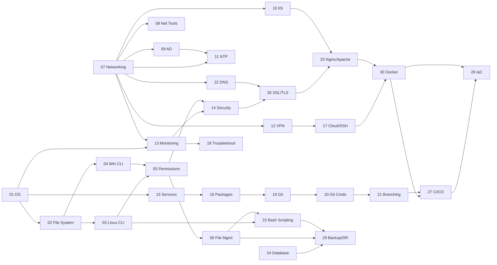

# 🖥️ System Administration & DevOps — Complete Study Notes

> A comprehensive, interconnected reference covering OS fundamentals, networking, security, Git, cloud, and DevOps.  
> 30 topics · 31 markdown files · Fully cross-linked · Mermaid diagrams throughout

---

## 📚 Table of Contents

### 🖥️ Operating System Fundamentals
| # | Topic | File |
|---|-------|------|
| 01 | OS Fundamentals — Linux vs Windows, Kernel, User Space, GUI vs CLI | [01_OS_Fundamentals.md](01_OS_Fundamentals.md) |
| 02 | File System Structure and Navigation | [02_File_System.md](02_File_System.md) |
| 03 | Linux Command Line Basics | [03_Linux_CLI.md](03_Linux_CLI.md) |
| 04 | Windows CMD and PowerShell Basics | [04_Windows_CLI.md](04_Windows_CLI.md) |
| 05 | User Permissions and Privilege Management | [05_Permissions.md](05_Permissions.md) |
| 06 | File Management Concepts | [06_File_Management.md](06_File_Management.md) |

### 🌐 Networking
| # | Topic | File |
|---|-------|------|
| 07 | Networking Fundamentals — IP, Subnet, Gateway, DNS, Ports, OSI | [07_Networking_Fundamentals.md](07_Networking_Fundamentals.md) |
| 08 | Networking Tools — ping, traceroute, netstat, nslookup, curl | [08_Networking_Tools.md](08_Networking_Tools.md) |
| 09 | Active Directory Concepts | [09_Active_Directory.md](09_Active_Directory.md) |
| 10 | IIS Web Server Basics | [10_IIS.md](10_IIS.md) |
| 11 | Time Synchronization — NTP | [11_NTP.md](11_NTP.md) |
| 12 | VPN Basics | [12_VPN.md](12_VPN.md) |
| 22 | DNS Deep Dive — Zone Files, BIND9, SPF/DKIM/DMARC | [22_DNS_Deep_Dive.md](22_DNS_Deep_Dive.md) |

### 🔐 Security & Monitoring
| # | Topic | File |
|---|-------|------|
| 13 | System Monitoring and Logging | [13_Monitoring_Logging.md](13_Monitoring_Logging.md) |
| 14 | Basic Security Concepts | [14_Security_Concepts.md](14_Security_Concepts.md) |
| 26 | SSL/TLS & Certificates — Let's Encrypt, openssl, HTTPS | [26_SSL_TLS_Certificates.md](26_SSL_TLS_Certificates.md) |

### ⚙️ System Management
| # | Topic | File |
|---|-------|------|
| 15 | Services and Process Management | [15_Services_Processes.md](15_Services_Processes.md) |
| 16 | Software Installation Methods | [16_Software_Installation.md](16_Software_Installation.md) |
| 17 | Cloud and Remote Access Basics | [17_Cloud_Remote_Access.md](17_Cloud_Remote_Access.md) |
| 18 | Troubleshooting Methodology | [18_Troubleshooting.md](18_Troubleshooting.md) |

### 🔧 Git & Version Control
| # | Topic | File |
|---|-------|------|
| 19 | Git Fundamentals | [19_Git_Fundamentals.md](19_Git_Fundamentals.md) |
| 20 | Git Commands and Workflow | [20_Git_Commands.md](20_Git_Commands.md) |
| 21 | Branching, Merging, Conflicts & Best Practices | [21_Git_Branching.md](21_Git_Branching.md) |

### 🌍 Web Servers & Scripting
| # | Topic | File |
|---|-------|------|
| 23 | Bash Scripting — Functions, Loops, Error Handling, Real Scripts | [23_Bash_Scripting.md](23_Bash_Scripting.md) |
| 25 | Web Servers — Nginx & Apache | [25_Nginx_Apache.md](25_Nginx_Apache.md) |

### 🗄️ Data & Storage
| # | Topic | File |
|---|-------|------|
| 24 | Database Basics — MySQL, PostgreSQL, SQLite | [24_Database_Basics.md](24_Database_Basics.md) |
| 29 | Backup and Disaster Recovery — rsync, Restic, RPO/RTO | [29_Backup_Disaster_Recovery.md](29_Backup_Disaster_Recovery.md) |

### 🚀 DevOps & Cloud Native
| # | Topic | File |
|---|-------|------|
| 27 | CI/CD Fundamentals — GitHub Actions, GitLab CI | [27_CICD_Fundamentals.md](27_CICD_Fundamentals.md) |
| 28 | Infrastructure as Code — Terraform & Ansible | [28_IaC_Terraform_Ansible.md](28_IaC_Terraform_Ansible.md) |
| 30 | Docker & Containers — Compose, Dockerfile, Kubernetes Intro | [30_Docker_Containers.md](30_Docker_Containers.md) |

---

## 🗺️ Full Topic Relationship Map



---

## 📖 Suggested Learning Path

### 🟢 Beginner
1. [01 OS Fundamentals](01_OS_Fundamentals.md) — How operating systems work
2. [02 File System](02_File_System.md) — Linux FHS, Windows paths
3. [03 Linux CLI](03_Linux_CLI.md) — Essential commands
4. [05 Permissions](05_Permissions.md) — chmod, sudo, UAC
5. [07 Networking Fundamentals](07_Networking_Fundamentals.md) — IP, DNS, OSI
6. [19 Git Fundamentals](19_Git_Fundamentals.md) — What Git is
7. [20 Git Commands](20_Git_Commands.md) — Daily workflow

### 🟡 Intermediate
8. [04 Windows CLI](04_Windows_CLI.md) — CMD, PowerShell
9. [06 File Management](06_File_Management.md) — tar, rsync, find
10. [08 Networking Tools](08_Networking_Tools.md) — ping, curl, nmap
11. [13 Monitoring & Logging](13_Monitoring_Logging.md) — journalctl, Event Viewer
12. [14 Security Concepts](14_Security_Concepts.md) — auth, firewalls
13. [15 Services & Processes](15_Services_Processes.md) — systemd, cron
14. [21 Git Branching](21_Git_Branching.md) — merge, rebase, conflicts
15. [22 DNS Deep Dive](22_DNS_Deep_Dive.md) — BIND9, zone files
16. [23 Bash Scripting](23_Bash_Scripting.md) — automation scripts
17. [25 Nginx & Apache](25_Nginx_Apache.md) — web server config
18. [26 SSL/TLS Certificates](26_SSL_TLS_Certificates.md) — HTTPS, certbot

### 🔴 Advanced / DevOps
19. [09 Active Directory](09_Active_Directory.md) — domains, GPO, Kerberos
20. [17 Cloud & Remote Access](17_Cloud_Remote_Access.md) — SSH, Docker, AWS
21. [24 Database Basics](24_Database_Basics.md) — MySQL, PostgreSQL
22. [27 CI/CD Fundamentals](27_CICD_Fundamentals.md) — GitHub Actions
23. [28 IaC Terraform & Ansible](28_IaC_Terraform_Ansible.md)
24. [29 Backup & Disaster Recovery](29_Backup_Disaster_Recovery.md)
25. [30 Docker & Containers](30_Docker_Containers.md) — Compose, K8s intro

---

## ⚡ Quick Reference Cheat Sheets

### Linux Essentials
```bash
ls -la && pwd               # List + current dir
cd /path && cd -            # Navigate + previous
cp -r src dst               # Copy recursive
mv src dst && rm -rf dir/   # Move / delete
grep -r "text" /path        # Search recursively
chmod 755 f && chown u:g f  # Permissions
tail -f /var/log/syslog     # Follow logs
ps aux && kill -9 PID       # Processes
df -h && free -h            # Disk + memory
sudo systemctl status svc   # Service status
```

### Git Quick Reference
```bash
git switch -c feature       # Create + switch branch
git add . && git commit -m "msg"  # Stage + commit
git push -u origin feature  # Push + track
git pull --rebase           # Pull cleanly
git stash && git stash pop  # Save/restore WIP
git log --oneline --graph   # Visual history
git revert HEAD             # Safe undo (new commit)
git reset --soft HEAD~1     # Undo commit, keep staged
```

### Docker Quick Reference
```bash
docker build -t app:1.0 .           # Build
docker run -d -p 8080:80 app:1.0    # Run
docker compose up -d --build        # Compose up
docker compose logs -f app          # Follow logs
docker exec -it container bash      # Shell in
docker system prune -a              # Full cleanup
```

### Nginx Quick Reference
```bash
nginx -t                            # Test config
nginx -s reload                     # Reload (no downtime)
certbot --nginx -d example.com      # Get SSL cert
certbot renew --dry-run             # Test renewal
tail -f /var/log/nginx/error.log    # Watch errors
```

### Networking Quick Reference
```bash
ping 8.8.8.8                        # Connectivity test
traceroute google.com               # Trace hops
dig +short google.com               # DNS lookup
dig +trace google.com               # Full resolution path
ss -tulpn                           # Listening ports
curl -I https://example.com         # HTTP headers
openssl s_client -connect host:443  # Test SSL cert
```

---

> 📝 **Note:** All files use relative links — keep them in the same folder.  
> Best viewed in: **Obsidian** · **VS Code** · **GitHub** · **Typora**
