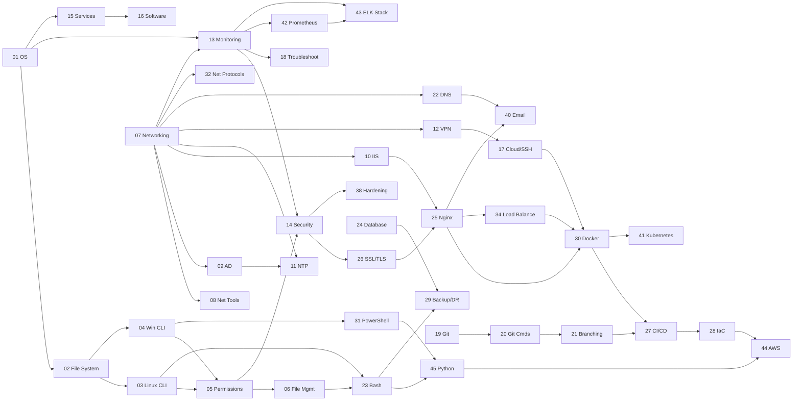

# 🖥️ System Administration & DevOps — Complete Study Notes

> A comprehensive, interconnected reference covering OS fundamentals, networking, security, scripting, Git, cloud, and DevOps.
> **45 topic files · 22,655+ lines · Fully cross-linked · Mermaid diagrams throughout**

---

## 📚 Complete Table of Contents

### 🖥️ Section 1 — Operating System Fundamentals

| # | Topic | File | Lines |
|---|-------|------|-------|
| 01 | OS Fundamentals — Linux vs Windows, Kernel, User Space, GUI vs CLI | [01_OS_Fundamentals.md](01_OS_Fundamentals.md) | 308 |
| 02 | File System Structure and Navigation — FHS, inodes, mounts | [02_File_System.md](02_File_System.md) | 321 |
| 03 | Linux Command Line Basics — ls, cd, grep, pipes, redirects | [03_Linux_CLI.md](03_Linux_CLI.md) | 472 |
| 04 | Windows CMD and PowerShell Basics — dir, tasklist, Get-Process | [04_Windows_CLI.md](04_Windows_CLI.md) | 427 |
| 05 | User Permissions and Privilege Management — chmod, sudo, UAC, ACL | [05_Permissions.md](05_Permissions.md) | 424 |
| 06 | File Management Concepts — compression, search, checksums, rsync | [06_File_Management.md](06_File_Management.md) | 361 |

---

### 🌐 Section 2 — Networking

| # | Topic | File | Lines |
|---|-------|------|-------|
| 07 | Networking Fundamentals — OSI, IP, Subnet, Gateway, DNS, Ports, TCP/UDP | [07_Networking_Fundamentals.md](07_Networking_Fundamentals.md) | 387 |
| 08 | Networking Tools — ping, traceroute, netstat, nslookup, curl, nmap | [08_Networking_Tools.md](08_Networking_Tools.md) | 394 |
| 09 | Active Directory — Domain, DC, GPO, Kerberos, LDAP, FSMO | [09_Active_Directory.md](09_Active_Directory.md) | 389 |
| 10 | IIS Web Server Basics — app pools, bindings, web.config, SSL | [10_IIS.md](10_IIS.md) | 317 |
| 11 | Time Synchronization — NTP, chrony, w32tm, stratum hierarchy | [11_NTP.md](11_NTP.md) | 226 |
| 12 | VPN Basics — IPSec, SSL/TLS, WireGuard, OpenVPN, split tunnel | [12_VPN.md](12_VPN.md) | 275 |
| 22 | DNS Deep Dive — BIND9, zone files, reverse DNS, SPF/DKIM/DMARC | [22_DNS_Deep_Dive.md](22_DNS_Deep_Dive.md) | 450 |
| 32 | Network Protocols Deep Dive — HTTP/2/3, DHCP, ARP, BGP, OSPF | [32_Network_Protocols.md](32_Network_Protocols.md) | 537 |

---

### 🔐 Section 3 — Security

| # | Topic | File | Lines |
|---|-------|------|-------|
| 13 | System Monitoring and Logging — journalctl, Event Viewer, syslog | [13_Monitoring_Logging.md](13_Monitoring_Logging.md) | 360 |
| 14 | Basic Security Concepts — auth, encryption, firewall, PKI, EDR | [14_Security_Concepts.md](14_Security_Concepts.md) | 328 |
| 26 | SSL/TLS & Certificates — Let's Encrypt, certbot, openssl, HTTPS | [26_SSL_TLS_Certificates.md](26_SSL_TLS_Certificates.md) | 356 |
| 38 | Linux System Hardening — SSH, Fail2Ban, PAM, auditd, sysctl, AppArmor | [38_Linux_Hardening.md](38_Linux_Hardening.md) | 513 |

---

### ⚙️ Section 4 — System Management

| # | Topic | File | Lines |
|---|-------|------|-------|
| 15 | Services and Process Management — systemd, cron, Windows SCM | [15_Services_Processes.md](15_Services_Processes.md) | 364 |
| 16 | Software Installation Methods — apt, pacman, winget, pip, npm | [16_Software_Installation.md](16_Software_Installation.md) | 402 |
| 17 | Cloud and Remote Access — SSH, RDP, Docker basics, AWS CLI | [17_Cloud_Remote_Access.md](17_Cloud_Remote_Access.md) | 370 |
| 18 | Troubleshooting Methodology — identify, isolate, fix, verify, document | [18_Troubleshooting.md](18_Troubleshooting.md) | 402 |
| 35 | Storage & RAID — LVM, RAID levels, ZFS, SAN/NAS, disk tools | [35_Storage_RAID.md](35_Storage_RAID.md) | 468 |
| 37 | Virtualization & Hypervisors — KVM, VMware ESXi, Hyper-V, VirtualBox | [37_Virtualization_KVM.md](37_Virtualization_KVM.md) | 471 |
| 39 | Windows Server Administration — DHCP, DNS, File Server, Registry, WEF | [39_Windows_Server_Admin.md](39_Windows_Server_Admin.md) | 415 |

---

### 🔧 Section 5 — Git & Version Control

| # | Topic | File | Lines |
|---|-------|------|-------|
| 19 | Git Fundamentals — objects, commits, staging, .gitignore | [19_Git_Fundamentals.md](19_Git_Fundamentals.md) | 362 |
| 20 | Git Commands and Workflow — init, clone, add, commit, push, pull | [20_Git_Commands.md](20_Git_Commands.md) | 436 |
| 21 | Branching, Merging, Conflicts & Best Practices — rebase, cherry-pick | [21_Git_Branching.md](21_Git_Branching.md) | 566 |

---

### 🌍 Section 6 — Web Servers & Email

| # | Topic | File | Lines |
|---|-------|------|-------|
| 25 | Web Servers — Nginx & Apache — vhosts, reverse proxy, PHP-FPM | [25_Nginx_Apache.md](25_Nginx_Apache.md) | 545 |
| 34 | Load Balancing & Reverse Proxy — HAProxy, Nginx LB, health checks | [34_Load_Balancing_Reverse_Proxy.md](34_Load_Balancing_Reverse_Proxy.md) | 532 |
| 40 | Email & Mail Servers — Postfix, Dovecot, SPF/DKIM/DMARC, SpamAssassin | [40_Email_MailServer.md](40_Email_MailServer.md) | 641 |

---

### 💻 Section 7 — Scripting & Automation

| # | Topic | File | Lines |
|---|-------|------|-------|
| 23 | Bash Scripting — variables, loops, functions, error handling, real scripts | [23_Bash_Scripting.md](23_Bash_Scripting.md) | 651 |
| 31 | PowerShell Scripting — objects, remoting, AD automation, modules | [31_PowerShell_Scripting.md](31_PowerShell_Scripting.md) | 740 |
| 33 | Regex Fundamentals — syntax, groups, lookaheads, grep/sed/awk/Python | [33_Regex_Fundamentals.md](33_Regex_Fundamentals.md) | 587 |
| 45 | Python for Sysadmins — psutil, paramiko, boto3, log parsing, SSH | [45_Python_for_Sysadmins.md](45_Python_for_Sysadmins.md) | 833 |

---

### 🗄️ Section 8 — Data & Storage

| # | Topic | File | Lines |
|---|-------|------|-------|
| 24 | Database Basics — MySQL, PostgreSQL, SQLite — CRUD, users, backup | [24_Database_Basics.md](24_Database_Basics.md) | 508 |
| 29 | Backup and Disaster Recovery — rsync, Restic, 3-2-1, RPO/RTO | [29_Backup_Disaster_Recovery.md](29_Backup_Disaster_Recovery.md) | 559 |

---

### 🚀 Section 9 — DevOps & Cloud Native

| # | Topic | File | Lines |
|---|-------|------|-------|
| 27 | CI/CD Fundamentals — GitHub Actions, GitLab CI, Docker pipelines | [27_CICD_Fundamentals.md](27_CICD_Fundamentals.md) | 454 |
| 28 | Infrastructure as Code — Terraform & Ansible — HCL, playbooks, roles | [28_IaC_Terraform_Ansible.md](28_IaC_Terraform_Ansible.md) | 658 |
| 30 | Docker & Containers — Dockerfile, Compose, networking, volumes, K8s intro | [30_Docker_Containers.md](30_Docker_Containers.md) | 772 |
| 41 | Kubernetes Deep Dive — kubectl, Deployments, RBAC, Helm, HPA, Jobs | [41_Kubernetes_Deep_Dive.md](41_Kubernetes_Deep_Dive.md) | 833 |
| 44 | AWS Cloud Deep Dive — VPC, EC2, S3, IAM, RDS, Lambda, CloudWatch | [44_Cloud_AWS_Deep_Dive.md](44_Cloud_AWS_Deep_Dive.md) | 758 |

---

### 📊 Section 10 — Observability & Monitoring

| # | Topic | File | Lines |
|---|-------|------|-------|
| 36 | SNMP & Network Monitoring — Nagios, Zabbix, SNMP OIDs, traps | [36_SNMP_Network_Monitoring.md](36_SNMP_Network_Monitoring.md) | 627 |
| 42 | Monitoring with Prometheus & Grafana — PromQL, alerting, exporters | [42_Monitoring_Prometheus_Grafana.md](42_Monitoring_Prometheus_Grafana.md) | 763 |
| 43 | ELK Stack — Elasticsearch, Logstash, Kibana, Filebeat, ILM | [43_ELK_Stack.md](43_ELK_Stack.md) | 870 |

---

## 🗺️ Full Topic Relationship Map



---

## 📖 Recommended Learning Paths

### 🟢 Path 1 — Linux Sysadmin (Beginner → Intermediate)
```
01 → 02 → 03 → 05 → 06 → 07 → 08 → 13 → 14 → 15 → 16 → 18 → 23 → 25 → 26 → 22 → 29
```
| Step | File | Focus |
|------|------|-------|
| 1 | [01 OS Fundamentals](01_OS_Fundamentals.md) | How Linux works |
| 2 | [02 File System](02_File_System.md) | FHS, paths, inodes |
| 3 | [03 Linux CLI](03_Linux_CLI.md) | Daily commands |
| 4 | [05 Permissions](05_Permissions.md) | chmod, sudo |
| 5 | [07 Networking](07_Networking_Fundamentals.md) | IP, DNS, ports |
| 6 | [13 Monitoring](13_Monitoring_Logging.md) | Logs, journalctl |
| 7 | [15 Services](15_Services_Processes.md) | systemd, cron |
| 8 | [23 Bash Scripting](23_Bash_Scripting.md) | Automate tasks |
| 9 | [25 Nginx/Apache](25_Nginx_Apache.md) | Web servers |
| 10 | [26 SSL/TLS](26_SSL_TLS_Certificates.md) | HTTPS setup |

---

### 🔵 Path 2 — Windows Sysadmin
```
01 → 04 → 05 → 07 → 09 → 10 → 11 → 13 → 14 → 15 → 31 → 39
```
| Step | File | Focus |
|------|------|-------|
| 1 | [01 OS Fundamentals](01_OS_Fundamentals.md) | Windows internals |
| 2 | [04 Windows CLI](04_Windows_CLI.md) | CMD + PowerShell |
| 3 | [05 Permissions](05_Permissions.md) | NTFS ACLs, UAC |
| 4 | [09 Active Directory](09_Active_Directory.md) | Domain, GPO, Kerberos |
| 5 | [10 IIS](10_IIS.md) | Web server |
| 6 | [11 NTP](11_NTP.md) | Time sync (Kerberos!) |
| 7 | [31 PowerShell](31_PowerShell_Scripting.md) | Automation |
| 8 | [39 Windows Server](39_Windows_Server_Admin.md) | DHCP, DNS, File Server |

---

### 🟡 Path 3 — DevOps Engineer
```
03 → 19 → 20 → 21 → 23 → 25 → 26 → 27 → 30 → 28 → 41 → 42 → 44 → 45
```
| Step | File | Focus |
|------|------|-------|
| 1 | [19 Git Fundamentals](19_Git_Fundamentals.md) | Version control |
| 2 | [20 Git Commands](20_Git_Commands.md) | Daily workflow |
| 3 | [21 Git Branching](21_Git_Branching.md) | PR, rebase, merge |
| 4 | [23 Bash Scripting](23_Bash_Scripting.md) | Shell automation |
| 5 | [27 CI/CD](27_CICD_Fundamentals.md) | GitHub Actions |
| 6 | [30 Docker](30_Docker_Containers.md) | Containers |
| 7 | [28 IaC](28_IaC_Terraform_Ansible.md) | Terraform + Ansible |
| 8 | [41 Kubernetes](41_Kubernetes_Deep_Dive.md) | Orchestration |
| 9 | [42 Prometheus/Grafana](42_Monitoring_Prometheus_Grafana.md) | Observability |
| 10 | [44 AWS](44_Cloud_AWS_Deep_Dive.md) | Cloud platform |

---

### 🔴 Path 4 — Security Engineer
```
05 → 14 → 26 → 38 → 07 → 12 → 22 → 09 → 13 → 43
```
| Step | File | Focus |
|------|------|-------|
| 1 | [05 Permissions](05_Permissions.md) | DAC, RBAC |
| 2 | [14 Security Concepts](14_Security_Concepts.md) | AuthN, AuthZ, crypto |
| 3 | [26 SSL/TLS](26_SSL_TLS_Certificates.md) | PKI, certificates |
| 4 | [38 Linux Hardening](38_Linux_Hardening.md) | Server hardening |
| 5 | [12 VPN](12_VPN.md) | Encrypted tunnels |
| 6 | [22 DNS Deep Dive](22_DNS_Deep_Dive.md) | SPF/DKIM/DMARC |
| 7 | [09 Active Directory](09_Active_Directory.md) | Kerberos, LDAP |
| 8 | [13 Monitoring](13_Monitoring_Logging.md) | Audit logs |
| 9 | [43 ELK Stack](43_ELK_Stack.md) | SIEM/log analysis |

---

## ⚡ Quick Reference Cheat Sheets

### Linux Essentials
```bash
# Navigation
ls -la && pwd && cd /path && cd -

# Files
cp -r src dst && mv src dst && rm -rf dir/
find /path -name "*.log" -mtime +7 -delete
grep -r "error" /var/log/ | tail -20

# Permissions
chmod 755 file && chown user:group file
sudo command && sudo -i && sudo visudo

# Processes & services
ps aux | grep nginx && kill -9 PID
sudo systemctl status|start|stop|restart|enable nginx
journalctl -u nginx -f --since today

# Disk & memory
df -h && du -sh * | sort -h && free -h
tar -czf archive.tar.gz dir/ && tar -xzf archive.tar.gz
```

### Git Essentials
```bash
git init && git clone <url>
git status && git diff && git log --oneline --graph
git add . && git commit -m "feat: description"
git push -u origin main && git pull --rebase
git switch -c feature && git merge feature && git branch -d feature
git stash && git stash pop
git revert HEAD && git reset --soft HEAD~1
git log --oneline --graph --all --decorate
```

### Docker Essentials
```bash
docker build -t app:1.0 . && docker push registry/app:1.0
docker run -d -p 8080:80 --name app app:1.0
docker ps && docker logs -f app && docker exec -it app bash
docker compose up -d --build && docker compose down
docker system prune -a && docker volume prune
```

### Networking Essentials
```bash
ping 8.8.8.8 && traceroute google.com
dig +short google.com && dig +trace google.com
nslookup -type=MX gmail.com
ss -tulpn && netstat -an
curl -I https://example.com && curl -v https://api/endpoint
openssl s_client -connect host:443 | openssl x509 -noout -dates
```

### Kubernetes Essentials
```bash
kubectl get pods,svc,deploy -n production
kubectl describe pod <name> -n production
kubectl logs -f <pod> --tail=100
kubectl exec -it <pod> -- bash
kubectl rollout status deployment/app
kubectl rollout undo deployment/app
kubectl scale deployment app --replicas=5
kubectl port-forward svc/app 8080:80
```

### AWS CLI Essentials
```bash
aws sts get-caller-identity
aws ec2 describe-instances --query 'Reservations[*].Instances[*].[InstanceId,State.Name,Tags[?Key==`Name`].Value|[0]]' --output table
aws s3 sync ./local/ s3://bucket/ --delete
aws logs tail /aws/lambda/my-function --follow
aws ssm start-session --target i-1234567890
```

---

## 📂 Files by Size (Reference)

| Size | Files |
|------|-------|
| **800+ lines** | 43 ELK Stack, 41 Kubernetes, 45 Python for Sysadmins |
| **700–800 lines** | 44 AWS Deep Dive, 42 Prometheus/Grafana, 31 PowerShell, 30 Docker |
| **600–700 lines** | 40 Email, 23 Bash Scripting, 28 IaC |
| **500–600 lines** | 33 Regex, 21 Git Branching, 29 Backup/DR, 25 Nginx, 38 Hardening |
| **400–500 lines** | 34 LB/Proxy, 32 Net Protocols, 24 Database, 36 SNMP, 35 Storage, 37 Virt |
| **300–400 lines** | Most core files (01–22, 27) |
| **< 300 lines** | 11 NTP, 12 VPN (focused/concise) |

---

## 🗓️ Suggested Study Schedule

### Week 1 — Foundation
- Day 1–2: Files 01, 02, 03 (OS + CLI)
- Day 3–4: Files 05, 06, 07 (Permissions + Networking)
- Day 5–7: Files 19, 20, 21 (Git)

### Week 2 — System Admin
- Day 1–2: Files 15, 16, 18 (Services + Troubleshooting)
- Day 3–4: Files 13, 14 (Monitoring + Security)
- Day 5–7: Files 23, 33 (Bash + Regex)

### Week 3 — Web & Network
- Day 1–2: Files 22, 08 (DNS + Networking Tools)
- Day 3–4: Files 25, 26 (Nginx + SSL/TLS)
- Day 5–7: Files 09, 10, 40 (AD + IIS + Email)

### Week 4 — DevOps
- Day 1–2: Files 30, 27 (Docker + CI/CD)
- Day 3–4: Files 28, 41 (IaC + Kubernetes)
- Day 5–7: Files 42, 43, 44 (Prometheus + ELK + AWS)

---

> 📝 **Usage:** Keep all `.md` files in the **same folder** for cross-links to work.
> Best viewers: **Obsidian** · **VS Code + Markdown Preview Enhanced** · **GitHub** · **Typora**
>
> 🔗 **GitHub push commands:**
> ```bash
> git init && git add . && git commit -m "feat: complete sysadmin & devops study notes (45 topics, 22k+ lines)"
> git remote add origin git@github.com:USERNAME/sysadmin-notes.git
> git branch -M main && git push -u origin main
> ```
