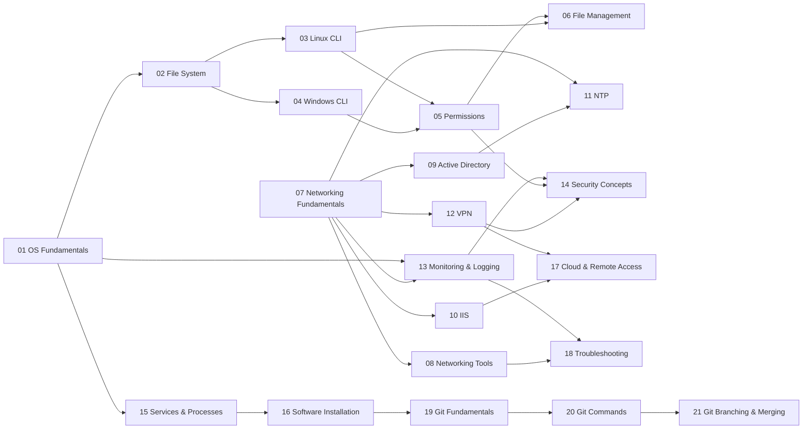

# 🖥️ System Administration & DevOps — Complete Study Notes

> A comprehensive, interconnected reference covering OS fundamentals, networking, security, Git, and cloud concepts.  
> Each topic is a standalone markdown file with cross-links for deep navigation.

---

## 📚 Table of Contents

### 🖥️ Operating System Fundamentals
| # | Topic | File |
|---|-------|------|
| 01 | OS Fundamentals — Linux vs Windows, Kernel, User Space, GUI vs CLI | [01_OS_Fundamentals.md](01_OS_Fundamentals.md) |
| 02 | File System Structure and Navigation | [02_File_System.md](02_File_System.md) |
| 03 | Linux Command Line Basics | [03_Linux_CLI.md](03_Linux_CLI.md) |
| 04 | Windows CMD and PowerShell Basics | [04_Windows_CLI.md](04_Windows_CLI.md) |
| 05 | User Permissions and Privilege Management | [05_Permissions.md](05_Permissions.md) |
| 06 | File Management Concepts | [06_File_Management.md](06_File_Management.md) |

### 🌐 Networking
| # | Topic | File |
|---|-------|------|
| 07 | Networking Fundamentals — IP, Subnet, Gateway, DNS, Ports, OSI | [07_Networking_Fundamentals.md](07_Networking_Fundamentals.md) |
| 08 | Networking Tools — ping, traceroute, netstat, nslookup, curl | [08_Networking_Tools.md](08_Networking_Tools.md) |
| 09 | Active Directory Concepts | [09_Active_Directory.md](09_Active_Directory.md) |
| 10 | IIS Web Server Basics | [10_IIS.md](10_IIS.md) |
| 11 | Time Synchronization — NTP | [11_NTP.md](11_NTP.md) |
| 12 | VPN Basics | [12_VPN.md](12_VPN.md) |

### 🔐 Security & Monitoring
| # | Topic | File |
|---|-------|------|
| 13 | System Monitoring and Logging | [13_Monitoring_Logging.md](13_Monitoring_Logging.md) |
| 14 | Basic Security Concepts | [14_Security_Concepts.md](14_Security_Concepts.md) |

### ⚙️ System Management
| # | Topic | File |
|---|-------|------|
| 15 | Services and Process Management | [15_Services_Processes.md](15_Services_Processes.md) |
| 16 | Software Installation Methods | [16_Software_Installation.md](16_Software_Installation.md) |
| 17 | Cloud and Remote Access Basics | [17_Cloud_Remote_Access.md](17_Cloud_Remote_Access.md) |
| 18 | Troubleshooting Methodology | [18_Troubleshooting.md](18_Troubleshooting.md) |

### 🔧 Git & Version Control
| # | Topic | File |
|---|-------|------|
| 19 | Git Fundamentals | [19_Git_Fundamentals.md](19_Git_Fundamentals.md) |
| 20 | Git Commands and Workflow | [20_Git_Commands.md](20_Git_Commands.md) |
| 21 | Branching, Merging, Conflicts & Best Practices | [21_Git_Branching.md](21_Git_Branching.md) |

---

## 🗺️ Topic Relationship Map



---

## 🚀 Quick Reference Cheat Sheets

### Linux Essential Commands
```bash
ls -la          # List all files with permissions
cd /path        # Change directory
pwd             # Print working directory
cp src dst      # Copy file
mv src dst      # Move/rename
rm -rf dir/     # Remove recursively
cat file        # Print file contents
grep "text" f   # Search in file
chmod 755 f     # Change permissions
sudo command    # Run as root
```

### Git Quick Reference
```bash
git init                    # Initialize repo
git clone <url>             # Clone remote
git add .                   # Stage all
git commit -m "msg"         # Commit
git push origin main        # Push to remote
git pull                    # Pull latest
git branch feature          # Create branch
git checkout feature        # Switch branch
git merge feature           # Merge into current
git log --oneline           # Compact log
```

### Networking Quick Reference
```bash
ping 8.8.8.8               # Test connectivity
traceroute google.com      # Trace route (Linux)
tracert google.com         # Trace route (Windows)
nslookup google.com        # DNS lookup
netstat -tulpn             # Active connections (Linux)
curl -I https://site.com   # HTTP headers
```

---

> 📝 **Note:** All files use relative links. Keep all `.md` files in the same folder for links to work correctly.
