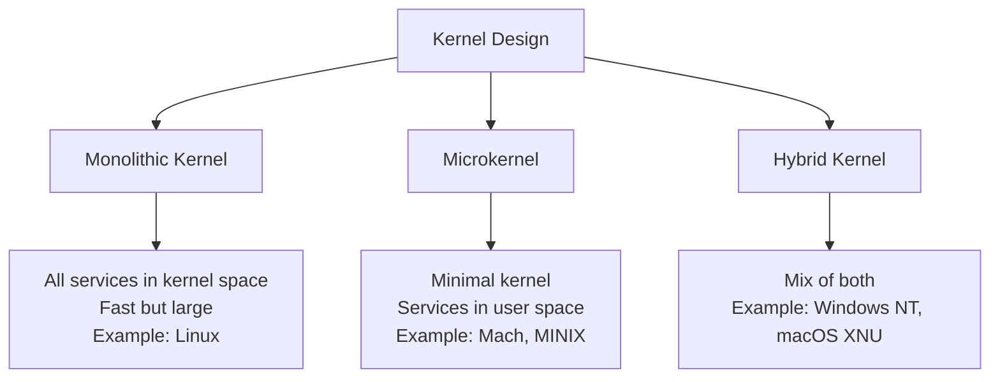
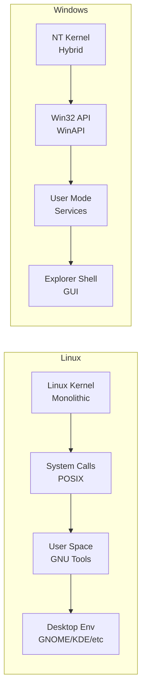
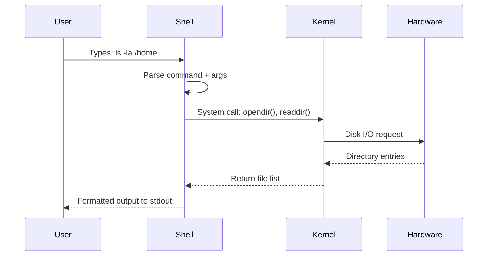
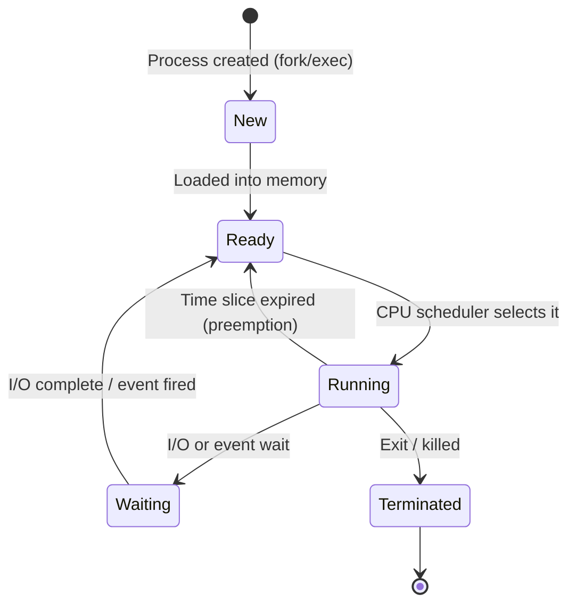
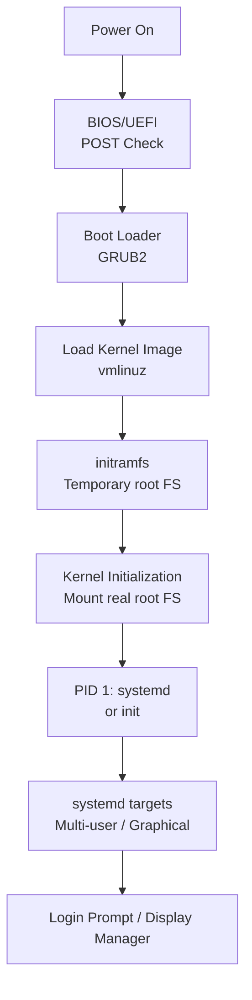
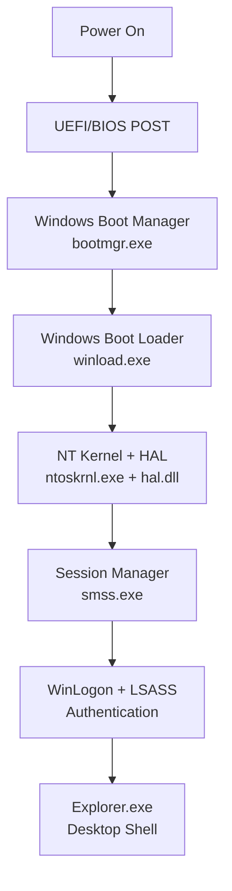

# 01 — Operating System Fundamentals

> **[← Index](00_INDEX.md)** | Next: [File System →](02_File_System.md)

---

## What is an Operating System?

An **Operating System (OS)** is system software that acts as an intermediary between computer hardware and user applications. It manages hardware resources, provides services to programs, and presents a usable interface to the user.

### Core Responsibilities
- **Process management** — scheduling, creating, and terminating processes
- **Memory management** — allocating/freeing RAM, virtual memory
- **File system management** — organizing data on storage devices
- **Device management** — communicating with hardware via drivers
- **Security & access control** — user authentication, permissions
- **Networking** — TCP/IP stack, socket management

---

## Architecture Overview

```
┌─────────────────────────────────────────────┐
│              USER APPLICATIONS              │
│   (browser, editor, terminal, games...)     │
├─────────────────────────────────────────────┤
│             SYSTEM LIBRARIES                │
│     (glibc, Win32 API, POSIX, etc.)         │
├─────────────────────────────────────────────┤
│               SYSTEM CALLS                  │
│    (interface between user & kernel)        │
├═════════════════════════════════════════════╡
│                  KERNEL                     │
│  ┌───────────┐ ┌──────────┐ ┌───────────┐  │
│  │ Process   │ │ Memory   │ │ File Sys  │  │
│  │ Scheduler │ │ Manager  │ │ Driver    │  │
│  └───────────┘ └──────────┘ └───────────┘  │
│  ┌───────────┐ ┌──────────┐ ┌───────────┐  │
│  │ Network   │ │ Security │ │ Device    │  │
│  │ Stack     │ │ Module   │ │ Drivers   │  │
│  └───────────┘ └──────────┘ └───────────┘  │
├─────────────────────────────────────────────┤
│               HARDWARE                      │
│   (CPU, RAM, Disk, NIC, GPU, USB...)        │
└─────────────────────────────────────────────┘
```

---

## The Kernel

The **kernel** is the core of the OS — it runs in **privileged mode** (also called kernel mode or ring 0) and has unrestricted access to all hardware.

### Kernel Responsibilities
- Direct hardware communication
- Memory protection and virtual address management
- System call handling
- Interrupt handling (hardware signals to CPU)
- Process scheduling (deciding which process runs when)

### Kernel Types



| Type | Description | Examples |
|------|-------------|---------|
| **Monolithic** | All OS services run in kernel space | Linux, older UNIX |
| **Microkernel** | Only essential services in kernel; rest in user space | MINIX, QNX |
| **Hybrid** | Monolithic performance + some microkernel isolation | Windows NT, macOS |
| **Exokernel** | Exposes hardware directly; minimal abstraction | Research only |

---

## Kernel Space vs User Space

```
┌──────────────────────────────────────────────────────┐
│                    USER SPACE                        │
│                                                      │
│  ┌────────┐  ┌────────┐  ┌────────┐  ┌────────┐    │
│  │ App 1  │  │ App 2  │  │ Shell  │  │Browser │    │
│  └────────┘  └────────┘  └────────┘  └────────┘    │
│       │            │           │            │        │
│       └────────────┴───────────┴────────────┘        │
│                         │                            │
│                   System Call Interface              │
│                  (read, write, open, fork...)        │
├──────────────────────────────────────────────────────┤
│                   KERNEL SPACE                       │
│                                                      │
│    Direct hardware access, no restrictions           │
│    Crashes here = entire system crash                │
│    Protected memory region                          │
└──────────────────────────────────────────────────────┘
```

| Feature | User Space | Kernel Space |
|---------|-----------|--------------|
| Access | Restricted | Unrestricted |
| Crash impact | Single process | Entire system |
| Memory | Virtual, isolated | Physical, shared |
| Examples | Applications, shells | Kernel, drivers |
| Privilege level | Ring 3 (x86) | Ring 0 (x86) |

---

## Linux vs Windows — Deep Comparison

### Architectural Differences



### Feature Comparison Table

| Feature | Linux | Windows |
|---------|-------|---------|
| **Kernel** | Monolithic (Linux kernel) | Hybrid (NT kernel) |
| **Source** | Open source (GPLv2) | Proprietary |
| **File System** | ext4, btrfs, xfs, zfs | NTFS, FAT32, exFAT |
| **Path separator** | `/` (forward slash) | `\` (backslash) |
| **Root of FS** | `/` | `C:\` (drive letters) |
| **Config files** | Plain text in `/etc/` | Registry + XML |
| **Package manager** | apt, pacman, dnf, zypper | Windows Store, winget, chocolatey |
| **Default shell** | bash/zsh/fish | cmd.exe, PowerShell |
| **User accounts** | root + regular users | Administrator + standard |
| **Service manager** | systemd, openrc | SCM (services.msc) |
| **Case sensitivity** | **Case-sensitive** | Case-insensitive |
| **Market share** | ~75% servers, ~4% desktop | ~90% desktop |
| **Update model** | Rolling or point releases | Windows Update |

---

## GUI vs CLI

### GUI (Graphical User Interface)

A visual interface with windows, buttons, icons, and pointer interaction.

**Pros:**
- Easy to learn, visual feedback
- Accessible to non-technical users
- Good for file browsing, design, media

**Cons:**
- Slower for repetitive tasks
- Hard to automate
- Resource-intensive (GPU, RAM)
- Remote access is heavier

**Examples:** Windows Explorer, GNOME Files, macOS Finder

---

### CLI (Command Line Interface)

A text-based interface where commands are typed and executed.

**Pros:**
- Extremely powerful and fast for bulk tasks
- Scriptable and automatable
- Lightweight — works over SSH
- Reproducible actions (scripts)
- History and piping (`|`)

**Cons:**
- Steep learning curve
- Typos can be destructive
- Less visual feedback

**Examples:** bash, zsh, PowerShell, cmd.exe

### CLI Interaction Flow



---

## Process Model

### Process States



### Key Concepts
- **PID** — Process ID, unique number per process
- **PPID** — Parent PID (every process has a parent)
- **Fork** — Duplicates a process (Linux)
- **Exec** — Replaces current process image with new program
- **Daemon** — Background process with no terminal (Linux) / Service (Windows)

---

## Memory Management

### Virtual Memory

Each process gets its own virtual address space, which the OS maps to physical RAM.

```
Process A Virtual Space        Physical RAM
┌─────────────┐               ┌─────────────┐
│ 0x00000000  │──────────────▶│  Frame 42   │
│ Code        │               ├─────────────┤
├─────────────┤         ┌────▶│  Frame 7    │
│ 0x08000000  │─────────┘     ├─────────────┤
│ Heap        │               │  (swapped)  │──▶ Swap/Pagefile
├─────────────┤               ├─────────────┤
│ Stack       │──────────────▶│  Frame 99   │
└─────────────┘               └─────────────┘
```

- **Page** — Fixed-size block of virtual memory (usually 4 KB)
- **Frame** — Fixed-size block of physical RAM
- **Page Table** — Maps virtual pages to physical frames
- **Swap (Linux) / Pagefile (Windows)** — Overflow to disk when RAM is full

---

## Boot Process

### Linux Boot Sequence



### Windows Boot Sequence



---

## Related Topics

- [File System Structure →](02_File_System.md)
- [Linux CLI Basics →](03_Linux_CLI.md)
- [Windows CLI Basics →](04_Windows_CLI.md)
- [User Permissions →](05_Permissions.md)
- [Services & Process Management →](15_Services_Processes.md)
- [Troubleshooting Methodology →](18_Troubleshooting.md)

---

> ← [Index](00_INDEX.md) | [File System →](02_File_System.md)
