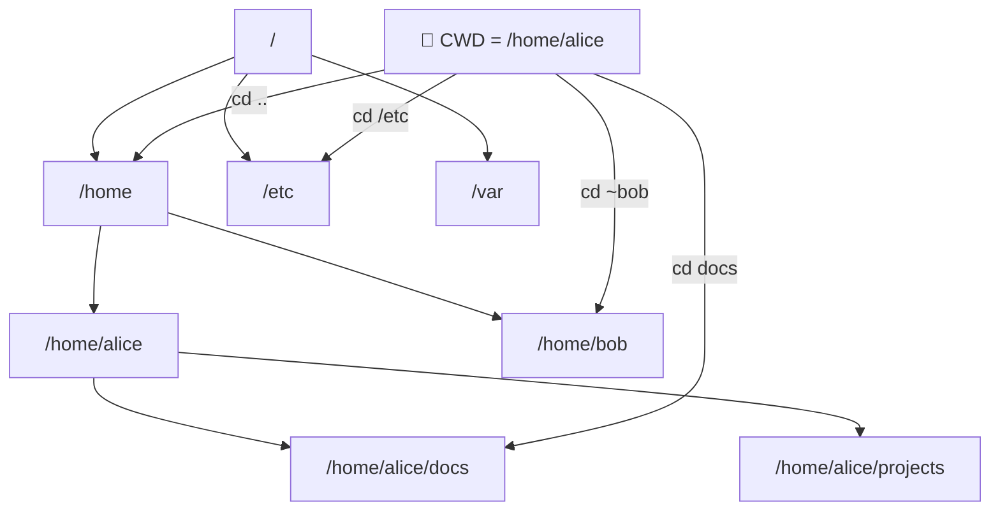

# 02 — File System Structure and Navigation

> **[← OS Fundamentals](01_OS_Fundamentals.md)** | **[Index](00_INDEX.md)** | **[Linux CLI →](03_Linux_CLI.md)**

---

## What is a File System?

A **file system** is the method and data structure that an OS uses to control how data is stored and retrieved on storage devices. Without a file system, data on disk would be one large unstructured blob.

### File System Responsibilities
- Organizing data into files and directories
- Tracking free/used disk space
- Managing file metadata (name, size, timestamps, permissions)
- Providing access control
- Supporting operations: create, read, write, delete, rename

---

## Common File System Types

| File System | OS | Max File Size | Max Volume | Features |
|------------|-----|--------------|------------|---------|
| **ext4** | Linux | 16 TB | 1 EB | Journaling, widely used |
| **btrfs** | Linux | 16 EB | 16 EB | Snapshots, RAID, CoW |
| **xfs** | Linux | 8 EB | 8 EB | High performance, large files |
| **zfs** | Linux/FreeBSD | 16 EB | 256 ZB | Pooled storage, checksums |
| **NTFS** | Windows | 16 TB | 256 TB | ACLs, encryption, journaling |
| **FAT32** | Universal | 4 GB | 8 TB | Legacy, USB drives |
| **exFAT** | Universal | 128 PB | 128 PB | Modern USB/SD cards |
| **APFS** | macOS | 8 EB | 8 EB | Encryption, snapshots |

---

## Linux File System Hierarchy (FHS)

The **Filesystem Hierarchy Standard (FHS)** defines the directory structure for Linux.

```
/                           ← Root (everything lives here)
├── bin/                    ← Essential user binaries (ls, cp, bash)
├── sbin/                   ← System binaries (for root: fdisk, iptables)
├── boot/                   ← Bootloader files, kernel images
├── dev/                    ← Device files (sda, tty, null, random)
├── etc/                    ← System-wide configuration files
│   ├── passwd              ← User account info
│   ├── shadow              ← Hashed passwords
│   ├── hosts               ← Static hostname/IP map
│   ├── fstab               ← Filesystem mount table
│   ├── ssh/                ← SSH daemon configuration
│   └── systemd/            ← Systemd unit files
├── home/                   ← User home directories
│   ├── alice/              ← Alice's files
│   └── bob/                ← Bob's files
├── lib/                    ← Shared libraries for /bin and /sbin
├── lib64/                  ← 64-bit shared libraries
├── media/                  ← Mount points for removable media
├── mnt/                    ← Temporary mount points
├── opt/                    ← Optional/third-party software
├── proc/                   ← Virtual FS — kernel/process info
│   ├── cpuinfo             ← CPU details
│   ├── meminfo             ← Memory details
│   └── [PID]/              ← Per-process info
├── root/                   ← Root user's home directory
├── run/                    ← Runtime data (PIDs, sockets)
├── srv/                    ← Data served by the system (web, FTP)
├── sys/                    ← Virtual FS — hardware/kernel info
├── tmp/                    ← Temporary files (cleared on reboot)
├── usr/                    ← User utilities and applications
│   ├── bin/                ← Most user commands (git, python, vim)
│   ├── lib/                ← Libraries for /usr/bin
│   ├── local/              ← Locally compiled software
│   └── share/              ← Architecture-independent data
└── var/                    ← Variable data (logs, spools, caches)
    ├── log/                ← System logs
    ├── www/                ← Web server files
    ├── cache/              ← Application cache data
    └── run/                ← Runtime variable data
```

### Key Directories Explained

| Directory | Purpose | Example Contents |
|-----------|---------|-----------------|
| `/etc` | System configuration | `/etc/nginx/nginx.conf`, `/etc/hosts` |
| `/var/log` | Log files | `/var/log/syslog`, `/var/log/auth.log` |
| `/proc` | Virtual: process/kernel info | `/proc/cpuinfo`, `/proc/1234/maps` |
| `/sys` | Virtual: hardware/driver info | `/sys/class/net/eth0/` |
| `/dev` | Device files | `/dev/sda`, `/dev/null`, `/dev/tty` |
| `/tmp` | Temporary files | Cleared on boot |
| `/home` | User data | `/home/username/` |
| `/root` | Root user home | `/root/.ssh/authorized_keys` |

---

## Windows File System Structure

Windows uses **drive letters** as roots (C:\, D:\, etc.), unlike Linux's unified `/`.

```
C:\                             ← System drive (primary)
├── Windows\                    ← OS files
│   ├── System32\               ← Core system DLLs and executables
│   ├── SysWOW64\               ← 32-bit compat on 64-bit
│   ├── drivers\                ← Device drivers (.sys files)
│   └── Temp\                   ← System temp files
├── Program Files\              ← 64-bit installed applications
├── Program Files (x86)\        ← 32-bit installed applications
├── Users\                      ← User profiles
│   ├── Username\
│   │   ├── Desktop\
│   │   ├── Documents\
│   │   ├── Downloads\
│   │   ├── AppData\
│   │   │   ├── Local\          ← Local app data
│   │   │   ├── LocalLow\       ← Low-integrity app data
│   │   │   └── Roaming\        ← Syncs with domain profile
│   │   └── .ssh\               ← SSH keys
│   └── Public\                 ← Shared between all users
├── ProgramData\                ← Machine-wide app data (hidden)
└── Temp\                       ← System temp (also %TEMP%)
```

### Windows Special Paths

| Path | Variable | Purpose |
|------|----------|---------|
| `C:\Users\%USERNAME%` | `%USERPROFILE%` | Current user's home |
| `C:\Windows\System32` | `%WINDIR%\System32` | System executables |
| `C:\Users\%USERNAME%\AppData\Roaming` | `%APPDATA%` | App config (roaming) |
| `C:\Users\%USERNAME%\AppData\Local` | `%LOCALAPPDATA%` | App data (local) |
| `C:\ProgramData` | `%PROGRAMDATA%` | Machine-wide app data |
| `C:\Windows\Temp` | `%TEMP%` | Temp files |

---

## Absolute vs Relative Paths

### Linux Examples
```
Absolute: /home/alice/documents/report.pdf
           ↑ starts from root /

Relative: documents/report.pdf
           ↑ relative to current directory

Special:
  .       = current directory
  ..      = parent directory
  ~       = home directory (/home/username)
  ~alice  = alice's home directory
```

### Windows Examples
```
Absolute: C:\Users\Alice\Documents\report.pdf
           ↑ starts from drive letter

Relative: Documents\report.pdf
           ↑ relative to current directory

Special:
  .       = current directory
  ..      = parent directory
  %USERPROFILE% = home directory
```

### Navigation Reference



---

## File Types in Linux

Linux represents everything as a file. The `ls -l` output shows the file type as the first character:

```
-rw-r--r--  1  alice  staff  1024  Apr 22 10:00  file.txt
drwxr-xr-x  2  alice  staff  4096  Apr 22 10:00  directory/
lrwxrwxrwx  1  alice  staff    10  Apr 22 10:00  link -> /etc/hosts
crw-rw-rw-  1  root   tty       5  Apr 22 10:00  /dev/tty
brw-rw----  1  root   disk    8,0  Apr 22 10:00  /dev/sda
prw-r--r--  1  alice  staff     0  Apr 22 10:00  mypipe
srwxrwxrwx  1  alice  staff     0  Apr 22 10:00  mysocket
```

| First Char | Type | Description |
|------------|------|-------------|
| `-` | Regular file | Text, binary, data |
| `d` | Directory | Container for files |
| `l` | Symbolic link | Pointer to another file |
| `c` | Character device | Serial, TTY (`/dev/tty`) |
| `b` | Block device | Disks (`/dev/sda`) |
| `p` | Named pipe (FIFO) | IPC between processes |
| `s` | Socket | Network/IPC socket |

---

## Inodes (Linux)

An **inode** (index node) stores file metadata — everything except the filename and actual data.

```
Directory Entry          Inode #1042              Data Blocks
┌───────────────┐       ┌────────────────┐       ┌──────────────┐
│ "report.txt"  │──────▶│ inode: 1042    │──────▶│ "Hello World"│
│ inode: 1042   │       │ size: 12 bytes │       │ ...file data │
└───────────────┘       │ owner: alice   │       └──────────────┘
                        │ perms: 644     │
                        │ atime: ...     │
                        │ mtime: ...     │
                        │ ctime: ...     │
                        │ links: 1       │
                        └────────────────┘
```

- `atime` — Last **a**ccess time
- `mtime` — Last **m**odification time (content)
- `ctime` — Last **c**hange time (metadata or content)

```bash
stat report.txt       # Show inode info
ls -i                 # Show inode numbers
df -i                 # Show inode usage per filesystem
```

---

## Hard Links vs Symbolic Links

```
Hard Link:
  file.txt ──┐
              ├──▶ inode 1042 ──▶ Data Blocks
  hardlink  ──┘
  (same inode, both point to same data)

Symbolic Link:
  symlink.txt ──▶ "file.txt" (path string) ──▶ inode 1042 ──▶ Data
  (separate inode, stores path as data)
```

| Feature | Hard Link | Symbolic Link |
|---------|-----------|--------------|
| Inode | Same as original | Different |
| Cross-filesystem | ❌ No | ✅ Yes |
| Works on directories | ❌ No (usually) | ✅ Yes |
| Broken if original deleted | ❌ No (data survives) | ✅ Yes (dangling link) |
| Command | `ln file hardlink` | `ln -s target link` |

---

## Mounting File Systems

In Linux, storage devices are **mounted** to directories (mount points).

```bash
# View current mounts
mount
df -h                        # Disk usage with human-readable sizes
lsblk                        # Block device tree

# Mount a device
sudo mount /dev/sdb1 /mnt/usb

# Unmount
sudo umount /mnt/usb

# Auto-mount at boot (edit /etc/fstab)
# Device         Mount Point   FS Type  Options    Dump  Pass
/dev/sda1        /             ext4     defaults   0     1
/dev/sda2        /home         ext4     defaults   0     2
UUID=xxxx        /mnt/data     btrfs    defaults   0     0
tmpfs            /tmp          tmpfs    defaults   0     0
```

---

## File Permissions Overview

> Detailed coverage in [05_Permissions.md](05_Permissions.md)

```
-rwxr-xr--  alice  staff  file.sh
 ↑↑↑↑↑↑↑↑↑
 │└──┤└──┤└──── others: r-- (read only)
 │   │   └───── group: r-x (read + execute)
 │   └────────── owner: rwx (full)
 └────────────── file type: - (regular)
```

---

## Related Topics

- [Linux CLI Basics →](03_Linux_CLI.md)
- [Windows CLI Basics →](04_Windows_CLI.md)
- [User Permissions →](05_Permissions.md)
- [File Management →](06_File_Management.md)
- [System Monitoring & Logging →](13_Monitoring_Logging.md)

---

> [← OS Fundamentals](01_OS_Fundamentals.md) | [Index](00_INDEX.md) | [Linux CLI →](03_Linux_CLI.md)
