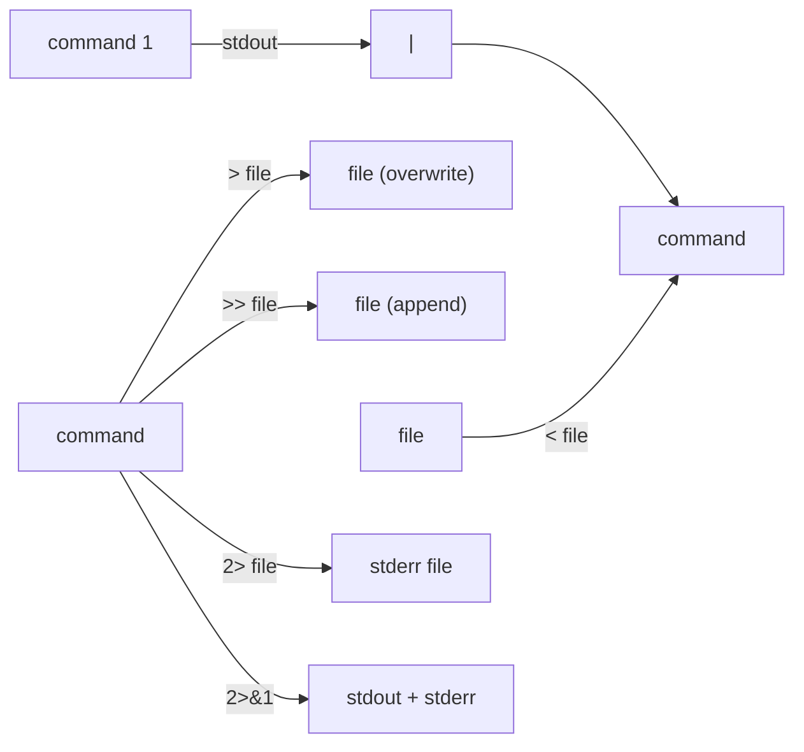

# 03 — Linux Command Line Basics

> **[← File System](02_File_System.md)** | **[Index](00_INDEX.md)** | **[Windows CLI →](04_Windows_CLI.md)**

---

## The Shell

A **shell** is a command-line interpreter — it reads commands from the user and executes them. It is both an interactive tool and a scripting language.

### Common Linux Shells

| Shell | Path | Notes |
|-------|------|-------|
| **bash** | `/bin/bash` | Default on most distros, Bourne Again Shell |
| **zsh** | `/bin/zsh` | Extended bash, used by macOS default, Arch Linux |
| **fish** | `/usr/bin/fish` | Friendly interactive, autosuggestions |
| **sh** | `/bin/sh` | POSIX shell (may be dash/bash symlink) |
| **dash** | `/bin/dash` | Lightweight POSIX, used in scripts |

```bash
echo $SHELL          # Show current shell
cat /etc/shells      # List installed shells
chsh -s /bin/zsh     # Change default shell
```

---

## Terminal Anatomy

```
alice@myserver:~$  ls -la /home
  ↑       ↑      ↑  ↑   ↑   ↑
  │       │      │  │   │   └── argument
  │       │      │  │   └────── flag/option
  │       │      │  └────────── command
  │       │      └───────────── prompt symbol ($ = user, # = root)
  │       └──────────────────── current directory (~ = home)
  └──────────────────────────── username@hostname
```

---

## Navigation Commands

### `pwd` — Print Working Directory
```bash
pwd
# Output: /home/alice/projects
```

### `ls` — List Directory Contents
```bash
ls                    # Basic listing
ls -l                 # Long format (permissions, size, date)
ls -a                 # Show hidden files (starting with .)
ls -la                # Long format + hidden
ls -lh                # Human-readable sizes (KB, MB)
ls -lt                # Sort by modification time
ls -R                 # Recursive listing
ls /etc               # List specific directory
ls *.txt              # Glob: all .txt files
```

**Long format breakdown:**
```
-rw-r--r-- 1 alice staff 1024 Apr 22 10:00 file.txt
↑           ↑ ↑     ↑     ↑    ↑            ↑
│           │ │     │     │    timestamp     filename
│           │ │     │     size (bytes)
│           │ │     group
│           │ owner
│           hard link count
permissions
```

### `cd` — Change Directory
```bash
cd /etc               # Absolute path
cd documents          # Relative path
cd ..                 # Go up one level
cd ../..              # Go up two levels
cd ~                  # Go to home directory
cd -                  # Go to previous directory
cd                    # Go to home (same as cd ~)
```

---

## File Viewing Commands

### `cat` — Concatenate and Print
```bash
cat file.txt                  # Print entire file
cat file1.txt file2.txt       # Concatenate two files
cat -n file.txt               # Show line numbers
cat -A file.txt               # Show non-printing characters
```

### `less` — Paginated Viewer
```bash
less file.txt                 # Open file in pager
# Inside less:
#   Space / PgDn = next page
#   b / PgUp     = previous page
#   /pattern     = search forward
#   ?pattern     = search backward
#   n            = next match
#   g            = go to start
#   G            = go to end
#   q            = quit
```

### `more` — Simple Pager (older)
```bash
more file.txt
```

### `head` — Show Beginning
```bash
head file.txt           # First 10 lines (default)
head -n 20 file.txt     # First 20 lines
head -c 100 file.txt    # First 100 bytes
```

### `tail` — Show End
```bash
tail file.txt           # Last 10 lines
tail -n 50 file.txt     # Last 50 lines
tail -f /var/log/syslog # Follow log in real time (stream)
tail -F logfile         # Follow + reopen if rotated
```

> 💡 `tail -f` is essential for live log monitoring → see [Monitoring & Logging](13_Monitoring_Logging.md)

---

## File and Directory Operations

### `cp` — Copy
```bash
cp source dest              # Copy file
cp -r dir/ newdir/          # Copy directory recursively
cp -p file dest             # Preserve permissions, timestamps
cp -u source dest           # Copy only if source is newer
cp -v source dest           # Verbose output
cp *.txt backup/            # Copy all .txt files
```

### `mv` — Move/Rename
```bash
mv oldname newname          # Rename file
mv file /path/to/dest       # Move file
mv dir/ /new/location/      # Move directory
mv -i file dest             # Interactive (ask before overwrite)
mv -v file dest             # Verbose
```

### `rm` — Remove
```bash
rm file.txt                 # Delete file
rm -i file.txt              # Interactive confirmation
rm -r directory/            # Remove directory recursively
rm -rf directory/           # Force remove (no prompts) ⚠️ DANGEROUS
rm -v file.txt              # Verbose
rm *.log                    # Remove all .log files
```

> ⚠️ **WARNING:** `rm -rf` is irreversible. There is no Recycle Bin in CLI. Double-check paths!

### `mkdir` — Make Directory
```bash
mkdir newdir                # Create directory
mkdir -p path/to/new/dir    # Create nested directories
mkdir -m 755 secured        # Create with specific permissions
```

### `rmdir` — Remove Empty Directory
```bash
rmdir emptydir              # Only works if empty
rm -r nonemptydir/          # Use rm -r for non-empty
```

### `touch` — Create/Update File
```bash
touch newfile.txt           # Create empty file or update timestamp
touch -t 202401010000 f     # Set specific timestamp
```

### `ln` — Create Links
```bash
ln file hardlink            # Hard link
ln -s /path/to/target link  # Symbolic link
```

---

## Finding Files

### `find` — Search File System
```bash
find /home -name "*.txt"             # Find all .txt in /home
find . -type f                       # Only regular files
find . -type d                       # Only directories
find . -name "*.log" -mtime -7       # Modified last 7 days
find /var -size +100M                # Files larger than 100MB
find . -perm 644                     # Files with exact permissions
find . -user alice                   # Files owned by alice
find . -empty                        # Empty files/directories
find / -name "passwd" 2>/dev/null    # Suppress permission errors

# Execute command on found files
find . -name "*.tmp" -exec rm {} \;
find . -name "*.txt" -exec ls -l {} +
```

### `locate` — Fast Search (uses database)
```bash
locate filename              # Fast but may be outdated
sudo updatedb                # Update the database
locate -i filename           # Case-insensitive
```

### `which` / `whereis` — Find Executables
```bash
which python3                # Location of command
whereis ls                   # Binary, source, man page locations
```

---

## Text Processing Commands

### `grep` — Search Text
```bash
grep "pattern" file.txt              # Basic search
grep -i "pattern" file.txt           # Case-insensitive
grep -r "pattern" /etc/              # Recursive
grep -n "pattern" file.txt           # Show line numbers
grep -v "pattern" file.txt           # Invert match (lines NOT matching)
grep -c "pattern" file.txt           # Count matching lines
grep -l "pattern" *.txt              # Only filenames
grep -w "word" file.txt              # Whole word match
grep -A 3 "pattern" file.txt         # 3 lines After match
grep -B 2 "pattern" file.txt         # 2 lines Before match
grep "^start" file.txt               # Lines starting with "start"
grep "end$" file.txt                 # Lines ending with "end"
grep -E "regex+" file.txt            # Extended regex
```

### `sort` — Sort Lines
```bash
sort file.txt                        # Alphabetical
sort -r file.txt                     # Reverse
sort -n numbers.txt                  # Numeric sort
sort -u file.txt                     # Unique (remove duplicates)
sort -k2 file.txt                    # Sort by column 2
```

### `uniq` — Remove Duplicates
```bash
uniq file.txt                        # Remove consecutive duplicates
sort file.txt | uniq                 # All duplicates (sort first)
uniq -c file.txt                     # Count occurrences
uniq -d file.txt                     # Only duplicated lines
```

### `wc` — Word Count
```bash
wc file.txt             # Lines, words, bytes
wc -l file.txt          # Only line count
wc -w file.txt          # Only word count
wc -c file.txt          # Only byte count
```

### `cut` — Extract Columns
```bash
cut -d: -f1 /etc/passwd              # Field 1, delimiter ":"
cut -c1-10 file.txt                  # Characters 1-10
```

### `sed` — Stream Editor
```bash
sed 's/old/new/' file.txt            # Replace first occurrence per line
sed 's/old/new/g' file.txt           # Replace all occurrences
sed -i 's/old/new/g' file.txt        # In-place edit
sed '/pattern/d' file.txt            # Delete matching lines
sed -n '5,10p' file.txt              # Print lines 5-10
```

### `awk` — Field Processing
```bash
awk '{print $1}' file.txt            # Print first field
awk -F: '{print $1, $3}' /etc/passwd # Custom delimiter
awk '{sum+=$1} END{print sum}' f     # Sum first column
awk 'NR==5' file.txt                 # Print line 5
```

---

## Pipes and Redirection



```bash
# Pipe: pass stdout of one command to stdin of next
ls -la | grep ".txt"
cat /etc/passwd | grep alice | cut -d: -f1,3

# Redirect stdout to file (overwrite)
ls -la > filelist.txt

# Redirect stdout to file (append)
echo "new line" >> log.txt

# Redirect stdin from file
sort < unsorted.txt

# Redirect stderr
command 2> errors.txt

# Redirect both stdout and stderr
command > output.txt 2>&1
command &> output.txt        # bash shorthand

# Discard output
command > /dev/null 2>&1
```

---

## Permissions Quick Reference

> Full detail: [User Permissions →](05_Permissions.md)

```bash
chmod 755 file          # rwxr-xr-x
chmod +x script.sh      # Add execute bit
chown alice:staff file  # Change owner:group
sudo command            # Run as root
su - alice              # Switch to user alice
```

---

## Process Commands

> Full detail: [Services & Processes →](15_Services_Processes.md)

```bash
ps aux                  # All running processes
top                     # Interactive process monitor
htop                    # Better interactive monitor
kill PID                # Send SIGTERM to process
kill -9 PID             # Force kill (SIGKILL)
jobs                    # List background jobs
bg                      # Resume job in background
fg                      # Bring job to foreground
command &               # Run command in background
nohup command &         # Run immune to hangup
```

---

## Useful Shortcuts

| Shortcut | Action |
|----------|--------|
| `Ctrl+C` | Interrupt (kill) current process |
| `Ctrl+Z` | Suspend current process |
| `Ctrl+D` | EOF / logout |
| `Ctrl+L` | Clear terminal |
| `Ctrl+A` | Go to beginning of line |
| `Ctrl+E` | Go to end of line |
| `Ctrl+U` | Delete from cursor to start |
| `Ctrl+K` | Delete from cursor to end |
| `Ctrl+R` | Reverse history search |
| `Tab` | Autocomplete |
| `↑ / ↓` | Navigate command history |
| `!!` | Repeat last command |
| `!n` | Run command number n from history |
| `sudo !!` | Re-run last command with sudo |

---

## Environment Variables

```bash
echo $HOME              # Print HOME variable
echo $PATH              # Print PATH (where shell looks for commands)
echo $USER              # Current username
echo $SHELL             # Current shell
env                     # List all environment variables
export VAR=value        # Set variable for current session + children
VAR=value command       # Set variable only for one command
unset VAR               # Remove variable

# Permanent: add to ~/.bashrc or ~/.zshrc
echo 'export MY_VAR=hello' >> ~/.bashrc
source ~/.bashrc         # Reload config
```

---

## Shell Scripting Basics

```bash
#!/bin/bash
# This is a comment

# Variables
NAME="Alice"
echo "Hello, $NAME"

# Conditionals
if [ -f /etc/hosts ]; then
    echo "hosts file exists"
elif [ -d /etc ]; then
    echo "/etc is a directory"
else
    echo "not found"
fi

# Loops
for i in 1 2 3; do
    echo "Number: $i"
done

for file in *.txt; do
    echo "Processing: $file"
done

while [ condition ]; do
    command
done

# Functions
greet() {
    echo "Hello, $1"
}
greet "World"

# Exit codes
command && echo "success"    # Run if previous succeeded
command || echo "failed"     # Run if previous failed
```

---

## Related Topics

- [File System Structure ←](02_File_System.md)
- [Windows CLI Basics →](04_Windows_CLI.md)
- [User Permissions →](05_Permissions.md)
- [File Management →](06_File_Management.md)
- [Networking Tools →](08_Networking_Tools.md)
- [System Monitoring & Logging →](13_Monitoring_Logging.md)
- [Services & Processes →](15_Services_Processes.md)

---

> [← File System](02_File_System.md) | [Index](00_INDEX.md) | [Windows CLI →](04_Windows_CLI.md)
