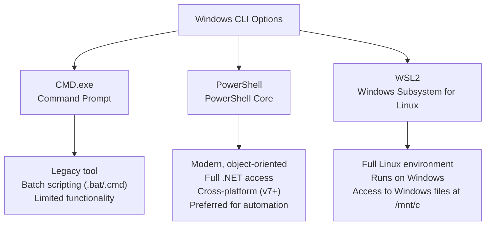

# 04 — Windows CMD and PowerShell Basics

> **[← Linux CLI](03_Linux_CLI.md)** | **[Index](00_INDEX.md)** | **[Permissions →](05_Permissions.md)**

---

## CMD vs PowerShell vs WSL



| Feature | CMD | PowerShell | WSL2 |
|---------|-----|-----------|------|
| Scripting | Batch (.bat/.cmd) | PowerShell (.ps1) | bash/zsh/etc |
| Objects | Text only | .NET objects | Text |
| Cross-platform | ❌ | ✅ (PS Core 7+) | ✅ |
| Pipe data | Text | Typed objects | Text |
| Admin tasks | Limited | Comprehensive | Needs sudo |

---

## CMD — Command Prompt

### Navigation
```cmd
cd                          REM Print current directory (like pwd)
cd Documents                REM Change to Documents
cd ..                       REM Go up one level
cd C:\Users\Alice           REM Absolute path
cd \                        REM Go to root of current drive
D:                          REM Switch to D drive
pushd C:\Temp               REM Save current dir and switch
popd                        REM Return to saved directory
```

### Directory Listing
```cmd
dir                         REM List current directory
dir /a                      REM Include hidden files
dir /s                      REM Recursive listing
dir /b                      REM Bare format (names only)
dir /o:n                    REM Sort by name
dir /o:d                    REM Sort by date
dir /o:s                    REM Sort by size
dir *.txt                   REM Only .txt files
dir C:\Windows              REM List specific directory
```

### File Operations
```cmd
REM Copy
copy source.txt dest.txt    REM Copy single file
copy *.txt C:\Backup\       REM Copy all .txt files
xcopy /E /I src\ dest\      REM Recursive copy directory

REM Move / Rename
move file.txt newname.txt   REM Rename
move file.txt C:\Dest\      REM Move

REM Delete
del file.txt                REM Delete file
del /f file.txt             REM Force delete (read-only)
del /q *.tmp                REM Quiet mode
rmdir folder                REM Remove empty directory
rmdir /s /q folder          REM Remove directory tree (no prompt)

REM Create
mkdir newfolder             REM Create directory
mkdir path\to\new\folder    REM Nested directories
echo text > file.txt        REM Create/overwrite file
echo text >> file.txt       REM Append to file
type nul > empty.txt        REM Create empty file
```

### Viewing Files
```cmd
type file.txt               REM Print file contents (like cat)
more file.txt               REM Paginated view
find "text" file.txt        REM Search text in file
findstr "pattern" file.txt  REM Regex search
```

### System Info Commands
```cmd
systeminfo                  REM Detailed system info
hostname                    REM Computer name
whoami                      REM Current user
whoami /priv                REM User privileges
set                         REM List environment variables
echo %USERNAME%             REM Print variable
echo %PATH%                 REM Print PATH
echo %COMPUTERNAME%         REM Computer name
echo %SYSTEMROOT%           REM Windows directory
ver                         REM Windows version
```

### Process Management
```cmd
tasklist                    REM List all running processes
tasklist /fi "imagename eq notepad.exe"  REM Filter by name
tasklist /v                 REM Verbose (includes window titles)
taskkill /PID 1234          REM Kill by PID
taskkill /IM notepad.exe    REM Kill by name
taskkill /F /IM process.exe REM Force kill
start notepad               REM Launch application
```

### Network Commands (CMD)
```cmd
ipconfig                    REM Show IP configuration
ipconfig /all               REM Full details (MAC, DNS, etc.)
ipconfig /release           REM Release DHCP lease
ipconfig /renew             REM Renew DHCP lease
ipconfig /flushdns          REM Clear DNS cache
ping 8.8.8.8                REM Test connectivity
tracert google.com          REM Trace route
nslookup google.com         REM DNS lookup
netstat -an                 REM Active connections
netstat -b                  REM Show executable for each connection (admin)
arp -a                      REM ARP table
route print                 REM Routing table
```

> Full detail in [Networking Tools →](08_Networking_Tools.md)

### Useful CMD Tricks
```cmd
cls                         REM Clear screen
help                        REM List commands
command /?                  REM Help for specific command
command > output.txt        REM Redirect to file
command >> output.txt       REM Append to file
command1 | command2         REM Pipe
command1 && command2        REM Run 2nd if 1st succeeds
command1 || command2        REM Run 2nd if 1st fails
^C                          REM Interrupt command
F7                          REM Command history popup
```

### Batch Script Basics
```batch
@echo off
REM This is a comment

SET NAME=Alice
ECHO Hello, %NAME%

IF EXIST file.txt (
    ECHO File found
) ELSE (
    ECHO File not found
)

FOR %%F IN (*.txt) DO (
    ECHO Processing: %%F
)

:LOOP
    ECHO In loop
    GOTO LOOP
```

---

## PowerShell

PowerShell works with **.NET objects** rather than text, making it much more powerful than CMD.

### Running PowerShell
```powershell
# Open PowerShell as Administrator (right-click > Run as Admin)
# Check version
$PSVersionTable.PSVersion

# Execution Policy (security setting for scripts)
Get-ExecutionPolicy
Set-ExecutionPolicy RemoteSigned    # Allow local scripts
Set-ExecutionPolicy Bypass          # Allow all (use carefully)
```

### Navigation
```powershell
Get-Location              # pwd equivalent
Set-Location C:\Users     # cd equivalent
Set-Location ..           # go up
Push-Location C:\Temp     # pushd
Pop-Location              # popd
```

### Aliases (PowerShell has Linux-like aliases)
```powershell
# PowerShell maps many Linux commands to aliases
ls     # = Get-ChildItem
cd     # = Set-Location
pwd    # = Get-Location
cat    # = Get-Content
cp     # = Copy-Item
mv     # = Move-Item
rm     # = Remove-Item
mkdir  # = New-Item -ItemType Directory
echo   # = Write-Output
clear  # = Clear-Host
```

### File Operations
```powershell
# List files
Get-ChildItem                          # List current dir
Get-ChildItem -Path C:\                # Specific path
Get-ChildItem -Recurse                 # Recursive
Get-ChildItem -Filter "*.txt"          # Filter by extension
Get-ChildItem -Hidden                  # Include hidden
Get-ChildItem | Sort-Object Length     # Sort by size

# Copy
Copy-Item source.txt dest.txt
Copy-Item -Recurse src\ dest\

# Move/Rename
Move-Item old.txt new.txt
Rename-Item old.txt new.txt

# Delete
Remove-Item file.txt
Remove-Item -Recurse -Force folder\

# Create
New-Item -ItemType File -Name "new.txt"
New-Item -ItemType Directory -Name "newdir"
New-Item -ItemType Directory -Path "a\b\c" -Force   # nested

# Read/Write content
Get-Content file.txt                   # Print file
Get-Content file.txt | Select-Object -First 10  # head
Get-Content file.txt | Select-Object -Last 10   # tail
Get-Content file.txt -Wait             # tail -f
Set-Content file.txt "content"        # Overwrite
Add-Content file.txt "new line"       # Append
```

### Process Management
```powershell
Get-Process                            # All processes (tasklist)
Get-Process -Name "notepad"            # Filter by name
Get-Process | Sort-Object CPU -Descending  # Sort by CPU
Stop-Process -Name "notepad"           # Kill by name
Stop-Process -Id 1234                  # Kill by PID
Stop-Process -Id 1234 -Force           # Force kill
Start-Process notepad                  # Launch app
Start-Process cmd -Verb RunAs          # Run as admin
```

### Service Management
```powershell
Get-Service                            # List all services
Get-Service -Name "wuauserv"           # Specific service (Windows Update)
Get-Service | Where-Object {$_.Status -eq "Running"}  # Only running

Start-Service -Name "wuauserv"
Stop-Service -Name "wuauserv"
Restart-Service -Name "wuauserv"
Set-Service -Name "wuauserv" -StartupType Automatic
```

> See also: [Services & Processes →](15_Services_Processes.md)

### Network Commands (PowerShell)
```powershell
Get-NetIPAddress                       # IP addresses
Get-NetIPConfiguration                 # Full network config (ipconfig)
Test-Connection 8.8.8.8               # ping equivalent
Test-Connection google.com -Count 5
Resolve-DnsName google.com            # nslookup equivalent
Get-NetTCPConnection                  # netstat equivalent
Get-NetTCPConnection -State Listen    # Listening ports only
```

### Filtering and Piping Objects
```powershell
# PowerShell pipes objects, not text
Get-Process | Where-Object {$_.CPU -gt 100}        # Filter by CPU
Get-Process | Select-Object Name, CPU, Id          # Select columns
Get-Process | Sort-Object CPU -Descending           # Sort
Get-Process | Measure-Object                        # Count
Get-ChildItem | Where-Object {$_.Length -gt 1MB}   # Files > 1MB
Get-Service | Where-Object {$_.Status -eq "Stopped"}
```

### Output Formatting
```powershell
Get-Process | Format-Table              # Table format
Get-Process | Format-List               # List format
Get-Process | Format-Wide               # Wide format
Get-Process | Out-GridView              # GUI grid (Windows only)
Get-Process | Export-Csv procs.csv      # Export to CSV
Get-Process | ConvertTo-Json            # Convert to JSON
Get-Content procs.csv | Import-Csv     # Import CSV
```

### PowerShell Scripting
```powershell
# Variables
$name = "Alice"
$number = 42
$list = @("a", "b", "c")
$hash = @{ key = "value"; count = 5 }

# If/Else
if ($number -gt 10) {
    Write-Output "Greater than 10"
} elseif ($number -eq 10) {
    Write-Output "Equal to 10"
} else {
    Write-Output "Less than 10"
}

# Comparison operators
-eq   # equal
-ne   # not equal
-gt   # greater than
-lt   # less than
-ge   # greater or equal
-le   # less or equal
-like # wildcard match
-match # regex match

# Loops
foreach ($item in $list) {
    Write-Output $item
}

for ($i = 0; $i -lt 5; $i++) {
    Write-Output $i
}

Get-ChildItem *.txt | ForEach-Object {
    Write-Output $_.Name
}

# Try/Catch
try {
    Remove-Item "missing.txt" -ErrorAction Stop
} catch {
    Write-Error "Failed: $_"
}

# Functions
function Greet {
    param([string]$Name = "World")
    Write-Output "Hello, $Name!"
}
Greet -Name "Alice"
```

### Environment Variables in PowerShell
```powershell
$env:USERNAME               # Current user
$env:PATH                   # PATH variable
$env:COMPUTERNAME           # Computer name
$env:TEMP                   # Temp directory

# Set environment variable (session)
$env:MY_VAR = "hello"

# Permanent (current user)
[Environment]::SetEnvironmentVariable("MY_VAR", "hello", "User")

# Permanent (system-wide, requires admin)
[Environment]::SetEnvironmentVariable("MY_VAR", "hello", "Machine")
```

---

## CMD vs PowerShell Quick Reference

| Task | CMD | PowerShell |
|------|-----|-----------|
| List files | `dir` | `Get-ChildItem` / `ls` |
| Change dir | `cd` | `Set-Location` / `cd` |
| Print file | `type` | `Get-Content` / `cat` |
| Search text | `findstr` | `Select-String` |
| Copy file | `copy` / `xcopy` | `Copy-Item` |
| Move file | `move` | `Move-Item` |
| Delete file | `del` / `rmdir` | `Remove-Item` |
| Create dir | `mkdir` | `New-Item -ItemType Directory` |
| Process list | `tasklist` | `Get-Process` |
| Kill process | `taskkill` | `Stop-Process` |
| Services | `sc` / `net` | `Get-Service` |
| IP info | `ipconfig` | `Get-NetIPConfiguration` |
| Ping | `ping` | `Test-Connection` |
| DNS lookup | `nslookup` | `Resolve-DnsName` |

---

## Windows Event Viewer (Logs)

> See full coverage in [System Monitoring & Logging →](13_Monitoring_Logging.md)

```powershell
# View event logs in PowerShell
Get-EventLog -LogName System -Newest 20
Get-EventLog -LogName Application -EntryType Error
Get-WinEvent -LogName "Microsoft-Windows-Sysmon/Operational"
```

---

## Related Topics

- [Linux CLI Basics ←](03_Linux_CLI.md)
- [User Permissions →](05_Permissions.md)
- [Networking Tools →](08_Networking_Tools.md)
- [Services & Processes →](15_Services_Processes.md)
- [System Monitoring & Logging →](13_Monitoring_Logging.md)
- [Troubleshooting →](18_Troubleshooting.md)

---

> [← Linux CLI](03_Linux_CLI.md) | [Index](00_INDEX.md) | [Permissions →](05_Permissions.md)
