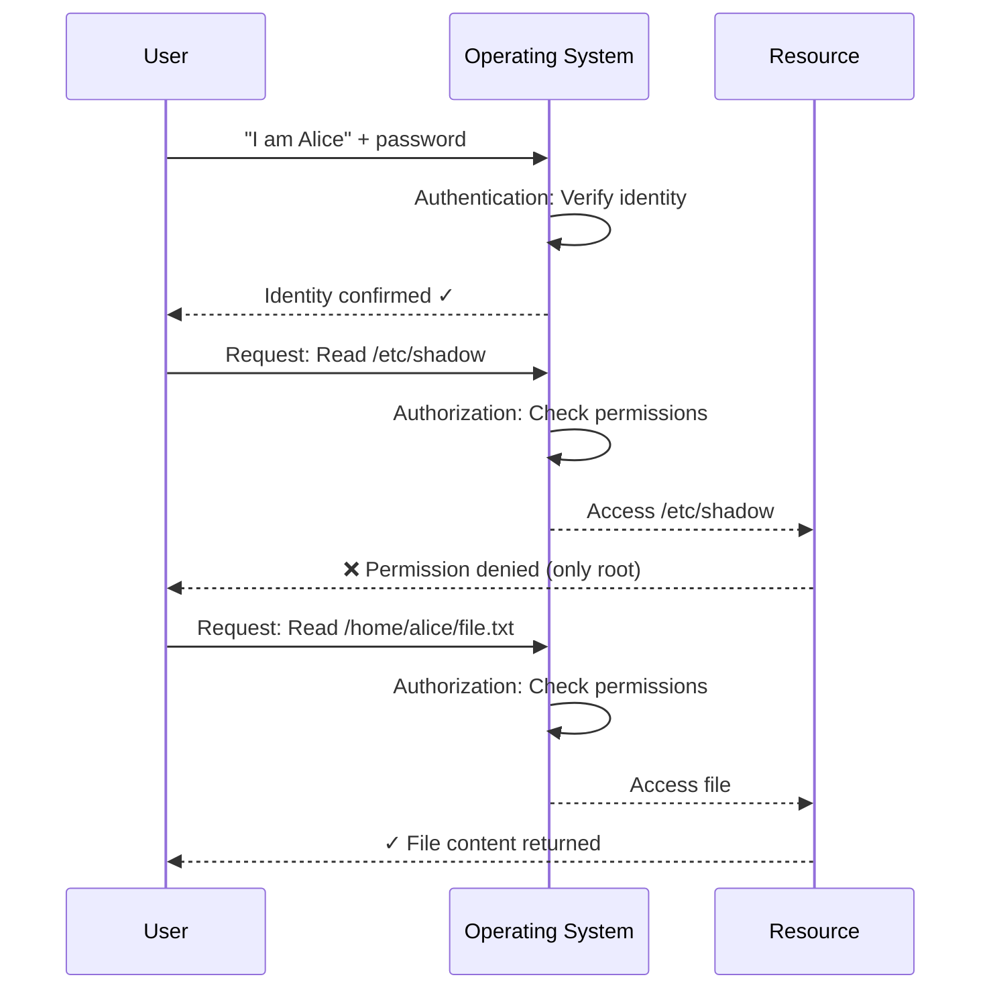
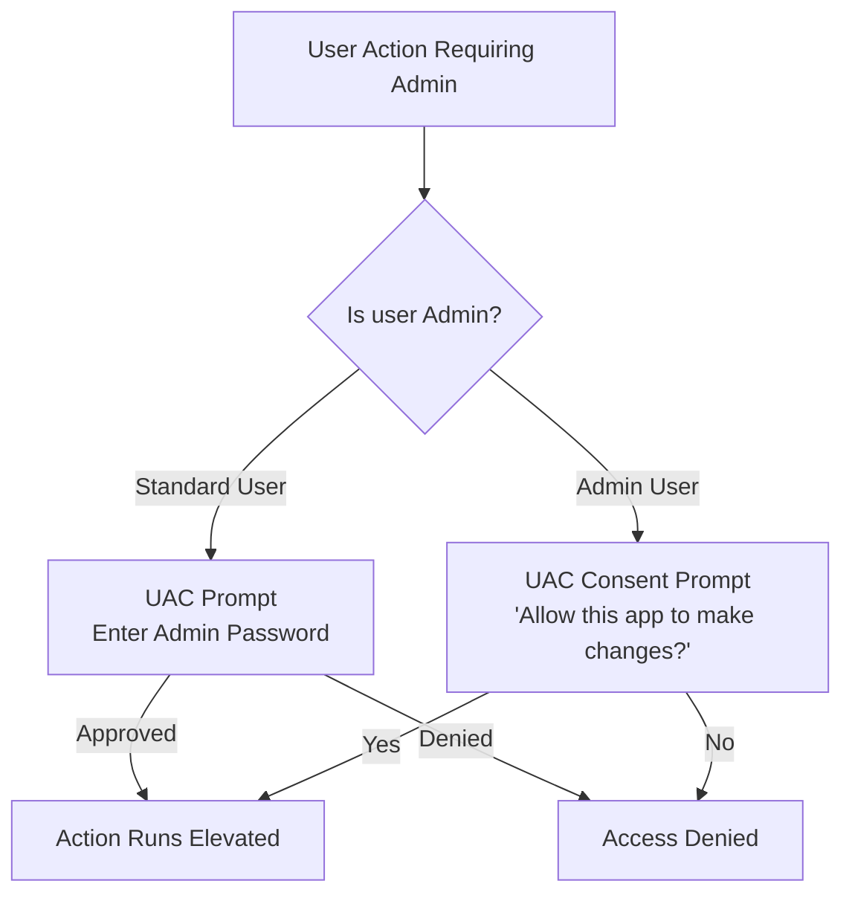

# 05 — User Permissions and Privilege Management

> **[← Windows CLI](04_Windows_CLI.md)** | **[Index](00_INDEX.md)** | **[File Management →](06_File_Management.md)**

---

## Core Concepts

### Authentication vs Authorization



| Concept | Question | Example |
|---------|----------|---------|
| **Authentication** | Who are you? | Login with password, SSH key, biometric |
| **Authorization** | What can you do? | Read, write, execute permissions |

---

## Linux Permission Model

### Permission Bits

Every file/directory has three permission groups, each with three bits:

```
-  r w x  r - x  r - -
↑  ↑↑↑↑  ↑↑↑↑  ↑↑↑↑
│  ╰Owner╯ ╰Group╯ ╰Others╯
└─ File type (- = file, d = dir, l = link)
```

| Permission | File | Directory |
|-----------|------|-----------|
| **r** (read) | Read file content | List directory contents (`ls`) |
| **w** (write) | Modify file | Create/delete files inside |
| **x** (execute) | Run as program | Enter directory (`cd`) |

### Numeric (Octal) Notation

```
r = 4, w = 2, x = 1

rwx = 4+2+1 = 7
rw- = 4+2+0 = 6
r-x = 4+0+1 = 5
r-- = 4+0+0 = 4
-wx = 0+2+1 = 3
-w- = 0+2+0 = 2
--x = 0+0+1 = 1
--- = 0+0+0 = 0
```

**Common Permission Values:**

| Octal | Symbolic | Meaning |
|-------|----------|---------|
| `755` | `rwxr-xr-x` | Owner full, group/others read+exec |
| `644` | `rw-r--r--` | Owner read+write, others read |
| `700` | `rwx------` | Owner only (private) |
| `600` | `rw-------` | Owner read+write only |
| `777` | `rwxrwxrwx` | Everyone full access ⚠️ |
| `000` | `---------` | No access |
| `750` | `rwxr-x---` | Owner full, group read+exec, others none |
| `664` | `rw-rw-r--` | Owner+group read+write, others read |

### Reading `ls -l` Output

```
-rw-r--r-- 1 alice devs  1024 Apr 22 10:00 config.txt
drwxr-xr-x 2 alice devs  4096 Apr 22 10:00 projects/
-rwxr-xr-x 1 root  root  8192 Apr 22 10:00 /usr/bin/ls
lrwxrwxrwx 1 root  root     7 Apr 22 10:00 /bin -> usr/bin

↑↑↑↑↑↑↑↑↑ ↑ ↑     ↑     ↑    ↑             ↑
│         │ │     │     │    timestamp       name
│         │ │     group size
│         │ owner
│         hard links
permissions (type + 9 bits)
```

---

## `chmod` — Change Permissions

### Symbolic Mode
```bash
chmod u+x script.sh          # Add execute for owner
chmod g-w file.txt           # Remove write from group
chmod o=r file.txt           # Set others to read only
chmod a+x file.sh            # Add execute for all (a = all)
chmod ug+rw file.txt         # Add read+write for owner and group
chmod u=rwx,g=rx,o= file     # Set explicit permissions
chmod -R 755 directory/      # Recursive
```

Targets: `u` = user/owner, `g` = group, `o` = others, `a` = all  
Operators: `+` = add, `-` = remove, `=` = set exactly

### Numeric Mode
```bash
chmod 755 script.sh          # rwxr-xr-x
chmod 644 config.txt         # rw-r--r--
chmod 600 ~/.ssh/id_rsa      # rw------- (SSH key must be 600)
chmod 700 ~/.ssh/            # rwx------ (SSH dir must be 700)
chmod 777 /tmp/shared/       # ⚠️ Dangerous: avoid in production
chmod -R 750 /var/app/       # Recursive
```

---

## `chown` — Change Ownership

```bash
chown alice file.txt             # Change owner
chown alice:devs file.txt        # Change owner and group
chown :devs file.txt             # Change group only (same as chgrp)
chown -R alice:devs /var/app/    # Recursive
chgrp devs file.txt              # Change group only
```

---

## Special Permission Bits

### SUID — Set User ID (4xxx)
When set on an executable, it runs with the **file owner's privileges**, not the caller's.

```bash
ls -l /usr/bin/passwd
# -rwsr-xr-x  root  root  /usr/bin/passwd
#      ↑ s = SUID set (runs as root even when regular user calls it)

chmod 4755 program     # Set SUID
chmod u+s program      # Same with symbolic
```

> `/usr/bin/passwd` needs SUID to write to `/etc/shadow` (root-owned) when a regular user changes their password.

### SGID — Set Group ID (2xxx)
On files: runs with file's group permissions.  
On directories: new files inherit the directory's group.

```bash
chmod 2755 /shared/project/     # SGID on directory
chmod g+s /shared/project/      # Symbolic
```

### Sticky Bit (1xxx)
On a directory: users can only **delete their own files**, not others'.  
Used on `/tmp`.

```bash
ls -ld /tmp
# drwxrwxrwt  root  root  /tmp
#          ↑ t = sticky bit set

chmod 1777 /tmp                  # Sticky + world-writable
chmod +t /shared/                # Add sticky bit
```

### Summary
```
4000 = SUID   → s in owner execute position
2000 = SGID   → s in group execute position
1000 = Sticky → t in others execute position

chmod 4755 = SUID + rwxr-xr-x
chmod 2770 = SGID + rwxrwx---
chmod 1777 = Sticky + rwxrwxrwx
```

---

## `sudo` — Superuser Do

`sudo` allows permitted users to run commands as root (or another user) without knowing the root password.

```bash
sudo command              # Run command as root
sudo -u alice command     # Run as user alice
sudo -i                   # Interactive root shell (full env)
sudo -s                   # Root shell (current env)
sudo su -                 # Switch to root (full login)
su - alice                # Switch to alice (needs alice's password)
sudo !!                   # Re-run last command as root
sudo visudo               # Edit /etc/sudoers safely
```

### `/etc/sudoers` Configuration
```
# Format: WHO WHERE=(AS_WHO) WHAT
# Allow alice to run all commands as root
alice ALL=(ALL:ALL) ALL

# Allow devops group to run all commands without password
%devops ALL=(ALL) NOPASSWD: ALL

# Allow alice to run only specific commands
alice ALL=(root) /usr/bin/systemctl, /usr/bin/apt

# Allow sudo for a group
%sudo ALL=(ALL:ALL) ALL

# No password for specific command
alice ALL=(root) NOPASSWD: /usr/bin/apt update
```

---

## umask — Default Permission Mask

`umask` defines which permissions are **removed** from new files/directories.

```bash
umask              # Show current mask (e.g., 0022)
umask 022          # Set mask

# Default max for files:      666 (no execute by default)
# Default max for dirs:       777
# With umask 022:
#   Files: 666 - 022 = 644 (rw-r--r--)
#   Dirs:  777 - 022 = 755 (rwxr-xr-x)

# With umask 027:
#   Files: 666 - 027 = 640 (rw-r-----)
#   Dirs:  777 - 027 = 750 (rwxr-x---)
```

---

## Access Control Lists (ACLs)

Standard Unix permissions (owner/group/others) can be extended with **ACLs** for fine-grained control.

```bash
# View ACL
getfacl file.txt

# Set ACL
setfacl -m u:bob:rw file.txt          # Give bob read+write
setfacl -m g:devs:r file.txt          # Give devs read
setfacl -m u:eve:--- file.txt         # Explicitly deny eve
setfacl -x u:bob file.txt             # Remove bob's ACL
setfacl -b file.txt                   # Remove all ACLs

# Default ACL on directory (inherited by new files)
setfacl -d -m g:devs:rw /shared/
```

---

## Linux Users and Groups

### User Management
```bash
# User info
id                          # Current user UID, GID, groups
id alice                    # Specific user
whoami                      # Current username
w / who                     # Logged-in users
last                        # Login history

# Create/modify users
sudo useradd alice              # Create user (basic)
sudo useradd -m -s /bin/bash -G sudo alice  # With home, shell, group
sudo usermod -aG docker alice   # Add to group (append, don't replace)
sudo usermod -L alice           # Lock account
sudo usermod -U alice           # Unlock account
sudo userdel alice              # Delete user (keep home)
sudo userdel -r alice           # Delete user + home

# Password management
passwd                          # Change own password
sudo passwd alice               # Change alice's password
sudo passwd -l alice            # Lock password
sudo passwd -e alice            # Expire password (force change on next login)
sudo chage -l alice             # Show password aging info
```

### Group Management
```bash
sudo groupadd devs              # Create group
sudo groupdel devs              # Delete group
sudo gpasswd -a alice devs      # Add alice to devs
sudo gpasswd -d alice devs      # Remove alice from devs
groups alice                    # Show alice's groups
cat /etc/group                  # List all groups
```

### Important Files
```bash
/etc/passwd     # User accounts (username:x:UID:GID:comment:home:shell)
/etc/shadow     # Hashed passwords (root-readable only)
/etc/group      # Group definitions
/etc/sudoers    # sudo permissions (edit with visudo)
```

---

## Windows Permission Model

### User Account Types

| Type | Description |
|------|-------------|
| **Administrator** | Full system access |
| **Standard User** | Limited, needs elevation for system changes |
| **Guest** | Very limited, usually disabled |
| **SYSTEM** | OS internal account, highest privilege |
| **Network Service** | Service account with network access |
| **Local Service** | Service account, minimal privileges |

### UAC — User Account Control

UAC prevents unauthorized privilege escalation by prompting when an admin action is attempted.



```powershell
# Check if running as admin
([Security.Principal.WindowsPrincipal][Security.Principal.WindowsIdentity]::GetCurrent()).IsInRole([Security.Principal.WindowsBuiltInRole]::Administrator)

# Run PowerShell as Admin
Start-Process powershell -Verb RunAs
```

### NTFS Permissions

Windows uses **Access Control Lists (ACLs)** on NTFS volumes.

```
Full Control     → Can do anything (read, write, execute, delete, change permissions)
Modify           → Read + write + delete (but not change permissions)
Read & Execute   → Read + run executables
List Folder      → See contents (directories only)
Read             → View file content
Write            → Create/modify files
Special          → Custom combination
```

### Viewing and Setting Permissions

```powershell
# View permissions
Get-Acl C:\path\file.txt
Get-Acl C:\path\file.txt | Format-List

# Set permissions
$acl = Get-Acl "C:\path\file.txt"
$rule = New-Object System.Security.AccessControl.FileSystemAccessRule(
    "Alice", "FullControl", "Allow"
)
$acl.AddAccessRule($rule)
Set-Acl "C:\path\file.txt" $acl
```

**Using icacls (CMD/PowerShell):**
```cmd
icacls C:\path\file.txt                          REM View ACL
icacls C:\path\file.txt /grant Alice:F           REM Give Alice full control
icacls C:\path\file.txt /grant Users:(R)         REM Give Users read
icacls C:\path\file.txt /deny Guest:(W)          REM Deny Guest write
icacls C:\path\file.txt /remove Alice            REM Remove Alice's ACE
icacls C:\path\ /inheritance:d                   REM Disable inheritance
icacls C:\path\ /reset                           REM Reset to inherited
```

---

## Comparison: Linux vs Windows Permissions

| Feature | Linux | Windows |
|---------|-------|---------|
| Model | rwx bits + ACL | NTFS ACL |
| Granularity | Owner/Group/Others | Per user/group (many entries) |
| Root equiv | root (UID 0) | Administrator / SYSTEM |
| Privilege tool | sudo | UAC / Run as Administrator |
| Config file | /etc/sudoers | Group Policy / Local Security Policy |
| Special bits | SUID, SGID, Sticky | Special permissions flag |

---

## Related Topics

- [OS Fundamentals ←](01_OS_Fundamentals.md)
- [File System Structure ←](02_File_System.md)
- [Linux CLI ←](03_Linux_CLI.md)
- [Windows CLI ←](04_Windows_CLI.md)
- [Security Concepts →](14_Security_Concepts.md)
- [Active Directory →](09_Active_Directory.md) — domain-level permissions

---

> [← Windows CLI](04_Windows_CLI.md) | [Index](00_INDEX.md) | [File Management →](06_File_Management.md)
