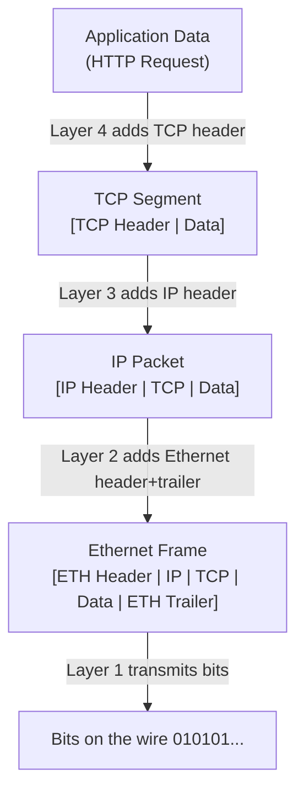
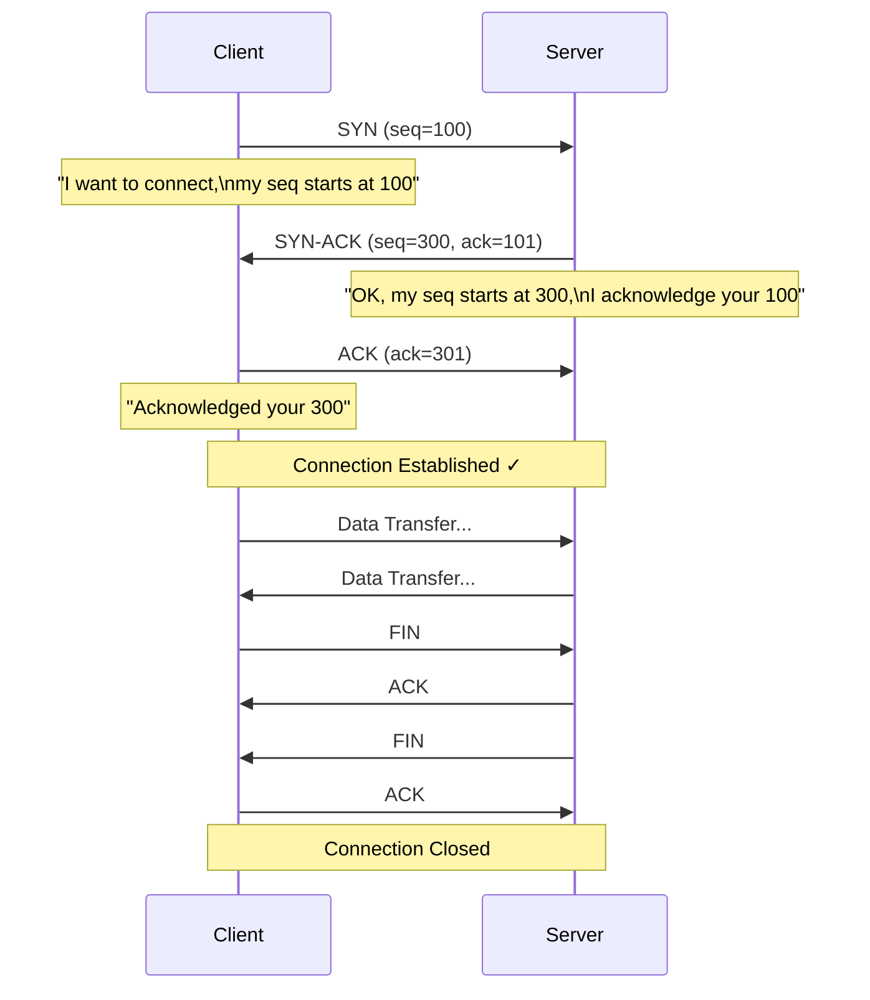
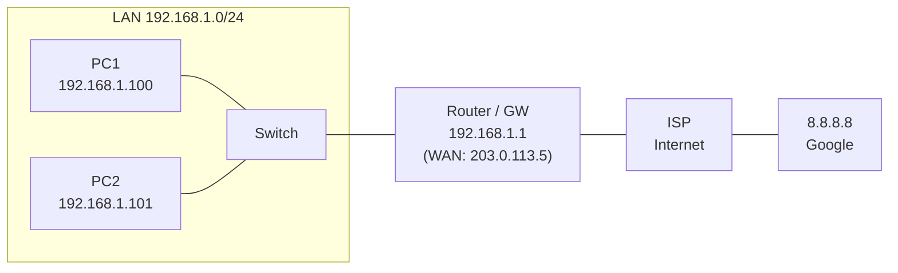
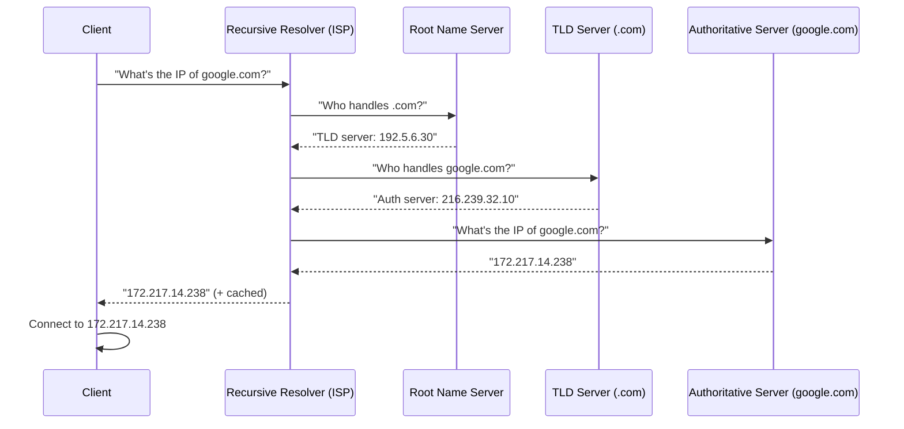
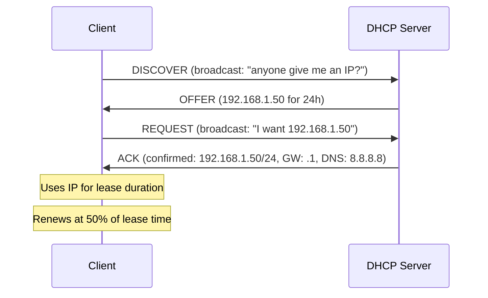

# 07 — Networking Fundamentals

> **[← File Management](06_File_Management.md)** | **[Index](00_INDEX.md)** | **[Networking Tools →](08_Networking_Tools.md)**

---

## The OSI Model

The **Open Systems Interconnection (OSI)** model is a conceptual framework that describes how data travels from one computer to another across a network in **7 layers**.

```
┌─────────────────────────────────────────────────────────────┐
│  Layer 7 — APPLICATION    HTTP, HTTPS, FTP, SMTP, DNS, SSH  │
│  (what the user sees)     Data: Message                     │
├─────────────────────────────────────────────────────────────┤
│  Layer 6 — PRESENTATION   TLS/SSL, JPEG, MPEG, ASCII        │
│  (format/encrypt/decrypt) Data: Formatted Data              │
├─────────────────────────────────────────────────────────────┤
│  Layer 5 — SESSION        NetBIOS, RPC, PPTP                │
│  (manage connections)     Data: Session                     │
├─────────────────────────────────────────────────────────────┤
│  Layer 4 — TRANSPORT      TCP, UDP                          │
│  (end-to-end delivery)    Data: Segments (TCP) / Datagrams  │
├─────────────────────────────────────────────────────────────┤
│  Layer 3 — NETWORK        IP, ICMP, ARP, routing            │
│  (logical addressing)     Data: Packets                     │
├─────────────────────────────────────────────────────────────┤
│  Layer 2 — DATA LINK      Ethernet, Wi-Fi (802.11), MAC     │
│  (physical addressing)    Data: Frames                      │
├─────────────────────────────────────────────────────────────┤
│  Layer 1 — PHYSICAL       Cables, fiber, radio waves        │
│  (bits on wire)           Data: Bits                        │
└─────────────────────────────────────────────────────────────┘
```

**Mnemonic:** "**A**ll **P**eople **S**eem **T**o **N**eed **D**ata **P**rocessing"

### Data Encapsulation

As data moves down the stack, each layer **wraps** the data with its own header:



---

## TCP vs UDP

| Feature | TCP | UDP |
|---------|-----|-----|
| Connection | Connection-oriented | Connectionless |
| Reliability | Guaranteed delivery | No guarantee |
| Order | In-order delivery | No ordering |
| Error checking | Yes (retransmit) | Basic checksum only |
| Speed | Slower (overhead) | Faster |
| Flow control | Yes | No |
| Use cases | HTTP, SSH, FTP, email | DNS, video streaming, VoIP, gaming |

### TCP Three-Way Handshake



---

## IP Addressing

### IPv4

An IPv4 address is a **32-bit** number written as four octets (0–255):

```
192  . 168  .  1   .  100
 ↑       ↑      ↑      ↑
 8 bits  8 bits 8 bits 8 bits = 32 bits total
```

### IP Address Classes (Historical)

| Class | Range | Default Mask | Hosts | Use |
|-------|-------|-------------|-------|-----|
| A | 1–126 | /8 (255.0.0.0) | 16M | Large orgs |
| B | 128–191 | /16 (255.255.0.0) | 65K | Medium orgs |
| C | 192–223 | /24 (255.255.255.0) | 254 | Small orgs |
| D | 224–239 | N/A | N/A | Multicast |
| E | 240–255 | N/A | N/A | Reserved |

### Private IP Ranges

These ranges are **not routable on the internet** — used in internal networks:

| Range | CIDR | Description |
|-------|------|-------------|
| `10.0.0.0` – `10.255.255.255` | `10.0.0.0/8` | Class A private |
| `172.16.0.0` – `172.31.255.255` | `172.16.0.0/12` | Class B private |
| `192.168.0.0` – `192.168.255.255` | `192.168.0.0/16` | Class C private |
| `127.0.0.0` – `127.255.255.255` | `127.0.0.0/8` | Loopback |
| `169.254.0.0` – `169.254.255.255` | `169.254.0.0/16` | Link-local (APIPA) |

---

## Subnet Masks and CIDR

### Subnet Mask

A subnet mask separates the **network** portion from the **host** portion of an IP:

```
IP:      192.168.1.100   = 11000000.10101000.00000001.01100100
Mask:    255.255.255.0   = 11111111.11111111.11111111.00000000
                           ↑ 24 bits network             ↑ 8 bits hosts

Network: 192.168.1.0     (all host bits = 0)
Broadcast: 192.168.1.255 (all host bits = 1)
Hosts:   192.168.1.1 – 192.168.1.254 (254 usable)
```

### CIDR Notation

CIDR (Classless Inter-Domain Routing) expresses the mask as a **prefix length**:

```
192.168.1.0/24 = 192.168.1.0 with 24-bit mask (255.255.255.0)
10.0.0.0/8     = 10.0.0.0 with 8-bit mask (255.0.0.0)
172.16.0.0/12  = 172.16.0.0 with 12-bit mask (255.240.0.0)
```

### Common Subnet Reference

| CIDR | Mask | Hosts | Use Case |
|------|------|-------|---------|
| `/8` | 255.0.0.0 | 16,777,214 | Very large network |
| `/16` | 255.255.0.0 | 65,534 | Large org/campus |
| `/24` | 255.255.255.0 | 254 | Typical LAN |
| `/25` | 255.255.255.128 | 126 | Split /24 in half |
| `/26` | 255.255.255.192 | 62 | Smaller subnet |
| `/28` | 255.255.255.240 | 14 | Small group |
| `/30` | 255.255.255.252 | 2 | Point-to-point links |
| `/32` | 255.255.255.255 | 1 | Single host |

---

## Default Gateway

The **default gateway** is the router that a device sends traffic to when the destination IP is **outside the local subnet**.

```
Device: 192.168.1.100/24
GW:     192.168.1.1

Destination: 192.168.1.50  → Same subnet → Direct (no GW needed)
Destination: 8.8.8.8       → Different subnet → Send to GW 192.168.1.1
```

### Network Topology



---

## DNS — Domain Name System

DNS translates human-readable domain names to IP addresses.

### DNS Resolution Process



### DNS Record Types

| Record | Purpose | Example |
|--------|---------|---------|
| **A** | Hostname → IPv4 | `google.com → 142.250.x.x` |
| **AAAA** | Hostname → IPv6 | `google.com → 2607:f8b0::` |
| **CNAME** | Alias to another hostname | `www.example.com → example.com` |
| **MX** | Mail server | `example.com → mail.example.com` |
| **TXT** | Text data (SPF, DKIM, verify) | SPF records |
| **NS** | Name server delegation | `example.com → ns1.example.com` |
| **PTR** | Reverse DNS (IP → hostname) | `1.2.3.4 → host.example.com` |
| **SOA** | Start of Authority — zone info | Serial, refresh, TTL |
| **SRV** | Service location | `_sip._tcp.example.com` |

```bash
# Query DNS records
nslookup google.com              # A record
nslookup -type=MX gmail.com      # MX records
dig google.com                   # Detailed query
dig google.com MX                # MX records
dig +short google.com            # Short answer
dig -x 8.8.8.8                  # Reverse lookup (PTR)
```

> See [Networking Tools →](08_Networking_Tools.md)

### Important DNS Servers

| DNS Server | IP | Provider |
|-----------|-----|---------|
| `8.8.8.8` | Google Public DNS | Google |
| `8.8.4.4` | Google Public DNS | Google |
| `1.1.1.1` | Cloudflare | Cloudflare |
| `1.0.0.1` | Cloudflare | Cloudflare |
| `9.9.9.9` | Quad9 | IBM/Quad9 |
| `208.67.222.222` | OpenDNS | Cisco |

---

## Ports and Protocols

A **port** is a 16-bit number (0–65535) that identifies a specific service on a host.

### Port Ranges

| Range | Name | Description |
|-------|------|-------------|
| 0–1023 | Well-known ports | Standard services, need root to bind |
| 1024–49151 | Registered ports | Third-party services |
| 49152–65535 | Dynamic/Ephemeral | Temporary client ports |

### Common Ports Reference

| Port | Protocol | Service |
|------|----------|--------|
| 20/21 | TCP | FTP (data/control) |
| 22 | TCP | SSH |
| 23 | TCP | Telnet (insecure, avoid) |
| 25 | TCP | SMTP (email sending) |
| 53 | TCP/UDP | DNS |
| 67/68 | UDP | DHCP (server/client) |
| 80 | TCP | HTTP |
| 110 | TCP | POP3 (email retrieval) |
| 123 | UDP | NTP |
| 143 | TCP | IMAP (email) |
| 161/162 | UDP | SNMP |
| 389 | TCP | LDAP |
| 443 | TCP | HTTPS |
| 445 | TCP | SMB/CIFS (file sharing) |
| 465/587 | TCP | SMTPS / SMTP submission |
| 514 | UDP | Syslog |
| 636 | TCP | LDAPS (secure LDAP) |
| 993 | TCP | IMAPS |
| 995 | TCP | POP3S |
| 1433 | TCP | Microsoft SQL Server |
| 1521 | TCP | Oracle DB |
| 3306 | TCP | MySQL |
| 3389 | TCP | RDP (Remote Desktop) |
| 5432 | TCP | PostgreSQL |
| 5900 | TCP | VNC |
| 6379 | TCP | Redis |
| 8080 | TCP | HTTP alternate |
| 8443 | TCP | HTTPS alternate |
| 27017 | TCP | MongoDB |

---

## DHCP — Dynamic Host Configuration Protocol

DHCP automatically assigns IP addresses, subnet masks, gateways, and DNS to devices.



**DORA:** Discover → Offer → Request → Acknowledge

---

## NAT — Network Address Translation

NAT allows multiple private IPs to share one public IP.

```
Private LAN              Router (NAT)           Internet
192.168.1.100 ──────────▶ Maps to 203.0.113.5:12345 ──────▶ 8.8.8.8:80
192.168.1.101 ──────────▶ Maps to 203.0.113.5:12346 ──────▶ 8.8.8.8:80
192.168.1.102 ──────────▶ Maps to 203.0.113.5:12347 ──────▶ 1.1.1.1:443
```

Types:
- **PAT/Masquerade** — Many-to-one (most common home/office NAT)
- **Static NAT** — One-to-one mapping
- **Dynamic NAT** — Pool of public IPs

---

## IPv6 Basics

IPv6 uses **128-bit** addresses written in hexadecimal:

```
2001:0db8:85a3:0000:0000:8a2e:0370:7334
↓ Simplified (collapse leading zeros and longest :: run)
2001:db8:85a3::8a2e:370:7334
```

| Address | Meaning |
|---------|---------|
| `::1` | Loopback (like 127.0.0.1) |
| `fe80::/10` | Link-local (like APIPA) |
| `fc00::/7` | Unique local (like private RFC1918) |
| `ff00::/8` | Multicast |
| `2000::/3` | Global unicast (internet-routable) |

---

## Related Topics

- [Networking Tools →](08_Networking_Tools.md)
- [Active Directory →](09_Active_Directory.md) — Kerberos, DNS in AD
- [IIS →](10_IIS.md) — HTTP/HTTPS ports
- [NTP →](11_NTP.md) — Port 123, UDP
- [VPN →](12_VPN.md) — tunneled networking
- [Security Concepts →](14_Security_Concepts.md) — firewalls, encryption
- [Cloud & Remote Access →](17_Cloud_Remote_Access.md) — SSH port 22, RDP port 3389

---

> [← File Management](06_File_Management.md) | [Index](00_INDEX.md) | [Networking Tools →](08_Networking_Tools.md)
