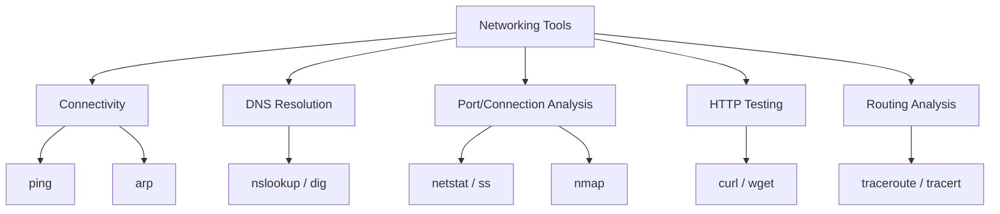
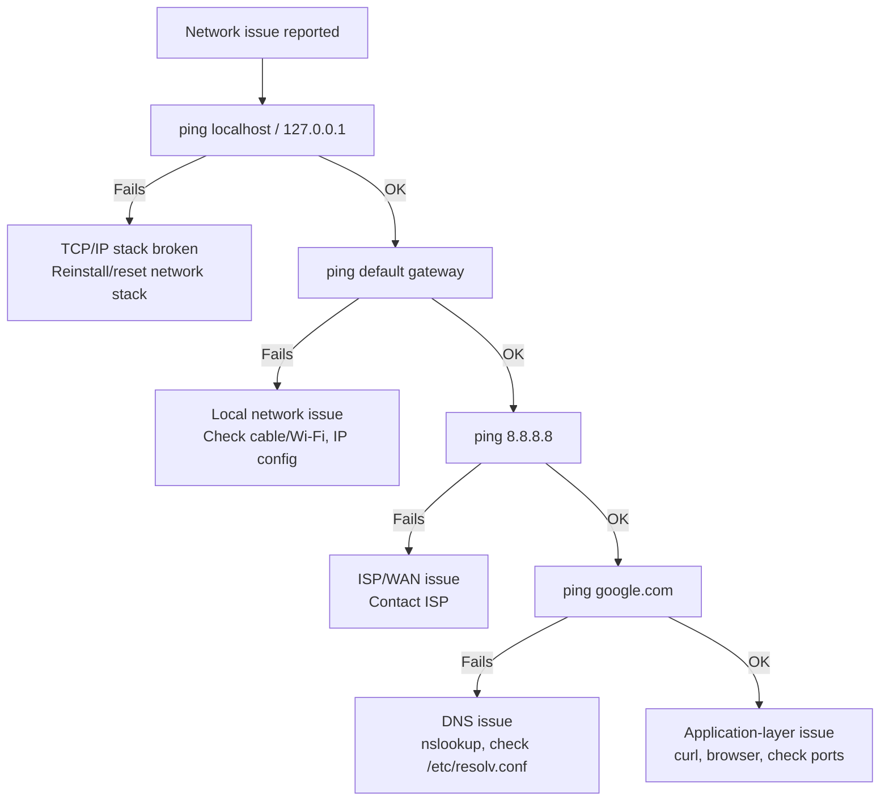

# 08 — Networking Tools

> **[← Networking Fundamentals](07_Networking_Fundamentals.md)** | **[Index](00_INDEX.md)** | **[Active Directory →](09_Active_Directory.md)**

---

## Overview



---

## `ping` — Test Connectivity

`ping` sends **ICMP Echo Request** packets and waits for **ICMP Echo Reply**.

### Linux
```bash
ping 8.8.8.8                    # Continuous ping (Ctrl+C to stop)
ping -c 4 8.8.8.8               # Send 4 packets
ping -c 4 -i 2 host             # 2-second interval
ping -s 1400 host               # Custom packet size (bytes)
ping -t 128 host                # Set TTL
ping -q host                    # Quiet mode (summary only)
ping6 ::1                       # IPv6 ping
```

### Windows
```cmd
ping 8.8.8.8                    :: 4 packets by default
ping -t 8.8.8.8                 :: Continuous (Ctrl+C to stop)
ping -n 10 8.8.8.8              :: Send 10 packets
ping -l 1400 8.8.8.8            :: Packet size
ping -4 host                    :: Force IPv4
ping -6 host                    :: Force IPv6
```

### Reading `ping` Output
```
PING google.com (142.250.67.78): 56 data bytes
64 bytes from 142.250.67.78: icmp_seq=1 ttl=117 time=12.3 ms
64 bytes from 142.250.67.78: icmp_seq=2 ttl=117 time=11.8 ms
64 bytes from 142.250.67.78: icmp_seq=3 ttl=117 time=12.1 ms
^C
--- google.com ping statistics ---
3 packets transmitted, 3 received, 0% packet loss
rtt min/avg/max/mdev = 11.8/12.1/12.3/0.2 ms

↑ TTL=117: started at 128 → means ~11 hops
↑ time: round-trip latency in milliseconds
↑ packet loss %: connectivity health indicator
```

### Interpreting Results

| Result | Meaning |
|--------|---------|
| Reply received, low ms | Good connectivity |
| Reply received, high ms | Latency/congestion |
| Request timeout | Firewall blocking ICMP, or host down |
| Destination unreachable | No route to host |
| 100% packet loss | No connectivity |
| TTL expired | Routing loop or too many hops |

---

## `traceroute` / `tracert` — Trace Network Path

Reveals each **router hop** between source and destination.

### Linux: `traceroute`
```bash
traceroute google.com           # Default (UDP probes)
traceroute -I google.com        # Use ICMP (like Windows)
traceroute -T google.com        # Use TCP
traceroute -p 443 google.com    # Specific port
traceroute -n google.com        # No DNS resolution (faster)
traceroute -m 30 google.com     # Max 30 hops
mtr google.com                  # Real-time traceroute (interactive)
mtr --report google.com         # Generate report
```

### Windows: `tracert`
```cmd
tracert google.com
tracert -d google.com           :: No DNS resolution
tracert -h 20 google.com        :: Max 20 hops
tracert -w 1000 google.com      :: Timeout per hop (ms)
```

### Reading Output
```
traceroute to google.com (142.250.67.78), 30 hops max
 1   192.168.1.1     1.2 ms  0.9 ms  1.0 ms    ← Your router (gateway)
 2   10.20.30.1      5.1 ms  5.3 ms  5.0 ms    ← ISP edge router
 3   203.0.113.1    10.2 ms 10.1 ms 10.5 ms    ← ISP backbone
 4   * * *                                      ← Hop not responding (ICMP filtered)
 5   142.251.49.1   12.0 ms 11.8 ms 12.1 ms    ← Google network
 6   142.250.67.78  12.3 ms 11.9 ms 12.1 ms    ← Destination
```

`* * *` = That hop's router drops traceroute probes (doesn't mean traffic stops).

---

## `netstat` / `ss` — Network Connections

Shows active connections, listening ports, and socket statistics.

### Linux: `ss` (modern replacement for netstat)
```bash
ss -tulpn             # TCP+UDP, listening, with process name, numeric
ss -an                # All sockets, numeric
ss -tnp               # TCP, with process
ss -s                 # Socket statistics summary
ss -lntp              # Listening TCP with PID
ss state established  # Only established connections
ss dst 8.8.8.8        # Connections to specific IP
ss sport = :80        # Connections on source port 80

# Legacy netstat (may need: sudo apt install net-tools)
netstat -tulpn        # TCP+UDP listening with processes
netstat -an           # All connections, numeric
netstat -rn           # Routing table
netstat -s            # Statistics by protocol
```

### Windows
```cmd
netstat -an           :: All connections, numeric
netstat -b            :: Show executable (needs Admin)
netstat -o            :: Show PID
netstat -r            :: Routing table
netstat -s            :: Statistics

:: PowerShell equivalents
Get-NetTCPConnection
Get-NetTCPConnection -State Listen
Get-NetTCPConnection -LocalPort 80
```

### Understanding `netstat` Output
```
Proto  Local Address      Foreign Address    State       PID
tcp    0.0.0.0:80         0.0.0.0:*          LISTEN      1234   ← nginx/apache
tcp    127.0.0.1:3306     0.0.0.0:*          LISTEN      5678   ← mysql (local only)
tcp    192.168.1.100:57432 142.250.67.78:443 ESTABLISHED 9012   ← browser
udp    0.0.0.0:53         0.0.0.0:*                      1234   ← DNS server
```

### Connection States (TCP)

| State | Meaning |
|-------|---------|
| `LISTEN` | Waiting for incoming connections |
| `ESTABLISHED` | Active connection in progress |
| `TIME_WAIT` | Waiting after connection close |
| `CLOSE_WAIT` | Remote closed, waiting for local close |
| `SYN_SENT` | Sent SYN, waiting for SYN-ACK |
| `SYN_RECEIVED` | Got SYN, sent SYN-ACK, waiting for ACK |
| `FIN_WAIT_1/2` | Connection is closing |

---

## `nslookup` — DNS Lookup

```bash
# Basic lookup
nslookup google.com                # A record (default)
nslookup google.com 8.8.8.8        # Query specific DNS server

# Interactive mode
nslookup
> set type=MX
> gmail.com
> set type=TXT
> example.com
> exit
```

### `dig` — Advanced DNS Tool (Linux)
```bash
dig google.com                  # Full A record query
dig google.com A                # Explicit A record
dig google.com AAAA             # IPv6 record
dig google.com MX               # Mail exchange
dig google.com NS               # Name servers
dig google.com TXT              # Text records
dig google.com ANY              # All records
dig +short google.com           # Short answer only
dig +noall +answer google.com   # Clean output
dig -x 8.8.8.8                  # Reverse lookup
dig @8.8.8.8 google.com         # Query specific server
dig google.com +trace           # Trace full resolution path
```

### Reading `dig` Output
```
; <<>> DiG 9.18 <<>> google.com
;; ANSWER SECTION:
google.com.     300  IN  A   142.250.67.78
                ↑    ↑   ↑   ↑
                TTL  Class Type  IP Address

;; Query time: 12 msec
;; SERVER: 8.8.8.8#53(8.8.8.8)
```

---

## `curl` — Transfer Data via URLs

`curl` is a versatile tool for testing HTTP/HTTPS APIs, downloading files, and sending various types of requests.

```bash
# Basic GET
curl https://example.com             # GET request, print body
curl -I https://example.com          # Headers only (HEAD request)
curl -i https://example.com          # Headers + body
curl -v https://example.com          # Verbose (shows all headers)
curl -s https://example.com          # Silent (no progress meter)
curl -o output.html https://example.com  # Save to file
curl -O https://example.com/file.zip     # Save with original filename
curl -L https://short.url/xyz        # Follow redirects

# HTTP methods
curl -X GET    https://api.example.com/users
curl -X POST   https://api.example.com/users
curl -X PUT    https://api.example.com/users/1
curl -X DELETE https://api.example.com/users/1
curl -X PATCH  https://api.example.com/users/1

# Send data
curl -d "name=Alice&age=30" https://api.example.com/submit    # Form data
curl -d '{"name":"Alice"}' -H "Content-Type: application/json" https://api.example.com/

# Custom headers
curl -H "Authorization: Bearer TOKEN" https://api.example.com/
curl -H "X-API-Key: mykey" https://api.example.com/

# Authentication
curl -u username:password https://api.example.com/
curl --user alice:pass https://api.example.com/

# SSL/TLS
curl -k https://self-signed.example.com    # Skip SSL verification (insecure)
curl --cacert /path/to/ca.crt https://...  # Custom CA certificate
curl --cert client.crt --key client.key https://...  # Client cert

# Cookies
curl -c cookies.txt https://example.com    # Save cookies
curl -b cookies.txt https://example.com    # Send cookies

# Timeout
curl --connect-timeout 5 https://example.com    # 5s connection timeout
curl --max-time 30 https://example.com           # 30s total timeout

# Upload file
curl -F "file=@/path/to/file.txt" https://upload.example.com/

# Download with resume
curl -C - -O https://example.com/bigfile.zip
```

### Testing HTTP APIs with `curl`

```bash
# REST API testing
curl -s -X POST https://api.example.com/auth/login \
     -H "Content-Type: application/json" \
     -d '{"username":"admin","password":"secret"}' \
     | python3 -m json.tool     # Pretty-print JSON

# Get with auth token
TOKEN="eyJhbGc..."
curl -s https://api.example.com/users \
     -H "Authorization: Bearer $TOKEN" \
     | jq .                     # jq for JSON parsing
```

---

## `wget` — Download Files

```bash
wget https://example.com/file.zip            # Download file
wget -O output.zip https://example.com/f     # Custom filename
wget -c https://example.com/bigfile.zip      # Resume interrupted download
wget -r https://example.com/                 # Recursive (mirror site)
wget -q https://example.com/                 # Quiet mode
wget --no-check-certificate https://...      # Skip SSL check
wget -P /tmp/ https://example.com/file       # Save to directory
```

---

## `arp` — ARP Table

ARP (Address Resolution Protocol) maps IP addresses to MAC addresses on the local network.

```bash
arp -a                          # Show ARP cache (all)
arp -n                          # Numeric, no hostname resolution
arp -d 192.168.1.1              # Delete entry

# Windows
arp -a
arp -d 192.168.1.1
```

---

## `ip` — Modern Linux Network Tool

```bash
ip addr                         # Show IP addresses
ip addr show eth0               # Specific interface
ip link                         # Show network interfaces
ip link set eth0 up/down        # Enable/disable interface
ip route                        # Show routing table
ip route add default via 192.168.1.1   # Add default route
ip neigh                        # ARP table (neighbor table)
```

---

## `nmap` — Network Scanner

```bash
# Basic scan
nmap 192.168.1.1                # Scan single host
nmap 192.168.1.0/24             # Scan entire subnet
nmap -p 80,443 host             # Specific ports
nmap -p 1-1000 host             # Port range
nmap -p- host                   # All 65535 ports

# Scan types
nmap -sS host                   # SYN scan (stealth)
nmap -sT host                   # TCP connect scan
nmap -sU host                   # UDP scan
nmap -sn 192.168.1.0/24         # Ping scan (discover hosts)

# OS and version detection
nmap -O host                    # OS detection
nmap -sV host                   # Service/version detection
nmap -A host                    # Aggressive (OS + version + scripts)
```

---

## Troubleshooting Network Issues



---

## Related Topics

- [Networking Fundamentals ←](07_Networking_Fundamentals.md)
- [Active Directory →](09_Active_Directory.md)
- [IIS →](10_IIS.md)
- [Security Concepts →](14_Security_Concepts.md) — firewall rules
- [Troubleshooting →](18_Troubleshooting.md)
- [Cloud & Remote Access →](17_Cloud_Remote_Access.md) — SSH

---

> [← Networking Fundamentals](07_Networking_Fundamentals.md) | [Index](00_INDEX.md) | [Active Directory →](09_Active_Directory.md)
