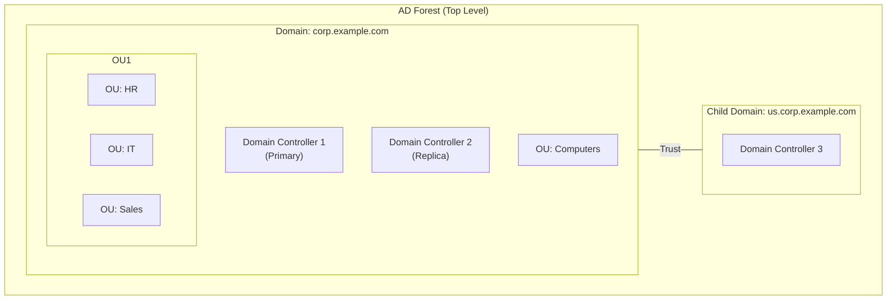
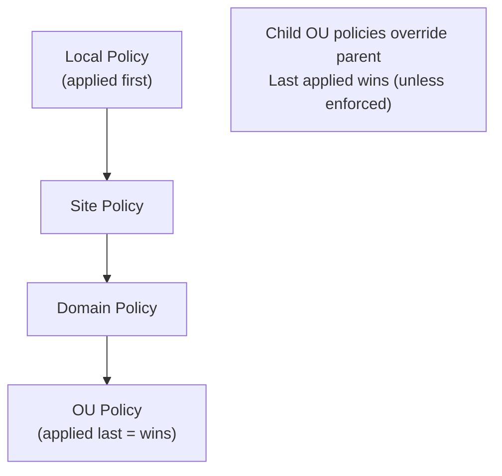
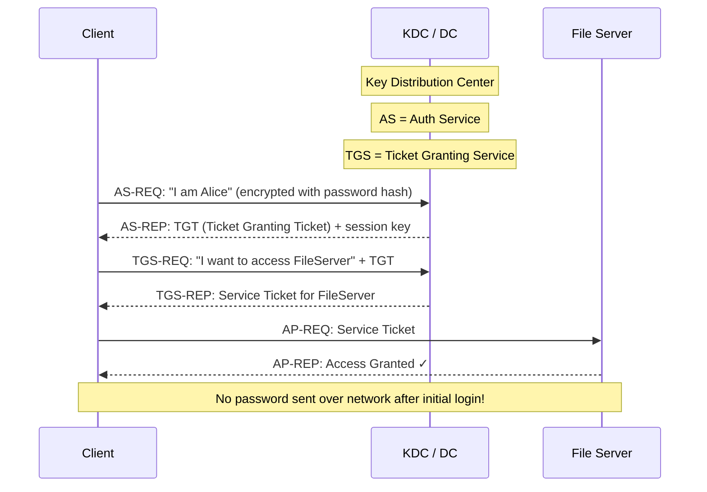

# 09 — Active Directory Concepts

> **[← Networking Tools](08_Networking_Tools.md)** | **[Index](00_INDEX.md)** | **[IIS →](10_IIS.md)**

---

## What is Active Directory?

**Active Directory (AD)** is Microsoft's centralized directory service for managing users, computers, and resources in a Windows domain environment. It provides:

- **Authentication** — Who you are (via Kerberos or NTLM)
- **Authorization** — What you can access (via permissions and group policies)
- **Centralized management** — One place to manage all users, computers, and policies

---

## Core Architecture



---

## Key Concepts

### Domain

A **domain** is the fundamental administrative unit in AD — a logical grouping of objects (users, computers, groups) that share:
- The same AD database
- The same security policies
- A common namespace (e.g., `corp.example.com`)

### Domain Controller (DC)

A **Domain Controller** is a Windows Server that:
- Hosts a copy of the AD database (`ntds.dit`)
- Authenticates users and computers
- Stores and enforces Group Policies
- Runs DNS and Kerberos services

```
AD Database location: C:\Windows\NTDS\ntds.dit
SYSVOL share:         C:\Windows\SYSVOL\  (GPO scripts, policies)
```

### Forest

A **forest** is a collection of one or more domains that share:
- A common schema (AD data structure)
- A common configuration
- A transitive trust relationship

Every forest has exactly one **Forest Root Domain**.

### Tree

A **tree** is a group of domains in a contiguous namespace:
```
example.com
├── us.example.com
└── eu.example.com
    └── uk.eu.example.com
```

### Organizational Units (OUs)

OUs are **containers** within a domain used to organize objects and apply Group Policies:

```
corp.example.com/
├── Users (default container)
├── Computers (default container)
├── Domain Controllers (default OU)
└── Company (custom OU)
    ├── IT Department
    │   ├── Helpdesk
    │   └── Admins
    ├── HR
    └── Finance
```

---

## AD Objects

### Users

```powershell
# View user
Get-ADUser -Identity "alice"
Get-ADUser -Filter * -Properties *        # All users
Get-ADUser alice -Properties MemberOf     # Group membership

# Create user
New-ADUser -Name "Alice Smith" `
           -SamAccountName "alice" `
           -UserPrincipalName "alice@corp.example.com" `
           -AccountPassword (Read-Host -AsSecureString) `
           -Enabled $true `
           -Path "OU=IT,DC=corp,DC=example,DC=com"

# Modify user
Set-ADUser -Identity "alice" -Title "Engineer" -Department "IT"
Enable-ADAccount -Identity "alice"
Disable-ADAccount -Identity "alice"
Unlock-ADAccount -Identity "alice"
Set-ADAccountPassword -Identity "alice" -Reset
```

### Groups

| Group Type | Purpose |
|-----------|---------|
| **Security Group** | Assign permissions and rights |
| **Distribution Group** | Email distribution lists only |

| Group Scope | Members Can Come From | Permissions Can Be Assigned To |
|-------------|----------------------|-------------------------------|
| **Domain Local** | Anywhere in forest | Only local domain |
| **Global** | Same domain only | Anywhere in forest |
| **Universal** | Anywhere in forest | Anywhere in forest |

```powershell
# Create group
New-ADGroup -Name "IT-Admins" `
            -GroupScope Global `
            -GroupCategory Security `
            -Path "OU=IT,DC=corp,DC=example,DC=com"

# Add member
Add-ADGroupMember -Identity "IT-Admins" -Members "alice","bob"

# List members
Get-ADGroupMember -Identity "IT-Admins"

# Get user's groups
Get-ADPrincipalGroupMembership -Identity "alice"
```

### Computer Objects

Every domain-joined computer has a computer account in AD.

```powershell
Get-ADComputer -Filter *
Get-ADComputer -Identity "WORKSTATION01"
New-ADComputer -Name "LAPTOP01" -Path "OU=Computers,DC=corp,DC=example,DC=com"
```

---

## Group Policy Objects (GPO)

A **GPO** is a collection of settings applied to users and computers in an OU (or domain/site).

### GPO Application Order (LSDOU)



### Common GPO Settings

```
Computer Configuration
├── Windows Settings
│   ├── Security Settings
│   │   ├── Account Policies (password length, lockout)
│   │   ├── Local Policies (audit, user rights)
│   │   └── Firewall settings
│   └── Scripts (startup/shutdown scripts)
└── Administrative Templates
    ├── Windows Components
    ├── System
    └── Network

User Configuration
├── Windows Settings
│   ├── Scripts (logon/logoff)
│   └── Folder Redirection (Desktop → server share)
└── Administrative Templates
    ├── Control Panel restrictions
    ├── Browser settings
    └── Desktop settings
```

```powershell
# PowerShell GPO management
Get-GPO -All                              # List all GPOs
New-GPO -Name "IT Security Policy"
New-GPLink -Name "IT Security Policy" -Target "OU=IT,DC=corp,DC=example,DC=com"
Get-GPResultantSetOfPolicy -ReportType Html -Path C:\report.html  # RSOP
gpupdate /force                           # Force policy refresh
gpresult /r                               # Show applied policies
```

---

## Kerberos Authentication

Kerberos is the default authentication protocol in AD. It uses **tickets** instead of passwords over the network.



### Kerberos Key Concepts

| Term | Meaning |
|------|---------|
| **TGT** | Ticket Granting Ticket — proves identity to KDC |
| **TGS** | Ticket Granting Service — issues service tickets |
| **Service Ticket** | Proves you're allowed to access a specific service |
| **KDC** | Key Distribution Center (runs on DC) |
| **SPN** | Service Principal Name — identifies services |
| **Realm** | Kerberos equivalent of domain |

```cmd
klist                          :: View current Kerberos tickets (Windows)
klist purge                    :: Clear ticket cache
```

---

## LDAP — Lightweight Directory Access Protocol

AD stores objects in an LDAP-accessible database. LDAP uses a hierarchical structure called a **Distinguished Name (DN)**:

```
CN=Alice Smith,OU=IT,DC=corp,DC=example,DC=com

CN = Common Name      (the object name)
OU = Organizational Unit
DC = Domain Component (each part of the domain)
```

```bash
# Query AD with ldapsearch (Linux)
ldapsearch -H ldap://dc.corp.example.com \
           -D "CN=Administrator,DC=corp,DC=example,DC=com" \
           -W \
           -b "DC=corp,DC=example,DC=com" \
           "(sAMAccountName=alice)"
```

---

## Trust Relationships

Trusts allow users in one domain/forest to access resources in another.

| Trust Type | Direction | Transitivity |
|-----------|-----------|-------------|
| **Parent-Child** | Two-way | Transitive (automatic) |
| **Tree-Root** | Two-way | Transitive (automatic) |
| **Forest** | One or two-way | Configurable |
| **External** | One or two-way | Non-transitive |
| **Shortcut** | One or two-way | Transitive |
| **Realm** | One or two-way | Configurable |

---

## AD and DNS

AD is **tightly coupled with DNS**. The domain name IS the DNS name.

```
Domain: corp.example.com
DNS zone: corp.example.com

DCs register SRV records in DNS:
_kerberos._tcp.corp.example.com  → DC IP
_ldap._tcp.corp.example.com      → DC IP
_gc._tcp.corp.example.com        → Global Catalog DC IP
```

```powershell
# Check DC SRV records
nslookup -type=SRV _kerberos._tcp.corp.example.com
nslookup -type=SRV _ldap._tcp.corp.example.com

# Find all DCs
nltest /dclist:corp.example.com
```

---

## AD Roles (FSMO)

Five **Flexible Single Master Operations** roles:

| Role | Scope | Function |
|------|-------|---------|
| **Schema Master** | Forest | Controls AD schema updates |
| **Domain Naming Master** | Forest | Manages domain add/remove |
| **PDC Emulator** | Domain | Password changes, time sync, legacy auth |
| **RID Master** | Domain | Allocates RID pools to DCs |
| **Infrastructure Master** | Domain | Cross-domain object references |

```powershell
netdom query fsmo            # Show FSMO role holders
```

---

## Common AD Admin Tasks

```powershell
# Password reset
Set-ADAccountPassword -Identity "alice" -Reset -NewPassword (ConvertTo-SecureString "NewPass123!" -AsPlainText -Force)

# Force password change at next logon
Set-ADUser -Identity "alice" -ChangePasswordAtLogon $true

# Unlock account
Unlock-ADAccount -Identity "alice"

# Find locked-out accounts
Search-ADAccount -LockedOut

# Find disabled accounts
Search-ADAccount -AccountDisabled

# Find accounts not logged in for 90 days
$date = (Get-Date).AddDays(-90)
Get-ADUser -Filter {LastLogonDate -lt $date -and Enabled -eq $true}

# Move object between OUs
Move-ADObject -Identity "CN=Alice,OU=HR,DC=corp,DC=example,DC=com" `
              -TargetPath "OU=IT,DC=corp,DC=example,DC=com"
```

---

## Related Topics

- [Networking Fundamentals ←](07_Networking_Fundamentals.md) — DNS, ports 389, 636, 88
- [User Permissions ←](05_Permissions.md) — NTFS permissions
- [NTP →](11_NTP.md) — Critical: Kerberos requires clock sync within 5 minutes
- [Security Concepts →](14_Security_Concepts.md) — authentication, authorization
- [Troubleshooting →](18_Troubleshooting.md)

---

> [← Networking Tools](08_Networking_Tools.md) | [Index](00_INDEX.md) | [IIS →](10_IIS.md)
