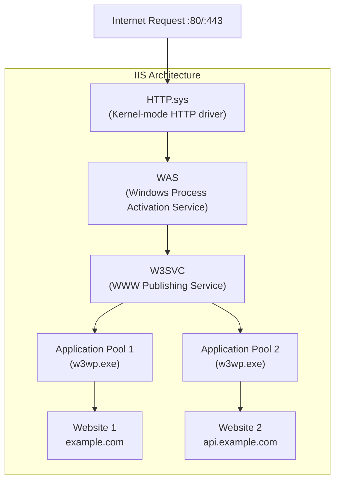

# 10 — IIS Web Server Basics

> **[← Active Directory](09_Active_Directory.md)** | **[Index](00_INDEX.md)** | **[NTP →](11_NTP.md)**

---

## What is IIS?

**Internet Information Services (IIS)** is Microsoft's web server software, built into Windows Server and Windows 10/11 (as optional feature). It hosts:
- Static websites (HTML, CSS, JS)
- Dynamic web applications (ASP.NET, PHP)
- APIs and web services
- FTP servers

---

## IIS Architecture



### Key Components

| Component | Role |
|-----------|------|
| **HTTP.sys** | Kernel-mode driver; handles HTTP/HTTPS; routes to correct app pool |
| **W3SVC** | Windows service; manages sites and config |
| **WAS** | Manages app pool lifetimes and worker processes |
| **w3wp.exe** | Worker process — actually runs your web app |
| **Application Pool** | Isolated container for web apps; each pool = one or more w3wp.exe |
| **Website** | Logical container; has bindings (IP/port/hostname) |
| **Application** | Virtual directory with its own app pool and code |

---

## Installation

### Windows Server (PowerShell)
```powershell
# Install IIS with common features
Install-WindowsFeature -Name Web-Server -IncludeManagementTools

# Install with all subfeatures
Install-WindowsFeature -Name Web-Server -IncludeAllSubFeature -IncludeManagementTools

# Install ASP.NET 4.8 support
Install-WindowsFeature -Name Web-Asp-Net45

# Verify installation
Get-WindowsFeature -Name Web-*  | Where-Object Installed
```

### Windows 10/11
```
Control Panel → Programs → Turn Windows features on or off
→ Internet Information Services ✓
→ IIS Management Console ✓
→ World Wide Web Services → Application Development Features → ASP.NET ✓
```

---

## Default Directories

```
C:\inetpub\
├── wwwroot\          ← Default website root (serve files here)
├── wwwscripts\       ← Scripts directory
├── ftproot\          ← Default FTP root
└── logs\             ← IIS logs
    └── LogFiles\
        └── W3SVC1\   ← Access logs for site 1

C:\Windows\System32\inetsrv\
├── config\
│   ├── applicationHost.config    ← Main IIS config file
│   └── schema\
└── appcmd.exe                    ← IIS command-line tool
```

---

## Application Pools

An **application pool** provides **process isolation** — each pool runs in a separate `w3wp.exe` process. If one crashes, others are unaffected.

```powershell
# IIS Management via PowerShell (requires WebAdministration module)
Import-Module WebAdministration

# List app pools
Get-ChildItem IIS:\AppPools\
Get-WebConfiguration /system.applicationHost/applicationPools/add

# Create app pool
New-WebAppPool -Name "MyApp_Pool"

# Configure app pool
Set-ItemProperty IIS:\AppPools\MyApp_Pool -Name processModel.userName -Value "DOMAIN\svc_myapp"
Set-ItemProperty IIS:\AppPools\MyApp_Pool -Name processModel.password -Value "password"
Set-ItemProperty IIS:\AppPools\MyApp_Pool -Name managedRuntimeVersion -Value "v4.0"
Set-ItemProperty IIS:\AppPools\MyApp_Pool -Name enable32BitAppOnWin64 -Value $false

# Recycle / Start / Stop app pool
Restart-WebAppPool -Name "MyApp_Pool"
Start-WebAppPool -Name "MyApp_Pool"
Stop-WebAppPool -Name "MyApp_Pool"
```

### App Pool Identity Options

| Identity | Description |
|----------|-------------|
| **ApplicationPoolIdentity** | Auto-created virtual account (recommended) |
| **NetworkService** | Built-in network service account |
| **LocalSystem** | Highest privilege — avoid |
| **LocalService** | Minimal privileges |
| **Custom Account** | Specific domain/local service account |

---

## Website Bindings

A **binding** tells IIS which IP, port, and hostname to listen on for a site.

```powershell
# Create a website
New-Website -Name "MyWebsite" `
            -PhysicalPath "C:\inetpub\mysite" `
            -Port 80 `
            -HostHeader "mysite.example.com"

# Add HTTPS binding
New-WebBinding -Name "MyWebsite" `
               -Protocol "https" `
               -Port 443 `
               -HostHeader "mysite.example.com" `
               -SslFlags 1    # SNI

# Assign SSL certificate to binding
$cert = Get-ChildItem Cert:\LocalMachine\My | Where-Object {$_.Subject -like "*mysite*"}
$binding = Get-WebBinding -Name "MyWebsite" -Protocol "https"
$binding.AddSslCertificate($cert.Thumbprint, "My")

# List all bindings
Get-WebBinding

# Start/Stop website
Start-Website -Name "MyWebsite"
Stop-Website -Name "MyWebsite"
```

### Binding Types

| Protocol | Default Port | Use |
|---------|-------------|-----|
| http | 80 | Unencrypted web |
| https | 443 | SSL/TLS encrypted |
| ftp | 21 | File transfer |
| ftps | 990 | Secure FTP |
| net.tcp | 808 | WCF services |

---

## IIS Logs

```
Default log location: C:\inetpub\logs\LogFiles\W3SVC1\

Log format (W3C Extended):
date time s-ip cs-method cs-uri-stem cs-uri-query s-port cs-username c-ip cs-version cs(User-Agent) sc-status sc-bytes time-taken

Example:
2024-04-22 10:30:15 192.168.1.10 GET /index.html - 80 - 203.0.113.5 HTTP/1.1 Mozilla/5.0 200 1234 15
```

```powershell
# Find IIS log location
Get-WebConfigurationProperty -Filter system.applicationHost/sites/site[@name='Default Web Site']/logFile -Name Directory

# Parse IIS logs (PowerShell)
Get-Content "C:\inetpub\logs\LogFiles\W3SVC1\u_ex240422.log" |
    Where-Object { $_ -notmatch "^#" } |
    ConvertFrom-Csv -Delimiter " " -Header date,time,s-ip,cs-method,cs-uri-stem,cs-uri-query,s-port,cs-username,c-ip,cs-version,cs-useragent,sc-status,sc-bytes,time-taken |
    Where-Object {$_.'sc-status' -eq "500"}   # Find 500 errors
```

> See also: [System Monitoring & Logging →](13_Monitoring_Logging.md)

---

## `appcmd.exe` — IIS Command Line

```cmd
REM List sites
%windir%\system32\inetsrv\appcmd list site

REM List app pools
%windir%\system32\inetsrv\appcmd list apppool

REM Start/Stop site
%windir%\system32\inetsrv\appcmd start site /site.name:"Default Web Site"
%windir%\system32\inetsrv\appcmd stop site /site.name:"Default Web Site"

REM Recycle app pool
%windir%\system32\inetsrv\appcmd recycle apppool /apppool.name:"DefaultAppPool"
```

---

## web.config — Application Configuration

The `web.config` file controls ASP.NET application settings per-directory.

```xml
<?xml version="1.0" encoding="UTF-8"?>
<configuration>
    <system.webServer>
        <!-- Default documents -->
        <defaultDocument enabled="true">
            <files>
                <add value="index.html" />
                <add value="default.aspx" />
            </files>
        </defaultDocument>

        <!-- Custom error pages -->
        <httpErrors errorMode="Custom">
            <remove statusCode="404"/>
            <error statusCode="404" path="/errors/404.html" responseMode="File"/>
        </httpErrors>

        <!-- Redirect HTTP to HTTPS -->
        <rewrite>
            <rules>
                <rule name="HTTP to HTTPS" stopProcessing="true">
                    <match url="(.*)"/>
                    <conditions>
                        <add input="{HTTPS}" pattern="off"/>
                    </conditions>
                    <action type="Redirect" url="https://{HTTP_HOST}/{R:1}" redirectType="Permanent"/>
                </rule>
            </rules>
        </rewrite>

        <!-- Security headers -->
        <httpProtocol>
            <customHeaders>
                <add name="X-Frame-Options" value="SAMEORIGIN"/>
                <add name="X-Content-Type-Options" value="nosniff"/>
                <add name="Strict-Transport-Security" value="max-age=31536000"/>
            </customHeaders>
        </httpProtocol>
    </system.webServer>

    <appSettings>
        <add key="ApiUrl" value="https://api.example.com"/>
        <add key="Environment" value="Production"/>
    </appSettings>

    <connectionStrings>
        <add name="DefaultConnection"
             connectionString="Server=db;Database=mydb;Trusted_Connection=True;"/>
    </connectionStrings>
</configuration>
```

---

## HTTPS and SSL Certificates

```powershell
# View certificates in store
Get-ChildItem Cert:\LocalMachine\My

# Import PFX certificate
Import-PfxCertificate -FilePath "cert.pfx" `
                      -CertStoreLocation Cert:\LocalMachine\My `
                      -Password (ConvertTo-SecureString "pfxpassword" -AsPlainText -Force)

# Create self-signed certificate (for testing)
New-SelfSignedCertificate -DnsName "localhost","mysite.local" `
                           -CertStoreLocation Cert:\LocalMachine\My
```

---

## Related Topics

- [Active Directory ←](09_Active_Directory.md) — Windows Server context
- [NTP →](11_NTP.md) — Certificates require correct time
- [Networking Fundamentals ←](07_Networking_Fundamentals.md) — HTTP port 80, HTTPS 443
- [Security Concepts →](14_Security_Concepts.md) — TLS, firewalls
- [Monitoring & Logging →](13_Monitoring_Logging.md) — IIS logs
- [Cloud & Remote Access →](17_Cloud_Remote_Access.md) — hosting on cloud

---

> [← Active Directory](09_Active_Directory.md) | [Index](00_INDEX.md) | [NTP →](11_NTP.md)
