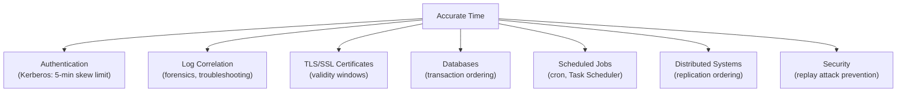

# 11 — Time Synchronization (NTP)

> **[← IIS](10_IIS.md)** | **[Index](00_INDEX.md)** | **[VPN →](12_VPN.md)**

---

## Why Time Synchronization Matters

Accurate time is **critical** in networked environments for:



> ⚠️ **Kerberos fails if clock skew > 5 minutes** between client and DC — see [Active Directory →](09_Active_Directory.md)

---

## NTP Protocol Basics

**Network Time Protocol (NTP)** synchronizes clocks across a network to within a few milliseconds.

- **Port:** UDP 123
- **Protocol:** UDP (unreliable transport, but NTP handles accuracy mathematically)
- **Accuracy:** Typically 1–50ms over internet; <1ms on LAN

### NTP Stratum

NTP uses a **stratum** hierarchy:

```
Stratum 0 — Reference Clocks (GPS, atomic clocks, radio signals)
              ↓
Stratum 1 — Primary NTP Servers (directly connected to Stratum 0)
              ↓
Stratum 2 — Secondary Servers (synced from Stratum 1)
              ↓
Stratum 3 — Tertiary Servers (synced from Stratum 2)
              ↓
...
Stratum 16 — Unsynchronized (invalid)
```

- **Lower stratum = more accurate**
- Your PC is typically Stratum 3 or 4
- Domain Controllers (using `time.windows.com`) are typically Stratum 2 or 3
- In AD: PDC Emulator → NTP source for all other domain machines → see [Active Directory →](09_Active_Directory.md)

---

## NTP on Linux

### Using `systemd-timesyncd` (simple, default on most distros)

```bash
# Status
timedatectl status
timedatectl show-timesync

# Configure NTP servers (edit config)
sudo nano /etc/systemd/timesyncd.conf
# [Time]
# NTP=0.pool.ntp.org 1.pool.ntp.org 2.pool.ntp.org
# FallbackNTP=ntp.ubuntu.com

# Restart service
sudo systemctl restart systemd-timesyncd
sudo systemctl enable systemd-timesyncd

# Force sync
sudo timedatectl set-ntp true
```

### Using `chrony` (more accurate, recommended for servers)

```bash
# Install
sudo apt install chrony       # Debian/Ubuntu
sudo pacman -S chrony          # Arch

# Config file: /etc/chrony.conf
# Example:
server 0.pool.ntp.org iburst
server 1.pool.ntp.org iburst
server time.cloudflare.com iburst

# Commands
chronyc tracking               # Show sync status
chronyc sources -v             # List NTP sources
chronyc sourcestats            # Statistics
sudo systemctl start chronyd
sudo systemctl enable chronyd

# Force immediate sync
sudo chronyc makestep
```

### Using `ntpd` (traditional NTP daemon)

```bash
# Install
sudo apt install ntp

# Config: /etc/ntp.conf
server 0.pool.ntp.org iburst
server 1.pool.ntp.org iburst
driftfile /var/lib/ntp/drift

# Check
ntpq -p                        # List peers
ntpstat                        # Sync status
```

### Manual Time Commands

```bash
# View current time
date
date -u                         # UTC time
timedatectl

# Set timezone
sudo timedatectl set-timezone Asia/Kolkata
sudo timedatectl set-timezone UTC
ls /usr/share/zoneinfo/          # Available timezones
sudo ln -sf /usr/share/zoneinfo/Asia/Kolkata /etc/localtime

# Set time manually (only when NTP is off)
sudo timedatectl set-time "2024-04-22 10:30:00"
sudo date -s "2024-04-22 10:30:00"

# Hardware clock
hwclock                         # Read hardware clock
sudo hwclock --systohc          # Sync system time to hardware
sudo hwclock --hctosys          # Sync hardware to system time
```

---

## NTP on Windows

### Windows Time Service (w32tm)

```powershell
# Check sync status
w32tm /query /status
w32tm /query /configuration
w32tm /query /peers

# Configure NTP server
w32tm /config /manualpeerlist:"time.windows.com,0x1 pool.ntp.org,0x1" /syncfromflags:manual /reliable:YES /update
w32tm /config /update
Net Stop w32tm && Net Start w32tm

# Force sync
w32tm /resync /force
w32tm /resync /rediscover

# Set as NTP server (for AD)
w32tm /config /syncfromflags:DOMHIER /reliable:YES /update
```

### Active Directory Time Hierarchy

```
Internet NTP (time.windows.com)
         ↓
PDC Emulator (Stratum 2)     ← Only this syncs from external NTP
         ↓
All Domain Controllers (Stratum 3)
         ↓
Domain-joined clients (Stratum 4)
```

> All domain members auto-sync from their authenticating DC. No manual config needed except for the PDC Emulator.

---

## Public NTP Servers

| Server | Notes |
|--------|-------|
| `pool.ntp.org` | Large cluster of volunteer servers |
| `0.pool.ntp.org` through `3.pool.ntp.org` | Regional pools |
| `time.google.com` | Google's NTP (Stratum 1) |
| `time.cloudflare.com` | Cloudflare NTP |
| `time.windows.com` | Microsoft NTP |
| `time.apple.com` | Apple NTP |
| `ntp.ubuntu.com` | Ubuntu pool |

---

## Troubleshooting Time Issues

```bash
# Linux: Check if NTP is working
timedatectl status
# Should show: "NTP service: active" and "System clock synchronized: yes"

# Manually check offset to NTP server
ntpdate -q pool.ntp.org

# If huge offset (>1000 seconds), force step
sudo chronyc makestep

# Windows: Common issue - time not syncing in domain
w32tm /resync /force
# If that fails:
net stop w32tm
net start w32tm
w32tm /resync

# Check if Kerberos auth failing due to time
klist                           # Check ticket timestamps
```

---

> [← IIS](10_IIS.md) | [Index](00_INDEX.md) | [VPN →](12_VPN.md)
