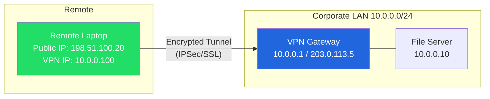
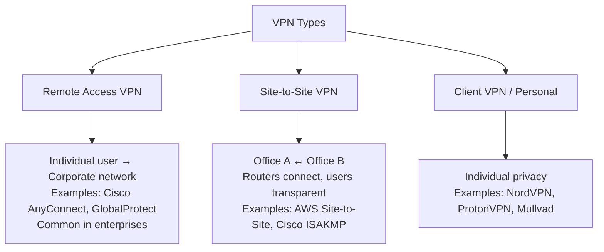
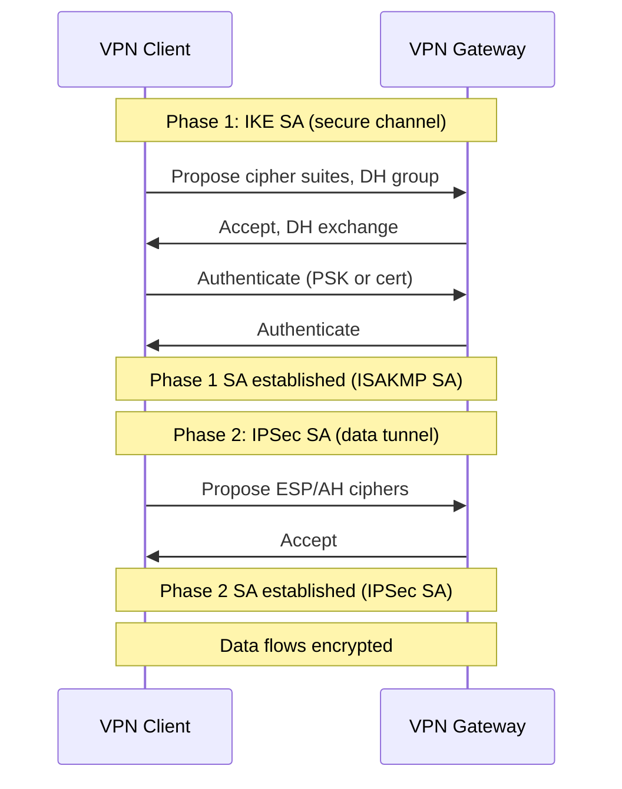

# 12 — VPN Basics

> **[← NTP](11_NTP.md)** | **[Index](00_INDEX.md)** | **[Monitoring & Logging →](13_Monitoring_Logging.md)**

---

## What is a VPN?

A **Virtual Private Network (VPN)** creates an **encrypted tunnel** between two endpoints over an untrusted network (like the internet), making it appear as though they are on the same private network.



### Key Benefits

- **Privacy** — encrypts traffic from ISP and public networks
- **Remote Access** — securely connect to office resources from anywhere
- **Site-to-Site** — connect two office networks transparently
- **Bypass restrictions** — access geo-restricted or firewalled content
- **Security on public Wi-Fi** — protect against MITM attacks

---

## VPN Types

### By Use Case



### By Protocol

| Protocol | Type | Ports | Pros | Cons |
|---------|------|-------|------|------|
| **OpenVPN** | SSL/TLS | UDP 1194 / TCP 443 | Open source, flexible, firewall-friendly | Complex config |
| **WireGuard** | Custom | UDP 51820 | Very fast, modern, simple | Newer, less legacy support |
| **IPSec/IKEv2** | IPSec | UDP 500, 4500 | Native on most OSes, fast | Complex, may be blocked |
| **L2TP/IPSec** | IPSec | UDP 1701, 500, 4500 | Wide support | Slower, deprecated |
| **PPTP** | Legacy | TCP 1723 | Simple | ❌ Insecure, avoid |
| **SSL VPN** | SSL/TLS | TCP 443 | Browser-based, firewall-friendly | Overhead |

---

## IPSec VPN

**Internet Protocol Security** operates at **Layer 3 (Network)** and provides:
- **Authentication** — verifies the identity of both endpoints
- **Integrity** — ensures packets aren't tampered with
- **Confidentiality** — encrypts packet contents

### IPSec Modes

```
Transport Mode:
[IP Header] | [IPSec Header] | [Encrypted Payload]
→ Protects only the payload; original IP headers intact
→ Used for host-to-host communication

Tunnel Mode:
[New IP Header] | [IPSec Header] | [Encrypted Original IP + Payload]
→ Wraps entire original packet; creates new IP header
→ Used for VPN gateways (site-to-site)
```

### IPSec Protocols

| Protocol | Function |
|---------|---------|
| **AH** (Authentication Header) | Integrity + authentication, no encryption |
| **ESP** (Encapsulating Security Payload) | Integrity + authentication + **encryption** |
| **IKE/IKEv2** | Key exchange and SA negotiation |

### IKE Phases



---

## SSL/TLS VPN

**SSL VPNs** use the same encryption as HTTPS (TLS), making them:
- Firewall-friendly (runs over TCP 443)
- Browser-accessible (clientless mode)
- Easier to deploy than IPSec

### Types

| Type | Description |
|------|-------------|
| **Network-level SSL VPN** | Full tunnel; all traffic routed through VPN (e.g., OpenVPN, AnyConnect) |
| **Portal SSL VPN** | Browser-based; access specific apps via web portal |
| **Split tunnel** | Only specific traffic goes through VPN; rest goes direct |
| **Full tunnel** | All traffic goes through VPN |

```
Split Tunnel:
Internet traffic → Direct to ISP
Corporate 10.0.0.0/8 → Through VPN

Full Tunnel:
All traffic → Through VPN gateway
(VPN gateway routes to internet)
```

---

## WireGuard

WireGuard is a modern, fast VPN protocol with a small codebase (~4,000 lines vs OpenVPN's ~600,000).

```bash
# Install WireGuard (Linux)
sudo apt install wireguard
sudo pacman -S wireguard-tools   # Arch

# Generate key pair
wg genkey | tee privatekey | wg pubkey > publickey
cat privatekey
cat publickey

# Server config (/etc/wireguard/wg0.conf)
[Interface]
PrivateKey = <server_private_key>
Address = 10.0.0.1/24
ListenPort = 51820
PostUp = iptables -A FORWARD -i wg0 -j ACCEPT; iptables -t nat -A POSTROUTING -o eth0 -j MASQUERADE
PostDown = iptables -D FORWARD -i wg0 -j ACCEPT; iptables -t nat -D POSTROUTING -o eth0 -j MASQUERADE

[Peer]
PublicKey = <client_public_key>
AllowedIPs = 10.0.0.2/32         # Client's VPN IP

# Client config
[Interface]
PrivateKey = <client_private_key>
Address = 10.0.0.2/24
DNS = 10.0.0.1

[Peer]
PublicKey = <server_public_key>
Endpoint = server.example.com:51820
AllowedIPs = 0.0.0.0/0           # Full tunnel (all traffic)
# AllowedIPs = 10.0.0.0/24       # Split tunnel (only VPN subnet)

# Start/stop
sudo wg-quick up wg0
sudo wg-quick down wg0
sudo systemctl enable wg-quick@wg0

# Status
sudo wg show
```

---

## OpenVPN Basics

```bash
# Install
sudo apt install openvpn

# Connect with config file
sudo openvpn --config client.ovpn

# As service
sudo systemctl start openvpn@client
sudo systemctl enable openvpn@client

# Typical .ovpn client config
client
dev tun
proto udp
remote vpn.example.com 1194
resolv-retry infinite
nobind
persist-key
persist-tun
ca ca.crt
cert client.crt
key client.key
cipher AES-256-GCM
auth SHA256
verb 3
```

---

## VPN and Security

```
Without VPN (public Wi-Fi):
Laptop → [unencrypted HTTP] → Wi-Fi AP → ← ATTACKER can sniff

With VPN:
Laptop → [encrypted tunnel] → VPN Server → Internet
          ↑ attacker can only see encrypted data
```

### VPN Security Considerations

- **Encryption algorithm** — AES-256-GCM is current standard
- **Key exchange** — Diffie-Hellman, prefer DH group 14+ or ECDH
- **Authentication** — Certificates > PSK (pre-shared keys)
- **DNS leak** — Ensure DNS queries also go through VPN
- **Kill switch** — Block traffic if VPN drops (prevents IP leak)
- **No-log policy** — For privacy VPNs, verify provider logs nothing

---

## Common VPN Ports

| Protocol | Ports |
|---------|-------|
| OpenVPN | UDP 1194, TCP 443 |
| WireGuard | UDP 51820 |
| IPSec IKE | UDP 500 |
| IPSec NAT-T | UDP 4500 |
| L2TP | UDP 1701 |
| PPTP | TCP 1723 |
| SSTP | TCP 443 |

> See [Networking Fundamentals →](07_Networking_Fundamentals.md) for port reference

---

## Related Topics

- [Networking Fundamentals ←](07_Networking_Fundamentals.md)
- [Security Concepts →](14_Security_Concepts.md) — encryption, firewalls
- [Cloud & Remote Access →](17_Cloud_Remote_Access.md) — SSH tunnels
- [Active Directory →](09_Active_Directory.md) — VPN + domain auth

---

> [← NTP](11_NTP.md) | [Index](00_INDEX.md) | [Monitoring & Logging →](13_Monitoring_Logging.md)
