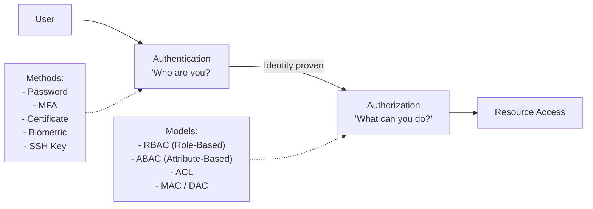
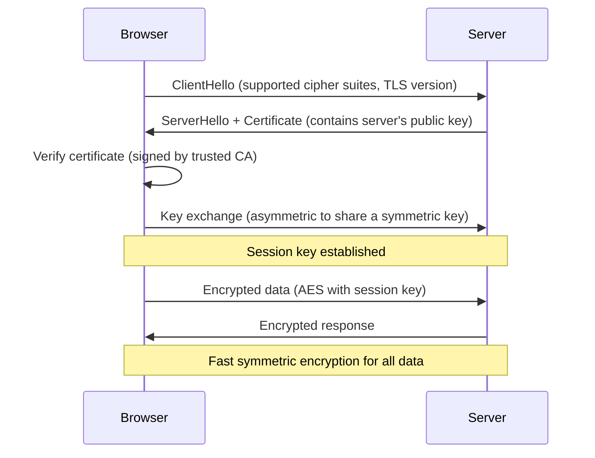

# 14 — Basic Security Concepts

> **[← Monitoring & Logging](13_Monitoring_Logging.md)** | **[Index](00_INDEX.md)** | **[Services & Processes →](15_Services_Processes.md)**

---

## Authentication vs Authorization



| Concept | Question | Examples |
|---------|----------|---------|
| **Authentication (AuthN)** | Who are you? | Password, MFA, SSH key, smart card |
| **Authorization (AuthZ)** | What are you allowed to do? | File permissions, RBAC, GPO |
| **Accounting** | What did you do? | Audit logs, SIEM |

### Authentication Factors

| Factor | Type | Examples |
|--------|------|---------|
| **Something you know** | Knowledge | Password, PIN, security question |
| **Something you have** | Possession | TOTP app, hardware key (YubiKey), SMS |
| **Something you are** | Inherence | Fingerprint, face, iris |

**MFA** = two or more factors combined → much stronger than password alone.

---

## Encryption

### Symmetric Encryption

Same key for encrypt and decrypt. Fast, used for bulk data.

```
Plaintext + Key → Ciphertext
Ciphertext + Key → Plaintext

Algorithms: AES-128/256, ChaCha20, 3DES (legacy)
```

### Asymmetric Encryption

Two mathematically linked keys: **public** (share freely) and **private** (keep secret).

```
Encrypt with PUBLIC key  → Only PRIVATE key can decrypt (confidentiality)
Sign with PRIVATE key    → Anyone with PUBLIC key can verify (authenticity)

Algorithms: RSA, ECDSA, Ed25519
```

### How They Work Together (TLS/HTTPS)



### Hashing

One-way transformation — cannot be reversed. Used for:
- Storing passwords (`/etc/shadow` stores hashes, not passwords)
- File integrity verification
- Digital signatures

```
Input → Hash Function → Fixed-size digest (no way back)
"password" → SHA-256 → 5e884898da28047151...
"Password" → SHA-256 → d8578edf8458ce06bf...   ← different!

Algorithms: SHA-256, SHA-512, bcrypt (for passwords), Argon2
Avoid: MD5, SHA-1 (broken)
```

---

## PKI — Public Key Infrastructure

PKI is the system for issuing and managing **digital certificates** that link public keys to identities.

```
Root CA (Certificate Authority)
  ↓ signs
Intermediate CA
  ↓ signs
End-entity Certificate (server.example.com)
  → contains: domain, public key, validity, CA signature
```

```bash
# View certificate
openssl x509 -in cert.pem -text -noout
openssl s_client -connect google.com:443 -showcerts

# Create self-signed cert
openssl genrsa -out key.pem 4096
openssl req -new -x509 -key key.pem -out cert.pem -days 365 \
    -subj "/CN=localhost/O=MyOrg/C=IN"

# Check cert expiry
openssl x509 -in cert.pem -noout -dates
echo | openssl s_client -connect example.com:443 2>/dev/null | openssl x509 -noout -dates
```

---

## Firewall

A firewall controls **what network traffic is allowed** in and out, based on rules.

### Types

| Type | Works At | Example |
|------|----------|---------|
| **Packet filter** | L3/L4 — IP + ports | iptables, nftables, Windows Firewall |
| **Stateful inspection** | L3/L4 + connection state | firewalld, pfSense |
| **Application firewall (WAF)** | L7 — application content | ModSecurity, AWS WAF |
| **NGFW** | L3–L7 + deep inspection | Palo Alto, Fortinet |

### `iptables` (Linux)

```bash
# View rules
sudo iptables -L -v -n
sudo iptables -L -v -n --line-numbers   # With line numbers

# Default policies
sudo iptables -P INPUT DROP             # Drop all inbound by default
sudo iptables -P FORWARD DROP
sudo iptables -P OUTPUT ACCEPT          # Allow all outbound

# Allow established connections
sudo iptables -A INPUT -m state --state ESTABLISHED,RELATED -j ACCEPT

# Allow loopback
sudo iptables -A INPUT -i lo -j ACCEPT

# Allow SSH
sudo iptables -A INPUT -p tcp --dport 22 -j ACCEPT

# Allow HTTP/HTTPS
sudo iptables -A INPUT -p tcp --dport 80 -j ACCEPT
sudo iptables -A INPUT -p tcp --dport 443 -j ACCEPT

# Allow from specific IP
sudo iptables -A INPUT -s 192.168.1.0/24 -j ACCEPT

# Block specific IP
sudo iptables -A INPUT -s 1.2.3.4 -j DROP

# Delete rule
sudo iptables -D INPUT -p tcp --dport 80 -j ACCEPT

# Save rules
sudo iptables-save > /etc/iptables/rules.v4
```

### `firewalld` (systemd-based, modern)

```bash
sudo systemctl start firewalld
firewall-cmd --state
firewall-cmd --get-active-zones
firewall-cmd --zone=public --list-all

# Allow service
firewall-cmd --zone=public --add-service=http --permanent
firewall-cmd --zone=public --add-service=https --permanent
firewall-cmd --zone=public --add-port=8080/tcp --permanent
firewall-cmd --reload      # Apply permanent rules

# Remove
firewall-cmd --zone=public --remove-service=http --permanent
```

### UFW (Uncomplicated Firewall — Ubuntu)

```bash
sudo ufw enable
sudo ufw status verbose

sudo ufw allow ssh
sudo ufw allow 80/tcp
sudo ufw allow from 192.168.1.0/24
sudo ufw deny 23

sudo ufw delete allow 80/tcp
sudo ufw reset           # Remove all rules
```

### Windows Firewall (PowerShell)

```powershell
# View rules
Get-NetFirewallRule | Where-Object {$_.Enabled -eq 'True'} | Select DisplayName, Direction, Action

# Allow port
New-NetFirewallRule -DisplayName "Allow HTTP" -Direction Inbound -Protocol TCP -LocalPort 80 -Action Allow

# Block application
New-NetFirewallRule -DisplayName "Block Telnet" -Direction Outbound -Program "C:\telnet.exe" -Action Block

# Enable/disable rule
Enable-NetFirewallRule -DisplayName "Allow HTTP"
Disable-NetFirewallRule -DisplayName "Allow HTTP"

# Windows Defender Firewall
netsh advfirewall firewall show rule name=all
```

---

## Antivirus / EDR

### Traditional Antivirus

- Scans files against **signature database** of known malware
- Reactive — only detects known threats
- Examples: ClamAV (Linux), Windows Defender

### EDR — Endpoint Detection and Response

- **Behavioral analysis** — detects unknown threats by watching behavior
- Records all process activities, file changes, network connections
- Can respond automatically (isolate, kill process)
- Examples: CrowdStrike Falcon, SentinelOne, Carbon Black

```
AV:  "This file matches malware signature XYZ → block"
EDR: "Process spawned cmd.exe → ran PowerShell → contacted C2 IP → suspicious behavior → alert + kill"
```

---

## Common Attack Types

| Attack | Description | Defense |
|--------|-------------|---------|
| **Phishing** | Trick users to reveal credentials | Security training, MFA |
| **Brute Force** | Try all password combinations | Account lockout, strong passwords |
| **SQL Injection** | Insert SQL in web forms | Parameterized queries, WAF |
| **XSS** | Inject malicious scripts | Input sanitization, CSP headers |
| **MITM** | Intercept communications | TLS, certificate pinning |
| **Ransomware** | Encrypt files, demand payment | Backups, EDR, patch management |
| **DDoS** | Overwhelm with traffic | Rate limiting, CDN, WAF |
| **Pass-the-Hash** | Replay NTLM hash | Kerberos, credential guard |
| **Privilege Escalation** | Gain higher permissions | Least privilege, patching |

---

## Principle of Least Privilege

Users, processes, and services should have **only the minimum permissions** needed:

```
❌ Bad:  Run web server as root
✅ Good: Run web server as 'www-data' (no shell, no home, no sudo)

❌ Bad:  Give all developers admin access
✅ Good: Developers get read access; deploy scripts run as service account

❌ Bad:  Open all firewall ports
✅ Good: Only open required ports; default deny
```

---

## Security Best Practices Summary

```
Passwords:
  ✓ Use password manager
  ✓ Minimum 16 characters
  ✓ Enable MFA everywhere
  ✓ Never reuse passwords

System:
  ✓ Keep OS and software patched
  ✓ Remove unused software/services
  ✓ Disable root SSH login (use key auth)
  ✓ Use sudo, not root shell

Network:
  ✓ Default-deny firewall
  ✓ Encrypt all data in transit (TLS)
  ✓ Use VPN on public networks
  ✓ Segment networks (VLAN)

Monitoring:
  ✓ Enable audit logging
  ✓ Monitor failed logins
  ✓ Set up alerts for anomalies
  ✓ Regular log review
```

---

## Related Topics

- [User Permissions ←](05_Permissions.md) — Linux rwx, NTFS ACLs
- [Networking Fundamentals ←](07_Networking_Fundamentals.md) — OSI, ports
- [Active Directory ←](09_Active_Directory.md) — Kerberos, domain auth
- [VPN ←](12_VPN.md) — encrypted tunnels
- [Monitoring & Logging ←](13_Monitoring_Logging.md) — detecting incidents
- [Troubleshooting →](18_Troubleshooting.md)

---

> [← Monitoring & Logging](13_Monitoring_Logging.md) | [Index](00_INDEX.md) | [Services & Processes →](15_Services_Processes.md)
