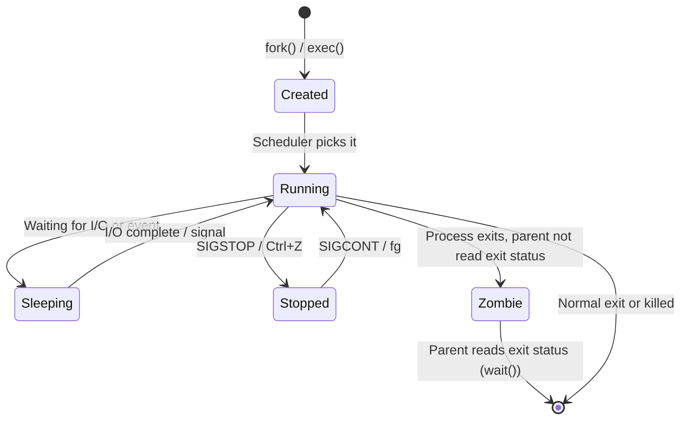

# 15 — Services and Process Management

> **[← Security Concepts](14_Security_Concepts.md)** | **[Index](00_INDEX.md)** | **[Software Installation →](16_Software_Installation.md)**

---

## Processes vs Services

| Term | Description |
|------|-------------|
| **Process** | A running instance of a program with a PID |
| **Service / Daemon** | A background process that runs continuously; starts at boot |
| **Thread** | Lightweight execution unit within a process |

### Process Lifecycle



---

## Linux Process Management

### Viewing Processes

```bash
# List processes
ps                      # Current terminal's processes
ps aux                  # All processes (BSD style)
ps -ef                  # All processes (UNIX style)
ps aux | grep nginx     # Filter by name
ps -p 1234              # Specific PID

# Understanding ps aux output:
# USER PID %CPU %MEM VSZ RSS TTY STAT START TIME COMMAND
# VSZ = virtual memory size (KB)
# RSS = resident set size (actual RAM used, KB)
# STAT codes:
#   S = sleeping  R = running  Z = zombie  T = stopped
#   s = session leader  l = multi-threaded  + = foreground

# Interactive monitors
top                     # Basic interactive
htop                    # Enhanced (color, mouse, tree view)
atop                    # Disk/net/CPU/mem history
glances                 # Modern all-in-one

# Process tree
pstree                  # Text tree
pstree -p               # With PIDs
pstree -u               # With usernames
```

### Signals

Signals are a way to communicate with running processes.

| Signal | Number | Meaning |
|--------|--------|---------|
| SIGHUP | 1 | Hang up — reload config (graceful) |
| SIGINT | 2 | Interrupt — Ctrl+C |
| SIGQUIT | 3 | Quit with core dump |
| SIGKILL | 9 | **Forcefully kill** — cannot be caught |
| SIGTERM | 15 | **Graceful terminate** (default for `kill`) |
| SIGSTOP | 19 | Pause process (cannot be caught) |
| SIGCONT | 18 | Continue paused process |
| SIGUSR1 | 10 | User-defined signal 1 |
| SIGUSR2 | 12 | User-defined signal 2 |

```bash
# Sending signals
kill PID                # SIGTERM (graceful)
kill -15 PID            # Explicit SIGTERM
kill -9 PID             # SIGKILL (force)
kill -1 PID             # SIGHUP (reload)
kill -TERM PID          # By name
killall nginx           # Kill all by name
pkill nginx             # Kill by name pattern
pkill -u alice          # Kill all of alice's processes

# Find PID by name
pidof nginx             # PID(s) of nginx
pgrep nginx             # Same
pgrep -l nginx          # With process name
```

### Background and Foreground

```bash
command &               # Start in background
jobs                    # List background jobs
bg                      # Resume stopped job in background
bg %2                   # Resume job 2 in background
fg                      # Bring background job to foreground
fg %2                   # Bring job 2 to foreground
Ctrl+Z                  # Suspend foreground job (to background stopped)
Ctrl+C                  # Terminate foreground job (SIGINT)

# Persist after logout
nohup command &         # Immune to hangup signal
disown %1               # Remove job from shell's job table
screen                  # Terminal multiplexer (persistent sessions)
tmux                    # Modern terminal multiplexer
```

### Process Priority (nice)

```bash
# Nice value: -20 (highest priority) to 19 (lowest priority)
# Default = 0

nice -n 10 command          # Start with lower priority (niceness 10)
nice -n -5 command          # Higher priority (root only for negative)
renice 5 -p 1234            # Change running process priority
renice -10 -p 1234          # Increase priority (root only)
renice 15 -u alice          # Lower priority for all of alice's processes

# See nice values in top/ps
ps -o pid,ni,comm -p 1234
```

---

## `systemd` — Linux Service Manager

`systemd` is the init system (PID 1) on most modern Linux distros. It manages services (called **units**).

### `systemctl` Commands

```bash
# Service management
sudo systemctl start nginx          # Start service
sudo systemctl stop nginx           # Stop service
sudo systemctl restart nginx        # Stop + start
sudo systemctl reload nginx         # Reload config without restart
sudo systemctl enable nginx         # Enable auto-start on boot
sudo systemctl disable nginx        # Disable auto-start
sudo systemctl mask nginx           # Completely prevent starting
sudo systemctl unmask nginx         # Undo mask

# Status and info
systemctl status nginx              # Service status
systemctl is-active nginx           # active/inactive
systemctl is-enabled nginx          # enabled/disabled/masked
systemctl list-units                # All active units
systemctl list-units --type=service # Services only
systemctl list-unit-files           # All unit files + enabled state
systemctl list-units --failed       # Failed services

# Logs for a service
journalctl -u nginx                 # All logs
journalctl -u nginx -f              # Follow
journalctl -u nginx --since today   # Since today
journalctl -u nginx -n 50           # Last 50 lines

# System state
sudo systemctl poweroff             # Shutdown
sudo systemctl reboot               # Reboot
sudo systemctl suspend              # Suspend
systemctl get-default               # Current default target
sudo systemctl set-default multi-user.target  # Set to non-graphical
```

### Unit File Structure

Unit files live in `/etc/systemd/system/` (custom) or `/lib/systemd/system/` (package-installed).

```ini
# /etc/systemd/system/myapp.service

[Unit]
Description=My Application
Documentation=https://example.com/docs
After=network.target mysql.service
Requires=mysql.service
Wants=redis.service

[Service]
Type=simple                    # simple, forking, oneshot, notify, idle
User=myapp
Group=myapp
WorkingDirectory=/opt/myapp
ExecStart=/usr/bin/node /opt/myapp/server.js
ExecReload=/bin/kill -HUP $MAINPID
ExecStop=/bin/kill -TERM $MAINPID
Restart=on-failure
RestartSec=5s
StandardOutput=journal
StandardError=journal
Environment="NODE_ENV=production"
EnvironmentFile=/etc/myapp/env

[Install]
WantedBy=multi-user.target
```

```bash
# After creating/editing unit file:
sudo systemctl daemon-reload        # Reload systemd config
sudo systemctl enable --now myapp  # Enable and start immediately
```

### Service Types

| Type | Description | Use Case |
|------|-------------|---------|
| `simple` | Main process specified in ExecStart | Most apps |
| `forking` | Forks to background after start | Traditional daemons |
| `oneshot` | Runs once, exits | Scripts, init tasks |
| `notify` | Uses sd_notify to signal ready | Apps that support it |
| `dbus` | Waits for D-Bus name | D-Bus services |
| `idle` | Waits until no jobs | Low-priority tasks |

---

## Windows Services

### Service Management (GUI)
```
Windows + R → services.msc
→ Right-click service → Start/Stop/Restart/Properties
→ Startup type: Automatic, Automatic (Delayed), Manual, Disabled
```

### PowerShell Service Commands

```powershell
# View services
Get-Service                              # All services
Get-Service -Name nginx                  # Specific
Get-Service | Where-Object {$_.Status -eq "Running"}
Get-Service | Where-Object {$_.StartType -eq "Automatic" -and $_.Status -ne "Running"}

# Control services
Start-Service -Name "wuauserv"
Stop-Service -Name "wuauserv"
Restart-Service -Name "wuauserv"
Suspend-Service -Name "wuauserv"        # Pause (if supported)

# Configure
Set-Service -Name "wuauserv" -StartupType Automatic
Set-Service -Name "wuauserv" -StartupType Disabled
Set-Service -Name "wuauserv" -Description "My description"

# Create service
New-Service -Name "MyApp" `
            -DisplayName "My Application" `
            -BinaryPathName "C:\MyApp\myapp.exe" `
            -StartupType Automatic

# Delete service
Remove-Service -Name "MyApp"            # PowerShell 6+
sc.exe delete MyApp                     # CMD/older PowerShell
```

### CMD Service Commands (`sc`)

```cmd
sc query                        :: List all services
sc query wuauserv               :: Specific service
sc start wuauserv
sc stop wuauserv
sc config wuauserv start= auto  :: Set startup type (note space after =)
sc config wuauserv start= demand
sc config wuauserv start= disabled
sc delete MyService
```

### Windows Task Manager

```
Ctrl+Shift+Esc → Task Manager
→ Processes tab: CPU/RAM/Disk/Network per process
→ Performance tab: system-wide graphs
→ Services tab: service list
→ Startup tab: programs that start with Windows
```

---

## Windows Task Scheduler

```powershell
# View scheduled tasks
Get-ScheduledTask
Get-ScheduledTask -TaskPath "\Microsoft\Windows\"

# Create task
$action = New-ScheduledTaskAction -Execute "C:\Scripts\backup.ps1"
$trigger = New-ScheduledTaskTrigger -Daily -At "2:00AM"
$settings = New-ScheduledTaskSettingsSet -RunOnlyIfNetworkAvailable
Register-ScheduledTask -TaskName "DailyBackup" `
                       -Action $action `
                       -Trigger $trigger `
                       -Settings $settings `
                       -RunLevel Highest

# Run task immediately
Start-ScheduledTask -TaskName "DailyBackup"

# Delete task
Unregister-ScheduledTask -TaskName "DailyBackup" -Confirm:$false
```

---

## Cron (Linux Scheduled Tasks)

```bash
# Edit cron jobs
crontab -e              # Edit current user's crontab
crontab -l              # List current user's crontab
crontab -r              # Remove crontab
sudo crontab -e -u alice  # Edit alice's crontab

# Cron syntax:
# ┌──── minute (0-59)
# │ ┌──── hour (0-23)
# │ │ ┌──── day of month (1-31)
# │ │ │ ┌──── month (1-12)
# │ │ │ │ ┌──── day of week (0-7, 0/7=Sunday)
# │ │ │ │ │
# * * * * *  command

# Examples:
0 2 * * *     /scripts/backup.sh          # Daily at 2:00 AM
*/15 * * * *  /scripts/check.sh           # Every 15 minutes
0 9 * * 1     /scripts/weekly.sh          # Every Monday at 9 AM
0 0 1 * *     /scripts/monthly.sh         # First of each month
@reboot       /scripts/startup.sh         # On every reboot
@daily        /scripts/daily.sh           # Shorthand for 0 0 * * *

# System cron directories
ls /etc/cron.d/         # Package cron jobs
ls /etc/cron.daily/     # Daily scripts (run by run-parts)
ls /etc/cron.hourly/
ls /etc/cron.weekly/
ls /etc/cron.monthly/
```

---

## Related Topics

- [OS Fundamentals ←](01_OS_Fundamentals.md) — process model
- [Linux CLI ←](03_Linux_CLI.md) — process commands
- [Windows CLI ←](04_Windows_CLI.md) — tasklist, taskkill
- [Monitoring & Logging ←](13_Monitoring_Logging.md) — service logs
- [Software Installation →](16_Software_Installation.md)
- [Troubleshooting →](18_Troubleshooting.md)

---

> [← Security Concepts](14_Security_Concepts.md) | [Index](00_INDEX.md) | [Software Installation →](16_Software_Installation.md)
