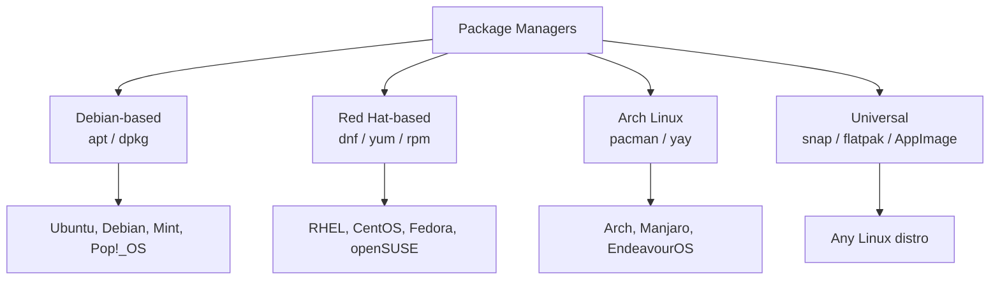

# 16 — Software Installation Methods

> **[← Services & Processes](15_Services_Processes.md)** | **[Index](00_INDEX.md)** | **[Cloud & Remote Access →](17_Cloud_Remote_Access.md)**

---

## Linux Package Managers

A **package manager** automates installing, updating, removing, and managing software and dependencies.

### Package Manager Overview



---

### `apt` — Debian/Ubuntu

```bash
# Update package list (always do this first)
sudo apt update

# Upgrade installed packages
sudo apt upgrade                    # Upgrade all upgradable
sudo apt full-upgrade               # Upgrade + handle dependency changes
sudo apt dist-upgrade               # Full upgrade including removed packages

# Install
sudo apt install nginx
sudo apt install nginx mysql-server php8.2    # Multiple packages
sudo apt install -y nginx           # Auto-yes (no prompt)
sudo apt install ./package.deb      # Install local .deb file

# Remove
sudo apt remove nginx               # Remove package, keep config
sudo apt purge nginx                # Remove package + config files
sudo apt autoremove                 # Remove unused dependencies

# Search and info
apt search nginx                    # Search packages
apt show nginx                      # Package details
apt list --installed                # List installed
apt list --upgradable               # Show upgradable packages

# Cache management
sudo apt clean                      # Remove downloaded .deb files
sudo apt autoclean                  # Remove old .deb files
du -sh /var/cache/apt/archives/     # Cache size

# Source repositories: /etc/apt/sources.list and /etc/apt/sources.list.d/
```

### `dpkg` — Low-level Debian Package Tool

```bash
# Install local .deb
sudo dpkg -i package.deb
sudo apt install -f                 # Fix broken dependencies after dpkg

# Remove
sudo dpkg -r packagename            # Remove (keep config)
sudo dpkg -P packagename            # Purge (remove + config)

# Query
dpkg -l                             # List all installed
dpkg -l | grep nginx                # Filter
dpkg -l "nginx*"                    # Wildcard
dpkg -s nginx                       # Package status/info
dpkg -L nginx                       # Files installed by package
dpkg -S /usr/bin/nginx              # Which package owns this file
```

---

### `pacman` — Arch Linux

```bash
# Sync and update (always do together)
sudo pacman -Syu                    # Sync + full system update

# Install
sudo pacman -S nginx                # Install package
sudo pacman -S nginx git vim        # Multiple

# Remove
sudo pacman -R nginx                # Remove package
sudo pacman -Rs nginx               # Remove + unused deps
sudo pacman -Rns nginx              # Remove + deps + config files

# Search and info
pacman -Ss nginx                    # Search in repos
pacman -Qi nginx                    # Info on installed package
pacman -Ql nginx                    # List files of installed package
pacman -Qo /usr/bin/nginx           # Which package owns file
pacman -Q                           # List all installed
pacman -Qdt                         # Orphaned packages (unused deps)

# Cache
sudo pacman -Sc                     # Clean old package cache
sudo pacman -Scc                    # Clean all cache

# AUR (via yay or paru)
yay -S package                      # AUR + official repos
yay -Syu                            # Full update including AUR
```

### `dnf` / `yum` — RHEL/CentOS/Fedora

```bash
# dnf (modern, Fedora, RHEL 8+)
sudo dnf update                     # Update all
sudo dnf install nginx              # Install
sudo dnf remove nginx               # Remove
sudo dnf search nginx               # Search
sudo dnf info nginx                 # Package info
sudo dnf list installed             # Installed packages
sudo dnf autoremove                 # Remove unused deps
sudo dnf clean all                  # Clean cache

# yum (older, CentOS 7)
sudo yum update
sudo yum install nginx
sudo yum remove nginx
```

---

## Universal Package Formats

### Snap

```bash
# Snap: containerized, auto-updated packages from Canonical
sudo snap install code              # VS Code
sudo snap install --classic code    # Classic confinement (more access)
snap list                           # List installed snaps
sudo snap remove code               # Remove
snap find "text editor"             # Search
snap info code                      # Info
```

### Flatpak

```bash
# Flatpak: sandboxed apps, works on any distro
flatpak install flathub io.github.flathub.Desktop
flatpak run io.github.flathub.Desktop
flatpak list                        # Installed
flatpak update                      # Update all
flatpak uninstall <app-id>          # Remove
flatpak search "app name"           # Search
```

### AppImage

```bash
# AppImage: self-contained executable, no installation
chmod +x AppName.AppImage           # Make executable
./AppName.AppImage                  # Run directly
# Integration with AppImageLauncher for menu entries
```

---

## Compiling from Source (Linux)

When a package isn't in repos, compile from source:

```bash
# Standard configure/make workflow
tar -xzvf software-1.0.tar.gz
cd software-1.0/

./configure --prefix=/usr/local     # Check deps, generate Makefile
make                                 # Compile
sudo make install                    # Install to prefix

# Install build dependencies first
sudo apt install build-essential     # gcc, g++, make
sudo apt install libssl-dev          # Example dependency

# CMake-based projects
mkdir build && cd build
cmake .. -DCMAKE_BUILD_TYPE=Release -DCMAKE_INSTALL_PREFIX=/usr/local
make -j$(nproc)                      # Parallel compile
sudo make install
```

---

## Windows Installation Methods

### MSI / EXE Installers

```powershell
# Silent install (EXE)
Start-Process setup.exe -ArgumentList "/S", "/quiet" -Wait

# MSI install
msiexec /i package.msi /quiet /norestart

# MSI with logging
msiexec /i package.msi /quiet /l*v install.log

# Common switches:
# EXE: /S /silent /quiet /Q
# MSI: /quiet /passive /norestart /l*v log.txt
```

### `winget` — Windows Package Manager

```powershell
# Install
winget install --id Microsoft.VSCode
winget install --id Git.Git
winget install "Visual Studio Code"

# Search
winget search vscode
winget show --id Microsoft.VSCode

# Update
winget upgrade --all
winget upgrade --id Microsoft.VSCode

# Uninstall
winget uninstall --id Microsoft.VSCode

# List installed
winget list

# Export/import (for new machine setup)
winget export -o packages.json
winget import -i packages.json
```

### Chocolatey

```powershell
# Install Chocolatey first (admin PowerShell)
Set-ExecutionPolicy Bypass -Scope Process -Force
[System.Net.ServicePointManager]::SecurityProtocol = [System.Net.ServicePointManager]::SecurityProtocol -bor 3072
iex ((New-Object System.Net.WebClient).DownloadString('https://community.chocolatey.org/install.ps1'))

# Use Chocolatey
choco install git
choco install git vscode nodejs -y    # Multiple, auto-yes
choco upgrade all                     # Update all
choco uninstall git
choco list                            # Installed packages
choco search nodejs                   # Search
```

---

## Environment Variables

Environment variables configure system and application behavior.

### Linux

```bash
# View
env                     # All variables
echo $PATH              # Specific variable
printenv PATH           # Same

# Session-level (lost on terminal close)
export MY_VAR="hello"
export PATH="$PATH:/new/path"

# Permanent (add to shell config)
# For bash: ~/.bashrc (interactive) or ~/.bash_profile (login)
# For zsh:  ~/.zshrc
echo 'export MY_VAR="hello"' >> ~/.bashrc
echo 'export PATH="$PATH:/new/path"' >> ~/.bashrc
source ~/.bashrc            # Reload

# System-wide
sudo nano /etc/environment  # Key=Value format (no export)
sudo nano /etc/profile      # Shell scripts

# Important variables
$PATH       # Colon-separated list of dirs where commands are found
$HOME       # Home directory
$USER       # Current username
$SHELL      # Current shell
$LANG       # Locale/language
$EDITOR     # Default text editor
$JAVA_HOME  # Java installation path
$PYTHONPATH # Python module search path
```

### Windows

```powershell
# View
$env:PATH
Get-ChildItem Env:              # All variables
[Environment]::GetEnvironmentVariable("PATH", "User")

# Session-level
$env:MY_VAR = "hello"
$env:PATH += ";C:\new\path"

# Permanent - User level
[Environment]::SetEnvironmentVariable("MY_VAR", "hello", "User")

# Permanent - System level (admin)
[Environment]::SetEnvironmentVariable("MY_VAR", "hello", "Machine")

# Via GUI: System Properties → Advanced → Environment Variables
```

### PATH Variable

PATH tells the OS where to look for executables when you type a command.

```bash
# Linux
echo $PATH
# /usr/local/bin:/usr/bin:/bin:/usr/local/sbin:/usr/sbin:/home/alice/.local/bin

# Add to PATH permanently
echo 'export PATH="$HOME/.local/bin:$PATH"' >> ~/.bashrc

# Windows
$env:PATH
# C:\Windows\System32;C:\Windows;C:\Program Files\Git\bin;...
```

---

## Python Package Management

```bash
# pip
pip install requests                    # Install
pip install requests==2.28.0            # Specific version
pip install -r requirements.txt         # Install from file
pip uninstall requests
pip list                                # List installed
pip freeze > requirements.txt          # Export installed packages
pip install --upgrade requests          # Update

# Virtual environments (isolate project deps)
python3 -m venv venv                    # Create
source venv/bin/activate                # Activate (Linux)
venv\Scripts\activate                   # Activate (Windows)
deactivate                              # Deactivate

# pipx: Install Python apps globally in isolated envs
pipx install httpie
pipx upgrade-all
```

---

## Node.js Package Management

```bash
# npm
npm install                             # Install from package.json
npm install express                     # Install package locally
npm install -g nodemon                  # Install globally
npm install express@4.18.0              # Specific version
npm uninstall express
npm update
npm list                                # List local packages
npm list -g                             # List global packages
npm run start                           # Run script from package.json

# yarn
yarn install
yarn add express
yarn global add nodemon
yarn remove express
```

---

## Related Topics

- [Linux CLI ←](03_Linux_CLI.md)
- [Services & Processes ←](15_Services_Processes.md) — starting installed services
- [Cloud & Remote Access →](17_Cloud_Remote_Access.md)
- [Git Fundamentals →](19_Git_Fundamentals.md) — version-controlled projects

---

> [← Services & Processes](15_Services_Processes.md) | [Index](00_INDEX.md) | [Cloud & Remote Access →](17_Cloud_Remote_Access.md)
