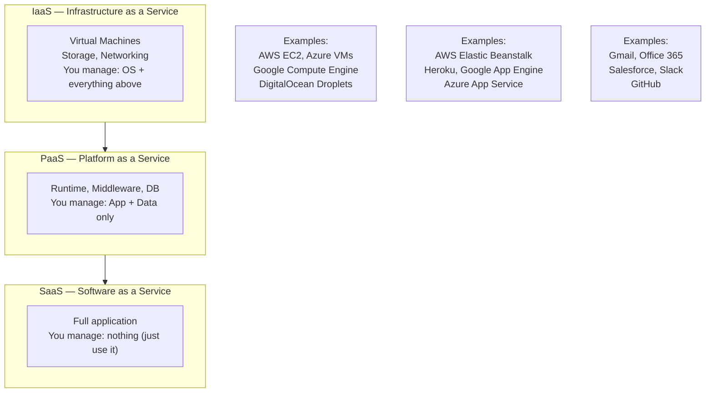

# 17 — Cloud and Remote Access Basics

> **[← Software Installation](16_Software_Installation.md)** | **[Index](00_INDEX.md)** | **[Troubleshooting →](18_Troubleshooting.md)**

---

## Cloud Computing Overview

Cloud computing delivers computing resources (servers, storage, networking, software) over the internet on a **pay-as-you-go** model.

### Service Models



### Deployment Models

| Model | Description | Example |
|-------|-------------|---------|
| **Public Cloud** | Shared infrastructure, pay-per-use | AWS, Azure, GCP |
| **Private Cloud** | Dedicated infrastructure for one org | On-prem VMware, OpenStack |
| **Hybrid Cloud** | Mix of public + private | On-prem + AWS with VPN |
| **Multi-Cloud** | Multiple public providers | AWS + Azure |

---

## Virtual Machines (VMs)

A **VM** is a software emulation of a physical computer. Multiple VMs run on one physical host via a **hypervisor**.

```
Physical Host
├── Hypervisor (Type 1: ESXi, Hyper-V, KVM)
│   ├── VM 1: Ubuntu Server (2 vCPU, 4 GB RAM)
│   ├── VM 2: Windows Server (4 vCPU, 8 GB RAM)
│   └── VM 3: CentOS (1 vCPU, 2 GB RAM)

Type 1 Hypervisor = Bare metal (runs directly on hardware) — production
Type 2 Hypervisor = Hosted (runs on top of OS) — VirtualBox, VMware Workstation
```

### VM on Linux (KVM/QEMU)

```bash
# Check if KVM supported
egrep -c '(vmx|svm)' /proc/cpuinfo    # >0 means yes

# Install KVM + management tools
sudo apt install qemu-kvm libvirt-daemon-system virtinst virt-manager

# Create VM from CLI
virt-install \
  --name ubuntu-server \
  --ram 2048 \
  --vcpus 2 \
  --disk path=/var/lib/libvirt/images/ubuntu.qcow2,size=20 \
  --cdrom /tmp/ubuntu-22.04-server.iso \
  --network bridge=virbr0 \
  --graphics none \
  --console pty,target_type=serial \
  --os-variant ubuntu22.04

# Manage VMs
virsh list --all                    # List VMs
virsh start ubuntu-server           # Start VM
virsh shutdown ubuntu-server        # Graceful shutdown
virsh destroy ubuntu-server         # Force stop
virsh suspend ubuntu-server         # Pause
virsh resume ubuntu-server          # Resume
virsh snapshot-create-as ubuntu-server snap1   # Snapshot
```

---

## Containers

Containers are **lightweight, portable, isolated environments** that share the host OS kernel (unlike VMs which emulate full hardware).

### VM vs Container

```
Virtual Machine:                    Container:
┌──────────────────┐               ┌──────────────────┐
│   App A          │               │   App A          │
│   Libraries      │               │   Libraries      │
│   Guest OS       │               ├──────────────────┤
├──────────────────┤               │   App B          │
│   App B          │               │   Libraries      │
│   Libraries      │               ├──────────────────┤
│   Guest OS       │               │ Container Runtime│
├──────────────────┤               │ (Docker Engine)  │
│   Hypervisor     │               ├──────────────────┤
├──────────────────┤               │   Host OS Kernel │
│   Hardware       │               ├──────────────────┤
└──────────────────┘               │   Hardware       │
                                   └──────────────────┘
Startup: minutes                   Startup: seconds
Size: GBs                          Size: MBs
Isolation: Full OS                 Isolation: Process-level
```

### Docker Basics

```bash
# Install Docker
curl -fsSL https://get.docker.com | sh
sudo usermod -aG docker $USER       # Add user to docker group (re-login)

# Images
docker pull ubuntu:22.04            # Download image
docker images                       # List local images
docker rmi ubuntu:22.04             # Remove image

# Containers
docker run ubuntu:22.04 echo "hello"          # Run command in container
docker run -it ubuntu:22.04 bash              # Interactive shell
docker run -d -p 8080:80 nginx                # Detached, port mapping
docker run --name myapp -d nginx              # Named container

# Flags:
# -d = detached (background)
# -it = interactive terminal
# -p host:container = port mapping
# --name = container name
# -v /host:/container = volume mount
# -e VAR=val = environment variable
# --rm = remove on exit

# Container management
docker ps                           # Running containers
docker ps -a                        # All containers
docker stop myapp                   # Stop
docker start myapp                  # Start stopped container
docker restart myapp                # Restart
docker rm myapp                     # Remove container
docker logs myapp                   # View logs
docker logs -f myapp                # Follow logs
docker exec -it myapp bash          # Shell into running container
docker inspect myapp                # Full container info
docker stats                        # Live resource usage

# Dockerfile
cat > Dockerfile << 'EOF'
FROM node:18-alpine
WORKDIR /app
COPY package*.json ./
RUN npm ci --only=production
COPY . .
EXPOSE 3000
CMD ["node", "server.js"]
EOF

docker build -t myapp:1.0 .         # Build image
docker build -t myapp:1.0 -f Dockerfile.prod .

# Docker Compose
docker compose up -d                # Start all services
docker compose down                 # Stop and remove
docker compose logs -f              # Follow logs
docker compose ps                   # Status
```

---

## SSH — Secure Shell

SSH provides **encrypted remote terminal access** to Linux/Unix systems.

> See also: [Networking Fundamentals →](07_Networking_Fundamentals.md) (Port 22)

### Connecting

```bash
# Basic connection
ssh username@hostname
ssh username@192.168.1.100
ssh -p 2222 username@host           # Custom port
ssh -i ~/.ssh/id_rsa username@host  # Specific key
ssh -v username@host                # Verbose (debug connection)

# SSH config file (~/.ssh/config) — simplify connections
Host myserver
    HostName 192.168.1.100
    User alice
    Port 22
    IdentityFile ~/.ssh/id_rsa_myserver
    ServerAliveInterval 60

# Now just:
ssh myserver
```

### SSH Key Authentication

```bash
# Generate key pair
ssh-keygen -t ed25519 -C "alice@laptop"        # Modern (recommended)
ssh-keygen -t rsa -b 4096 -C "alice@laptop"   # RSA 4096-bit

# Files created:
# ~/.ssh/id_ed25519       (private key — keep secret!)
# ~/.ssh/id_ed25519.pub   (public key — share this)

# Copy public key to server
ssh-copy-id alice@192.168.1.100
ssh-copy-id -i ~/.ssh/id_ed25519.pub alice@192.168.1.100

# Manual copy (if ssh-copy-id not available)
cat ~/.ssh/id_ed25519.pub | ssh alice@host "mkdir -p ~/.ssh && cat >> ~/.ssh/authorized_keys && chmod 600 ~/.ssh/authorized_keys"

# Key permissions (MUST be correct or SSH refuses)
chmod 700 ~/.ssh/
chmod 600 ~/.ssh/id_ed25519         # Private key
chmod 644 ~/.ssh/id_ed25519.pub     # Public key
chmod 600 ~/.ssh/authorized_keys
chmod 600 ~/.ssh/config
```

### SSH Server Configuration

```bash
# Config file: /etc/ssh/sshd_config

# Recommended security settings:
Port 22                          # Change to non-standard (e.g., 2222)
PermitRootLogin no               # Disable root login
PasswordAuthentication no        # Keys only (after copying your key!)
PubkeyAuthentication yes
AuthorizedKeysFile .ssh/authorized_keys
MaxAuthTries 3
AllowUsers alice bob             # Whitelist users
X11Forwarding no

# Apply changes
sudo systemctl restart sshd
```

### SSH Tunneling

```bash
# Local port forwarding: access remote service locally
# Access remote MySQL (3306) via localhost:3307
ssh -L 3307:localhost:3306 user@remotehost
# Now connect to: mysql -h 127.0.0.1 -P 3307

# Remote port forwarding: expose local service remotely
# Expose local port 8080 on remote's port 80
ssh -R 80:localhost:8080 user@remotehost

# Dynamic port forwarding (SOCKS proxy)
ssh -D 1080 user@remotehost
# Configure browser to use SOCKS5 proxy at 127.0.0.1:1080

# Jump host / Bastion host
ssh -J bastion@jumphost user@private-server
# Config file version:
# Host private-server
#     ProxyJump bastion@jumphost
```

### SCP and SFTP

```bash
# SCP — Secure Copy
scp file.txt alice@host:/remote/path/
scp alice@host:/remote/file.txt ./local/
scp -r local_dir/ alice@host:/remote/            # Recursive
scp -P 2222 file.txt alice@host:/path/           # Custom port

# SFTP — Interactive FTP over SSH
sftp alice@host
# Commands inside sftp:
# ls, cd, mkdir, rm, rmdir
# lls, lcd (local)
# put localfile remotefile    (upload)
# get remotefile localfile    (download)
# mput *.txt                  (upload multiple)
# mget *.txt                  (download multiple)
# bye / exit / quit
```

---

## RDP — Remote Desktop Protocol

RDP provides **graphical remote access** to Windows machines on port **3389**.

```powershell
# Enable RDP on Windows (PowerShell)
Set-ItemProperty -Path 'HKLM:\System\CurrentControlSet\Control\Terminal Server' -Name "fDenyTSConnections" -Value 0
Enable-NetFirewallRule -DisplayGroup "Remote Desktop"

# Disable RDP
Set-ItemProperty -Path 'HKLM:\System\CurrentControlSet\Control\Terminal Server' -Name "fDenyTSConnections" -Value 1

# Check if RDP is enabled
(Get-ItemProperty -Path 'HKLM:\System\CurrentControlSet\Control\Terminal Server').fDenyTSConnections
# 0 = enabled, 1 = disabled
```

```bash
# Connect to RDP from Linux
sudo apt install freerdp2-x11
xfreerdp /v:192.168.1.100 /u:alice /p:password
xfreerdp /v:host /u:alice /p:pass /f         # Fullscreen
xfreerdp /v:host:3389 /u:alice /cert-ignore  # Ignore cert warning

# Remmina (GUI RDP client)
sudo apt install remmina remmina-plugin-rdp
```

---

## AWS / Cloud CLI Basics

```bash
# Install AWS CLI
curl "https://awscli.amazonaws.com/awscli-exe-linux-x86_64.zip" -o awscliv2.zip
unzip awscliv2.zip && sudo ./aws/install

# Configure
aws configure
# AWS Access Key ID: AKIA...
# AWS Secret Access Key: ...
# Default region: ap-south-1
# Default output format: json

# Common commands
aws ec2 describe-instances                     # List EC2 instances
aws ec2 start-instances --instance-ids i-xxx  # Start instance
aws ec2 stop-instances --instance-ids i-xxx   # Stop instance
aws s3 ls                                      # List S3 buckets
aws s3 cp file.txt s3://mybucket/             # Upload to S3
aws s3 sync ./local/ s3://mybucket/           # Sync directory
aws s3 rb s3://mybucket --force               # Delete bucket
aws logs tail /aws/lambda/myfunction --follow  # CloudWatch logs

# SSH to EC2
ssh -i ~/.ssh/mykey.pem ec2-user@ec2-ip-addr.compute.amazonaws.com
```

---

## Related Topics

- [Networking Fundamentals ←](07_Networking_Fundamentals.md) — ports 22, 3389
- [Security Concepts ←](14_Security_Concepts.md) — encryption, firewall
- [VPN ←](12_VPN.md) — tunneling
- [Software Installation ←](16_Software_Installation.md) — installing cloud tools
- [Troubleshooting →](18_Troubleshooting.md)

---

> [← Software Installation](16_Software_Installation.md) | [Index](00_INDEX.md) | [Troubleshooting →](18_Troubleshooting.md)
