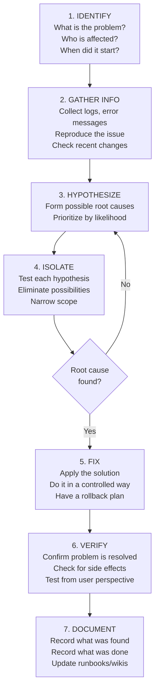
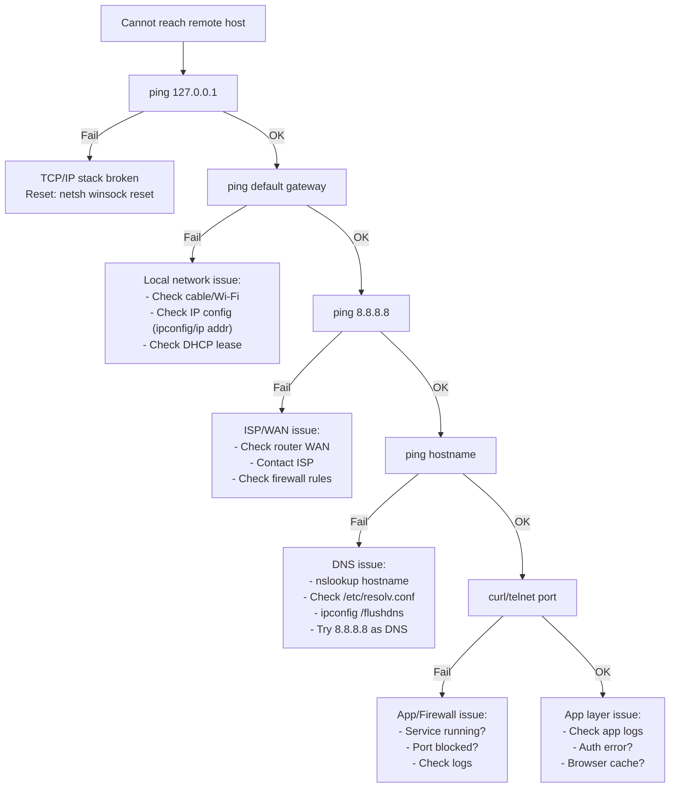

# 18 — Troubleshooting Methodology

> **[← Cloud & Remote Access](17_Cloud_Remote_Access.md)** | **[Index](00_INDEX.md)** | **[Git Fundamentals →](19_Git_Fundamentals.md)**

---

## The Troubleshooting Process

A structured approach prevents wasted effort, ensures root cause is found (not just symptoms), and creates a traceable history.



---

## Step 1 — Identify the Problem

Ask **who, what, when, where, how many**:

```
✓ What exactly is broken?
  "Users cannot log in" vs "ALL users cannot log in" vs "specific user Alice cannot log in"

✓ When did it start?
  "Just now" vs "since last night" vs "since the patch at 3 PM"

✓ Who is affected?
  "All users" / "only remote users" / "only users in finance OU"

✓ What changed recently?
  Deployments, patches, config changes, hardware failures, network changes

✓ Is it reproducible?
  Always? Intermittent? Under specific conditions?

✓ What is the impact?
  Full outage? Degraded? Cosmetic?
```

---

## Step 2 — Gather Information

### Linux Information Commands

```bash
# System identity
hostname                        # Machine name
uname -a                        # OS, kernel version, arch
cat /etc/os-release             # Distro info
uptime                          # How long running + load average

# Recent changes
last                            # Recent logins
lastlog                         # Last login per user
history                         # Command history
sudo journalctl --since "1 hour ago"  # Recent system events

# Services
systemctl list-units --failed   # Failed services
systemctl status servicename    # Specific service

# Logs — the most important step
tail -100 /var/log/syslog
tail -100 /var/log/auth.log
journalctl -xe                  # Recent logs with context
journalctl -u servicename -n 100

# Resources
top / htop                      # CPU/Memory
df -h                           # Disk space
free -h                         # Memory
ss -tulpn                       # Open ports

# Network
ip addr                         # IP addresses
ip route                        # Routing table
ping gateway_ip                 # Test local network
ping 8.8.8.8                    # Test internet
nslookup domain.com             # Test DNS
```

### Windows Information Commands

```powershell
# System info
$env:COMPUTERNAME
Get-ComputerInfo
systeminfo

# Event logs — FIRST place to look
Get-EventLog -LogName System -Newest 50 -EntryType Error
Get-EventLog -LogName Application -Newest 50 -EntryType Error
Get-EventLog -LogName Security -InstanceId 4625 -Newest 20    # Failed logins

# Services
Get-Service | Where-Object {$_.Status -ne 'Running' -and $_.StartType -eq 'Automatic'}

# Resources
Get-Process | Sort-Object CPU -Descending | Select -First 10
Get-Counter "\Processor(_Total)\% Processor Time" -SampleInterval 2 -MaxSamples 5

# Network
Get-NetIPConfiguration
Test-Connection 8.8.8.8
Resolve-DnsName google.com
Get-NetTCPConnection -State Listen
```

---

## Step 3 — Common Issue Patterns

### Network Troubleshooting Flow



### Disk Space Issues

```bash
# Find what's using disk space
df -h                           # Overall usage
du -sh /var/log/                # Check log dir
du -sh * 2>/dev/null | sort -h  # Sort by size in current dir
find / -size +500M 2>/dev/null  # Files over 500MB
find /var/log -name "*.log" -size +100M  # Large logs

# Free up space
sudo journalctl --vacuum-size=200M    # Trim journal logs
sudo apt clean / sudo pacman -Sc      # Clean package cache
find /tmp -mtime +7 -delete           # Clean old temp files
```

### High CPU / Memory

```bash
# Find CPU hog
top -b -n 1 | head -20          # Non-interactive snapshot
ps aux --sort=-%cpu | head -10  # Top CPU users
ps aux --sort=-%mem | head -10  # Top memory users

# Check for runaway processes
watch -n 2 'ps aux --sort=-%cpu | head -10'

# Memory analysis
free -h
cat /proc/meminfo | grep -E "MemFree|MemAvailable|Cached|SwapFree"
vmstat 1 5
```

### Service Won't Start

```bash
# Step 1: Check status
systemctl status nginx

# Step 2: Check logs
journalctl -u nginx -n 50 --no-pager
tail -50 /var/log/nginx/error.log

# Step 3: Test config manually
nginx -t                        # Nginx config test
apache2ctl configtest           # Apache config test
php -l /etc/php/8.2/fpm/php.ini  # PHP syntax check

# Step 4: Check port conflicts
ss -tulpn | grep :80            # Is port 80 in use by something else?

# Step 5: Check permissions
ls -la /var/run/nginx/          # Check PID file dir
ls -la /etc/nginx/              # Check config perms
```

### Permission Denied Errors

```bash
# Check who you are
whoami
id

# Check file permissions
ls -la /path/to/file
stat /path/to/file

# Check directory permissions (need execute on all parent dirs)
namei -l /path/to/file          # Show permissions for each path component

# Check SELinux/AppArmor (may override DAC permissions)
getenforce                       # SELinux status
aa-status                        # AppArmor status
ausearch -m avc -ts recent       # SELinux denials

# Common fixes
chmod 755 /var/www/              # Fix web dir permissions
chown www-data:www-data /var/www/html/  # Fix ownership
sudo -u www-data cat /var/www/html/protected   # Test as service user
```

### SSH Connection Issues

```bash
# On client — verbose debug
ssh -vvv user@host              # Very verbose

# Common issues:
# 1. Wrong key permissions
chmod 700 ~/.ssh/
chmod 600 ~/.ssh/id_ed25519
chmod 600 ~/.ssh/authorized_keys

# 2. Wrong username
ssh ec2-user@host               # AWS Amazon Linux
ssh ubuntu@host                 # AWS Ubuntu
ssh admin@host                  # Some distros

# 3. Host key changed (MITM warning)
ssh-keygen -R hostname          # Remove old host key
# Then reconnect and accept new key

# On server — check sshd
systemctl status sshd
journalctl -u sshd -n 50
tail -50 /var/log/auth.log | grep ssh
```

---

## Step 4 — Isolate

**Divide and conquer** — narrow down the problem scope:

```
Is it:
  - All users or specific user?
  - All locations or specific location?
  - All services or specific service?
  - All data or specific records?
  - Consistent or intermittent?
  - After specific action?

Techniques:
  - Reproduce in isolation (test env)
  - Binary search (disable half, test, repeat)
  - Compare with working system
  - Add verbose logging
  - Strace/ltrace for system call tracing
```

```bash
# strace — trace system calls (Linux)
strace -p PID                   # Attach to running process
strace -e trace=file command    # Trace only file-related calls
strace -e trace=network command # Trace network calls
strace -f -o trace.log command  # Fork-following, log to file
```

---

## Step 5 — Apply Fix

```
Before fixing:
  ✓ Have a rollback plan
  ✓ Backup configs before editing
  ✓ Do changes during maintenance window if possible
  ✓ Test in staging/dev if available
  ✓ Communicate with users/team

During fix:
  ✓ Make ONE change at a time
  ✓ Document each change made
  ✓ Note the time of each change

After fix:
  ✓ Verify from the user's perspective
  ✓ Check related systems not broken
  ✓ Monitor for recurrence
```

---

## Step 6 — Verify

```bash
# Verify service is running
systemctl status nginx
curl -I http://localhost

# Verify from external perspective
curl -I https://yourdomain.com
ping hostname

# Verify logs show normal operation
journalctl -u nginx -f          # Watch logs in real time

# Windows
Test-Connection hostname
Invoke-WebRequest http://localhost
Get-EventLog -LogName System -Newest 10
```

---

## Step 7 — Document

A good incident report includes:

```markdown
## Incident Report — [Date] — [Brief Title]

**Start Time:** 2024-04-22 14:35
**End Time:**   2024-04-22 15:12
**Duration:**   37 minutes
**Impact:**     All users unable to log in to web portal

### Timeline
- 14:35 — First alert: login failures reported
- 14:40 — Checked nginx status: running
- 14:45 — Checked auth logs: MySQL connection refused
- 14:50 — Found MySQL OOM-killed due to disk full
- 15:00 — Cleared /var/log old logs, freed 8GB
- 15:05 — Restarted MySQL
- 15:08 — Login tested: working
- 15:12 — Monitoring confirmed: all normal

### Root Cause
MySQL was killed by OOM killer because /var disk filled up
due to unrotated application debug logs from new deployment.

### Resolution
1. Removed debug logs: freed 8 GB
2. Restarted MySQL service
3. Added logrotate config for app logs

### Prevention
- [ ] Set up disk usage alerts at 80%
- [ ] Review and fix logrotate config in deploy checklist
- [ ] Set app log level to INFO in production
```

---

## Quick Reference Troubleshooting Toolkit

```bash
# The first 60 seconds on a sick Linux server
uptime                          # Load average
dmesg | tail -20                # Kernel errors
journalctl -xe                  # Recent system errors
top                             # CPU/memory snapshot
df -h                           # Disk space
free -h                         # Memory
ss -tulpn                       # Listening ports
systemctl list-units --failed   # Failed services
tail -50 /var/log/syslog        # Recent syslog
ip addr && ip route             # Network config
```

---

## Related Topics

- [Linux CLI ←](03_Linux_CLI.md) — commands used in troubleshooting
- [Windows CLI ←](04_Windows_CLI.md) — PowerShell diagnostics
- [Networking Tools ←](08_Networking_Tools.md) — ping, traceroute, netstat
- [Monitoring & Logging ←](13_Monitoring_Logging.md) — reading logs
- [Services & Processes ←](15_Services_Processes.md) — service management
- [Git Fundamentals →](19_Git_Fundamentals.md)

---

> [← Cloud & Remote Access](17_Cloud_Remote_Access.md) | [Index](00_INDEX.md) | [Git Fundamentals →](19_Git_Fundamentals.md)
