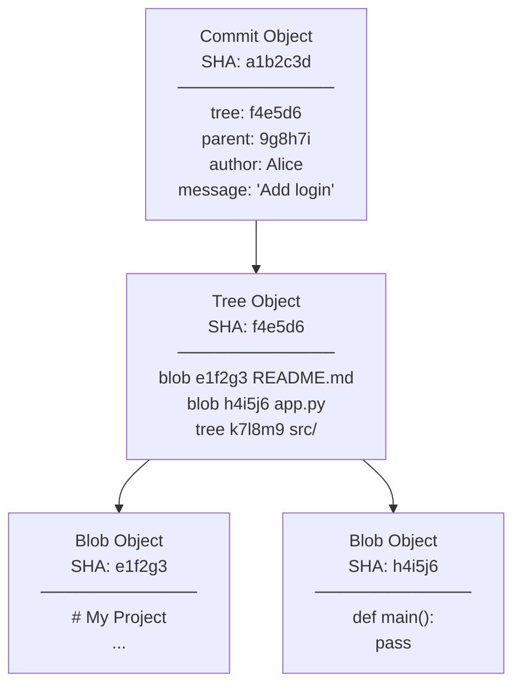
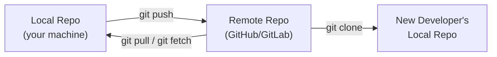
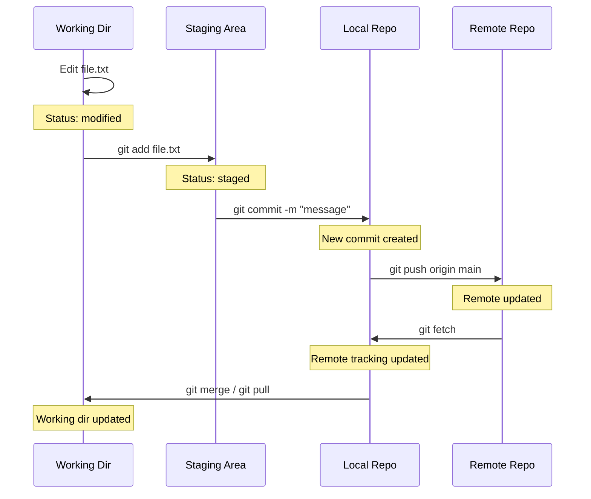

# 19 — Git Fundamentals

> **[← Troubleshooting](18_Troubleshooting.md)** | **[Index](00_INDEX.md)** | **[Git Commands →](20_Git_Commands.md)**

---

## What is Git?

**Git** is a **distributed version control system (DVCS)** that tracks changes to files over time, enabling collaboration, history review, and safe experimentation.

- Created by **Linus Torvalds** in 2005 (for Linux kernel development)
- **Distributed** — every developer has a full copy of the repository
- **Non-linear** — supports branching and merging freely
- **Fast** — most operations are local (no network needed)

---

## Core Concepts

### The Three Trees / Areas

```
┌─────────────────────────────────────────────────────────────────┐
│                         Git Repository                          │
│                                                                  │
│  Working Directory    Staging Area (Index)    Local Repository  │
│  ┌─────────────┐      ┌─────────────┐        ┌─────────────┐   │
│  │  file.txt   │      │  file.txt   │        │  Commit A   │   │
│  │  (modified) │─────▶│  (staged)   │───────▶│  Commit B   │   │
│  │  new.txt    │  git │             │ git    │  Commit C   │   │
│  │  (untrack.) │  add │             │ commit │  (HEAD)     │   │
│  └─────────────┘      └─────────────┘        └─────────────┘   │
│                                                        │         │
│                                               git push │         │
│                                                        ▼         │
└─────────────────────────────────────────────────────────────────┘
                                               Remote Repository
                                               ┌─────────────┐
                                               │   GitHub /  │
                                               │   GitLab /  │
                                               │   Bitbucket │
                                               └─────────────┘
```

| Area | Description |
|------|-------------|
| **Working Directory** | Your actual files on disk — what you see and edit |
| **Staging Area (Index)** | Files prepared/queued for the next commit |
| **Local Repository** | `.git/` folder — full history of all commits |
| **Remote Repository** | Server-hosted copy (GitHub, GitLab, self-hosted) |

---

## Repository Structure

```
project/
├── .git/                   ← Git internal data (DON'T manually edit)
│   ├── HEAD                ← Points to current branch
│   ├── config              ← Repo-level git config
│   ├── objects/            ← All blob/tree/commit objects (compressed)
│   ├── refs/
│   │   ├── heads/          ← Local branch pointers
│   │   │   └── main        ← Points to latest commit on main
│   │   └── remotes/
│   │       └── origin/     ← Remote tracking branches
│   │           └── main
│   └── COMMIT_EDITMSG      ← Last commit message
├── .gitignore              ← Files/patterns to ignore
├── README.md
├── src/
│   └── app.py
└── tests/
    └── test_app.py
```

---

## Git Object Model

Git stores everything as **objects** in a content-addressable store. Each object is identified by its SHA-1 hash.



| Object Type | Contains | Analogy |
|-------------|---------|---------|
| **Blob** | File content | File |
| **Tree** | Directory listing (blobs + trees) | Folder |
| **Commit** | Tree pointer + parent + metadata | Snapshot |
| **Tag** | Pointer to commit + message | Named bookmark |

---

## Commits

A **commit** is a snapshot of the entire project at a point in time — not just the changed files.

### Commit Anatomy

```
commit a1b2c3d4e5f6...          ← SHA-1 hash (unique ID)
Author: Alice Smith <alice@ex.com>
Date:   Mon Apr 22 10:00:00 2024 +0530

    Add user authentication feature   ← Subject line (50 chars max)

    Implement JWT-based login and logout endpoints.
    - POST /api/auth/login returns Bearer token
    - POST /api/auth/logout invalidates token
    - Added middleware for protected routes

    Closes #42
```

### What Makes a Good Commit

```
✓ Atomic: one logical change per commit
✓ Subject: imperative mood ("Add feature", not "Added feature")
✓ Subject: ≤ 50 characters
✓ Body: explain WHY, not WHAT (code shows what)
✓ Reference issue numbers

✗ "fix stuff"
✗ "WIP"
✗ "asdfgh"
✗ Giant commit with 50 files changed
```

---

## Branches

A **branch** is a lightweight, movable pointer to a commit.

```
main:    A ── B ── C ── D
                    \
feature:             E ── F ── G
                              ↑
                             HEAD (current position)
```

- **HEAD** — special pointer indicating your current working position
- `HEAD → main` means you're on the `main` branch
- Detached HEAD = HEAD points to a commit, not a branch

```bash
# HEAD is stored in .git/HEAD
cat .git/HEAD
# ref: refs/heads/main

# After detaching (git checkout <commit-hash>):
cat .git/HEAD
# 3f4a5b6c7...
```

---

## Remote Repositories

A **remote** is a hosted copy of the repository. Conventionally named **`origin`**.



### Remote Tracking Branches

Git keeps local copies of remote branches as **remote tracking branches**:

```
origin/main   → tracks main on the remote
origin/dev    → tracks dev on the remote

These are read-only locally — updated by git fetch/pull
Your local main can be ahead, behind, or diverged from origin/main
```

---

## Git Configuration

```bash
# Identity (required before committing)
git config --global user.name "Alice Smith"
git config --global user.email "alice@example.com"

# Default branch name
git config --global init.defaultBranch main

# Default editor
git config --global core.editor "vim"
git config --global core.editor "nano"
git config --global core.editor "code --wait"   # VS Code

# Line endings
git config --global core.autocrlf input         # Linux/Mac
git config --global core.autocrlf true          # Windows

# Aliases
git config --global alias.st status
git config --global alias.co checkout
git config --global alias.br branch
git config --global alias.lg "log --oneline --graph --all --decorate"

# View config
git config --list
git config --global --list
git config user.name

# Config file locations:
# System:  /etc/gitconfig
# Global:  ~/.gitconfig
# Local:   .git/config  (per-repo)
```

---

## .gitignore

The `.gitignore` file tells Git which files to **never track**. Place at repo root (or subdirectories).

```gitignore
# Comments start with #

# Ignore specific file
secrets.txt
.env
.env.local

# Ignore by extension
*.log
*.tmp
*.pyc
*.class
*.o
*.so
*.exe

# Ignore directories (trailing slash)
node_modules/
vendor/
__pycache__/
.cache/
dist/
build/
target/

# Ignore anywhere in tree (no leading slash)
*.log

# Ignore only at root
/debug.log

# Negate (don't ignore, even if pattern above matches)
!important.log

# Wildcards
logs/
*.log
!logs/production.log     # But keep this one

# IDE and OS files
.DS_Store               # macOS
Thumbs.db               # Windows
.idea/                  # IntelliJ
.vscode/                # VS Code (or track .vscode/settings.json specifically)
*.sublime-project

# Language-specific
# Python
__pycache__/
*.py[cod]
venv/
.env

# Node.js
node_modules/
npm-debug.log
.npm/

# Java
*.class
*.jar
target/

# Laravel / PHP
/vendor/
.env
storage/
bootstrap/cache/
```

```bash
# Check if a file is being ignored
git check-ignore -v filename

# Show all ignored files
git status --ignored

# Force-add ignored file (override .gitignore)
git add -f filename

# Global gitignore (applies to all repos)
git config --global core.excludesfile ~/.gitignore_global
```

---

## How Git Tracks Changes



---

## Related Topics

- [Git Commands →](20_Git_Commands.md) — practical command reference
- [Git Branching →](21_Git_Branching.md) — branching, merging, conflicts
- [Software Installation ←](16_Software_Installation.md) — installing Git
- [Cloud & Remote Access ←](17_Cloud_Remote_Access.md) — SSH keys for GitHub

---

> [← Troubleshooting](18_Troubleshooting.md) | [Index](00_INDEX.md) | [Git Commands →](20_Git_Commands.md)
