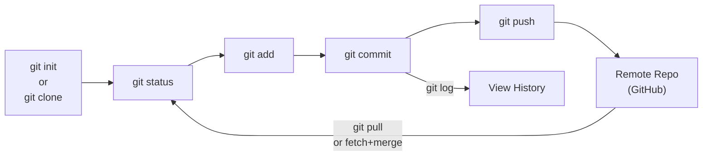
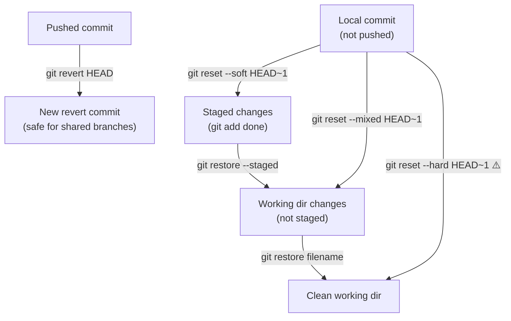

# 20 — Git Commands and Workflow

> **[← Git Fundamentals](19_Git_Fundamentals.md)** | **[Index](00_INDEX.md)** | **[Git Branching →](21_Git_Branching.md)**

---

## Complete Git Workflow Overview



---

## Setting Up a Repository

### `git init` — Initialize New Repository

```bash
# Create new repo in current directory
git init

# Create new repo in new directory
git init myproject
cd myproject

# What it does:
# Creates .git/ directory with all git internals
# Sets default branch (main or master depending on config)
ls -la .git/
```

### `git clone` — Clone Existing Repository

```bash
# Clone via HTTPS
git clone https://github.com/user/repo.git

# Clone via SSH (requires SSH key setup)
git clone git@github.com:user/repo.git

# Clone to specific directory
git clone https://github.com/user/repo.git mydir

# Clone specific branch
git clone -b develop https://github.com/user/repo.git

# Shallow clone (last N commits only — faster for large repos)
git clone --depth=1 https://github.com/user/repo.git

# Clone with submodules
git clone --recurse-submodules https://github.com/user/repo.git
```

---

## Checking Status and History

### `git status` — Working Tree Status

```bash
git status                      # Full status
git status -s                   # Short format
git status -sb                  # Short + branch info

# Short format codes:
# ?? = Untracked file
# A  = Added (staged new file)
# M  = Modified
# D  = Deleted
# R  = Renamed
# Left column = staging area, Right = working dir
# MM = modified in both staging and working dir
```

### `git log` — View Commit History

```bash
git log                         # Full log (author, date, message)
git log --oneline               # One line per commit
git log --oneline --graph       # With ASCII branch graph
git log --oneline --graph --all --decorate  # All branches

# Filter
git log -n 10                   # Last 10 commits
git log --since="2 weeks ago"
git log --after="2024-04-01" --before="2024-04-22"
git log --author="Alice"
git log --grep="fix"            # Search commit messages
git log -- filename.txt         # History of specific file

# Show changes
git log -p                      # With diffs
git log --stat                  # With file change summary
git log --name-only             # Just file names

# Range
git log main..feature           # Commits in feature not in main
git log origin/main..main       # Local commits not pushed

# Pretty formats
git log --pretty=format:"%h %an %s %ar"
# %h = short hash, %an = author, %s = subject, %ar = relative time
```

### `git diff` — View Changes

```bash
git diff                        # Working dir vs staging area
git diff --staged               # Staging area vs last commit
git diff HEAD                   # Working dir vs last commit
git diff HEAD~1                 # Working dir vs previous commit
git diff main feature           # Between branches
git diff a1b2c3 d4e5f6         # Between commits
git diff --stat                 # Summary only (files changed)
git diff filename.txt           # Specific file only

# Word-level diff
git diff --word-diff
```

### `git show` — Show Object Details

```bash
git show                        # Show last commit + diff
git show a1b2c3d                # Specific commit
git show HEAD~2                 # Two commits ago
git show HEAD:filename.txt      # File as it was at HEAD
git show a1b2c3:filename.txt    # File at specific commit
```

---

## Staging Changes

### `git add` — Stage Files

```bash
git add filename.txt            # Stage specific file
git add dir/                    # Stage entire directory
git add *.py                    # Stage all .py files
git add .                       # Stage all changes in current dir
git add -A                      # Stage all changes everywhere

# Interactive staging (choose which hunks to stage)
git add -p                      # Patch mode — review each change
git add -p filename.txt         # Specific file

# Inside -p mode:
# y = stage this hunk
# n = skip this hunk
# s = split hunk into smaller hunks
# e = manually edit hunk
# q = quit
# ? = help
```

### `git restore` — Discard / Unstage

```bash
# Unstage (remove from staging area, keep working dir changes)
git restore --staged filename.txt
git restore --staged .          # Unstage everything

# Discard working dir changes (DESTRUCTIVE — cannot undo)
git restore filename.txt        # Discard changes to file
git restore .                   # Discard all changes ⚠️

# Old-style (still works)
git reset HEAD filename.txt     # Unstage
git checkout -- filename.txt    # Discard working dir changes
```

---

## Committing

### `git commit` — Create a Commit

```bash
# Open editor for message
git commit

# Inline message
git commit -m "Add user authentication"

# Multi-line message
git commit -m "Add user authentication" -m "Implements JWT login/logout. Closes #42."

# Stage tracked files and commit in one step
git commit -am "Fix typo in README"
# Note: -a does NOT stage new untracked files

# Amend last commit (before pushing)
git commit --amend                      # Edit message in editor
git commit --amend -m "Better message"
git commit --amend --no-edit            # Keep message, add staged changes

# Empty commit (useful for triggering CI)
git commit --allow-empty -m "Trigger CI"
```

---

## Working with Remotes

### `git remote` — Manage Remotes

```bash
git remote -v                           # List remotes (verbose)
git remote add origin https://github.com/user/repo.git  # Add remote
git remote rename origin upstream       # Rename
git remote remove origin                # Remove
git remote set-url origin git@github.com:user/repo.git  # Change URL
git remote show origin                  # Detailed remote info
```

### `git fetch` — Download Without Merging

```bash
git fetch                       # Fetch all remotes
git fetch origin                # Fetch from origin
git fetch origin main           # Fetch specific branch
git fetch --all                 # Fetch from all remotes
git fetch --prune               # Remove deleted remote branches locally

# After fetch: see what's new
git log HEAD..origin/main --oneline   # Commits on remote not local
git diff HEAD origin/main             # Diff vs remote
```

### `git pull` — Fetch + Merge

```bash
git pull                        # Pull from tracked remote branch
git pull origin main            # Explicit remote + branch
git pull --rebase               # Rebase instead of merge (cleaner history)
git pull --no-ff                # Force merge commit even if fast-forward

# Set default pull strategy
git config --global pull.rebase false   # merge (default)
git config --global pull.rebase true    # always rebase
```

### `git push` — Upload to Remote

```bash
git push                        # Push current branch to its upstream
git push origin main            # Push main to origin
git push origin feature-branch  # Push a branch
git push -u origin main         # Push + set upstream tracking (-u = --set-upstream)
git push --all                  # Push all branches
git push --tags                 # Push tags
git push origin --delete old-branch  # Delete remote branch
git push -f origin main         # Force push ⚠️ (rewrites remote history)
git push --force-with-lease     # Safer force push (check for new commits first)
```

---

## Undoing Changes

### The Undo Toolkit



### `git reset` — Move HEAD

```bash
# --soft: move HEAD, keep changes staged
git reset --soft HEAD~1         # Undo last commit, keep staged

# --mixed (default): move HEAD, unstage changes
git reset HEAD~1                # Undo last commit, keep as unstaged
git reset HEAD~3                # Undo last 3 commits

# --hard: move HEAD, discard ALL changes ⚠️ DESTRUCTIVE
git reset --hard HEAD~1         # Undo last commit, discard changes
git reset --hard HEAD           # Discard all working dir + staged changes
git reset --hard origin/main    # Reset to match remote (lose local work)

# Reset specific file (not HEAD)
git reset HEAD filename.txt     # Unstage file
```

### `git revert` — Safe Undo (creates new commit)

```bash
# Creates a new commit that undoes the specified commit
# SAFE for shared/pushed commits — preserves history
git revert HEAD                 # Revert last commit
git revert a1b2c3d              # Revert specific commit
git revert HEAD~3..HEAD         # Revert last 3 commits
git revert --no-commit HEAD     # Stage the revert, don't auto-commit
```

### `git stash` — Temporary Storage

```bash
# Save work in progress without committing
git stash                       # Stash tracked changes
git stash push -m "WIP: login feature"  # With message
git stash -u                    # Include untracked files

# View stashes
git stash list
# stash@{0}: WIP on main: a1b2c3 Last commit message
# stash@{1}: WIP: login feature

# Apply stash
git stash pop                   # Apply and remove stash@{0}
git stash apply                 # Apply but keep stash
git stash apply stash@{1}       # Specific stash

# Drop / clear
git stash drop stash@{0}        # Remove one stash
git stash clear                 # Remove all stashes

# Inspect stash
git stash show                  # Summary of stash@{0}
git stash show -p               # Full diff
```

---

## Tags

Tags mark specific commits (usually releases).

```bash
# Lightweight tag (just a pointer)
git tag v1.0.0

# Annotated tag (with message, author — recommended)
git tag -a v1.0.0 -m "Version 1.0.0 - stable release"
git tag -a v1.0.0 a1b2c3d -m "Tag old commit"  # Tag specific commit

# View tags
git tag                         # List all tags
git tag -l "v1.*"               # Filter
git show v1.0.0                 # Tag details

# Push tags
git push origin v1.0.0          # Push specific tag
git push origin --tags           # Push all tags

# Delete tags
git tag -d v1.0.0               # Delete local
git push origin --delete v1.0.0  # Delete remote
```

---

## Useful Inspection Commands

```bash
# Find who last modified each line
git blame filename.txt
git blame -L 10,20 filename.txt  # Lines 10-20 only

# Search commit history for when text appeared/disappeared
git log -S "function_name"       # When this string was added/removed
git log -G "regex_pattern"       # When matching lines changed

# Find which commit introduced a bug (binary search)
git bisect start
git bisect bad                   # Current commit is bad
git bisect good v1.0.0           # This tag was good
# Git checks out middle commit — test it, then:
git bisect good                  # or git bisect bad
# Repeat until root cause commit found
git bisect reset                 # Return to HEAD

# List all files tracked by git
git ls-files

# Show size of repo
git count-objects -vH

# Garbage collect and optimize
git gc
```

---

## Setting Up SSH for GitHub/GitLab

```bash
# Generate key
ssh-keygen -t ed25519 -C "your_email@example.com"

# Start SSH agent and add key
eval "$(ssh-agent -s)"
ssh-add ~/.ssh/id_ed25519

# Copy public key
cat ~/.ssh/id_ed25519.pub
# Add this to: GitHub → Settings → SSH Keys

# Test connection
ssh -T git@github.com
# Hi username! You've successfully authenticated

# Switch existing repo from HTTPS to SSH
git remote set-url origin git@github.com:user/repo.git
```

---

## Related Topics

- [Git Fundamentals ←](19_Git_Fundamentals.md) — concepts, .gitignore
- [Git Branching →](21_Git_Branching.md) — branching, merging, conflicts
- [Cloud & Remote Access ←](17_Cloud_Remote_Access.md) — SSH keys

---

> [← Git Fundamentals](19_Git_Fundamentals.md) | [Index](00_INDEX.md) | [Git Branching →](21_Git_Branching.md)
