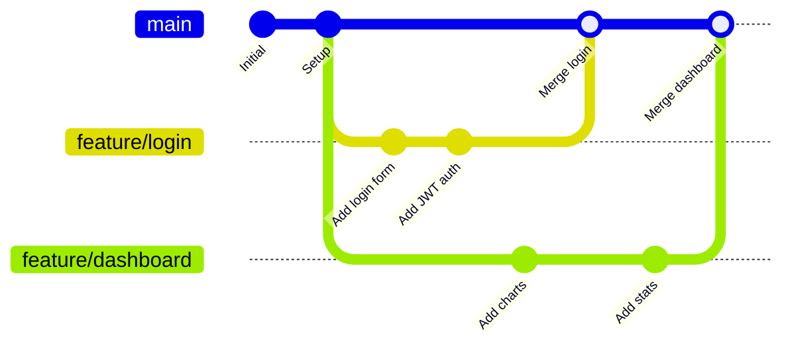
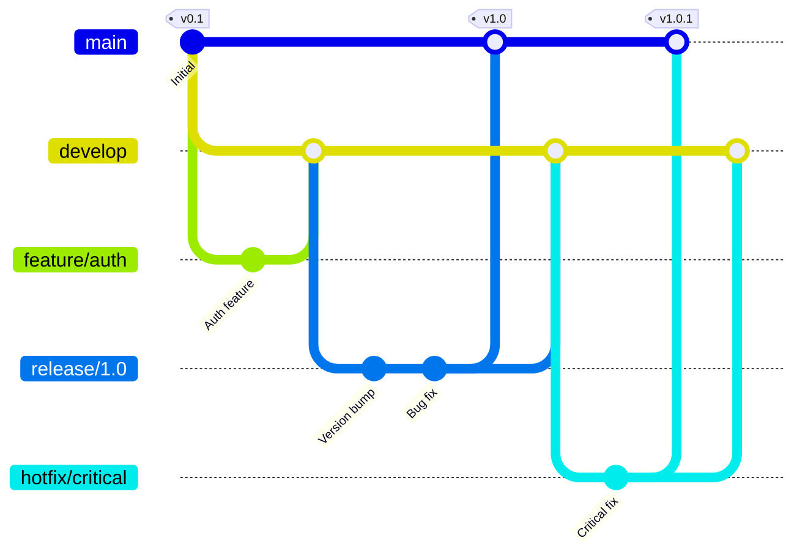
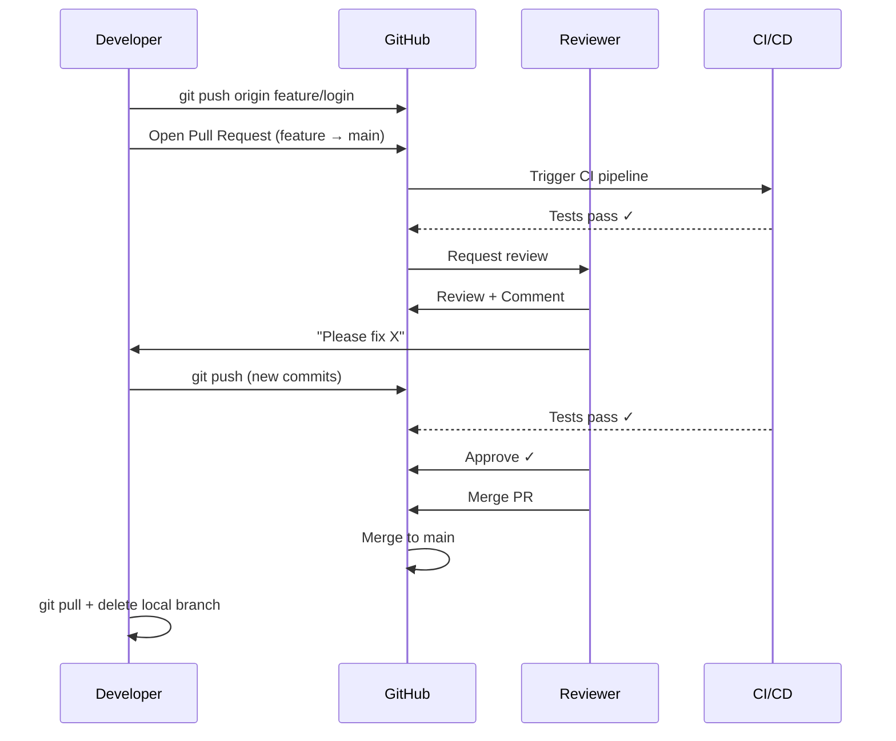

# 21 — Branching, Merging, Conflicts & Git Best Practices

> **[← Git Commands](20_Git_Commands.md)** | **[Index](00_INDEX.md)**

---

## Branches

A **branch** is a lightweight, movable pointer to a commit. Creating a branch is nearly instant in Git because it's just a 41-byte file containing a commit hash.

### Branch Commands

```bash
# Create branches
git branch feature-login        # Create branch (don't switch)
git checkout -b feature-login   # Create AND switch (old syntax)
git switch -c feature-login     # Create AND switch (modern syntax)
git branch feature-login main   # Create branch off specific branch

# Switch branches
git checkout main               # Switch (old)
git switch main                 # Switch (modern, clearer)
git switch -                    # Switch to previous branch

# List branches
git branch                      # Local branches
git branch -r                   # Remote tracking branches
git branch -a                   # All (local + remote)
git branch -v                   # With last commit info
git branch --merged             # Branches merged into current
git branch --no-merged          # Branches NOT merged

# Rename branch
git branch -m old-name new-name         # Rename local branch
git push origin --delete old-name       # Delete old remote name
git push -u origin new-name             # Push new name

# Delete branches
git branch -d feature-login     # Delete (safe — warns if unmerged)
git branch -D feature-login     # Force delete (even if unmerged)
git push origin --delete feature-login  # Delete remote branch

# Track remote branch
git branch --track feature origin/feature
git checkout --track origin/feature    # Create local + track remote
```

---

## Branching Strategies

### Feature Branch Workflow (Most Common)



### Git Flow (Formal Release Strategy)



| Branch | Purpose | Merges Into |
|--------|---------|-------------|
| `main` | Production-ready code | — |
| `develop` | Integration branch | `main` (via release) |
| `feature/*` | New features | `develop` |
| `release/*` | Release preparation | `main` + `develop` |
| `hotfix/*` | Production bug fixes | `main` + `develop` |

### Trunk-Based Development (Modern / CI-CD)

```
All developers commit to main (or short-lived branches < 2 days)
Use feature flags to hide incomplete features
Requires strong CI/CD and test automation
```

---

## Merging

### `git merge` — Combine Branches

```bash
# Always merge INTO the target branch
git switch main                 # Switch to branch you're merging INTO
git merge feature-login         # Merge feature-login INTO main

# Options
git merge --no-ff feature       # Force merge commit (no fast-forward)
git merge --squash feature      # Squash all commits into one staged change
git merge --abort               # Abort merge in progress

# After squash merge:
git commit -m "Add feature (squashed from feature branch)"
```

### Fast-Forward vs Three-Way Merge

#### Fast-Forward (no divergence)

```
Before:
  main:    A ── B
  feature:       └── C ── D

After git merge feature (fast-forward):
  main:    A ── B ── C ── D
  (HEAD just moves forward — no merge commit created)
```

```bash
git merge feature               # Fast-forward (default when possible)
git merge --no-ff feature       # Disable FF — always create merge commit
```

#### Three-Way Merge (branches diverged)

```
Before:
  main:    A ── B ── C
                \
  feature:        D ── E

After git merge feature (three-way):
  main:    A ── B ── C ── M
                \        /
  feature:        D ── E
  (M = merge commit with two parents)
```

---

## Merge Conflicts

A **merge conflict** occurs when two branches modify the same lines of the same file differently, and Git cannot automatically decide which change to keep.

### When Do Conflicts Happen?

```
main branch:    "color: blue"
feature branch: "color: red"
→ Conflict! Git doesn't know which color you want.

main branch:    "color: blue"
feature branch: Added new line below (no overlap)
→ No conflict. Git auto-merges.
```

### Conflict Markers

When a conflict occurs, Git marks the file with **conflict markers**:

```
<<<<<<< HEAD                          ← Start of YOUR changes (current branch)
color: blue;                          ← Your version
font-size: 14px;
=======                               ← Separator
color: red;                           ← THEIR version (merging branch)
font-size: 16px;
>>>>>>> feature/new-design            ← End of THEIR changes
```

### Resolving Conflicts — Step by Step

```bash
# Step 1: Git tells you there's a conflict
git merge feature-branch
# Auto-merging style.css
# CONFLICT (content): Merge conflict in style.css
# Automatic merge failed; fix conflicts and then commit the result.

# Step 2: See which files have conflicts
git status
# Both modified: style.css

# Step 3: Open conflicted file(s)
# Find all <<<<<<< markers
grep -n "<<<<<<" style.css

# Step 4: Edit the file — choose/combine the right content
# Remove the markers (<<<<<<, =======, >>>>>>>) and keep what you want:
# Option A: Keep yours:    color: blue;   font-size: 14px;
# Option B: Keep theirs:   color: red;    font-size: 16px;
# Option C: Combine:       color: blue;   font-size: 16px;  ← best

# Step 5: Mark as resolved
git add style.css

# Step 6: Check no more conflicts
git status                      # All resolved?

# Step 7: Complete the merge
git commit                      # Git pre-fills the merge commit message

# Alternative: Abort the merge entirely
git merge --abort               # Back to state before merge started
```

### Conflict Resolution Tools

```bash
# Built-in merge tool
git mergetool                   # Opens configured tool for each conflict
git config --global merge.tool vimdiff    # Set tool
git config --global merge.tool vscode

# VS Code setup
git config --global merge.tool vscode
git config --global mergetool.vscode.cmd 'code --wait $MERGED'

# Common merge tools
# vimdiff, kdiff3, meld, p4merge, Beyond Compare, VS Code
```

### Using `git checkout` to Accept One Side

```bash
# Accept our version entirely (throw away theirs)
git checkout --ours style.css
git add style.css

# Accept their version entirely (throw away ours)
git checkout --theirs style.css
git add style.css
```

---

## Rebasing

`git rebase` re-applies commits on top of another branch — creating a **linear history**.

### Merge vs Rebase

```
Merge:
  main:    A ── B ── C ── M
                \        /
  feature:        D ── E
  (preserves history, adds merge commit)

Rebase:
  main:    A ── B ── C ── D' ── E'
  (replays D, E on top of C, rewrites commit hashes)
  (clean linear history, no merge commit)
```

```bash
# Rebase feature onto main (while on feature branch)
git switch feature
git rebase main

# Interactive rebase — rewrite/squash/reorder commits
git rebase -i HEAD~3            # Interactive rebase of last 3 commits
git rebase -i main              # Interactive rebase of commits not in main

# Inside interactive rebase (text editor opens):
# pick a1b2c3 Add login form       ← keep as-is
# squash d4e5f6 Fix typo           ← squash into previous commit
# reword g7h8i9 Add auth token     ← keep commit, edit message
# drop j1k2l3 Temporary debug     ← remove commit entirely
# fixup m4n5o6 Minor fix           ← squash, discard message

# Abort rebase
git rebase --abort

# Continue after resolving conflict
git rebase --continue

# Skip conflicting commit
git rebase --skip
```

### ⚠️ The Golden Rule of Rebasing

> **Never rebase commits that have been pushed to a shared branch.**

Rebasing rewrites commit hashes. If others have pulled those commits, their history diverges from yours — causing confusion and painful conflicts.

```
Safe to rebase:  local-only feature branches
Safe to rebase:  your private branch before opening a PR
Never rebase:    main, develop, or any shared branch
```

---

## Cherry-Picking

Apply a specific commit from one branch to another:

```bash
git cherry-pick a1b2c3d         # Apply commit to current branch
git cherry-pick a1b2c3 d4e5f6  # Multiple commits
git cherry-pick main..feature   # Range of commits
git cherry-pick --no-commit a1b2c3  # Apply changes, don't auto-commit
git cherry-pick --abort         # Abort if conflict
git cherry-pick --continue      # Continue after resolving conflict
```

**Use case:** A bug was fixed in `develop` but you need it in `main` immediately without merging all of `develop`.

---

## Pull Requests / Merge Requests

A **Pull Request (PR)** (GitHub) / **Merge Request (MR)** (GitLab) is a request to merge one branch into another — with a review process.



---

## Git Best Practices

### Commit Practices

```
✓ Commit early, commit often — small atomic commits
✓ Write meaningful commit messages (imperative, present tense)
✓ One logical change per commit
✓ Test before committing (at minimum: it builds)
✓ Reference issue numbers: "Fix login redirect (#123)"

✗ "fix" / "update" / "changes" / "asdf"
✗ Committing broken/untested code to shared branches
✗ Committing secrets, API keys, passwords
✗ Giant commits with unrelated changes
```

### Commit Message Format

```
<type>(<scope>): <subject>    ← 50 chars max, imperative

[optional body]               ← 72 chars per line, explain WHY

[optional footer]             ← Closes #42, Breaking change: ...

Types (Conventional Commits):
  feat:     New feature
  fix:      Bug fix
  docs:     Documentation
  style:    Formatting (no code change)
  refactor: Code restructure (no feature/fix)
  test:     Add/fix tests
  chore:    Build scripts, tooling
  perf:     Performance improvement
  ci:       CI configuration

Examples:
  feat(auth): add JWT refresh token support
  fix(api): handle null response from payment gateway
  docs(readme): update installation instructions
  chore(deps): upgrade express to 4.18.2
```

### Branch Practices

```
✓ Use descriptive branch names:
    feature/user-authentication
    fix/login-redirect-bug
    chore/upgrade-dependencies
    hotfix/critical-security-patch

✓ Keep branches short-lived (merge within days, not weeks)
✓ Delete merged branches
✓ Keep main/master always deployable
✓ Protect main branch — require PR + review
✓ Regularly pull from main to avoid divergence
```

### Security Practices

```
✗ NEVER commit secrets to Git — even to private repos
✗ Even deleted secrets can be recovered from history

✓ Use .gitignore for .env files
✓ Use environment variables for secrets
✓ If you accidentally commit a secret:
    1. Rotate/invalidate the secret immediately
    2. Use git-filter-repo or BFG Repo Cleaner to remove it
    3. Force push (alert collaborators)
    4. Treat the old secret as compromised

# Check for secrets before commit
git diff --staged | grep -E "(password|secret|api_key|token)" 
```

### .gitignore Best Practices

```
✓ Add .gitignore before first commit
✓ Use gitignore.io to generate for your stack
✓ Ignore build artifacts, dependencies, IDE files, secrets
✓ Don't ignore compiled output if it's part of the release
```

### Collaboration Practices

```
✓ Pull before you push (avoid unnecessary merge commits)
✓ Use feature branches — never commit directly to main
✓ Keep PRs focused and small (easier to review)
✓ Review your own diff before opening a PR
✓ Respond to code review feedback promptly
✓ Write descriptive PR descriptions
✓ Link PRs to issues
✓ Squash messy/WIP commits before merging
```

---

## Common Git Workflows Reference

```bash
# Start a new feature
git switch main
git pull
git switch -c feature/my-feature

# Work on feature
# ... edit files ...
git add .
git commit -m "feat: add initial feature structure"
# ... more edits ...
git add -p                          # Stage selectively
git commit -m "feat: implement core logic"

# Keep up with main while developing
git fetch origin
git rebase origin/main              # Rebase onto latest main

# Ready to merge — clean up commits
git rebase -i origin/main           # Squash/reorder if needed

# Push and open PR
git push -u origin feature/my-feature

# After PR is merged — cleanup
git switch main
git pull
git branch -d feature/my-feature    # Delete local branch
git remote prune origin             # Clean remote tracking refs
```

---

## Quick Reference Cheat Sheet

```bash
# Setup
git config --global user.name "Name"
git config --global user.email "email"

# Start
git init                       # New repo
git clone <url>                # Clone existing

# Daily workflow
git status                     # Check state
git pull                       # Get latest
git add .                      # Stage all
git commit -m "message"        # Commit
git push                       # Push

# Branches
git switch -c feature          # Create + switch
git switch main                # Switch
git merge feature              # Merge into current
git branch -d feature          # Delete after merge

# Undo
git restore --staged file      # Unstage
git restore file               # Discard changes
git reset --soft HEAD~1        # Undo commit, keep staged
git revert HEAD                # Safe undo (new commit)

# Inspect
git log --oneline --graph      # Pretty log
git diff                       # Unstaged changes
git blame file                 # Who wrote each line
git stash                      # Save WIP

# Remote
git remote -v                  # Show remotes
git fetch                      # Download (no merge)
git pull                       # Fetch + merge
git push -u origin branch      # Push + set upstream
```

---

## Related Topics

- [Git Fundamentals ←](19_Git_Fundamentals.md) — concepts, object model
- [Git Commands ←](20_Git_Commands.md) — command reference
- [Cloud & Remote Access ←](17_Cloud_Remote_Access.md) — SSH for GitHub
- [Troubleshooting ←](18_Troubleshooting.md) — debugging git issues

---

> [← Git Commands](20_Git_Commands.md) | [Index](00_INDEX.md)
