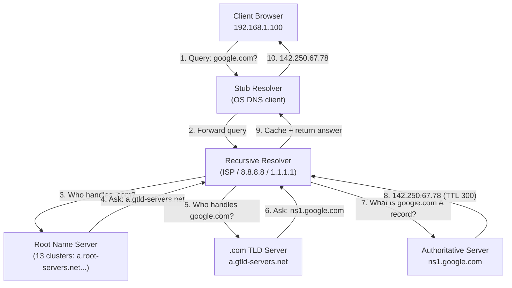
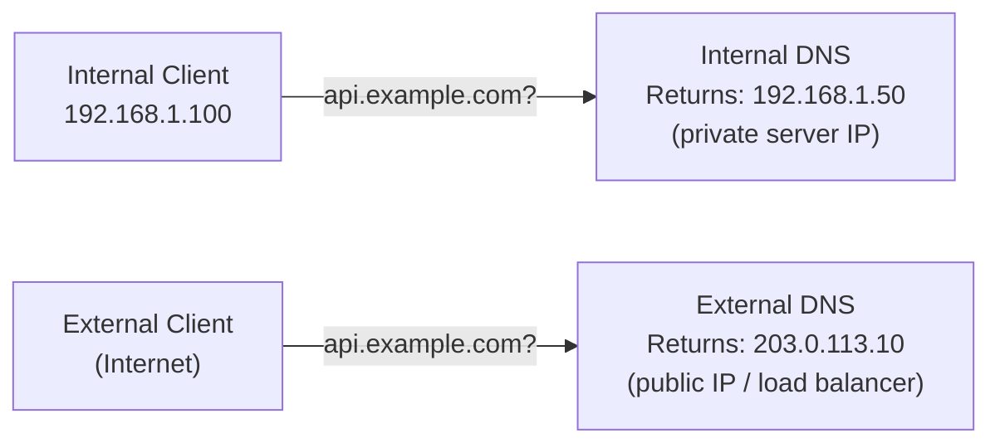

# 22 — DNS Deep Dive

> **[← Index](00_INDEX.md)** | **Related: [Networking Fundamentals](07_Networking_Fundamentals.md) · [Networking Tools](08_Networking_Tools.md) · [Active Directory](09_Active_Directory.md)**

---

## DNS Architecture — Full Picture



---

## DNS Record Types — Complete Reference

| Record | Full Name | Purpose | Example |
|--------|-----------|---------|---------|
| **A** | Address | Hostname → IPv4 | `example.com. 300 IN A 93.184.216.34` |
| **AAAA** | IPv6 Address | Hostname → IPv6 | `example.com. 300 IN AAAA 2606:2800::1` |
| **CNAME** | Canonical Name | Alias to another hostname | `www.example.com. CNAME example.com.` |
| **MX** | Mail Exchanger | Mail server for domain | `example.com. MX 10 mail.example.com.` |
| **NS** | Name Server | Authoritative DNS for domain | `example.com. NS ns1.example.com.` |
| **PTR** | Pointer | Reverse DNS: IP → hostname | `34.216.184.93.in-addr.arpa. PTR example.com.` |
| **TXT** | Text | Arbitrary text (SPF, DKIM, verify) | `example.com. TXT "v=spf1 include:..."` |
| **SOA** | Start of Authority | Zone metadata | Serial, refresh, retry, expire, TTL |
| **SRV** | Service | Service location + port | `_sip._tcp.example.com. SRV 10 60 5060 sip.example.com.` |
| **CAA** | CA Authorization | Which CAs can issue certs | `example.com. CAA 0 issue "letsencrypt.org"` |
| **DNSKEY** | DNS Key | DNSSEC public key | Zone signing key |
| **DS** | Delegation Signer | DNSSEC chain of trust | Links parent zone to child |

---

## Zone Files

A **zone file** is a text file that defines DNS records for a domain. Format: RFC 1035.

```bash
# /etc/bind/zones/example.com.zone

$ORIGIN example.com.        ; Default domain suffix
$TTL 3600                   ; Default TTL (1 hour)

; SOA Record — required, must be first
@   IN  SOA  ns1.example.com.  admin.example.com. (
            2024042201  ; Serial (YYYYMMDDnn — increment on change)
            3600        ; Refresh (how often secondaries check)
            900         ; Retry (if refresh fails)
            604800      ; Expire (secondary stops answering)
            300         ; Negative TTL (NXDOMAIN caching)
)

; Name Servers
@           IN  NS      ns1.example.com.
@           IN  NS      ns2.example.com.

; A Records (IPv4)
@           IN  A       93.184.216.34       ; example.com itself
ns1         IN  A       93.184.216.10
ns2         IN  A       93.184.216.11
www         IN  A       93.184.216.34
mail        IN  A       93.184.216.50
ftp         IN  A       93.184.216.55

; AAAA Records (IPv6)
@           IN  AAAA    2606:2800:220:1:248:1893:25c8:1946
www         IN  AAAA    2606:2800:220:1:248:1893:25c8:1946

; CNAME Records (alias)
blog        IN  CNAME   www.example.com.    ; blog.example.com → www
shop        IN  CNAME   shops.myplatform.com.

; MX Records (mail, lower priority number = higher priority)
@           IN  MX  10  mail.example.com.
@           IN  MX  20  mail2.example.com.

; TXT Records
@           IN  TXT     "v=spf1 ip4:93.184.216.0/24 include:sendgrid.net ~all"
_dmarc      IN  TXT     "v=DMARC1; p=reject; rua=mailto:dmarc@example.com"

; SRV Record (format: priority weight port target)
_sip._tcp   IN  SRV  10 60 5060 sip.example.com.

; CAA Record
@           IN  CAA  0  issue "letsencrypt.org"
@           IN  CAA  0  issuewild "letsencrypt.org"
```

---

## Reverse DNS Zones (PTR Records)

Reverse DNS maps IP addresses back to hostnames. Used in email validation, logging, and security.

```bash
# /etc/bind/zones/216.184.93.in-addr.arpa.zone
# For the 93.184.216.0/24 subnet

$ORIGIN 216.184.93.in-addr.arpa.
$TTL 3600

@   IN  SOA  ns1.example.com.  admin.example.com. (
            2024042201
            3600
            900
            604800
            300
)

@       IN  NS  ns1.example.com.
@       IN  NS  ns2.example.com.

; PTR Records (last octet only, because $ORIGIN handles the rest)
34      IN  PTR  example.com.
10      IN  PTR  ns1.example.com.
11      IN  PTR  ns2.example.com.
50      IN  PTR  mail.example.com.
```

```bash
# Test reverse lookup
dig -x 93.184.216.34
nslookup 93.184.216.34
host 93.184.216.34
```

---

## BIND9 — Linux DNS Server

**BIND** (Berkeley Internet Name Domain) is the most widely used DNS server software.

### Installation

```bash
sudo apt install bind9 bind9utils bind9-doc   # Debian/Ubuntu
sudo dnf install bind bind-utils               # RHEL/CentOS
sudo pacman -S bind                            # Arch Linux
```

### Main Configuration Files

```
/etc/bind/
├── named.conf                  ← Main config (includes others)
├── named.conf.options          ← Global options
├── named.conf.local            ← Your zones
├── named.conf.default-zones    ← Built-in zones (localhost, etc.)
└── zones/
    ├── example.com.zone        ← Forward zone file
    └── 216.184.93.in-addr.arpa.zone  ← Reverse zone file
```

### `named.conf.options`

```
options {
    directory "/var/cache/bind";

    // Forwarders — upstream DNS to use when we don't know
    forwarders {
        8.8.8.8;
        1.1.1.1;
    };

    // Allow recursive queries only from trusted networks
    allow-recursion {
        127.0.0.1;
        192.168.1.0/24;
        10.0.0.0/8;
    };

    // Allow queries from these networks
    allow-query { any; };

    // DNSSEC validation
    dnssec-validation auto;

    listen-on { any; };
    listen-on-v6 { any; };
};
```

### `named.conf.local` — Declare Zones

```
// Forward zone
zone "example.com" {
    type master;
    file "/etc/bind/zones/example.com.zone";
    allow-transfer { 93.184.216.11; };   // Secondary NS IP
    notify yes;
};

// Reverse zone
zone "216.184.93.in-addr.arpa" {
    type master;
    file "/etc/bind/zones/216.184.93.in-addr.arpa.zone";
};

// Secondary zone (slave)
zone "other.com" {
    type slave;
    masters { 10.0.0.1; };
    file "/var/cache/bind/other.com.zone";
};
```

### Managing BIND

```bash
# Start/enable
sudo systemctl start named
sudo systemctl enable named

# Check config syntax before restarting
sudo named-checkconf
sudo named-checkzone example.com /etc/bind/zones/example.com.zone

# Reload zones without full restart
sudo rndc reload
sudo rndc reload example.com        # Reload specific zone

# Flush DNS cache
sudo rndc flush

# Status
sudo rndc status
sudo systemctl status named

# View BIND logs
sudo journalctl -u named -f
tail -f /var/log/named/named.log
```

---

## Windows DNS Server

```powershell
# Install DNS Server role
Install-WindowsFeature -Name DNS -IncludeManagementTools

# Manage with PowerShell
Import-Module DnsServer

# Zones
Get-DnsServerZone
Add-DnsServerPrimaryZone -Name "example.com" -ZoneFile "example.com.dns"
Add-DnsServerSecondaryZone -Name "example.com" -ZoneFile "example.com.dns" -MasterServers 10.0.0.1

# Records
Get-DnsServerResourceRecord -ZoneName "example.com"
Add-DnsServerResourceRecordA -ZoneName "example.com" -Name "www" -IPv4Address "93.184.216.34"
Add-DnsServerResourceRecordCName -ZoneName "example.com" -Name "blog" -HostNameAlias "www.example.com"
Add-DnsServerResourceRecordMx -ZoneName "example.com" -Name "@" -MailExchange "mail.example.com" -Preference 10
Remove-DnsServerResourceRecord -ZoneName "example.com" -Name "www" -RRType "A" -Force

# Flush cache
Clear-DnsServerCache
# Client-side flush
Clear-DnsClientCache          # PowerShell
ipconfig /flushdns            # CMD
```

---

## Split-Horizon DNS (Split-Brain)

Different DNS answers are returned depending on **where the query comes from** — internal users get private IPs, external users get public IPs.



```bash
# BIND split-horizon using views
view "internal" {
    match-clients { 192.168.1.0/24; 10.0.0.0/8; };
    zone "example.com" {
        type master;
        file "/etc/bind/zones/example.com.internal.zone";
    };
};

view "external" {
    match-clients { any; };
    zone "example.com" {
        type master;
        file "/etc/bind/zones/example.com.external.zone";
    };
};
```

---

## Email DNS Records — SPF, DKIM, DMARC

### SPF — Sender Policy Framework

Specifies which mail servers are authorized to send email for your domain.

```
example.com.  TXT  "v=spf1 ip4:93.184.216.50 include:sendgrid.net include:mailchimp.com ~all"

Mechanisms:
  ip4:x.x.x.x     → Specific IPv4 address
  ip6:xxxx::       → Specific IPv6 address
  include:domain   → Trust domain's SPF record
  a                → Trust domain's A record IP
  mx               → Trust domain's MX record IPs
  all              → Match everything (use as last rule)

Qualifiers:
  +all   → Pass (allow) — dangerous, allow all
  -all   → Fail (reject) — strict
  ~all   → SoftFail — accept but mark suspicious
  ?all   → Neutral — no policy
```

### DKIM — DomainKeys Identified Mail

Cryptographically signs outgoing email. Receiver can verify the signature.

```
# DKIM TXT record
selector._domainkey.example.com.  TXT  "v=DKIM1; k=rsa; p=MIGfMA0GCSqGSIb3DQEBA..."
                                                                          ↑ Public key

# Generate DKIM keys (Postfix + opendkim)
sudo apt install opendkim opendkim-tools
opendkim-genkey -t -s mail -d example.com
# Creates: mail.private (keep secret on server)
#          mail.txt     (add to DNS as TXT record)
```

### DMARC — Domain-based Message Auth, Reporting & Conformance

Tells receivers what to do when SPF/DKIM fails.

```
_dmarc.example.com.  TXT  "v=DMARC1; p=reject; pct=100; rua=mailto:dmarc@example.com; ruf=mailto:forensics@example.com; adkim=s; aspf=s"

p=none      → Monitor only (don't reject) — start here
p=quarantine → Send to spam
p=reject    → Reject the email

pct=100     → Apply policy to 100% of failing mail
rua=        → Aggregate reports destination
ruf=        → Forensic (per-failure) reports
adkim=s     → DKIM strict alignment
aspf=s      → SPF strict alignment
```

---

## DNS Troubleshooting

```bash
# Test full resolution path
dig +trace example.com

# Test specific record types
dig example.com A
dig example.com MX
dig example.com TXT
dig example.com NS
dig example.com SOA

# Query specific DNS server
dig @8.8.8.8 example.com
dig @ns1.example.com example.com

# Check reverse DNS
dig -x 93.184.216.34
host 93.184.216.34

# Check propagation (compare multiple resolvers)
dig @8.8.8.8 example.com A +short
dig @1.1.1.1 example.com A +short
dig @9.9.9.9 example.com A +short

# Verify SPF
dig example.com TXT | grep spf

# Verify DKIM
dig mail._domainkey.example.com TXT

# Verify DMARC
dig _dmarc.example.com TXT

# Check DNS from Windows
Resolve-DnsName example.com
Resolve-DnsName example.com -Type MX
Resolve-DnsName example.com -Server 8.8.8.8

# Common issues
# NXDOMAIN  = domain doesn't exist (check spelling, zone file)
# SERVFAIL  = server error (check named logs)
# REFUSED   = server won't answer (check allow-recursion)
# TIMEOUT   = no response (firewall, server down, UDP 53 blocked)
```

---

## TTL — Time To Live

TTL controls how long DNS responses are cached.

```
High TTL (86400 = 24h):
  ✓ Less DNS query load
  ✓ Faster responses (cached)
  ✗ Changes take 24h to propagate

Low TTL (300 = 5min):
  ✓ Changes propagate quickly
  ✗ More DNS queries, more load

Best practice:
  Normal operation: 3600 (1 hour)
  Before planned IP change: lower to 300 (5 min) a day ahead
  After change confirmed: raise back to 3600
```

---

## Related Topics

- [Networking Fundamentals ←](07_Networking_Fundamentals.md)
- [Networking Tools ←](08_Networking_Tools.md) — dig, nslookup
- [Active Directory ←](09_Active_Directory.md) — AD DNS integration
- [SSL/TLS & Certificates →](26_SSL_TLS_Certificates.md)
- [Email / Mail Servers →](30_Docker_Containers.md)

---

> [Index](00_INDEX.md)
