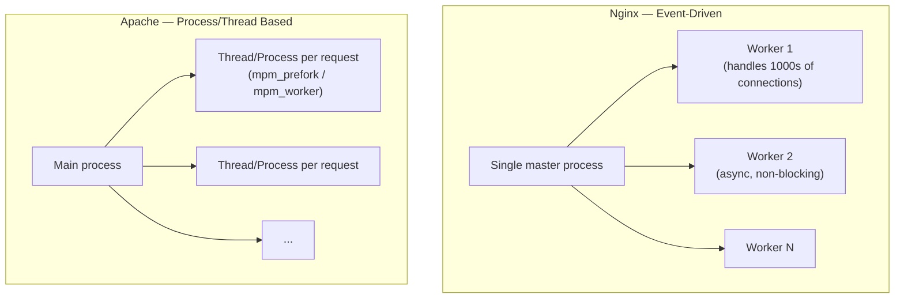

# 25 — Web Servers: Nginx & Apache

> **[← Index](00_INDEX.md)** | **Related: [Networking Fundamentals](07_Networking_Fundamentals.md) · [SSL/TLS](26_SSL_TLS_Certificates.md) · [IIS](10_IIS.md) · [Security Concepts](14_Security_Concepts.md)**

---

## Nginx vs Apache — Overview



| Feature | Nginx | Apache |
|---------|-------|--------|
| Architecture | Async, event-driven | Process/thread per connection |
| Performance | Excellent for static files + high concurrency | Good, less efficient under high load |
| Config style | Block-based, declarative | Directive-based, per-directory (.htaccess) |
| .htaccess | ❌ Not supported | ✅ Supported |
| Dynamic content | Via proxy (PHP-FPM, upstream) | Via modules (mod_php) |
| Modules | Compiled-in or dynamic | Load at runtime |
| Reverse proxy | Excellent | Good |
| Use case | High-traffic, microservices, CDN edge | Shared hosting, .htaccess-dependent apps |

---

## Nginx

### Installation

```bash
# Debian/Ubuntu
sudo apt install nginx
sudo systemctl start nginx
sudo systemctl enable nginx

# Arch Linux
sudo pacman -S nginx
sudo systemctl start nginx

# Verify
nginx -v
curl -I http://localhost
```

### Directory Structure

```
/etc/nginx/
├── nginx.conf              ← Main configuration file
├── conf.d/                 ← Additional configs (auto-included)
│   └── default.conf
├── sites-available/        ← Virtual host configs (Ubuntu convention)
│   ├── example.com
│   └── api.example.com
├── sites-enabled/          ← Symlinks to sites-available (active sites)
│   └── example.com -> ../sites-available/example.com
├── snippets/               ← Reusable config fragments
│   └── ssl-params.conf
└── modules-enabled/        ← Dynamic modules

/var/log/nginx/
├── access.log
└── error.log

/var/www/
└── html/                   ← Default web root
```

### `nginx.conf` — Main Configuration

```nginx
# /etc/nginx/nginx.conf

user www-data;
worker_processes auto;          # One worker per CPU core
pid /run/nginx.pid;

events {
    worker_connections 1024;    # Max connections per worker
    multi_accept on;            # Accept multiple connections at once
    use epoll;                  # Linux: use epoll for best performance
}

http {
    # MIME types
    include /etc/nginx/mime.types;
    default_type application/octet-stream;

    # Logging format
    log_format main '$remote_addr - $remote_user [$time_local] '
                    '"$request" $status $body_bytes_sent '
                    '"$http_referer" "$http_user_agent"';

    access_log /var/log/nginx/access.log main;
    error_log  /var/log/nginx/error.log warn;

    # Performance
    sendfile on;                # Efficient file serving
    tcp_nopush on;              # Send headers in one packet
    tcp_nodelay on;
    keepalive_timeout 65;       # Keep connection alive 65s
    gzip on;                    # Enable gzip compression
    gzip_types text/plain text/css application/json application/javascript;
    gzip_min_length 1024;

    # Security
    server_tokens off;          # Hide nginx version
    client_max_body_size 20M;   # Max upload size

    # Include virtual hosts
    include /etc/nginx/conf.d/*.conf;
    include /etc/nginx/sites-enabled/*;
}
```

### Virtual Host — Static Website

```nginx
# /etc/nginx/sites-available/example.com

server {
    listen 80;
    listen [::]:80;                     # IPv6
    server_name example.com www.example.com;

    root /var/www/example.com/html;
    index index.html index.htm;

    # Logging
    access_log /var/log/nginx/example.com.access.log;
    error_log  /var/log/nginx/example.com.error.log;

    location / {
        try_files $uri $uri/ =404;
    }

    # Cache static assets
    location ~* \.(jpg|jpeg|png|gif|ico|css|js|woff2)$ {
        expires 30d;
        add_header Cache-Control "public, immutable";
    }

    # Custom error pages
    error_page 404 /404.html;
    error_page 500 502 503 504 /50x.html;
    location = /50x.html {
        root /usr/share/nginx/html;
    }
}
```

### Virtual Host — HTTPS (with SSL)

```nginx
# /etc/nginx/sites-available/example.com (full HTTPS config)

# Redirect HTTP → HTTPS
server {
    listen 80;
    listen [::]:80;
    server_name example.com www.example.com;
    return 301 https://$host$request_uri;
}

# HTTPS server
server {
    listen 443 ssl http2;
    listen [::]:443 ssl http2;
    server_name example.com www.example.com;

    # SSL certificates
    ssl_certificate     /etc/letsencrypt/live/example.com/fullchain.pem;
    ssl_certificate_key /etc/letsencrypt/live/example.com/privkey.pem;
    include             /etc/nginx/snippets/ssl-params.conf;

    root /var/www/example.com/html;
    index index.html;

    # Security headers
    add_header Strict-Transport-Security "max-age=63072000; includeSubDomains; preload" always;
    add_header X-Frame-Options SAMEORIGIN always;
    add_header X-Content-Type-Options nosniff always;
    add_header X-XSS-Protection "1; mode=block" always;
    add_header Referrer-Policy "no-referrer-when-downgrade" always;
    add_header Content-Security-Policy "default-src 'self';" always;

    location / {
        try_files $uri $uri/ =404;
    }
}
```

### Nginx as Reverse Proxy

```nginx
# /etc/nginx/sites-available/api.example.com

upstream backend {
    server 127.0.0.1:3000;
    server 127.0.0.1:3001;          # Load balance across two instances
    server 127.0.0.1:3002;
    keepalive 32;                    # Keep upstream connections alive
}

server {
    listen 443 ssl http2;
    server_name api.example.com;

    ssl_certificate     /etc/letsencrypt/live/api.example.com/fullchain.pem;
    ssl_certificate_key /etc/letsencrypt/live/api.example.com/privkey.pem;

    location / {
        proxy_pass         http://backend;
        proxy_http_version 1.1;
        proxy_set_header   Upgrade $http_upgrade;
        proxy_set_header   Connection 'upgrade';
        proxy_set_header   Host $host;
        proxy_set_header   X-Real-IP $remote_addr;
        proxy_set_header   X-Forwarded-For $proxy_add_x_forwarded_for;
        proxy_set_header   X-Forwarded-Proto $scheme;
        proxy_cache_bypass $http_upgrade;
        proxy_read_timeout 90s;
        proxy_connect_timeout 90s;
    }

    # WebSocket support
    location /ws/ {
        proxy_pass http://backend;
        proxy_http_version 1.1;
        proxy_set_header Upgrade $http_upgrade;
        proxy_set_header Connection "upgrade";
    }
}
```

### Nginx — PHP-FPM (Laravel / WordPress)

```nginx
server {
    listen 80;
    server_name myapp.example.com;
    root /var/www/myapp/public;

    index index.php index.html;

    # Laravel-style routing
    location / {
        try_files $uri $uri/ /index.php?$query_string;
    }

    # PHP-FPM
    location ~ \.php$ {
        include snippets/fastcgi-php.conf;
        fastcgi_pass unix:/var/run/php/php8.2-fpm.sock;
        fastcgi_param SCRIPT_FILENAME $realpath_root$fastcgi_script_name;
        include fastcgi_params;
    }

    # Block access to sensitive files
    location ~ /\.(?!well-known).* {
        deny all;
    }

    # Block access to .env
    location ~ /\.env {
        deny all;
    }
}
```

### Nginx Management Commands

```bash
# Test config (always before reload)
sudo nginx -t
sudo nginx -T                   # Test + print full merged config

# Reload without downtime
sudo nginx -s reload            # Send reload signal
sudo systemctl reload nginx     # Same via systemd

# Restart, start, stop
sudo systemctl restart nginx
sudo systemctl start nginx
sudo systemctl stop nginx

# Enable site (Ubuntu)
sudo ln -s /etc/nginx/sites-available/example.com /etc/nginx/sites-enabled/
sudo nginx -t && sudo nginx -s reload

# View logs
sudo tail -f /var/log/nginx/access.log
sudo tail -f /var/log/nginx/error.log
sudo journalctl -u nginx -f

# Check nginx status
sudo nginx -V                   # Version + compile flags
```

---

## Apache HTTP Server

### Installation

```bash
sudo apt install apache2
sudo systemctl start apache2
sudo systemctl enable apache2

# Enable modules
sudo a2enmod rewrite ssl proxy proxy_http headers
sudo systemctl restart apache2
```

### Directory Structure

```
/etc/apache2/
├── apache2.conf            ← Main config
├── ports.conf              ← Port definitions
├── mods-available/         ← Available modules
├── mods-enabled/           ← Enabled modules (symlinks)
├── sites-available/
│   ├── 000-default.conf    ← Default site
│   └── example.com.conf
├── sites-enabled/
│   └── example.com.conf -> ../sites-available/example.com.conf
└── conf-available/

/var/www/html/              ← Default web root
/var/log/apache2/
├── access.log
└── error.log
```

### Virtual Host Configuration

```apache
# /etc/apache2/sites-available/example.com.conf

<VirtualHost *:80>
    ServerName example.com
    ServerAlias www.example.com
    DocumentRoot /var/www/example.com/html

    <Directory /var/www/example.com/html>
        Options -Indexes +FollowSymLinks
        AllowOverride All                # Enable .htaccess
        Require all granted
    </Directory>

    ErrorLog  ${APACHE_LOG_DIR}/example.com-error.log
    CustomLog ${APACHE_LOG_DIR}/example.com-access.log combined

    # Redirect HTTP → HTTPS
    Redirect permanent / https://example.com/
</VirtualHost>

<VirtualHost *:443>
    ServerName example.com
    ServerAlias www.example.com
    DocumentRoot /var/www/example.com/html

    SSLEngine on
    SSLCertificateFile    /etc/letsencrypt/live/example.com/cert.pem
    SSLCertificateKeyFile /etc/letsencrypt/live/example.com/privkey.pem
    SSLCertificateChainFile /etc/letsencrypt/live/example.com/chain.pem

    Header always set Strict-Transport-Security "max-age=63072000"

    <Directory /var/www/example.com/html>
        Options -Indexes +FollowSymLinks
        AllowOverride All
        Require all granted
    </Directory>
</VirtualHost>
```

### Apache Reverse Proxy

```apache
# Enable modules first:
# sudo a2enmod proxy proxy_http proxy_balancer lbmethod_byrequests

<VirtualHost *:443>
    ServerName api.example.com

    SSLEngine on
    SSLCertificateFile    /etc/letsencrypt/live/api.example.com/cert.pem
    SSLCertificateKeyFile /etc/letsencrypt/live/api.example.com/privkey.pem

    ProxyPreserveHost On
    ProxyRequests Off

    <Proxy balancer://backend>
        BalancerMember http://127.0.0.1:3000
        BalancerMember http://127.0.0.1:3001
        ProxySet lbmethod=byrequests
    </Proxy>

    ProxyPass        / balancer://backend/
    ProxyPassReverse / balancer://backend/

    RequestHeader set X-Forwarded-Proto "https"
    RequestHeader set X-Forwarded-For %{REMOTE_ADDR}s
</VirtualHost>
```

### `.htaccess` — Per-Directory Config

```apache
# Laravel / URL rewriting
<IfModule mod_rewrite.c>
    <IfModule mod_negotiation.c>
        Options -MultiViews -Indexes
    </IfModule>

    RewriteEngine On

    # Redirect Trailing Slashes
    RewriteRule ^(.*)/$ /$1 [L,R=301]

    # Send all requests through index.php
    RewriteCond %{REQUEST_FILENAME} !-d
    RewriteCond %{REQUEST_FILENAME} !-f
    RewriteRule ^ index.php [L]
</IfModule>

# Block access to sensitive files
<FilesMatch "(\.env|composer\.lock|package\.json)$">
    Require all denied
</FilesMatch>

# Password protect a directory
AuthType Basic
AuthName "Restricted Area"
AuthUserFile /etc/apache2/.htpasswd
Require valid-user

# Custom error pages
ErrorDocument 404 /errors/404.html
ErrorDocument 500 /errors/500.html

# Set headers
Header always set X-Frame-Options SAMEORIGIN
Header always set X-Content-Type-Options nosniff
```

### Apache Management Commands

```bash
# Test config
sudo apache2ctl configtest
sudo apachectl -t

# Reload / restart
sudo systemctl reload apache2       # Graceful reload
sudo systemctl restart apache2

# Enable / disable sites and modules
sudo a2ensite example.com.conf      # Enable site
sudo a2dissite 000-default.conf     # Disable default
sudo a2enmod rewrite ssl            # Enable module
sudo a2dismod status                # Disable module
sudo systemctl reload apache2       # Apply changes

# Create password file for .htaccess auth
sudo htpasswd -c /etc/apache2/.htpasswd admin    # Create + add user
sudo htpasswd /etc/apache2/.htpasswd user2       # Add more users
```

---

## Rate Limiting (Nginx)

```nginx
http {
    # Define limit zone (10MB stores ~160,000 IPs)
    limit_req_zone $binary_remote_addr zone=api:10m rate=10r/s;
    limit_req_zone $binary_remote_addr zone=login:10m rate=5r/m;

    server {
        # Apply to all API routes
        location /api/ {
            limit_req zone=api burst=20 nodelay;
            limit_req_status 429;
            proxy_pass http://backend;
        }

        # Strict rate limit on login
        location /api/auth/login {
            limit_req zone=login burst=5;
            proxy_pass http://backend;
        }
    }
}
```

---

## Nginx Performance Tuning

```nginx
# Enable caching for proxy responses
proxy_cache_path /var/cache/nginx levels=1:2 keys_zone=my_cache:10m max_size=1g inactive=60m;

server {
    location / {
        proxy_cache my_cache;
        proxy_cache_valid 200 1d;
        proxy_cache_use_stale error timeout updating;
        proxy_cache_lock on;
        add_header X-Cache-Status $upstream_cache_status;
        proxy_pass http://backend;
    }
}
```

---

## Related Topics

- [SSL/TLS & Certificates →](26_SSL_TLS_Certificates.md) — HTTPS setup
- [IIS ←](10_IIS.md) — Windows web server
- [Networking Fundamentals ←](07_Networking_Fundamentals.md) — HTTP/HTTPS ports
- [Security Concepts ←](14_Security_Concepts.md) — WAF, firewall
- [Docker & Containers →](30_Docker_Containers.md) — Nginx in Docker

---

> [Index](00_INDEX.md)
