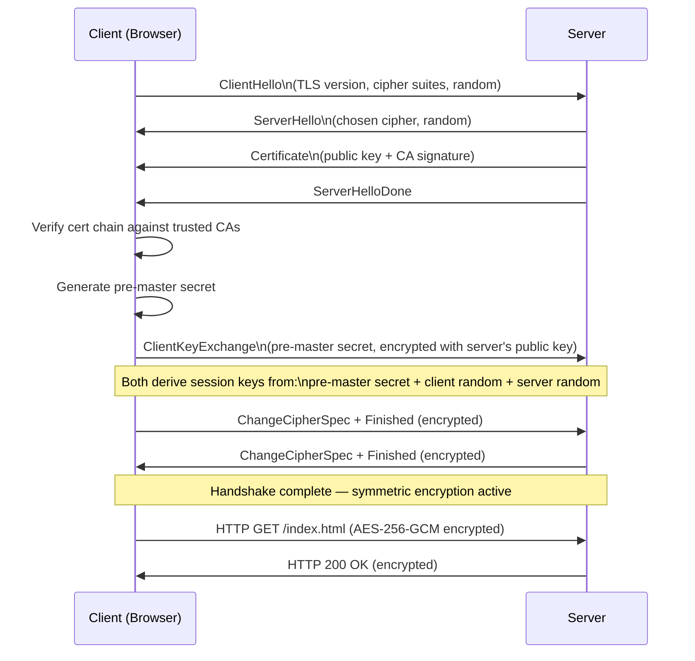

# 26 — SSL/TLS & Certificates

> **[← Index](00_INDEX.md)** | **Related: [Security Concepts](14_Security_Concepts.md) · [Nginx & Apache](25_Nginx_Apache.md) · [IIS](10_IIS.md) · [DNS Deep Dive](22_DNS_Deep_Dive.md)**

---

## TLS Handshake — How HTTPS Works



---

## Certificate Chain

```
Root CA (self-signed, in browser/OS trust store)
    ↓ signs
Intermediate CA (improves security — root can be kept offline)
    ↓ signs
End-Entity Certificate (your server's cert)
    → Contains: domain, public key, validity dates, CA signature
```

```
Browser checks:
1. Is the domain name correct? (CN or SAN matches)
2. Is the cert within its validity period?
3. Is it signed by a trusted CA (root in trust store)?
4. Is the chain complete (full chain provided)?
5. Has it been revoked? (CRL / OCSP)
```

---

## Certificate Types

| Type | Validation | Speed | Cost | Use Case |
|------|-----------|-------|------|---------|
| **DV** (Domain Validated) | Just domain ownership | Minutes | Free (Let's Encrypt) | Blogs, APIs |
| **OV** (Organization Validated) | Domain + org identity checked | Days | Paid | Business sites |
| **EV** (Extended Validation) | Full legal entity verification | Weeks | Expensive | Banks, e-commerce |
| **Wildcard** | Covers `*.example.com` | Minutes–days | Moderate | All subdomains |
| **Multi-SAN** | Multiple domains in one cert | Varies | Varies | Multi-domain |
| **Self-signed** | No CA — you sign it | Instant | Free | Dev/internal only |

---

## Let's Encrypt & Certbot

**Let's Encrypt** is a free, automated, open Certificate Authority. **Certbot** is the recommended client.

### Installation

```bash
# Ubuntu/Debian
sudo apt install certbot python3-certbot-nginx     # Nginx plugin
sudo apt install certbot python3-certbot-apache    # Apache plugin

# Arch Linux
sudo pacman -S certbot certbot-nginx

# Snap (works on any Linux)
sudo snap install --classic certbot
sudo ln -s /snap/bin/certbot /usr/bin/certbot
```

### Obtain Certificate — Nginx

```bash
# Automatic: certbot edits nginx config automatically
sudo certbot --nginx -d example.com -d www.example.com

# Manual: just obtain cert, configure nginx yourself
sudo certbot certonly --nginx -d example.com -d www.example.com

# Standalone (temporarily uses port 80)
sudo certbot certonly --standalone -d example.com

# Wildcard (requires DNS challenge — DNS plugin needed)
sudo certbot certonly --manual --preferred-challenges dns -d "*.example.com" -d example.com
```

### Obtain Certificate — Apache

```bash
sudo certbot --apache -d example.com -d www.example.com
```

### Certificate Files

```
/etc/letsencrypt/
└── live/
    └── example.com/
        ├── cert.pem        ← Server certificate only
        ├── chain.pem       ← Intermediate CA certificates
        ├── fullchain.pem   ← cert.pem + chain.pem (use this for nginx)
        └── privkey.pem     ← Private key (keep secret!)

# Nginx config:
ssl_certificate     /etc/letsencrypt/live/example.com/fullchain.pem;
ssl_certificate_key /etc/letsencrypt/live/example.com/privkey.pem;

# Apache config:
SSLCertificateFile    /etc/letsencrypt/live/example.com/cert.pem
SSLCertificateKeyFile /etc/letsencrypt/live/example.com/privkey.pem
SSLCertificateChainFile /etc/letsencrypt/live/example.com/chain.pem
```

### Auto-Renewal

```bash
# Test renewal
sudo certbot renew --dry-run

# Manual renewal
sudo certbot renew

# Certbot installs a timer automatically
systemctl status snap.certbot.renew.timer     # Snap
systemctl status certbot.timer                # apt

# View timer schedule
sudo systemctl list-timers | grep certbot

# Manual cron (if timer not set up)
# /etc/cron.d/certbot
0 0,12 * * * root certbot renew --quiet --post-hook "nginx -s reload"
```

### Revoking a Certificate

```bash
# Revoke (if private key compromised)
sudo certbot revoke --cert-path /etc/letsencrypt/live/example.com/cert.pem
sudo certbot delete --cert-name example.com
```

---

## `openssl` — The Swiss Army Knife

### Generate Keys and CSRs

```bash
# Generate RSA private key (4096-bit)
openssl genrsa -out private.key 4096

# Generate key with passphrase
openssl genrsa -aes256 -out private.key 4096

# Generate EC key (faster, smaller — recommended)
openssl ecparam -name prime256v1 -genkey -noout -out ec.key
openssl ecparam -name secp384r1 -genkey -noout -out ec.key

# Generate CSR (Certificate Signing Request)
openssl req -new -key private.key -out request.csr \
    -subj "/C=IN/ST=TamilNadu/L=Chennai/O=MyOrg/CN=example.com"

# Generate CSR with SAN (Subject Alternative Names)
openssl req -new -key private.key -out request.csr \
    -config <(cat /etc/ssl/openssl.cnf <(printf '[SAN]\nsubjectAltName=DNS:example.com,DNS:www.example.com,IP:93.184.216.34'))

# Self-signed certificate (for dev/internal)
openssl req -x509 -newkey rsa:4096 -keyout key.pem -out cert.pem -days 365 -nodes \
    -subj "/CN=localhost"

# Self-signed with SAN
openssl req -x509 -newkey rsa:4096 -keyout key.pem -out cert.pem -days 365 -nodes \
    -subj "/CN=example.com" \
    -addext "subjectAltName=DNS:example.com,DNS:www.example.com"
```

### Inspect Certificates

```bash
# View certificate details
openssl x509 -in cert.pem -text -noout

# View specific fields
openssl x509 -in cert.pem -noout -subject     # Subject
openssl x509 -in cert.pem -noout -issuer      # Issuer
openssl x509 -in cert.pem -noout -dates       # Validity dates
openssl x509 -in cert.pem -noout -fingerprint # SHA1 fingerprint
openssl x509 -in cert.pem -noout -serial      # Serial number

# Check cert and key match (should output same MD5)
openssl x509 -noout -modulus -in cert.pem | md5sum
openssl rsa -noout -modulus -in private.key | md5sum

# View CSR
openssl req -text -noout -verify -in request.csr

# View PFX/PKCS12 file
openssl pkcs12 -info -in certificate.pfx
```

### Test Live Server Certificates

```bash
# Connect and view certificate
openssl s_client -connect example.com:443 -showcerts

# Check specific things
echo | openssl s_client -connect example.com:443 2>/dev/null | openssl x509 -noout -dates
echo | openssl s_client -connect example.com:443 2>/dev/null | openssl x509 -noout -subject

# Check cert chain
openssl s_client -connect example.com:443 -showcerts 2>/dev/null | \
    openssl x509 -noout -text | grep -E "(Subject|Issuer|Not)"

# Test with specific TLS version
openssl s_client -connect example.com:443 -tls1_2
openssl s_client -connect example.com:443 -tls1_3

# Check supported ciphers
nmap --script ssl-enum-ciphers -p 443 example.com
```

### Convert Certificate Formats

```bash
# PEM → DER (binary)
openssl x509 -in cert.pem -outform DER -out cert.der

# DER → PEM
openssl x509 -in cert.der -inform DER -outform PEM -out cert.pem

# PEM → PFX/PKCS12 (Windows format)
openssl pkcs12 -export -out cert.pfx -inkey private.key -in cert.pem -certfile chain.pem

# PFX → PEM
openssl pkcs12 -in cert.pfx -nokeys -out cert.pem
openssl pkcs12 -in cert.pfx -nocerts -nodes -out private.key

# Combine chain
cat cert.pem chain.pem > fullchain.pem
```

---

## Nginx SSL Configuration — Best Practices

```nginx
# /etc/nginx/snippets/ssl-params.conf

ssl_protocols TLSv1.2 TLSv1.3;                 # Disable SSLv3, TLS 1.0, 1.1
ssl_prefer_server_ciphers off;                  # TLS 1.3: client chooses

# Strong cipher suites
ssl_ciphers ECDHE-ECDSA-AES128-GCM-SHA256:ECDHE-RSA-AES128-GCM-SHA256:ECDHE-ECDSA-AES256-GCM-SHA384:ECDHE-RSA-AES256-GCM-SHA384;

# Session resumption (performance)
ssl_session_cache shared:SSL:10m;
ssl_session_timeout 1d;
ssl_session_tickets off;

# OCSP Stapling (faster cert validation for clients)
ssl_stapling on;
ssl_stapling_verify on;
ssl_trusted_certificate /etc/letsencrypt/live/example.com/chain.pem;
resolver 8.8.8.8 1.1.1.1 valid=300s;
resolver_timeout 5s;

# DH params (for older clients)
ssl_dhparam /etc/nginx/dhparam.pem;
# Generate: openssl dhparam -out /etc/nginx/dhparam.pem 2048

# HSTS (tell browsers to always use HTTPS)
add_header Strict-Transport-Security "max-age=63072000; includeSubDomains; preload" always;
```

---

## Certificate Monitoring

```bash
# Check expiry (local)
openssl x509 -enddate -noout -in /etc/letsencrypt/live/example.com/cert.pem

# Check expiry (remote)
echo | openssl s_client -connect example.com:443 2>/dev/null | \
    openssl x509 -noout -enddate

# Script: alert if cert expires in < 30 days
#!/usr/bin/env bash
DOMAIN="example.com"
EXPIRY=$(echo | openssl s_client -connect "${DOMAIN}:443" 2>/dev/null | \
    openssl x509 -noout -enddate | cut -d= -f2)
EXPIRY_EPOCH=$(date -d "$EXPIRY" +%s)
NOW_EPOCH=$(date +%s)
DAYS_LEFT=$(( (EXPIRY_EPOCH - NOW_EPOCH) / 86400 ))
if [[ $DAYS_LEFT -lt 30 ]]; then
    echo "WARNING: $DOMAIN cert expires in $DAYS_LEFT days"
fi
```

---

## Common Certificate Errors

| Error | Cause | Fix |
|-------|-------|-----|
| `NET::ERR_CERT_AUTHORITY_INVALID` | Self-signed or unknown CA | Install CA cert, use valid cert |
| `NET::ERR_CERT_DATE_INVALID` | Cert expired or clock wrong | Renew cert; check NTP |
| `NET::ERR_CERT_COMMON_NAME_INVALID` | Domain mismatch | Check CN/SAN matches actual domain |
| `SSL_ERROR_RX_RECORD_TOO_LONG` | HTTP on HTTPS port | Send request to correct port |
| `ERR_SSL_PROTOCOL_ERROR` | Wrong TLS version | Check `ssl_protocols` in nginx |
| `UNABLE_TO_VERIFY_LEAF_SIGNATURE` | Incomplete chain | Use `fullchain.pem` not just `cert.pem` |
| `certificate verify failed` | CA not trusted | Install CA cert in system trust store |

```bash
# Add CA cert to system trust store (Ubuntu)
sudo cp myCA.crt /usr/local/share/ca-certificates/
sudo update-ca-certificates

# Add CA cert (RHEL/CentOS)
sudo cp myCA.crt /etc/pki/ca-trust/source/anchors/
sudo update-ca-trust
```

---

## Related Topics

- [Security Concepts ←](14_Security_Concepts.md) — PKI, encryption basics
- [Nginx & Apache ←](25_Nginx_Apache.md) — web server SSL config
- [IIS ←](10_IIS.md) — Windows SSL
- [DNS Deep Dive ←](22_DNS_Deep_Dive.md) — CAA records
- [NTP ←](11_NTP.md) — clock accuracy affects cert validation

---

> [Index](00_INDEX.md)
