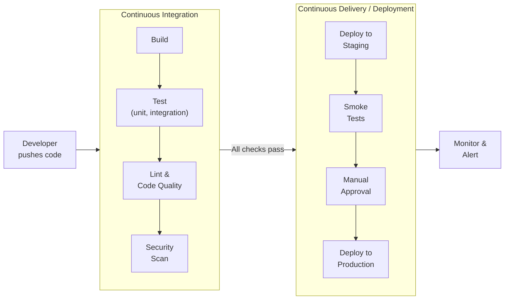
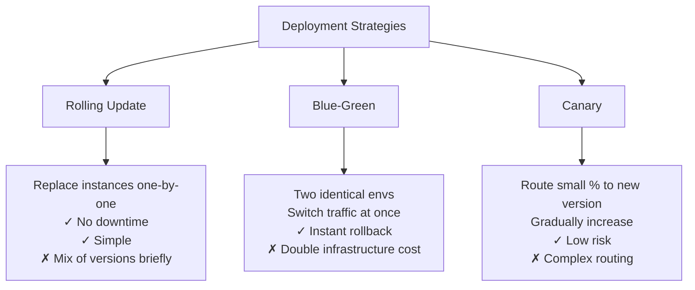

# 27 — CI/CD Fundamentals

> **[← Index](00_INDEX.md)** | **Related: [Git Commands](20_Git_Commands.md) · [Git Branching](21_Git_Branching.md) · [Docker & Containers](30_Docker_Containers.md) · [IaC](28_IaC_Terraform_Ansible.md)**

---

## What is CI/CD?



| Term | Meaning |
|------|---------|
| **CI** (Continuous Integration) | Automatically build and test every code push |
| **CD** (Continuous Delivery) | Automatically deploy to staging; manual production approval |
| **CD** (Continuous Deployment) | Automatically deploy to production if all checks pass |

---

## GitHub Actions

GitHub Actions is a CI/CD platform built into GitHub. Workflows are YAML files in `.github/workflows/`.

### Workflow Anatomy

```yaml
# .github/workflows/ci.yml

name: CI Pipeline                   # Workflow name (shown in GitHub UI)

on:                                  # Trigger events
  push:
    branches: [main, develop]
  pull_request:
    branches: [main]
  schedule:
    - cron: '0 0 * * 1'            # Every Monday at midnight
  workflow_dispatch:                 # Manual trigger from UI

env:                                 # Global environment variables
  NODE_VERSION: '20'
  REGISTRY: ghcr.io

jobs:                                # One or more jobs (run in parallel by default)
  build:                             # Job name
    runs-on: ubuntu-latest           # Runner: ubuntu, macos, windows
    timeout-minutes: 30

    steps:                           # Sequential steps in the job
      - name: Checkout code
        uses: actions/checkout@v4    # Use an action from marketplace

      - name: Setup Node.js
        uses: actions/setup-node@v4
        with:
          node-version: ${{ env.NODE_VERSION }}
          cache: 'npm'

      - name: Install dependencies
        run: npm ci                  # Run a shell command

      - name: Run tests
        run: npm test

      - name: Upload coverage
        uses: codecov/codecov-action@v4
```

### Complete CI/CD Pipeline — Node.js

```yaml
# .github/workflows/pipeline.yml
name: CI/CD Pipeline

on:
  push:
    branches: [main]
  pull_request:
    branches: [main]

jobs:
  # ── Job 1: Test ────────────────────────────────────
  test:
    runs-on: ubuntu-latest
    services:
      mysql:
        image: mysql:8.0
        env:
          MYSQL_ROOT_PASSWORD: root
          MYSQL_DATABASE: testdb
        ports:
          - 3306:3306
        options: --health-cmd="mysqladmin ping" --health-interval=10s --health-timeout=5s --health-retries=3

    steps:
      - uses: actions/checkout@v4

      - name: Setup Node.js
        uses: actions/setup-node@v4
        with:
          node-version: '20'
          cache: 'npm'

      - name: Install dependencies
        run: npm ci

      - name: Run linter
        run: npm run lint

      - name: Run unit tests
        run: npm run test:unit

      - name: Run integration tests
        env:
          DB_HOST: 127.0.0.1
          DB_PORT: 3306
          DB_NAME: testdb
          DB_USER: root
          DB_PASS: root
        run: npm run test:integration

  # ── Job 2: Security Scan ────────────────────────────
  security:
    runs-on: ubuntu-latest
    needs: test
    steps:
      - uses: actions/checkout@v4

      - name: Audit npm packages
        run: npm audit --audit-level=high

      - name: Run CodeQL analysis
        uses: github/codeql-action/analyze@v3
        with:
          languages: javascript

  # ── Job 3: Build Docker Image ───────────────────────
  build:
    runs-on: ubuntu-latest
    needs: [test, security]
    if: github.ref == 'refs/heads/main'

    permissions:
      contents: read
      packages: write

    outputs:
      image-tag: ${{ steps.meta.outputs.tags }}

    steps:
      - uses: actions/checkout@v4

      - name: Log in to GitHub Container Registry
        uses: docker/login-action@v3
        with:
          registry: ghcr.io
          username: ${{ github.actor }}
          password: ${{ secrets.GITHUB_TOKEN }}

      - name: Extract Docker metadata
        id: meta
        uses: docker/metadata-action@v5
        with:
          images: ghcr.io/${{ github.repository }}
          tags: |
            type=sha,prefix=sha-
            type=raw,value=latest

      - name: Build and push Docker image
        uses: docker/build-push-action@v5
        with:
          context: .
          push: true
          tags: ${{ steps.meta.outputs.tags }}
          cache-from: type=gha
          cache-to: type=gha,mode=max

  # ── Job 4: Deploy to Staging ────────────────────────
  deploy-staging:
    runs-on: ubuntu-latest
    needs: build
    environment: staging               # GitHub environment (optional approval)

    steps:
      - name: Deploy to staging
        uses: appleboy/ssh-action@v1
        with:
          host: ${{ secrets.STAGING_HOST }}
          username: ${{ secrets.STAGING_USER }}
          key: ${{ secrets.STAGING_SSH_KEY }}
          script: |
            docker pull ghcr.io/${{ github.repository }}:latest
            docker compose -f /opt/app/docker-compose.yml up -d --no-deps app
            docker compose -f /opt/app/docker-compose.yml exec -T app php artisan migrate --force

  # ── Job 5: Deploy to Production ─────────────────────
  deploy-production:
    runs-on: ubuntu-latest
    needs: deploy-staging
    environment: production            # Requires manual approval in GitHub

    steps:
      - name: Deploy to production
        uses: appleboy/ssh-action@v1
        with:
          host: ${{ secrets.PROD_HOST }}
          username: ${{ secrets.PROD_USER }}
          key: ${{ secrets.PROD_SSH_KEY }}
          script: |
            docker pull ghcr.io/${{ github.repository }}:latest
            docker compose -f /opt/app/docker-compose.yml up -d --no-deps --scale app=3 app
```

### CI/CD for Laravel (PHP)

```yaml
name: Laravel CI

on: [push, pull_request]

jobs:
  laravel-tests:
    runs-on: ubuntu-latest

    services:
      mysql:
        image: mysql:8.0
        env:
          MYSQL_DATABASE: laravel_test
          MYSQL_ROOT_PASSWORD: secret
        ports:
          - 3306:3306

    steps:
      - uses: actions/checkout@v4

      - name: Setup PHP
        uses: shivammathur/setup-php@v2
        with:
          php-version: '8.3'
          extensions: mbstring, mysql, bcmath
          coverage: xdebug

      - name: Install Composer dependencies
        run: composer install --no-progress --prefer-dist --optimize-autoloader

      - name: Prepare environment
        run: |
          cp .env.testing .env
          php artisan key:generate
          php artisan config:cache

      - name: Run migrations
        env:
          DB_CONNECTION: mysql
          DB_HOST: 127.0.0.1
          DB_DATABASE: laravel_test
          DB_USERNAME: root
          DB_PASSWORD: secret
        run: php artisan migrate --force

      - name: Run tests
        run: php artisan test --coverage

      - name: Static analysis (Larastan)
        run: ./vendor/bin/phpstan analyse
```

### GitHub Actions — Key Concepts

```yaml
# Secrets (stored in GitHub Settings → Secrets)
${{ secrets.MY_SECRET }}
${{ secrets.GITHUB_TOKEN }}          # Auto-provided by GitHub

# Context variables
${{ github.ref }}                    # refs/heads/main
${{ github.sha }}                    # Commit SHA
${{ github.actor }}                  # Who triggered the workflow
${{ github.repository }}             # owner/repo
${{ github.event_name }}             # push, pull_request, etc.

# Conditional execution
if: github.ref == 'refs/heads/main'
if: github.event_name == 'push'
if: failure()                        # Only if previous step failed
if: always()                         # Always run

# Job dependencies
needs: [test, build]                 # Wait for both jobs

# Matrix builds (test multiple versions)
strategy:
  matrix:
    node-version: [18, 20, 22]
    os: [ubuntu-latest, macos-latest]
runs-on: ${{ matrix.os }}
steps:
  - uses: actions/setup-node@v4
    with:
      node-version: ${{ matrix.node-version }}

# Caching
- uses: actions/cache@v4
  with:
    path: ~/.npm
    key: ${{ runner.os }}-node-${{ hashFiles('**/package-lock.json') }}
    restore-keys: |
      ${{ runner.os }}-node-
```

---

## GitLab CI/CD

GitLab uses `.gitlab-ci.yml` in the repo root.

```yaml
# .gitlab-ci.yml

stages:
  - test
  - build
  - deploy

variables:
  DOCKER_IMAGE: $CI_REGISTRY_IMAGE:$CI_COMMIT_SHORT_SHA

# ── Test Stage ────────────────────────────────────────
test:
  stage: test
  image: node:20-alpine
  services:
    - mysql:8.0
  variables:
    MYSQL_DATABASE: testdb
    MYSQL_ROOT_PASSWORD: root
  script:
    - npm ci
    - npm test
  coverage: '/Lines\s*:\s*(\d+\.?\d*)%/'
  artifacts:
    reports:
      coverage_report:
        coverage_format: cobertura
        path: coverage/cobertura-coverage.xml

# ── Build Stage ───────────────────────────────────────
build:
  stage: build
  image: docker:24
  services:
    - docker:24-dind
  only:
    - main
  script:
    - docker login -u $CI_REGISTRY_USER -p $CI_REGISTRY_PASSWORD $CI_REGISTRY
    - docker build -t $DOCKER_IMAGE .
    - docker push $DOCKER_IMAGE

# ── Deploy Stage ──────────────────────────────────────
deploy-staging:
  stage: deploy
  image: alpine
  environment:
    name: staging
    url: https://staging.example.com
  only:
    - main
  script:
    - apk add --no-cache openssh-client
    - eval $(ssh-agent -s)
    - echo "$STAGING_SSH_KEY" | ssh-add -
    - ssh -o StrictHostKeyChecking=no deploy@staging.example.com "
        docker pull $DOCKER_IMAGE &&
        docker compose up -d"

deploy-production:
  stage: deploy
  environment:
    name: production
    url: https://example.com
  when: manual                        # Manual trigger required
  only:
    - main
  script:
    - echo "Deploying $DOCKER_IMAGE to production"
```

---

## Pipeline Best Practices

```
✓ Fail fast — run fast checks first (lint, unit tests)
✓ Parallelize — run independent jobs simultaneously
✓ Cache dependencies — avoid re-downloading every run
✓ Never hardcode secrets — use CI/CD secret management
✓ Pin action versions — use @v4 not @latest
✓ Keep pipelines fast — aim for < 10 minutes
✓ Test in production-like environment
✓ Protect main branch — require CI to pass before merge
✓ Notify on failures — Slack, email, PagerDuty
✓ Review pipeline code like application code
```

---

## Deployment Strategies



---

## Related Topics

- [Git Branching ←](21_Git_Branching.md) — branching strategy affects CI/CD
- [Docker & Containers →](30_Docker_Containers.md) — containerized deployments
- [IaC →](28_IaC_Terraform_Ansible.md) — infrastructure automation
- [Nginx & Apache ←](25_Nginx_Apache.md) — web server deployment target
- [Monitoring & Logging ←](13_Monitoring_Logging.md) — post-deploy monitoring

---

> [Index](00_INDEX.md)
