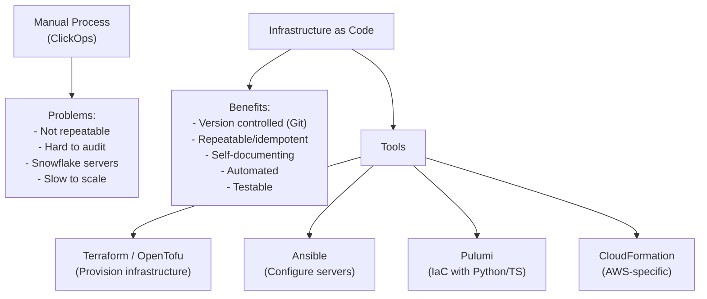
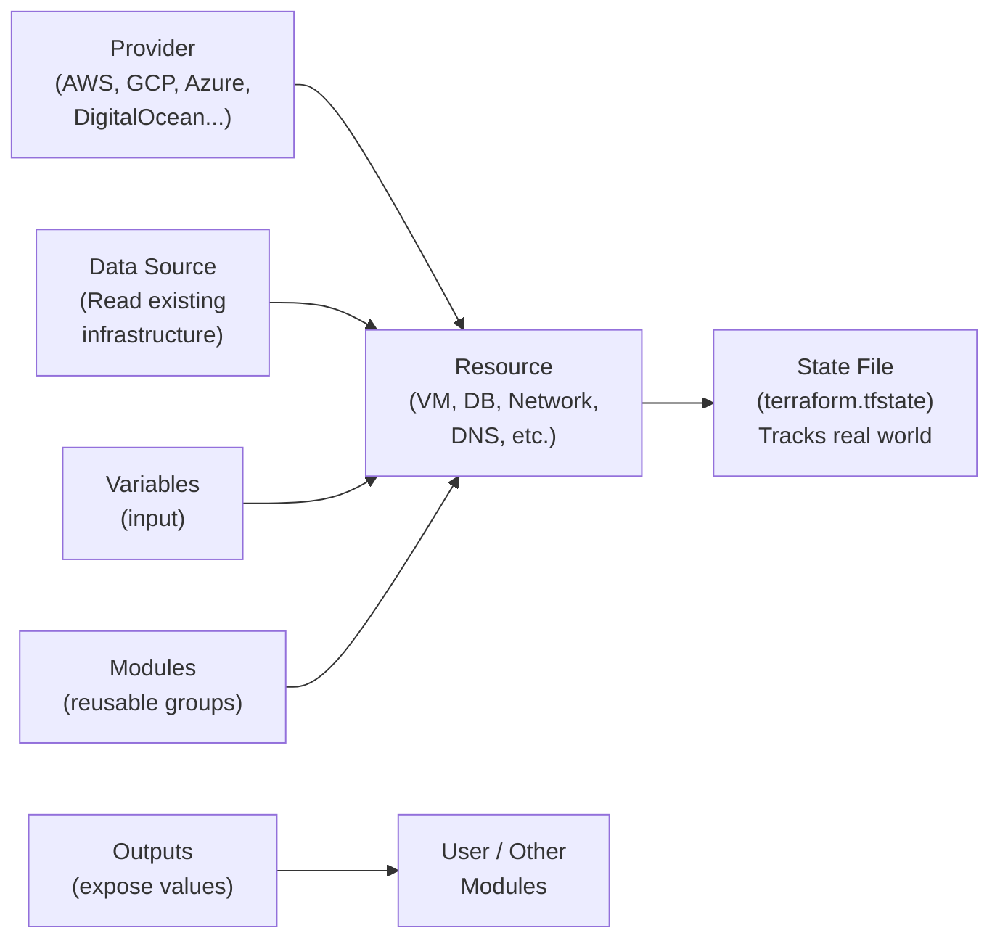
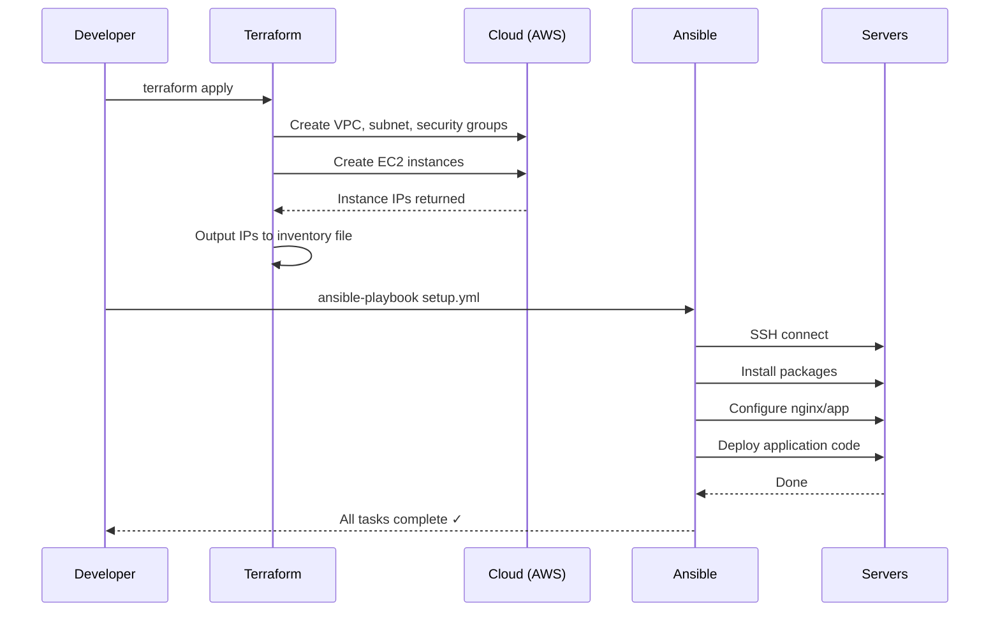

# 28 — Infrastructure as Code (Terraform & Ansible)

> **[← Index](00_INDEX.md)** | **Related: [CI/CD](27_CICD_Fundamentals.md) · [Cloud & Remote Access](17_Cloud_Remote_Access.md) · [Docker & Containers](30_Docker_Containers.md)**

---

## What is IaC?

**Infrastructure as Code** means managing and provisioning infrastructure through code (version-controlled, repeatable, automated) instead of manual processes.



### Terraform vs Ansible

| | Terraform | Ansible |
|--|-----------|---------|
| **Purpose** | Provision infrastructure (create VMs, networks, DBs) | Configure software on existing servers |
| **State** | Maintains state file | Stateless (idempotent tasks) |
| **Language** | HCL (HashiCorp Config Language) | YAML playbooks |
| **Agentless** | Yes | Yes (uses SSH) |
| **Approach** | Declarative — describe end state | Procedural + declarative hybrid |
| **Use case** | "Create a VM on AWS" | "Install nginx on that VM" |

---

## Terraform

### Installation

```bash
# Arch Linux
sudo pacman -S terraform

# Ubuntu/Debian
wget -O- https://apt.releases.hashicorp.com/gpg | sudo gpg --dearmor -o /usr/share/keyrings/hashicorp-archive-keyring.gpg
echo "deb [signed-by=/usr/share/keyrings/hashicorp-archive-keyring.gpg] https://apt.releases.hashicorp.com $(lsb_release -cs) main" | sudo tee /etc/apt/sources.list.d/hashicorp.list
sudo apt update && sudo apt install terraform

# Verify
terraform version
```

### Core Concepts



### Project Structure

```
project/
├── main.tf              ← Main resources
├── variables.tf         ← Input variable declarations
├── outputs.tf           ← Output values
├── providers.tf         ← Provider configuration
├── terraform.tfvars     ← Variable values (gitignore sensitive ones!)
├── versions.tf          ← Provider version constraints
└── modules/
    └── webserver/       ← Reusable module
        ├── main.tf
        ├── variables.tf
        └── outputs.tf
```

### `providers.tf` — Configure Provider

```hcl
# providers.tf
terraform {
  required_version = ">= 1.5.0"

  required_providers {
    aws = {
      source  = "hashicorp/aws"
      version = "~> 5.0"
    }
    random = {
      source  = "hashicorp/random"
      version = "~> 3.0"
    }
  }

  # Remote state backend (use this in teams — not local file)
  backend "s3" {
    bucket         = "my-terraform-state"
    key            = "prod/terraform.tfstate"
    region         = "ap-south-1"
    encrypt        = true
    dynamodb_table = "terraform-locks"
  }
}

provider "aws" {
  region = var.aws_region

  default_tags {
    tags = {
      Environment = var.environment
      ManagedBy   = "Terraform"
      Project     = var.project_name
    }
  }
}
```

### `variables.tf` — Input Variables

```hcl
# variables.tf
variable "aws_region" {
  description = "AWS region to deploy resources"
  type        = string
  default     = "ap-south-1"
}

variable "environment" {
  description = "Deployment environment"
  type        = string
  validation {
    condition     = contains(["dev", "staging", "prod"], var.environment)
    error_message = "Environment must be dev, staging, or prod."
  }
}

variable "instance_type" {
  description = "EC2 instance type"
  type        = string
  default     = "t3.micro"
}

variable "allowed_ips" {
  description = "List of IPs allowed SSH access"
  type        = list(string)
  default     = []
}

variable "db_password" {
  description = "Database password"
  type        = string
  sensitive   = true          # Won't print in logs
}
```

### `main.tf` — Resources

```hcl
# main.tf — Example: Full web stack on AWS

# ── Data Sources ──────────────────────────────────────
data "aws_ami" "ubuntu" {
  most_recent = true
  owners      = ["099720109477"]    # Canonical (Ubuntu)

  filter {
    name   = "name"
    values = ["ubuntu/images/hvm-ssd/ubuntu-jammy-22.04-amd64-server-*"]
  }
}

# ── Networking ────────────────────────────────────────
resource "aws_vpc" "main" {
  cidr_block           = "10.0.0.0/16"
  enable_dns_hostnames = true
  enable_dns_support   = true

  tags = { Name = "${var.environment}-vpc" }
}

resource "aws_subnet" "public" {
  count             = 2
  vpc_id            = aws_vpc.main.id
  cidr_block        = "10.0.${count.index}.0/24"
  availability_zone = data.aws_availability_zones.available.names[count.index]

  tags = { Name = "${var.environment}-public-${count.index}" }
}

resource "aws_internet_gateway" "main" {
  vpc_id = aws_vpc.main.id
}

# ── Security Group ─────────────────────────────────────
resource "aws_security_group" "web" {
  name        = "${var.environment}-web-sg"
  description = "Allow HTTP, HTTPS, and SSH"
  vpc_id      = aws_vpc.main.id

  ingress {
    from_port   = 80
    to_port     = 80
    protocol    = "tcp"
    cidr_blocks = ["0.0.0.0/0"]
  }

  ingress {
    from_port   = 443
    to_port     = 443
    protocol    = "tcp"
    cidr_blocks = ["0.0.0.0/0"]
  }

  ingress {
    from_port   = 22
    to_port     = 22
    protocol    = "tcp"
    cidr_blocks = var.allowed_ips
  }

  egress {
    from_port   = 0
    to_port     = 0
    protocol    = "-1"          # All outbound
    cidr_blocks = ["0.0.0.0/0"]
  }
}

# ── EC2 Instance ──────────────────────────────────────
resource "aws_instance" "web" {
  count                  = 2
  ami                    = data.aws_ami.ubuntu.id
  instance_type          = var.instance_type
  subnet_id              = aws_subnet.public[count.index].id
  vpc_security_group_ids = [aws_security_group.web.id]
  key_name               = aws_key_pair.deployer.key_name

  root_block_device {
    volume_size = 20
    volume_type = "gp3"
    encrypted   = true
  }

  user_data = base64encode(templatefile("${path.module}/user_data.sh", {
    environment = var.environment
  }))

  tags = { Name = "${var.environment}-web-${count.index + 1}" }
}

# ── RDS Database ──────────────────────────────────────
resource "aws_db_instance" "main" {
  identifier             = "${var.environment}-db"
  engine                 = "mysql"
  engine_version         = "8.0"
  instance_class         = "db.t3.micro"
  allocated_storage      = 20
  storage_encrypted      = true
  username               = "admin"
  password               = var.db_password
  skip_final_snapshot    = var.environment != "prod"
  deletion_protection    = var.environment == "prod"
  backup_retention_period = var.environment == "prod" ? 7 : 1
  vpc_security_group_ids = [aws_security_group.db.id]
  db_subnet_group_name   = aws_db_subnet_group.main.name
}
```

### `outputs.tf`

```hcl
# outputs.tf
output "web_public_ips" {
  description = "Public IP addresses of web instances"
  value       = aws_instance.web[*].public_ip
}

output "db_endpoint" {
  description = "RDS endpoint"
  value       = aws_db_instance.main.endpoint
  sensitive   = true
}

output "vpc_id" {
  value = aws_vpc.main.id
}
```

### Terraform Workflow

```bash
# Initialize (download providers, set up backend)
terraform init

# Validate syntax
terraform validate

# Preview changes (dry run)
terraform plan
terraform plan -out=tfplan         # Save plan to file
terraform plan -var="environment=prod"

# Apply changes
terraform apply
terraform apply tfplan              # Apply saved plan
terraform apply -auto-approve       # Skip confirmation (CI/CD)

# Destroy infrastructure
terraform destroy
terraform destroy -target=aws_instance.web[0]   # Specific resource

# State management
terraform show                      # Show current state
terraform state list                # List all resources
terraform state show aws_instance.web[0]  # Show specific resource
terraform state rm aws_instance.web[0]   # Remove from state (not destroy)
terraform import aws_instance.web[0] i-1234567890   # Import existing resource

# Format and docs
terraform fmt                       # Format all .tf files
terraform fmt -recursive
terraform-docs markdown .           # Generate docs (terraform-docs tool)

# Workspace (multiple environments with one config)
terraform workspace list
terraform workspace new staging
terraform workspace select prod
```

---

## Ansible

### Installation

```bash
# Ubuntu/Debian
sudo apt install ansible

# Arch Linux
sudo pacman -S ansible

# Via pip
pip install ansible

# Verify
ansible --version
```

### Inventory — Define Hosts

```ini
# /etc/ansible/hosts  OR  inventory/hosts.ini

# Simple list
web1.example.com
web2.example.com

# Groups
[webservers]
web1.example.com
web2.example.com ansible_port=2222

[databases]
db1.example.com
db2.example.com

[staging:children]   # Group of groups
webservers
databases

# Variables per host
[webservers:vars]
ansible_user=deploy
ansible_python_interpreter=/usr/bin/python3
http_port=80

# Specific host variables
web1.example.com ansible_host=192.168.1.100 ansible_user=ubuntu
```

```yaml
# inventory/hosts.yml (YAML format — more powerful)
all:
  children:
    webservers:
      hosts:
        web1:
          ansible_host: 192.168.1.100
          ansible_user: ubuntu
        web2:
          ansible_host: 192.168.1.101
    databases:
      hosts:
        db1:
          ansible_host: 192.168.1.200
          ansible_user: ubuntu
  vars:
    ansible_python_interpreter: /usr/bin/python3
    ansible_ssh_private_key_file: ~/.ssh/id_ed25519
```

### Ad-hoc Commands

```bash
# Test connectivity
ansible all -m ping
ansible webservers -m ping

# Run shell command
ansible all -m shell -a "uptime"
ansible webservers -m shell -a "df -h"

# Copy file
ansible webservers -m copy -a "src=./nginx.conf dest=/etc/nginx/nginx.conf owner=root mode=0644" --become

# Install package
ansible webservers -m apt -a "name=nginx state=present" --become

# Restart service
ansible webservers -m service -a "name=nginx state=restarted" --become

# Flags
-i inventory/hosts.ini    # Specify inventory
-u ubuntu                 # SSH user
--become                  # sudo
--become-user root        # sudo as root
-k                        # Ask SSH password
-K                        # Ask sudo password
--check                   # Dry run
-v / -vv / -vvv           # Verbosity
```

### Playbooks

```yaml
# playbooks/setup_webserver.yml
---
- name: Configure web servers
  hosts: webservers
  become: true                        # sudo for all tasks
  gather_facts: true                  # Collect system info

  vars:
    nginx_port: 80
    app_user: www-data
    deploy_dir: /var/www/myapp

  tasks:
    - name: Update apt cache
      apt:
        update_cache: yes
        cache_valid_time: 3600        # Skip if updated < 1 hour ago

    - name: Install required packages
      apt:
        name:
          - nginx
          - php8.2-fpm
          - php8.2-mysql
          - git
          - curl
        state: present

    - name: Create deploy directory
      file:
        path: "{{ deploy_dir }}"
        state: directory
        owner: "{{ app_user }}"
        group: "{{ app_user }}"
        mode: '0755'

    - name: Copy nginx config
      template:
        src: templates/nginx.conf.j2
        dest: /etc/nginx/sites-available/myapp
        owner: root
        mode: '0644'
      notify: Reload nginx            # Trigger handler

    - name: Enable nginx site
      file:
        src: /etc/nginx/sites-available/myapp
        dest: /etc/nginx/sites-enabled/myapp
        state: link

    - name: Start and enable services
      systemd:
        name: "{{ item }}"
        state: started
        enabled: yes
      loop:
        - nginx
        - php8.2-fpm

    - name: Check nginx is responding
      uri:
        url: "http://localhost:{{ nginx_port }}"
        status_code: 200
      register: result
      retries: 3
      delay: 5

    - name: Display result
      debug:
        msg: "Nginx responded with status {{ result.status }}"

  handlers:
    - name: Reload nginx
      systemd:
        name: nginx
        state: reloaded

    - name: Restart nginx
      systemd:
        name: nginx
        state: restarted
```

### Roles — Reusable Structure

```
roles/
└── nginx/
    ├── tasks/
    │   └── main.yml        ← Task list
    ├── handlers/
    │   └── main.yml        ← Handlers
    ├── templates/
    │   └── nginx.conf.j2   ← Jinja2 templates
    ├── files/
    │   └── index.html      ← Static files
    ├── vars/
    │   └── main.yml        ← Role variables
    ├── defaults/
    │   └── main.yml        ← Default values
    └── meta/
        └── main.yml        ← Role dependencies
```

```yaml
# Use roles in playbook
- name: Configure servers
  hosts: webservers
  become: true
  roles:
    - common
    - nginx
    - { role: php, php_version: "8.2" }
    - { role: deploy, when: deploy_app | default(false) }
```

### Jinja2 Templates

```nginx
# templates/nginx.conf.j2
server {
    listen {{ nginx_port }};
    server_name {{ ansible_hostname }};
    root {{ deploy_dir }}/public;

    
    listen 443 ssl;
    ssl_certificate {{ ssl_cert_path }};
    ssl_certificate_key {{ ssl_key_path }};
    

    location / {
        try_files $uri $uri/ /index.php?$query_string;
    }

    location ~ \.php$ {
        fastcgi_pass unix:/var/run/php/php{{ php_version }}-fpm.sock;
        include fastcgi_params;
    }
}
```

### Running Playbooks

```bash
# Run playbook
ansible-playbook playbooks/setup_webserver.yml
ansible-playbook playbooks/setup_webserver.yml -i inventory/production.yml

# Limit to specific hosts
ansible-playbook playbooks/setup.yml --limit web1
ansible-playbook playbooks/setup.yml --limit webservers

# Dry run
ansible-playbook playbooks/setup.yml --check
ansible-playbook playbooks/setup.yml --check --diff   # Show changes

# Extra variables
ansible-playbook playbooks/deploy.yml -e "version=1.2.3 environment=prod"

# Start at specific task
ansible-playbook playbooks/setup.yml --start-at-task="Copy nginx config"

# Tags (run only tagged tasks)
ansible-playbook playbooks/setup.yml --tags "nginx,php"
ansible-playbook playbooks/setup.yml --skip-tags "slow"

# Syntax check
ansible-playbook --syntax-check playbooks/setup.yml

# Lint
ansible-lint playbooks/setup.yml
```

---

## Combined Terraform + Ansible Workflow



---

## Related Topics

- [Cloud & Remote Access ←](17_Cloud_Remote_Access.md)
- [CI/CD ←](27_CICD_Fundamentals.md)
- [Docker & Containers →](30_Docker_Containers.md)
- [Bash Scripting ←](23_Bash_Scripting.md)
- [Security Concepts ←](14_Security_Concepts.md)

---

> [Index](00_INDEX.md)
