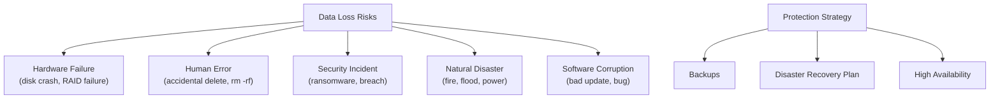
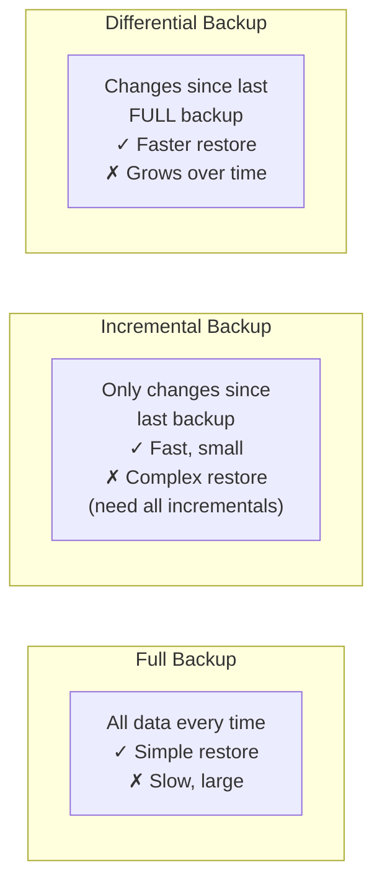

# 29 — Backup and Disaster Recovery

> **[← Index](00_INDEX.md)** | **Related: [File Management](06_File_Management.md) · [Database Basics](24_Database_Basics.md) · [Bash Scripting](23_Bash_Scripting.md) · [Monitoring & Logging](13_Monitoring_Logging.md)**

---

## Why Backup and DR Matter



---

## The 3-2-1 Backup Rule

```
3  — Keep at least 3 copies of data
2  — Store on 2 different media types (disk + tape, disk + cloud)
1  — Keep 1 copy offsite (different physical location / cloud)

Extended: 3-2-1-1-0
  + 1 copy offline / air-gapped (protection from ransomware)
  + 0 errors — verify backups regularly (restore tests)
```

---

## Backup Types



| Type | What it backs up | Backup speed | Restore complexity | Space |
|------|-----------------|-------------|-------------------|-------|
| **Full** | Everything | Slowest | Simplest (1 backup) | Largest |
| **Incremental** | Changes since last backup (any type) | Fastest | Complex (chain of backups) | Smallest |
| **Differential** | Changes since last full | Medium | Simple (full + latest diff) | Medium |
| **Snapshot** | Point-in-time copy (CoW) | Very fast | Very simple | Varies |

---

## `rsync` — The Workhorse

`rsync` is the go-to tool for Linux backups — efficient, fast, supports SSH, preserves permissions.

```bash
# Basic syntax
rsync [options] source destination

# Flags explained:
# -a = archive (recursive + preserve permissions/timestamps/symlinks/owner/group)
# -v = verbose
# -z = compress during transfer
# -h = human-readable sizes
# -P = show progress + resume partial transfers
# --delete = delete files in dest that no longer exist in source
# --dry-run / -n = simulate without making changes
# --exclude = skip patterns
# --bwlimit = limit bandwidth (KB/s)
# --checksum = verify by checksum instead of size+time

# ── Local Backups ─────────────────────────────────────
# Mirror a directory
rsync -avh /var/www/ /backup/www/

# With delete (make dest exact mirror of source)
rsync -avh --delete /var/www/ /backup/www/

# Exclude patterns
rsync -avh --exclude='*.log' --exclude='node_modules/' --exclude='.git/' \
    /var/www/ /backup/www/

# Multiple excludes via file
rsync -avh --exclude-from='/etc/rsync-exclude.txt' /var/www/ /backup/www/

# ── Remote Backups (SSH) ──────────────────────────────
# Push to remote server
rsync -avzh --delete /var/www/ deploy@backup.example.com:/backup/www/

# Pull from remote server
rsync -avzh --delete deploy@web.example.com:/var/www/ /local/backup/www/

# Custom SSH port
rsync -avzh -e "ssh -p 2222 -i ~/.ssh/backup_key" \
    /var/www/ backup@offsite.example.com:/backup/www/

# ── Incremental Backup with Hard Links ───────────────
# Each backup is full but unchanged files are hard-linked (saves space)
TIMESTAMP=$(date '+%Y-%m-%d_%H-%M-%S')
BACKUP_DIR="/backup/daily"
LATEST="$BACKUP_DIR/latest"

rsync -avh --delete \
    --link-dest="$LATEST" \
    /var/www/ \
    "$BACKUP_DIR/$TIMESTAMP/"

# Update "latest" symlink
rm -f "$LATEST"
ln -s "$BACKUP_DIR/$TIMESTAMP" "$LATEST"

# Result: each dated folder looks like full backup but only changed files take space
```

---

## Automated Backup Script

```bash
#!/usr/bin/env bash
# /usr/local/bin/backup.sh
set -euo pipefail

# ── Configuration ─────────────────────────────────────
BACKUP_ROOT="/backup"
RETENTION_DAILY=7
RETENTION_WEEKLY=4
RETENTION_MONTHLY=6
LOG_FILE="/var/log/backup.log"
TIMESTAMP=$(date '+%Y-%m-%d_%H-%M-%S')
DAY_OF_WEEK=$(date '+%u')    # 1=Mon ... 7=Sun
DAY_OF_MONTH=$(date '+%d')

SOURCES=(
    "/var/www"
    "/etc"
    "/home"
)

REMOTE_HOST="backup@offsite.example.com"
REMOTE_DIR="/backup/$(hostname)"
SSH_KEY="/etc/backup/id_ed25519"

# ── Helpers ───────────────────────────────────────────
log() { echo "[$(date '+%Y-%m-%d %H:%M:%S')] $*" | tee -a "$LOG_FILE"; }
die() { log "ERROR: $*"; exit 1; }

send_alert() {
    local subject="$1" message="$2"
    echo "$message" | mail -s "$subject" admin@example.com 2>/dev/null || true
}

# ── Determine backup type ─────────────────────────────
if [[ "$DAY_OF_MONTH" == "01" ]]; then
    BACKUP_TYPE="monthly"
    DEST="$BACKUP_ROOT/monthly/$TIMESTAMP"
    RETENTION=$RETENTION_MONTHLY
elif [[ "$DAY_OF_WEEK" == "7" ]]; then
    BACKUP_TYPE="weekly"
    DEST="$BACKUP_ROOT/weekly/$TIMESTAMP"
    RETENTION=$RETENTION_WEEKLY
else
    BACKUP_TYPE="daily"
    DEST="$BACKUP_ROOT/daily/$TIMESTAMP"
    RETENTION=$RETENTION_DAILY
fi

LATEST="$BACKUP_ROOT/$BACKUP_TYPE/latest"
mkdir -p "$DEST"

# ── Backup databases ──────────────────────────────────
log "Backing up databases..."
mkdir -p "$DEST/databases"

# MySQL
if command -v mysqldump &>/dev/null; then
    mysql -u root --password="$MYSQL_ROOT_PASSWORD" -N -e "SHOW DATABASES;" |
    grep -Ev "^(information_schema|performance_schema|sys)$" |
    while read -r db; do
        mysqldump -u root --password="$MYSQL_ROOT_PASSWORD" \
            --single-transaction --routines --triggers \
            "$db" | gzip > "$DEST/databases/${db}_${TIMESTAMP}.sql.gz"
        log "  DB backed up: $db"
    done
fi

# PostgreSQL
if command -v pg_dump &>/dev/null; then
    sudo -u postgres psql -t -c "SELECT datname FROM pg_database WHERE datistemplate = false;" |
    while read -r db; do
        [[ -z "$db" ]] && continue
        sudo -u postgres pg_dump -Fc "$db" > "$DEST/databases/${db}_${TIMESTAMP}.dump"
        log "  PG DB backed up: $db"
    done
fi

# ── Backup files with hard-link incremental ───────────
log "Starting $BACKUP_TYPE backup → $DEST"
for SOURCE in "${SOURCES[@]}"; do
    [[ -d "$SOURCE" ]] || { log "Skipping missing: $SOURCE"; continue; }
    DIR_NAME=$(basename "$SOURCE")

    rsync -avh --delete \
        --exclude='*.tmp' \
        --exclude='*.swp' \
        --exclude='node_modules/' \
        --exclude='__pycache__/' \
        --link-dest="$LATEST/$DIR_NAME/" \
        "$SOURCE/" \
        "$DEST/$DIR_NAME/" \
        >> "$LOG_FILE" 2>&1 || die "rsync failed for $SOURCE"

    log "  Files backed up: $SOURCE"
done

# Update latest symlink
rm -f "$LATEST"
ln -s "$DEST" "$LATEST"

# ── Sync to offsite ───────────────────────────────────
log "Syncing to offsite: $REMOTE_HOST"
rsync -avzh --delete \
    -e "ssh -p 22 -i $SSH_KEY -o StrictHostKeyChecking=no" \
    "$BACKUP_ROOT/" \
    "${REMOTE_HOST}:${REMOTE_DIR}/" \
    >> "$LOG_FILE" 2>&1 || log "WARNING: Offsite sync failed"

# ── Prune old backups ─────────────────────────────────
log "Pruning old $BACKUP_TYPE backups (keeping $RETENTION)..."
ls -dt "$BACKUP_ROOT/$BACKUP_TYPE"/[0-9]* 2>/dev/null |
    tail -n "+$((RETENTION + 1))" |
    xargs rm -rf --

# ── Verify backup integrity ───────────────────────────
log "Verifying backup..."
BACKUP_SIZE=$(du -sh "$DEST" | cut -f1)
FILE_COUNT=$(find "$DEST" -type f | wc -l)
log "Backup complete: $FILE_COUNT files, $BACKUP_SIZE"

if [[ "$FILE_COUNT" -lt 10 ]]; then
    send_alert "Backup WARNING: $(hostname)" "Only $FILE_COUNT files backed up — check $LOG_FILE"
fi

log "=== Backup finished: $BACKUP_TYPE ==="
```

```bash
# Add to cron
# /etc/cron.d/system-backup
0 2 * * * root MYSQL_ROOT_PASSWORD=secret /usr/local/bin/backup.sh
```

---

## Database Backups

> See also: [Database Basics →](24_Database_Basics.md)

```bash
# ── MySQL ─────────────────────────────────────────────
# Full backup
mysqldump -u root -p --all-databases --single-transaction \
    --routines --triggers --events \
    | gzip > /backup/mysql_full_$(date +%Y%m%d).sql.gz

# Per-database
for db in $(mysql -u root -p -N -e "SHOW DATABASES;" | grep -Ev "^(information_schema|performance_schema|sys)$"); do
    mysqldump -u root -p --single-transaction "$db" \
        | gzip > "/backup/mysql_${db}_$(date +%Y%m%d).sql.gz"
done

# Restore
gunzip < /backup/mysql_myapp_20240422.sql.gz | mysql -u root -p myapp

# Binary log backup (point-in-time recovery)
# Enable in /etc/mysql/mysql.conf.d/mysqld.cnf:
# log_bin = /var/log/mysql/mysql-bin.log
# expire_logs_days = 7
mysqlbinlog /var/log/mysql/mysql-bin.000001 | mysql -u root -p

# ── PostgreSQL ────────────────────────────────────────
# Per-database (custom format — fastest restore)
pg_dump -U postgres -Fc myapp > /backup/pg_myapp_$(date +%Y%m%d).dump

# All databases
pg_dumpall -U postgres | gzip > /backup/pg_all_$(date +%Y%m%d).sql.gz

# Restore
pg_restore -U postgres -d myapp -j 4 /backup/pg_myapp_20240422.dump

# Continuous archiving + PITR
# postgresql.conf:
# wal_level = replica
# archive_mode = on
# archive_command = 'cp %p /backup/wal/%f'
```

---

## Snapshot-Based Backups

### LVM Snapshots (Linux)

```bash
# Create LVM snapshot (near-instant, CoW)
sudo lvcreate -L 10G -s -n data-snap /dev/vg0/data

# Mount snapshot
sudo mkdir /mnt/snap
sudo mount -o ro /dev/vg0/data-snap /mnt/snap

# Backup from snapshot (application consistent)
sudo rsync -avh /mnt/snap/ /backup/data/

# Remove snapshot
sudo umount /mnt/snap
sudo lvremove -f /dev/vg0/data-snap
```

### BTRFS Snapshots

```bash
# Create snapshot (instant, space-efficient)
sudo btrfs subvolume snapshot /data /data/.snapshots/$(date +%Y%m%d)
sudo btrfs subvolume snapshot -r /data /data/.snapshots/$(date +%Y%m%d)  # Read-only

# List snapshots
sudo btrfs subvolume list /data

# Delete old snapshot
sudo btrfs subvolume delete /data/.snapshots/20240101

# Send snapshot to another drive (incremental)
sudo btrfs send /data/.snapshots/20240422 | sudo btrfs receive /backup/
sudo btrfs send -p /data/.snapshots/20240421 /data/.snapshots/20240422 | sudo btrfs receive /backup/
```

---

## Cloud Backups

### AWS S3

```bash
# Sync to S3
aws s3 sync /var/www/ s3://my-backup-bucket/www/ --delete
aws s3 sync /backup/ s3://my-backup-bucket/server/ \
    --storage-class STANDARD_IA \       # Infrequent Access (cheaper)
    --sse aws:kms                        # Server-side encryption

# Download from S3
aws s3 sync s3://my-backup-bucket/www/ /var/www/

# Lifecycle rules (auto-move to Glacier after 30 days, delete after 365)
aws s3api put-bucket-lifecycle-configuration \
    --bucket my-backup-bucket \
    --lifecycle-configuration file://lifecycle.json

# lifecycle.json
{
  "Rules": [{
    "ID": "archive-rule",
    "Status": "Enabled",
    "Filter": {"Prefix": ""},
    "Transitions": [
      {"Days": 30,  "StorageClass": "STANDARD_IA"},
      {"Days": 90,  "StorageClass": "GLACIER"},
      {"Days": 365, "StorageClass": "DEEP_ARCHIVE"}
    ],
    "Expiration": {"Days": 2557}
  }]
}
```

### Restic — Modern Backup Tool

```bash
# Install
sudo apt install restic

# Initialize repository (local)
restic init --repo /backup/restic-repo

# Initialize repository (S3)
export AWS_ACCESS_KEY_ID=xxx
export AWS_SECRET_ACCESS_KEY=yyy
restic -r s3:s3.amazonaws.com/my-bucket/restic init

# Backup
restic -r /backup/restic-repo backup /var/www /etc /home
restic -r s3:s3.amazonaws.com/my-bucket/restic backup /var/www

# List snapshots
restic -r /backup/restic-repo snapshots

# Restore latest snapshot
restic -r /backup/restic-repo restore latest --target /restore/

# Restore specific snapshot
restic -r /backup/restic-repo restore abc12345 --target /restore/

# Restore specific path
restic -r /backup/restic-repo restore latest --target / --include /etc/nginx

# Check integrity
restic -r /backup/restic-repo check

# Prune old snapshots
restic -r /backup/restic-repo forget \
    --keep-daily 7 \
    --keep-weekly 4 \
    --keep-monthly 6 \
    --prune
```

---

## Disaster Recovery Planning

### Key Metrics

| Metric | Definition | Example Target |
|--------|-----------|---------------|
| **RPO** (Recovery Point Objective) | Maximum acceptable data loss (time) | 1 hour → backups every hour |
| **RTO** (Recovery Time Objective) | Maximum acceptable downtime | 4 hours → restore within 4h |
| **MTTR** (Mean Time To Recover) | Average actual recovery time | Measure and improve |
| **MTBF** (Mean Time Between Failures) | Average time between incidents | Measure reliability |

### DR Tiers

```
Tier 0 — No DR (data loss acceptable)
Tier 1 — Backup and restore (RTO: hours/days)
Tier 2 — Warm standby (scaled-down replica, RTO: hours)
Tier 3 — Hot standby (full replica, RTO: minutes)
Tier 4 — Active-active (zero downtime, RTO: seconds)
```

### DR Runbook Template

```markdown
## DR Runbook — Web Application

### Contact List
| Role        | Name  | Phone         | Email               |
|-------------|-------|---------------|---------------------|
| On-call     | Alice | +91-9999-0001 | alice@example.com   |
| DBA         | Bob   | +91-9999-0002 | bob@example.com     |
| Management  | Carol | +91-9999-0003 | carol@example.com   |

### Incident Classification
| Level | Description       | Response Time | Notify        |
|-------|-------------------|--------------|---------------|
| P1    | Full outage       | 15 minutes   | All + Mgmt    |
| P2    | Major degradation | 30 minutes   | On-call + DBA |
| P3    | Minor issue       | 2 hours      | On-call       |

### Recovery Steps: Database Failure

1. **Assess** — check MySQL status
   ```bash
   systemctl status mysql
   journalctl -u mysql -n 50
   ```

2. **If corrupted** — restore from backup
   ```bash
   systemctl stop mysql
   mv /var/lib/mysql /var/lib/mysql.corrupted
   mkdir /var/lib/mysql
   gunzip < /backup/mysql_myapp_latest.sql.gz | mysql -u root -p
   systemctl start mysql
   ```

3. **Verify** — test application connectivity
4. **Communicate** — update status page, notify users
5. **Post-mortem** — document what happened and why
```

---

## Backup Verification — Critical!

> A backup you haven't tested is not a backup.

```bash
#!/usr/bin/env bash
# /usr/local/bin/verify-backup.sh

BACKUP_FILE="/backup/daily/latest/var/www"
RESTORE_DIR="/tmp/restore-test"
LOG="/var/log/backup-verify.log"

log() { echo "[$(date '+%H:%M:%S')] $*" | tee -a "$LOG"; }

log "=== Backup Verification Started ==="

# 1. Check backup exists and is recent
BACKUP_AGE=$(find /backup/daily/latest -maxdepth 0 -mtime +1 2>/dev/null | wc -l)
if [[ "$BACKUP_AGE" -gt 0 ]]; then
    log "ERROR: Latest backup is more than 1 day old!"
    exit 1
fi

# 2. Restore a sample of files
mkdir -p "$RESTORE_DIR"
rsync -avh --dry-run "$BACKUP_FILE/" "$RESTORE_DIR/" >> "$LOG" 2>&1
rsync -avh "$BACKUP_FILE/index.php" "$RESTORE_DIR/" 2>&1 | tee -a "$LOG"

# 3. Verify restored files
if [[ -f "$RESTORE_DIR/index.php" ]]; then
    log "✓ File restore verified"
else
    log "✗ File restore FAILED"
    exit 1
fi

# 4. Verify database backup
LATEST_DB_BACKUP=$(ls -t /backup/daily/latest/databases/*.sql.gz 2>/dev/null | head -1)
if [[ -n "$LATEST_DB_BACKUP" ]]; then
    if gunzip -t "$LATEST_DB_BACKUP" 2>/dev/null; then
        log "✓ Database backup integrity OK: $(basename "$LATEST_DB_BACKUP")"
    else
        log "✗ Database backup CORRUPTED: $(basename "$LATEST_DB_BACKUP")"
        exit 1
    fi
fi

# 5. Cleanup
rm -rf "$RESTORE_DIR"
log "=== Verification Complete ==="
```

---

## Related Topics

- [File Management ←](06_File_Management.md) — rsync, tar, compression
- [Database Basics ←](24_Database_Basics.md) — mysqldump, pg_dump
- [Bash Scripting ←](23_Bash_Scripting.md) — automating backup scripts
- [Monitoring & Logging ←](13_Monitoring_Logging.md) — backup job monitoring
- [Cloud & Remote Access ←](17_Cloud_Remote_Access.md) — offsite via SSH/S3
- [Services & Processes ←](15_Services_Processes.md) — cron scheduling

---

> [Index](00_INDEX.md)
