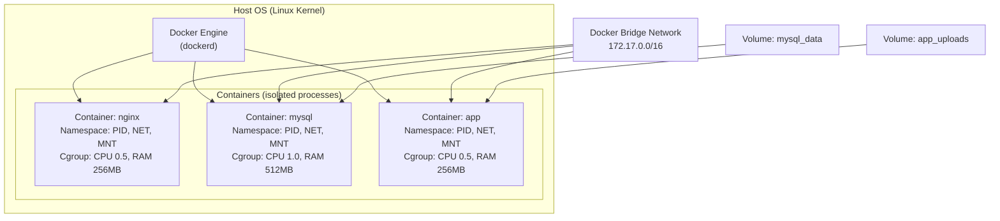
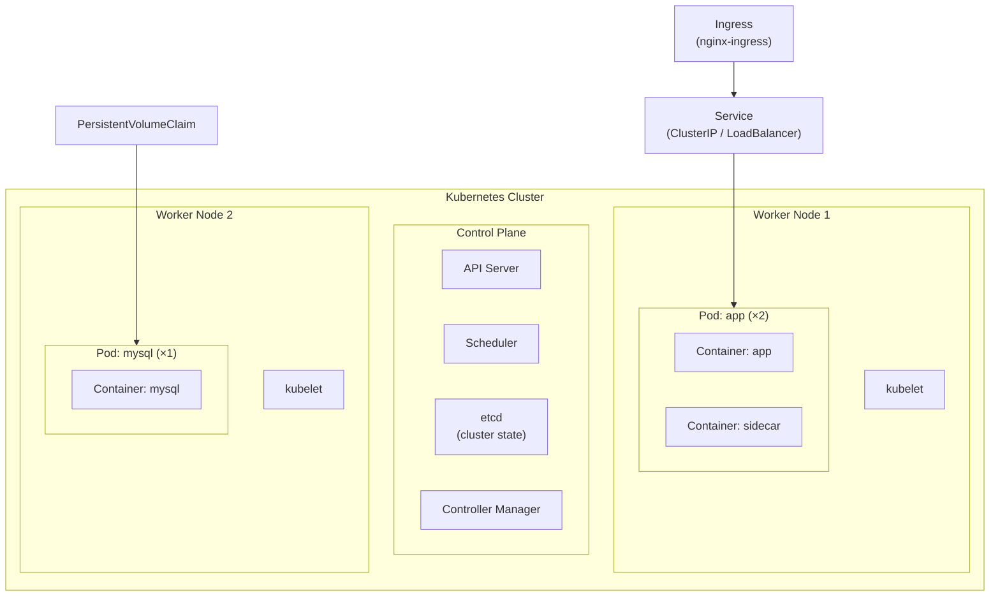

# 30 — Docker & Containers

> **[← Index](00_INDEX.md)** | **Related: [Cloud & Remote Access](17_Cloud_Remote_Access.md) · [Nginx & Apache](25_Nginx_Apache.md) · [CI/CD](27_CICD_Fundamentals.md) · [IaC](28_IaC_Terraform_Ansible.md)**

---

## Container Architecture



### Linux Kernel Features Behind Containers

| Feature | Purpose |
|---------|---------|
| **Namespaces** | Isolation: PID, network, mount, UTS (hostname), IPC, user |
| **cgroups** | Resource limits: CPU, memory, I/O, network |
| **Union FS (OverlayFS)** | Layered image filesystem — each layer is read-only |
| **seccomp** | System call filtering (security) |
| **Capabilities** | Fine-grained privilege control (instead of full root) |

---

## Docker Image Layers

```
Image: myapp:1.0
┌─────────────────────────────────────┐
│ Layer 5: COPY . /app         (R/W)  │ ← Your app code
├─────────────────────────────────────┤
│ Layer 4: RUN npm ci           (R/O) │ ← Dependencies
├─────────────────────────────────────┤
│ Layer 3: COPY package*.json . (R/O) │ ← package.json
├─────────────────────────────────────┤
│ Layer 2: RUN apt install curl (R/O) │ ← System packages
├─────────────────────────────────────┤
│ Layer 1: FROM node:20-alpine  (R/O) │ ← Base image
└─────────────────────────────────────┘
Each layer = SHA256 hash
Shared across images that use same base → saves disk space
```

---

## Dockerfile — Complete Reference

```dockerfile
# ── Base Image ────────────────────────────────────────
FROM node:20-alpine AS base

# Good practice: pin exact version for reproducibility
# FROM node:20.12.1-alpine3.19 AS base

# ── Labels ────────────────────────────────────────────
LABEL maintainer="alice@example.com"
LABEL version="1.0"
LABEL description="My Node.js Application"

# ── Environment ───────────────────────────────────────
ENV NODE_ENV=production \
    PORT=3000 \
    APP_DIR=/app

# ── Working Directory ─────────────────────────────────
WORKDIR $APP_DIR

# ── System Dependencies ───────────────────────────────
RUN apk add --no-cache \
    curl \
    bash \
    && rm -rf /var/cache/apk/*

# ── Create non-root user ──────────────────────────────
RUN addgroup -g 1001 -S nodejs \
    && adduser -S -u 1001 -G nodejs nodeuser

# ── Install app dependencies ──────────────────────────
# Copy package files FIRST (separate layer — cached unless deps change)
COPY --chown=nodeuser:nodejs package*.json ./

RUN npm ci --only=production \
    && npm cache clean --force

# ── Copy application code ─────────────────────────────
COPY --chown=nodeuser:nodejs . .

# ── Switch to non-root user ───────────────────────────
USER nodeuser

# ── Health Check ──────────────────────────────────────
HEALTHCHECK --interval=30s --timeout=10s --start-period=40s --retries=3 \
    CMD curl -f http://localhost:$PORT/health || exit 1

# ── Expose port ───────────────────────────────────────
EXPOSE $PORT

# ── Start command ─────────────────────────────────────
# ENTRYPOINT = fixed command (cannot be overridden easily)
# CMD        = default arguments (can be overridden)
ENTRYPOINT ["node"]
CMD ["server.js"]

# Or use exec form (preferred — no shell, signals handled correctly):
CMD ["node", "server.js"]
```

### Multi-Stage Build (Best Practice)

```dockerfile
# Stage 1: Build
FROM node:20-alpine AS builder

WORKDIR /app
COPY package*.json ./
RUN npm ci                           # Install ALL deps (including devDeps)
COPY . .
RUN npm run build                    # Compile TypeScript / bundle
RUN npm prune --production          # Remove dev dependencies

# Stage 2: Production
FROM node:20-alpine AS production

RUN addgroup -g 1001 -S nodejs && adduser -S -u 1001 -G nodejs nodeuser

WORKDIR /app

# Copy ONLY what's needed from builder stage
COPY --from=builder --chown=nodeuser:nodejs /app/dist ./dist
COPY --from=builder --chown=nodeuser:nodejs /app/node_modules ./node_modules
COPY --from=builder --chown=nodeuser:nodejs /app/package.json ./

USER nodeuser

HEALTHCHECK --interval=30s --timeout=5s \
    CMD wget -qO- http://localhost:3000/health || exit 1

EXPOSE 3000
CMD ["node", "dist/server.js"]
```

### Multi-Stage for PHP/Laravel

```dockerfile
# Stage 1: Composer dependencies
FROM composer:2 AS composer

WORKDIR /app
COPY composer.json composer.lock ./
RUN composer install --no-dev --no-scripts --prefer-dist --optimize-autoloader

# Stage 2: Node.js build (frontend assets)
FROM node:20-alpine AS node-builder

WORKDIR /app
COPY package*.json ./
RUN npm ci
COPY . .
RUN npm run build

# Stage 3: Production PHP image
FROM php:8.3-fpm-alpine AS production

RUN apk add --no-cache \
    nginx \
    supervisor \
    && docker-php-ext-install pdo pdo_mysql opcache

WORKDIR /var/www/html

COPY --from=composer /app/vendor ./vendor
COPY --from=node-builder /app/public/build ./public/build
COPY . .

# Set permissions
RUN chown -R www-data:www-data /var/www/html/storage /var/www/html/bootstrap/cache

COPY docker/nginx.conf /etc/nginx/nginx.conf
COPY docker/supervisord.conf /etc/supervisord.conf
COPY docker/php.ini /usr/local/etc/php/conf.d/custom.ini

EXPOSE 80

CMD ["/usr/bin/supervisord", "-c", "/etc/supervisord.conf"]
```

---

## Docker Commands — Complete Reference

### Image Management

```bash
# Pull images
docker pull nginx:latest
docker pull nginx:1.25-alpine
docker pull ubuntu:22.04

# List images
docker images
docker images --filter "dangling=true"    # Untagged/unused images

# Build image
docker build -t myapp:1.0 .
docker build -t myapp:1.0 -f Dockerfile.prod .
docker build --no-cache -t myapp:1.0 .   # Ignore cache
docker build --target production -t myapp:1.0 .  # Specific stage

# Tag image
docker tag myapp:1.0 myapp:latest
docker tag myapp:1.0 registry.example.com/myapp:1.0

# Push/pull from registry
docker login registry.example.com
docker push registry.example.com/myapp:1.0
docker pull registry.example.com/myapp:1.0

# Remove images
docker rmi myapp:1.0
docker image prune                        # Remove dangling images
docker image prune -a                     # Remove ALL unused images

# Inspect image
docker inspect myapp:1.0
docker history myapp:1.0                  # Layer history + sizes
docker image ls --format "table {{.Repository}}\t{{.Tag}}\t{{.Size}}"
```

### Container Management

```bash
# Run containers
docker run nginx                                   # Foreground
docker run -d nginx                                # Detached (background)
docker run -d -p 8080:80 nginx                     # Port mapping host:container
docker run -d -p 127.0.0.1:8080:80 nginx           # Bind to localhost only
docker run -d --name mynginx nginx                 # Named container
docker run -d -e DB_HOST=localhost nginx           # Environment variable
docker run -d --env-file .env nginx                # From file
docker run -d -v /host/path:/container/path nginx  # Bind mount
docker run -d -v myvolume:/data nginx              # Named volume
docker run --rm nginx echo "hello"                 # Auto-remove on exit
docker run -it ubuntu bash                         # Interactive shell
docker run -d --restart unless-stopped nginx       # Auto-restart policy

# Restart policies:
# no              = never restart (default)
# always          = always restart
# unless-stopped  = restart unless manually stopped
# on-failure[:N]  = restart on non-zero exit, max N times

# Container lifecycle
docker ps                         # Running containers
docker ps -a                      # All containers
docker ps --format "table {{.Names}}\t{{.Status}}\t{{.Ports}}"
docker start mynginx
docker stop mynginx               # SIGTERM (graceful)
docker stop -t 5 mynginx         # 5 second timeout
docker kill mynginx               # SIGKILL (immediate)
docker restart mynginx
docker pause mynginx              # Freeze
docker unpause mynginx

# Remove containers
docker rm mynginx                 # Must be stopped first
docker rm -f mynginx              # Force remove running container
docker container prune            # Remove all stopped containers

# Inspect and debug
docker logs mynginx               # View stdout/stderr
docker logs -f mynginx            # Follow logs
docker logs --tail 50 mynginx     # Last 50 lines
docker logs --since 1h mynginx    # Last 1 hour
docker exec -it mynginx bash      # Shell into running container
docker exec mynginx cat /etc/nginx/nginx.conf  # Run command
docker inspect mynginx            # Full JSON metadata
docker stats                      # Live resource usage
docker stats --no-stream          # One-time snapshot
docker top mynginx                # Processes inside container
docker diff mynginx               # Changed files vs image
docker cp mynginx:/etc/nginx/nginx.conf ./nginx.conf  # Copy file out
docker cp ./nginx.conf mynginx:/etc/nginx/nginx.conf  # Copy file in
```

---

## Docker Compose — Full Reference

Docker Compose orchestrates multi-container applications.

### Complete `docker-compose.yml`

```yaml
# docker-compose.yml
version: '3.9'

# ── Networks ──────────────────────────────────────────
networks:
  frontend:
    driver: bridge
  backend:
    driver: bridge
    internal: true          # No internet access (DB isolation)

# ── Volumes ───────────────────────────────────────────
volumes:
  mysql_data:
    driver: local
  redis_data:
    driver: local
  app_uploads:
    driver: local

# ── Services ──────────────────────────────────────────
services:

  # Nginx reverse proxy
  nginx:
    image: nginx:1.25-alpine
    container_name: nginx
    restart: unless-stopped
    ports:
      - "80:80"
      - "443:443"
    volumes:
      - ./docker/nginx/nginx.conf:/etc/nginx/nginx.conf:ro
      - ./docker/nginx/sites:/etc/nginx/conf.d:ro
      - /etc/letsencrypt:/etc/letsencrypt:ro
      - app_uploads:/var/www/uploads:ro
    networks:
      - frontend
    depends_on:
      app:
        condition: service_healthy
    logging:
      driver: "json-file"
      options:
        max-size: "10m"
        max-file: "3"

  # Laravel application
  app:
    build:
      context: .
      dockerfile: Dockerfile
      target: production
      args:
        PHP_VERSION: "8.3"
    image: myapp:${APP_VERSION:-latest}
    container_name: app
    restart: unless-stopped
    environment:
      APP_ENV: ${APP_ENV:-production}
      APP_KEY: ${APP_KEY}
      DB_HOST: mysql
      DB_PORT: 3306
      DB_DATABASE: ${DB_DATABASE}
      DB_USERNAME: ${DB_USERNAME}
      DB_PASSWORD: ${DB_PASSWORD}
      REDIS_HOST: redis
      REDIS_PORT: 6379
    env_file:
      - .env
    volumes:
      - app_uploads:/var/www/html/storage/app/public
    networks:
      - frontend
      - backend
    depends_on:
      mysql:
        condition: service_healthy
      redis:
        condition: service_healthy
    healthcheck:
      test: ["CMD", "curl", "-f", "http://localhost/api/health"]
      interval: 30s
      timeout: 10s
      retries: 3
      start_period: 40s

  # Queue worker
  queue:
    image: myapp:${APP_VERSION:-latest}
    container_name: queue-worker
    restart: unless-stopped
    command: php artisan queue:work --sleep=3 --tries=3 --max-time=3600
    env_file:
      - .env
    networks:
      - backend
    depends_on:
      - mysql
      - redis

  # MySQL database
  mysql:
    image: mysql:8.0
    container_name: mysql
    restart: unless-stopped
    environment:
      MYSQL_ROOT_PASSWORD: ${DB_ROOT_PASSWORD}
      MYSQL_DATABASE: ${DB_DATABASE}
      MYSQL_USER: ${DB_USERNAME}
      MYSQL_PASSWORD: ${DB_PASSWORD}
    volumes:
      - mysql_data:/var/lib/mysql
      - ./docker/mysql/my.cnf:/etc/mysql/conf.d/custom.cnf:ro
      - ./docker/mysql/init:/docker-entrypoint-initdb.d:ro  # Init SQL scripts
    networks:
      - backend
    healthcheck:
      test: ["CMD", "mysqladmin", "ping", "-h", "localhost"]
      interval: 10s
      timeout: 5s
      retries: 5
      start_period: 30s
    deploy:
      resources:
        limits:
          memory: 512M

  # Redis cache
  redis:
    image: redis:7-alpine
    container_name: redis
    restart: unless-stopped
    command: redis-server --appendonly yes --maxmemory 256mb --maxmemory-policy allkeys-lru
    volumes:
      - redis_data:/data
    networks:
      - backend
    healthcheck:
      test: ["CMD", "redis-cli", "ping"]
      interval: 10s
      timeout: 5s
      retries: 3
```

### Docker Compose Commands

```bash
# Start services
docker compose up                   # Foreground (Ctrl+C to stop)
docker compose up -d                # Detached (background)
docker compose up -d --build        # Rebuild images first
docker compose up -d nginx app      # Specific services only

# Stop services
docker compose stop                 # Stop (keep containers)
docker compose down                 # Stop + remove containers
docker compose down -v              # Stop + remove containers + volumes ⚠️

# Scaling
docker compose up -d --scale app=3  # Run 3 app instances

# Logs
docker compose logs                 # All services
docker compose logs -f app          # Follow specific service
docker compose logs --tail=100

# Status
docker compose ps
docker compose top                  # Processes in containers

# Execute commands
docker compose exec app bash
docker compose exec app php artisan migrate
docker compose exec mysql mysql -u root -p

# Build
docker compose build                # Build all images
docker compose build app            # Build specific service
docker compose build --no-cache app

# Pull images
docker compose pull

# Run one-off command (new container, then remove)
docker compose run --rm app php artisan db:seed
docker compose run --rm app php artisan key:generate

# Restart
docker compose restart app
```

---

## Docker Networking

```bash
# Network types
# bridge  = default, isolated from host, containers talk via name
# host    = shares host network stack (no isolation)
# none    = no networking
# overlay = multi-host (Docker Swarm/Kubernetes)

# List networks
docker network ls

# Create custom network
docker network create mynet
docker network create --driver bridge --subnet 172.20.0.0/16 mynet

# Connect container to network
docker network connect mynet mycontainer
docker network disconnect mynet mycontainer

# Inspect network
docker network inspect mynet

# DNS resolution between containers
# Containers on same custom network can reach each other by service name
# app container can connect to: mysql:3306, redis:6379
```

---

## Docker Volumes

```bash
# Create volume
docker volume create mydata

# List volumes
docker volume ls

# Inspect volume
docker volume inspect mydata

# Mount volume
docker run -v mydata:/data nginx
docker run -v /host/path:/container/path nginx    # Bind mount
docker run -v /host/path:/container/path:ro nginx # Read-only

# Remove volumes
docker volume rm mydata
docker volume prune                # Remove unused volumes ⚠️

# Backup volume
docker run --rm \
    -v mydata:/data \
    -v $(pwd):/backup \
    alpine tar czf /backup/mydata_backup.tar.gz /data

# Restore volume
docker run --rm \
    -v mydata:/data \
    -v $(pwd):/backup \
    alpine tar xzf /backup/mydata_backup.tar.gz -C /
```

---

## Docker Registry

```bash
# Docker Hub (default)
docker login
docker tag myapp:1.0 username/myapp:1.0
docker push username/myapp:1.0
docker pull username/myapp:1.0

# GitHub Container Registry
docker login ghcr.io -u USERNAME --password-stdin <<< "$GITHUB_TOKEN"
docker tag myapp:1.0 ghcr.io/username/myapp:1.0
docker push ghcr.io/username/myapp:1.0

# Self-hosted registry
docker run -d -p 5000:5000 --name registry \
    -v /registry-data:/var/lib/registry \
    registry:2

docker tag myapp:1.0 localhost:5000/myapp:1.0
docker push localhost:5000/myapp:1.0
docker pull localhost:5000/myapp:1.0
```

---

## System Cleanup

```bash
# Show disk usage
docker system df
docker system df -v               # Verbose (per image/container/volume)

# Clean everything unused
docker system prune               # Stopped containers, unused networks, dangling images
docker system prune -a            # Also remove unused images (not just dangling)
docker system prune -a --volumes  # Also remove volumes ⚠️ DANGEROUS

# Individual cleanup
docker container prune            # Stopped containers
docker image prune -a             # Unused images
docker volume prune               # Unused volumes
docker network prune              # Unused networks
```

---

## Kubernetes — Concepts Overview

Kubernetes (K8s) orchestrates containers across multiple hosts.



### Key K8s Resources

| Resource | Purpose |
|----------|---------|
| **Pod** | Smallest unit — one or more containers sharing network/storage |
| **Deployment** | Manages ReplicaSets, rolling updates |
| **Service** | Stable network endpoint for pods (load balances) |
| **Ingress** | HTTP routing rules → services |
| **ConfigMap** | Non-sensitive config data |
| **Secret** | Sensitive data (base64 encoded) |
| **PersistentVolume** | Cluster storage resource |
| **Namespace** | Virtual cluster — isolate environments |

```yaml
# Basic Deployment
apiVersion: apps/v1
kind: Deployment
metadata:
  name: myapp
  namespace: production
spec:
  replicas: 3
  selector:
    matchLabels:
      app: myapp
  template:
    metadata:
      labels:
        app: myapp
    spec:
      containers:
        - name: app
          image: myapp:1.0
          ports:
            - containerPort: 3000
          env:
            - name: DB_PASSWORD
              valueFrom:
                secretKeyRef:
                  name: db-secret
                  key: password
          resources:
            requests:
              cpu: "100m"
              memory: "128Mi"
            limits:
              cpu: "500m"
              memory: "512Mi"
          livenessProbe:
            httpGet:
              path: /health
              port: 3000
            initialDelaySeconds: 30
            periodSeconds: 10
          readinessProbe:
            httpGet:
              path: /ready
              port: 3000
            initialDelaySeconds: 5
            periodSeconds: 5
```

---

## Docker Security Best Practices

```dockerfile
# ✓ Use specific image tags (not :latest in production)
FROM node:20.12.1-alpine3.19

# ✓ Run as non-root user
RUN adduser -D -u 1001 appuser
USER appuser

# ✓ Minimal base image (alpine, distroless, scratch)
FROM gcr.io/distroless/nodejs20-debian12

# ✓ No sensitive data in Dockerfile/image
# ✗ ENV DB_PASSWORD=secret    ← never do this
# ✓ Pass secrets at runtime via --env-file or secrets manager

# ✓ Copy only what's needed
COPY --chown=appuser:appuser src/ /app/src/

# ✓ Use .dockerignore
# .dockerignore:
# .git/
# node_modules/
# .env
# *.log
# tests/
# Dockerfile*
# README.md
```

```bash
# Scan image for vulnerabilities
docker scout cves myapp:1.0
trivy image myapp:1.0              # Install trivy separately

# Limit container capabilities
docker run --cap-drop ALL --cap-add NET_BIND_SERVICE nginx

# Read-only filesystem
docker run --read-only --tmpfs /tmp nginx

# No new privileges
docker run --security-opt no-new-privileges nginx
```

---

## Related Topics

- [Cloud & Remote Access ←](17_Cloud_Remote_Access.md) — SSH, VMs
- [CI/CD ←](27_CICD_Fundamentals.md) — Docker in pipelines
- [IaC ←](28_IaC_Terraform_Ansible.md) — provision container infrastructure
- [Nginx & Apache ←](25_Nginx_Apache.md) — Nginx as reverse proxy in Docker
- [Monitoring & Logging ←](13_Monitoring_Logging.md) — container logs
- [Security Concepts ←](14_Security_Concepts.md) — container security

---

> [Index](00_INDEX.md)
