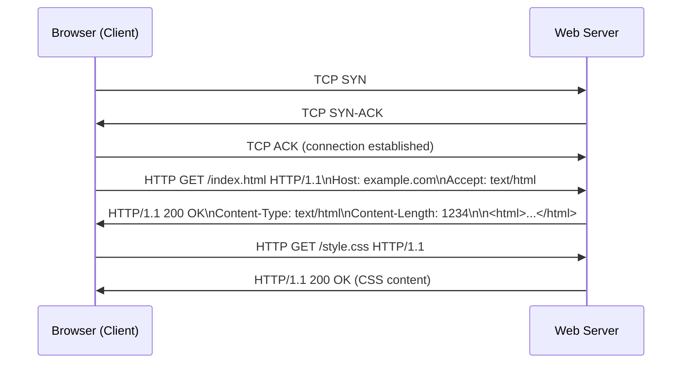
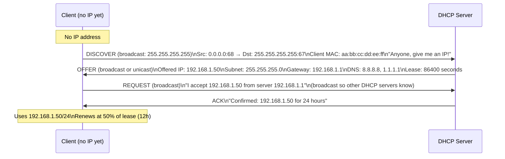
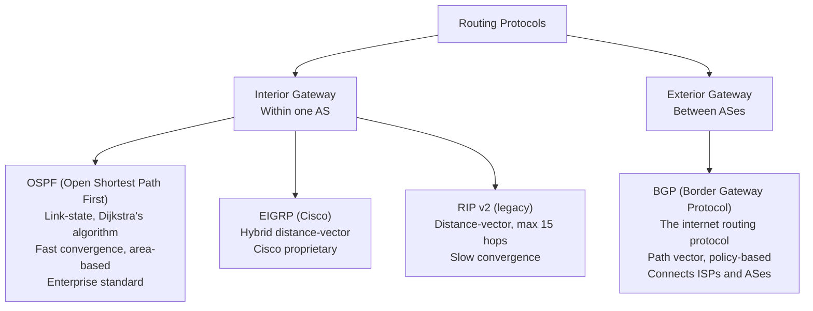
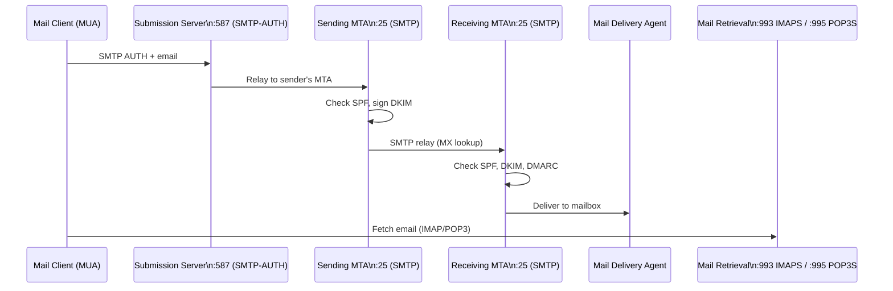
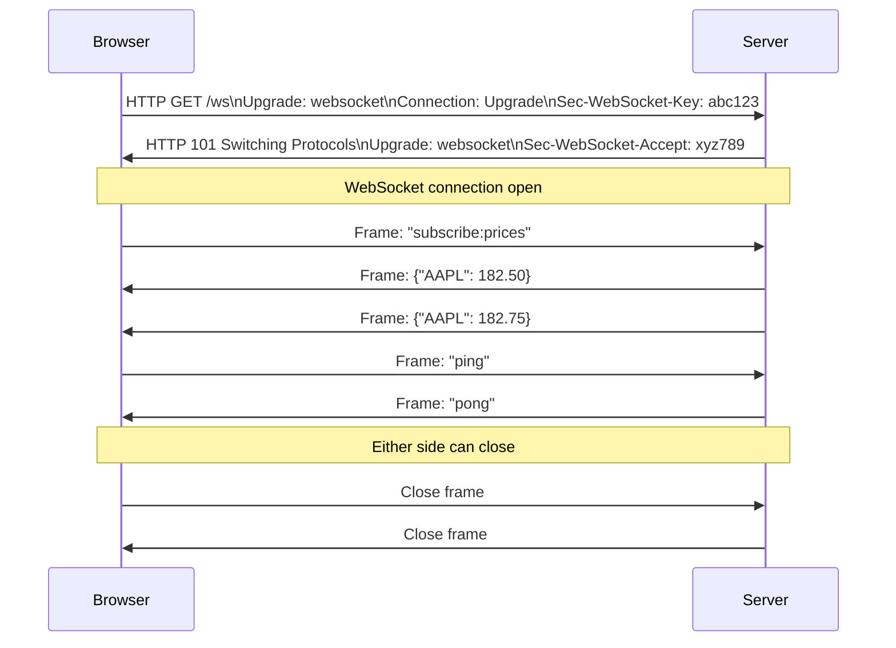

# 32 — Network Protocols Deep Dive

> **[← Index](00_INDEX.md)** | **Related: [Networking Fundamentals](07_Networking_Fundamentals.md) · [Networking Tools](08_Networking_Tools.md) · [DNS Deep Dive](22_DNS_Deep_Dive.md) · [Security Concepts](14_Security_Concepts.md)**

---

## HTTP / HTTPS — HyperText Transfer Protocol

### HTTP Request / Response Cycle



### HTTP Methods

| Method | Purpose | Body | Idempotent | Safe |
|--------|---------|------|-----------|------|
| **GET** | Retrieve resource | No | ✅ | ✅ |
| **POST** | Create resource / submit data | Yes | ❌ | ❌ |
| **PUT** | Replace resource entirely | Yes | ✅ | ❌ |
| **PATCH** | Partial update | Yes | ❌ | ❌ |
| **DELETE** | Remove resource | No | ✅ | ❌ |
| **HEAD** | Same as GET but no body | No | ✅ | ✅ |
| **OPTIONS** | What methods are allowed | No | ✅ | ✅ |

### HTTP Status Codes

| Range | Category | Common Codes |
|-------|---------|-------------|
| **1xx** | Informational | 100 Continue, 101 Switching Protocols |
| **2xx** | Success | 200 OK, 201 Created, 204 No Content |
| **3xx** | Redirection | 301 Moved Permanently, 302 Found, 304 Not Modified |
| **4xx** | Client Error | 400 Bad Request, 401 Unauthorized, 403 Forbidden, 404 Not Found, 429 Too Many Requests |
| **5xx** | Server Error | 500 Internal Server Error, 502 Bad Gateway, 503 Service Unavailable, 504 Gateway Timeout |

### HTTP Headers

```http
# Request Headers
GET /api/users HTTP/1.1
Host: api.example.com
Authorization: Bearer eyJhbGc...
Accept: application/json
Accept-Encoding: gzip, br
Content-Type: application/json
Content-Length: 42
Cookie: session=abc123
User-Agent: Mozilla/5.0 (X11; Linux x86_64)
X-Request-ID: f4e3d2c1

# Response Headers
HTTP/1.1 200 OK
Content-Type: application/json; charset=utf-8
Content-Length: 234
Cache-Control: max-age=3600, public
ETag: "abc123xyz"
Set-Cookie: session=def456; HttpOnly; Secure; SameSite=Strict
X-RateLimit-Limit: 100
X-RateLimit-Remaining: 87
Strict-Transport-Security: max-age=31536000; includeSubDomains
```

### HTTP/1.1 vs HTTP/2 vs HTTP/3

```
HTTP/1.1:
  - Text-based protocol
  - One request per TCP connection (unless pipelining)
  - Head-of-line blocking

HTTP/2:
  - Binary protocol (more efficient)
  - Multiplexing: multiple requests over ONE connection
  - Header compression (HPACK)
  - Server push
  - Still over TCP (head-of-line blocking at TCP level)

HTTP/3:
  - Built on QUIC (UDP-based)
  - Eliminates TCP head-of-line blocking
  - Faster connection setup (0-RTT)
  - Better on lossy networks
```

### Caching

```http
# Response tells client how to cache
Cache-Control: max-age=86400         # Cache for 24h
Cache-Control: no-cache              # Validate before serving
Cache-Control: no-store              # Never cache (sensitive data)
Cache-Control: private               # Only browser cache (not CDN)
Cache-Control: public                # CDN + browser cacheable
ETag: "v2.3.1"                       # Version fingerprint
Last-Modified: Mon, 22 Apr 2024 10:00:00 GMT

# Client sends conditional request
If-None-Match: "v2.3.1"             # Server returns 304 if unchanged
If-Modified-Since: Mon, 22 Apr 2024 10:00:00 GMT
```

---

## DHCP — Dynamic Host Configuration Protocol

DHCP automatically assigns IP configuration to network clients.

### DORA Process (Deep Dive)



### DHCP Lease Renewal

```
Lease = 24 hours
T1 (50%) = 12h → unicast REQUEST to same server
T2 (87.5%) = 21h → broadcast REQUEST (if T1 failed)
Expire (100%) = 24h → must get new lease (rebind)
```

### DHCP Options (Key Ones)

| Option | Code | Description |
|--------|------|-------------|
| Subnet Mask | 1 | 255.255.255.0 |
| Router (Gateway) | 3 | 192.168.1.1 |
| DNS Servers | 6 | 8.8.8.8, 1.1.1.1 |
| Hostname | 12 | client-hostname |
| Domain Name | 15 | corp.example.com |
| Broadcast Address | 28 | 192.168.1.255 |
| Lease Time | 51 | 86400 |
| NTP Servers | 42 | 192.168.1.1 |
| TFTP Server | 66 | PXE boot server |
| Boot File | 67 | pxelinux.0 |

### Linux DHCP Server (isc-dhcp-server)

```bash
# /etc/dhcp/dhcpd.conf
default-lease-time 86400;
max-lease-time 172800;
authoritative;

# Global options
option domain-name "corp.example.com";
option domain-name-servers 192.168.1.10, 192.168.1.11;
option ntp-servers 192.168.1.1;

# Subnet declaration
subnet 192.168.1.0 netmask 255.255.255.0 {
    range 192.168.1.100 192.168.1.200;
    option routers 192.168.1.1;
    option broadcast-address 192.168.1.255;
}

# Static assignment (reservation)
host printer01 {
    hardware ethernet aa:bb:cc:dd:ee:ff;
    fixed-address 192.168.1.50;
    option host-name "printer01";
}
```

```bash
sudo systemctl start isc-dhcp-server
# View leases
cat /var/lib/dhcp/dhcpd.leases
```

---

## ARP — Address Resolution Protocol

ARP resolves IP addresses to MAC addresses on a local network.

```
Question: "Who has 192.168.1.1? Tell 192.168.1.100"
  → Broadcast frame: FF:FF:FF:FF:FF:FF
  → All devices on segment receive it

Answer: "192.168.1.1 is at aa:bb:cc:11:22:33"
  → Unicast back to requester

Result: ARP cache updated
  192.168.1.1 → aa:bb:cc:11:22:33 (expires ~20 min)
```

```bash
# View ARP cache
arp -a                              # Linux/Windows
ip neigh show                       # Linux (modern)

# Add static ARP entry
sudo arp -s 192.168.1.10 aa:bb:cc:dd:ee:ff

# Gratuitous ARP (device announces its own IP→MAC)
# Used when: IP change, failover, duplicate IP detection

# ARP Spoofing (attack)
# Attacker sends fake ARP: "I am the gateway"
# → MITM position
# Defense: Dynamic ARP Inspection (DAI) on managed switches
```

---

## TCP In Depth

### TCP Segment Structure

```
 0                   1                   2                   3
 0 1 2 3 4 5 6 7 8 9 0 1 2 3 4 5 6 7 8 9 0 1 2 3 4 5 6 7 8 9 0 1
+-+-+-+-+-+-+-+-+-+-+-+-+-+-+-+-+-+-+-+-+-+-+-+-+-+-+-+-+-+-+-+-+
|          Source Port          |       Destination Port        |
+-+-+-+-+-+-+-+-+-+-+-+-+-+-+-+-+-+-+-+-+-+-+-+-+-+-+-+-+-+-+-+-+
|                        Sequence Number                        |
+-+-+-+-+-+-+-+-+-+-+-+-+-+-+-+-+-+-+-+-+-+-+-+-+-+-+-+-+-+-+-+-+
|                    Acknowledgment Number                      |
+-+-+-+-+-+-+-+-+-+-+-+-+-+-+-+-+-+-+-+-+-+-+-+-+-+-+-+-+-+-+-+-+
|  Data |     |U|A|P|R|S|F|                                    |
| Offset|Rsrvd|R|C|S|S|Y|I|            Window                  |
|       |     |G|K|H|T|N|N|                                    |
+-+-+-+-+-+-+-+-+-+-+-+-+-+-+-+-+-+-+-+-+-+-+-+-+-+-+-+-+-+-+-+-+
|           Checksum            |         Urgent Pointer        |
+-+-+-+-+-+-+-+-+-+-+-+-+-+-+-+-+-+-+-+-+-+-+-+-+-+-+-+-+-+-+-+-+
```

### TCP Flags

| Flag | Meaning |
|------|---------|
| **SYN** | Synchronize — initiate connection |
| **ACK** | Acknowledge — confirm receipt |
| **FIN** | Finish — graceful close |
| **RST** | Reset — abrupt close / refuse |
| **PSH** | Push — send data immediately |
| **URG** | Urgent data |

### TCP Flow Control and Congestion Control

```
Window Size = how much data can be in-flight before needing ACK

Slow Start:
  cwnd starts at 1 MSS
  Doubles every RTT until ssthresh
  Then grows linearly (Congestion Avoidance)

On packet loss:
  ssthresh = cwnd / 2
  cwnd = 1 MSS (Tahoe) or ssthresh (Reno)
  Restart slow start
```

---

## UDP — User Datagram Protocol

```
UDP Header (8 bytes only):
+------------------+------------------+
|    Source Port   |  Dest Port       |
+------------------+------------------+
|    Length        |  Checksum        |
+------------------+------------------+
|         Data...                     |
+-------------------------------------+
```

**Why use UDP when it's unreliable?**

- **Speed** — no handshake, no retransmit overhead
- **Real-time** — late data is useless (video, VoIP, gaming)
- **Application handles reliability** — QUIC (HTTP/3) builds reliability on top of UDP
- **Broadcast/Multicast** — TCP is unicast only

| Use Case | Why UDP |
|---------|---------|
| DNS queries | Small, fast, application retries |
| Video streaming | Dropped frame OK, latency matters |
| VoIP / WebRTC | Real-time, jitter > loss |
| Online gaming | Position updates → stale = useless |
| NTP | Small packets, accuracy via math not retransmit |
| DHCP | Broadcast required |
| SNMP | Simple polling, small packets |

---

## ICMP — Internet Control Message Protocol

ICMP carries control messages — not data. Lives at Layer 3 (IP).

| Type | Code | Meaning |
|------|------|---------|
| 0 | 0 | Echo Reply (ping response) |
| 3 | 0 | Destination Net Unreachable |
| 3 | 1 | Destination Host Unreachable |
| 3 | 3 | Destination Port Unreachable |
| 4 | 0 | Source Quench (throttle sender) |
| 5 | 0 | Redirect (use different gateway) |
| 8 | 0 | Echo Request (ping) |
| 11 | 0 | TTL Exceeded (traceroute) |
| 12 | 0 | Bad IP Header |

```bash
# Traceroute uses ICMP TTL exceeded messages
# Send packet with TTL=1 → first router decrements to 0 → sends ICMP TTL exceeded
# Send packet with TTL=2 → second router responds
# Continue until destination reached (sends ICMP Echo Reply or Port Unreachable)

# Firewall blocks ICMP? Use TCP traceroute
traceroute -T -p 80 google.com          # TCP SYN on port 80
```

---

## Routing Protocols

### Static vs Dynamic Routing

```
Static:
  Manually configured routes
  Predictable, no overhead
  ✗ Doesn't adapt to failures

Dynamic:
  Routers share topology automatically
  Adapts to failures
  Protocols: OSPF, BGP, EIGRP, RIP
```

### Key Routing Protocols



### Linux Routing

```bash
# View routing table
ip route show
route -n                            # Legacy command

# Add routes
sudo ip route add 10.0.0.0/8 via 192.168.1.1          # Static route
sudo ip route add default via 192.168.1.1              # Default gateway
sudo ip route add 192.168.2.0/24 dev eth1             # Direct route

# Delete route
sudo ip route del 10.0.0.0/8

# Persistent routes
# /etc/network/interfaces (Debian):
# up ip route add 10.0.0.0/8 via 192.168.1.1

# Enable IP forwarding (make Linux a router)
sudo sysctl -w net.ipv4.ip_forward=1
echo "net.ipv4.ip_forward=1" | sudo tee /etc/sysctl.d/99-routing.conf
```

---

## SMTP — Email Protocol



### SMTP Conversation

```
Client → Server: EHLO mail.sender.com
Server → Client: 250-mail.receiver.com
                 250-AUTH LOGIN PLAIN
                 250-STARTTLS
Client → Server: MAIL FROM:<alice@sender.com>
Server → Client: 250 OK
Client → Server: RCPT TO:<bob@receiver.com>
Server → Client: 250 OK
Client → Server: DATA
Server → Client: 354 Start mail input
Client → Server: From: Alice <alice@sender.com>
                 To: Bob <bob@receiver.com>
                 Subject: Hello
                 
                 Message body here.
                 .
Server → Client: 250 OK: queued as abc123
Client → Server: QUIT
```

---

## FTP and SFTP

```
FTP (Insecure — avoid in production):
  Port 21: Control channel (commands)
  Port 20: Data channel (active mode)
  OR ephemeral port (passive mode — better for firewalls)

SFTP (Secure — use this):
  Port 22: SSH protocol, fully encrypted
  Not related to FTP — completely different protocol
```

```bash
# SFTP
sftp user@host
sftp -P 2222 user@host

# Inside SFTP session:
ls / lls              # Remote / local listing
cd / lcd              # Remote / local cd
put localfile         # Upload
get remotefile        # Download
mput *.csv            # Upload multiple
mget *.csv            # Download multiple
mkdir dirname
rm remotefile
bye

# Non-interactive SFTP (batch)
sftp user@host <<EOF
put backup.tar.gz /uploads/
bye
EOF
```

---

## WebSockets

WebSockets provide **full-duplex** communication over a single TCP connection — unlike HTTP's request-response.



```nginx
# Nginx WebSocket proxy
location /ws/ {
    proxy_pass http://backend;
    proxy_http_version 1.1;
    proxy_set_header Upgrade $http_upgrade;
    proxy_set_header Connection "upgrade";
    proxy_set_header Host $host;
    proxy_read_timeout 3600s;      # Keep alive for 1 hour
}
```

---

## Related Topics

- [Networking Fundamentals ←](07_Networking_Fundamentals.md) — OSI, IP, TCP/UDP
- [Networking Tools ←](08_Networking_Tools.md) — practical tools
- [DNS Deep Dive ←](22_DNS_Deep_Dive.md) — DNS protocol
- [Security Concepts ←](14_Security_Concepts.md) — protocol attacks
- [Nginx & Apache ←](25_Nginx_Apache.md) — HTTP server config
- [Email & Mail Servers →](33_Email_Mail_Servers.md)

---

> [Index](00_INDEX.md)
