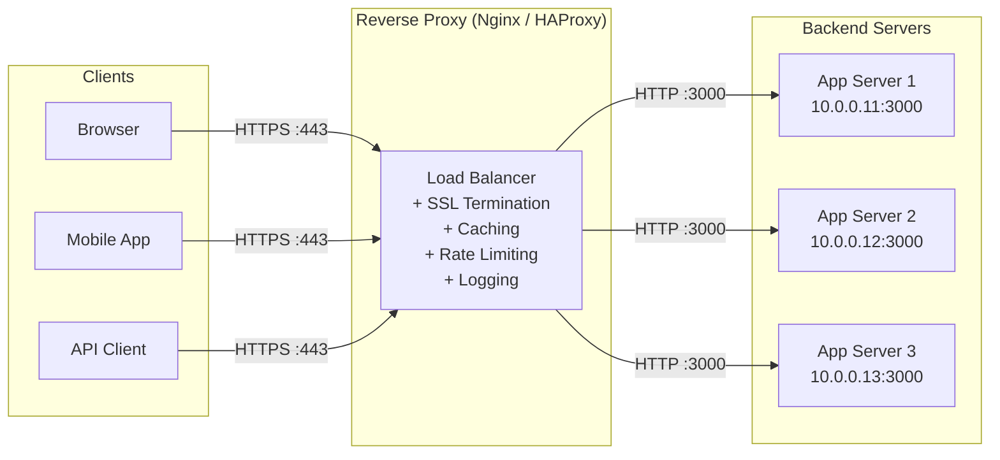
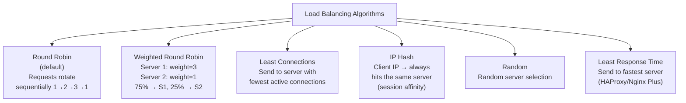
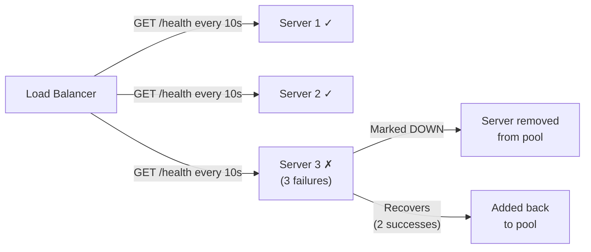

# 34 — Load Balancing & Reverse Proxy

> **[← Index](00_INDEX.md)** | **Related: [Nginx & Apache](25_Nginx_Apache.md) · [Networking Fundamentals](07_Networking_Fundamentals.md) · [Docker & Containers](30_Docker_Containers.md) · [SSL/TLS](26_SSL_TLS_Certificates.md)**

---

## What is a Reverse Proxy?

A **reverse proxy** sits in front of backend servers, accepting client requests and forwarding them to the appropriate server.



### Why Use a Reverse Proxy?

| Benefit | Description |
|---------|-------------|
| **SSL Termination** | Handle HTTPS once at the proxy; backends use plain HTTP |
| **Load Balancing** | Distribute traffic across multiple servers |
| **Caching** | Cache responses to reduce backend load |
| **Rate Limiting** | Protect backends from abuse |
| **Centralized Logging** | All requests logged in one place |
| **Security** | Hide backend topology from clients |
| **Static File Serving** | Serve static files without hitting the app |
| **Compression** | gzip/brotli at the proxy layer |

---

## Load Balancing Algorithms



---

## Nginx Load Balancing

### Round Robin (Default)

```nginx
upstream backend {
    server 10.0.0.11:3000;
    server 10.0.0.12:3000;
    server 10.0.0.13:3000;
}

server {
    listen 80;
    server_name example.com;

    location / {
        proxy_pass http://backend;
        proxy_set_header Host              $host;
        proxy_set_header X-Real-IP         $remote_addr;
        proxy_set_header X-Forwarded-For   $proxy_add_x_forwarded_for;
        proxy_set_header X-Forwarded-Proto $scheme;
    }
}
```

### Weighted Round Robin

```nginx
upstream backend {
    server 10.0.0.11:3000 weight=5;    # Gets 5/7 of requests
    server 10.0.0.12:3000 weight=2;    # Gets 2/7 of requests
}
```

### Least Connections

```nginx
upstream backend {
    least_conn;
    server 10.0.0.11:3000;
    server 10.0.0.12:3000;
    server 10.0.0.13:3000;
}
```

### IP Hash (Session Affinity / Sticky Sessions)

```nginx
upstream backend {
    ip_hash;                           # Same client IP → same server
    server 10.0.0.11:3000;
    server 10.0.0.12:3000;
}
```

### Server States and Health

```nginx
upstream backend {
    server 10.0.0.11:3000;
    server 10.0.0.12:3000;
    server 10.0.0.13:3000 backup;      # Only used when others are down
    server 10.0.0.14:3000 down;        # Marked as down (excluded)

    # Connection tuning
    keepalive 32;                      # Keep 32 idle connections to upstream

    # Health check parameters
    server 10.0.0.11:3000 max_fails=3 fail_timeout=30s;
    # After 3 failures in 30s → mark as unavailable for 30s
}
```

### Complete Production Nginx Load Balancer

```nginx
# /etc/nginx/nginx.conf

user nginx;
worker_processes auto;
worker_rlimit_nofile 65535;

events {
    worker_connections 10000;
    multi_accept on;
    use epoll;
}

http {
    # ── Upstream Pool ─────────────────────────────────
    upstream api_backend {
        least_conn;
        keepalive 64;

        server 10.0.0.11:8000 weight=1 max_fails=3 fail_timeout=30s;
        server 10.0.0.12:8000 weight=1 max_fails=3 fail_timeout=30s;
        server 10.0.0.13:8000 weight=1 max_fails=3 fail_timeout=30s;
        server 10.0.0.14:8000 backup;
    }

    upstream static_backend {
        server 10.0.0.20:8080;
        server 10.0.0.21:8080;
    }

    # ── Rate Limiting ─────────────────────────────────
    limit_req_zone $binary_remote_addr zone=api:10m rate=100r/m;
    limit_req_zone $binary_remote_addr zone=auth:10m rate=10r/m;
    limit_conn_zone $binary_remote_addr zone=conn_limit:10m;

    # ── Caching ───────────────────────────────────────
    proxy_cache_path /var/cache/nginx levels=1:2
                     keys_zone=api_cache:10m
                     max_size=1g
                     inactive=60m
                     use_temp_path=off;

    # ── Log Format ────────────────────────────────────
    log_format main_ext '$remote_addr - $remote_user [$time_local] '
                        '"$request" $status $body_bytes_sent '
                        '"$http_referer" "$http_user_agent" '
                        'rt=$request_time uct=$upstream_connect_time '
                        'uht=$upstream_header_time urt=$upstream_response_time '
                        'cs=$upstream_cache_status';

    # ── HTTP → HTTPS Redirect ─────────────────────────
    server {
        listen 80 default_server;
        listen [::]:80 default_server;
        server_name _;
        return 301 https://$host$request_uri;
    }

    # ── Main HTTPS Server ─────────────────────────────
    server {
        listen 443 ssl http2;
        listen [::]:443 ssl http2;
        server_name api.example.com;

        # SSL
        ssl_certificate     /etc/letsencrypt/live/api.example.com/fullchain.pem;
        ssl_certificate_key /etc/letsencrypt/live/api.example.com/privkey.pem;
        ssl_protocols       TLSv1.2 TLSv1.3;
        ssl_ciphers         ECDHE-ECDSA-AES128-GCM-SHA256:ECDHE-RSA-AES128-GCM-SHA256;
        ssl_session_cache   shared:SSL:10m;
        ssl_session_timeout 1d;

        # Security headers
        add_header Strict-Transport-Security "max-age=63072000; includeSubDomains; preload" always;
        add_header X-Frame-Options SAMEORIGIN always;
        add_header X-Content-Type-Options nosniff always;

        access_log /var/log/nginx/api.access.log main_ext;
        error_log  /var/log/nginx/api.error.log warn;

        # ── Static files (no backend needed) ──────────
        location /static/ {
            proxy_pass         http://static_backend;
            proxy_cache        api_cache;
            proxy_cache_valid  200 1d;
            proxy_cache_use_stale error timeout updating;
            add_header X-Cache-Status $upstream_cache_status;
            expires 30d;
        }

        # ── Auth endpoints (strict rate limit) ────────
        location ~ ^/api/(auth|login|register) {
            limit_req  zone=auth burst=5 nodelay;
            limit_req_status 429;
            proxy_pass http://api_backend;
            include /etc/nginx/proxy_params;
        }

        # ── API endpoints ─────────────────────────────
        location /api/ {
            limit_req  zone=api burst=50 nodelay;
            limit_conn conn_limit 20;
            limit_req_status 429;

            proxy_pass         http://api_backend;
            proxy_http_version 1.1;
            proxy_set_header   Connection "";
            include /etc/nginx/proxy_params;

            # Timeouts
            proxy_connect_timeout 5s;
            proxy_send_timeout    60s;
            proxy_read_timeout    60s;
        }

        # ── Health check endpoint ─────────────────────
        location /health {
            access_log off;
            return 200 "healthy\n";
            add_header Content-Type text/plain;
        }

        # ── Upstream health check status ──────────────
        location /nginx_status {
            stub_status;
            allow 127.0.0.1;
            allow 10.0.0.0/8;
            deny all;
        }
    }
}
```

### `/etc/nginx/proxy_params`

```nginx
# /etc/nginx/proxy_params
proxy_http_version 1.1;
proxy_set_header Host               $host;
proxy_set_header X-Real-IP          $remote_addr;
proxy_set_header X-Forwarded-For    $proxy_add_x_forwarded_for;
proxy_set_header X-Forwarded-Proto  $scheme;
proxy_set_header X-Forwarded-Host   $host;
proxy_set_header X-Forwarded-Port   $server_port;
proxy_set_header Upgrade            $http_upgrade;
proxy_set_header Connection         "upgrade";
proxy_buffering                     on;
proxy_buffer_size                   128k;
proxy_buffers                       4 256k;
proxy_busy_buffers_size             256k;
```

---

## HAProxy

HAProxy is a dedicated, high-performance TCP/HTTP load balancer. Often preferred over Nginx for pure load balancing.

### Installation

```bash
sudo apt install haproxy
sudo systemctl enable haproxy
```

### `/etc/haproxy/haproxy.cfg`

```haproxy
global
    log         /dev/log local0
    log         /dev/log local1 notice
    chroot      /var/lib/haproxy
    stats       socket /run/haproxy/admin.sock mode 660 level admin
    maxconn     50000
    user        haproxy
    group       haproxy
    daemon

defaults
    log         global
    mode        http
    option      httplog
    option      dontlognull
    option      forwardfor
    option      http-server-close
    timeout     connect 5s
    timeout     client  30s
    timeout     server  30s
    errorfile   400 /etc/haproxy/errors/400.http
    errorfile   503 /etc/haproxy/errors/503.http

# ── Stats Page ────────────────────────────────────────
listen stats
    bind *:8404
    stats enable
    stats uri /stats
    stats refresh 10s
    stats auth admin:strongpassword
    stats show-legends

# ── Frontend (what clients connect to) ───────────────
frontend http_front
    bind *:80
    redirect scheme https if !{ ssl_fc }

frontend https_front
    bind *:443 ssl crt /etc/ssl/certs/example.com.pem
    default_backend api_back

    # ACL-based routing
    acl is_api      path_beg /api/
    acl is_static   path_beg /static/
    acl is_ws       hdr(Upgrade) -i websocket

    use_backend static_back if is_static
    use_backend ws_back      if is_ws
    use_backend api_back     if is_api
    default_backend api_back

# ── Backends (server pools) ───────────────────────────
backend api_back
    balance leastconn
    option  httpchk GET /health HTTP/1.1\r\nHost:\ localhost

    server app1 10.0.0.11:3000 check inter 10s fall 3 rise 2
    server app2 10.0.0.12:3000 check inter 10s fall 3 rise 2
    server app3 10.0.0.13:3000 check inter 10s fall 3 rise 2
    server app4 10.0.0.14:3000 check inter 10s fall 3 rise 2 backup

backend static_back
    balance roundrobin
    server static1 10.0.0.20:8080 check
    server static2 10.0.0.21:8080 check

backend ws_back
    balance source          # Sticky for WebSocket
    option http-server-close
    option forceclose
    server ws1 10.0.0.11:3001 check
    server ws2 10.0.0.12:3001 check

# ── TCP Mode (for databases, non-HTTP) ───────────────
frontend mysql_front
    bind *:3306
    mode tcp
    default_backend mysql_back

backend mysql_back
    mode    tcp
    balance roundrobin
    server  db1 10.0.0.30:3306 check
    server  db2 10.0.0.31:3306 check backup
```

```bash
# Validate config
haproxy -c -f /etc/haproxy/haproxy.cfg

# Reload without dropping connections
sudo systemctl reload haproxy

# Runtime commands via socket
echo "show info" | sudo socat stdio /run/haproxy/admin.sock
echo "show stat" | sudo socat stdio /run/haproxy/admin.sock
echo "disable server api_back/app3" | sudo socat stdio /run/haproxy/admin.sock
echo "enable server api_back/app3"  | sudo socat stdio /run/haproxy/admin.sock
```

---

## Health Checks



### Application Health Endpoint

```javascript
// Express.js health endpoint
app.get('/health', async (req, res) => {
    try {
        // Check DB connection
        await db.query('SELECT 1');
        // Check Redis
        await redis.ping();

        res.status(200).json({
            status: 'healthy',
            timestamp: new Date().toISOString(),
            uptime: process.uptime(),
            db: 'connected',
            cache: 'connected'
        });
    } catch (err) {
        res.status(503).json({
            status: 'unhealthy',
            error: err.message
        });
    }
});
```

---

## SSL Termination vs SSL Passthrough

```
SSL TERMINATION (most common):
Client → [HTTPS] → Load Balancer → [HTTP] → Backend
         ↑ SSL cert here                     ↑ plain HTTP
Pros: Backend doesn't need to handle SSL; centralized certs
Cons: Traffic between LB and backend is unencrypted

SSL PASSTHROUGH:
Client → [HTTPS] → Load Balancer → [HTTPS] → Backend
                   ↑ cannot inspect L7         ↑ SSL cert here
Pros: End-to-end encryption; LB can't see content
Cons: Cannot do HTTP routing, caching, or header injection

# Nginx SSL passthrough (uses stream module, TCP level)
stream {
    upstream backend {
        server 10.0.0.11:443;
        server 10.0.0.12:443;
    }
    server {
        listen 443;
        proxy_pass backend;
    }
}
```

---

## Sticky Sessions (Session Persistence)

When your app stores session state on a single server, you need sticky sessions so the same client always hits the same server.

```nginx
# Nginx — sticky by cookie (requires nginx-sticky-module or Nginx Plus)
# Open source alternative: use ip_hash
upstream backend {
    ip_hash;           # Same IP → same server
    server 10.0.0.11:3000;
    server 10.0.0.12:3000;
}

# Better solution: store sessions in Redis (stateless backends)
# All app servers share the same Redis session store
# Then use least_conn or round-robin — no sticky needed
```

---

## Load Balancing Comparison

| Feature | Nginx | HAProxy | AWS ALB | Traefik |
|---------|-------|---------|---------|---------|
| HTTP LB | ✅ | ✅ | ✅ | ✅ |
| TCP LB | ✅ (stream) | ✅ | ✅ | ✅ |
| WebSocket | ✅ | ✅ | ✅ | ✅ |
| Active health check | Nginx Plus only | ✅ Free | ✅ | ✅ |
| Stats UI | Basic | ✅ Built-in | AWS Console | ✅ Dashboard |
| Dynamic config | ❌ (reload) | ✅ socket | ✅ | ✅ Auto |
| Docker-native | Manual | Manual | ❌ | ✅ Labels |
| SSL termination | ✅ | ✅ | ✅ | ✅ |
| gRPC | ✅ | ✅ | ✅ | ✅ |

---

## Related Topics

- [Nginx & Apache ←](25_Nginx_Apache.md) — Nginx config details
- [SSL/TLS Certificates ←](26_SSL_TLS_Certificates.md) — HTTPS on LB
- [Networking Fundamentals ←](07_Networking_Fundamentals.md) — OSI layer 4 vs 7
- [Docker & Containers ←](30_Docker_Containers.md) — Nginx in Docker
- [CI/CD ←](27_CICD_Fundamentals.md) — zero-downtime deployments
- [Monitoring & Logging ←](13_Monitoring_Logging.md) — LB logs

---

> [Index](00_INDEX.md)
