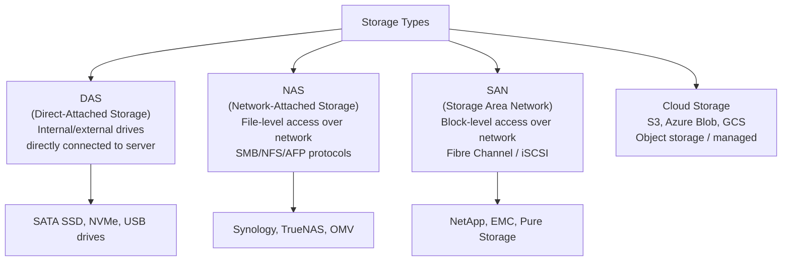
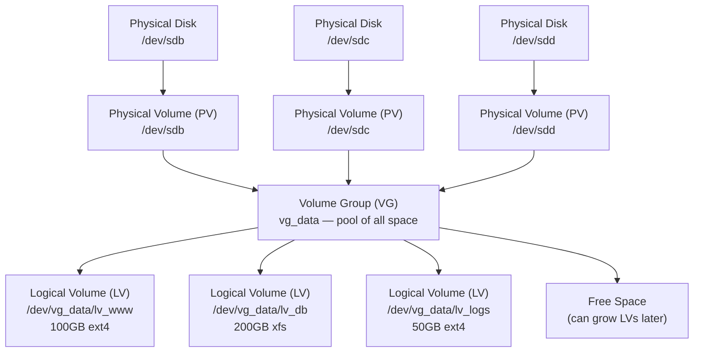

# 35 — Storage & RAID

> **[← Index](00_INDEX.md)** | **Related: [File System](02_File_System.md) · [Backup & DR](29_Backup_Disaster_Recovery.md) · [OS Fundamentals](01_OS_Fundamentals.md) · [Monitoring & Logging](13_Monitoring_Logging.md)**

---

## Storage Types Overview



### Storage Protocols

| Protocol | Type | Use Case | Speed |
|----------|------|----------|-------|
| **SATA** | Block (local) | General storage | 600 MB/s |
| **NVMe** | Block (local, PCIe) | High-speed SSD | 7000+ MB/s |
| **SAS** | Block (local) | Enterprise HDD/SSD | 1200 MB/s |
| **iSCSI** | Block (network) | SAN over Ethernet | Network speed |
| **NFS** | File (network) | Linux shared storage | Network speed |
| **SMB/CIFS** | File (network) | Windows/cross-platform | Network speed |
| **S3** | Object (network) | Cloud, unstructured data | Network speed |

---

## RAID — Redundant Array of Independent Disks

RAID combines multiple physical disks into a single logical unit for **redundancy** and/or **performance**.

### RAID Levels

#### RAID 0 — Striping (No Redundancy)

```
RAID 0:
Disk 1: A1 | A3 | A5
Disk 2: A2 | A4 | A6

Data is split (striped) across disks
READ: very fast (parallel)
WRITE: very fast (parallel)
Redundancy: NONE — one disk fails = total data loss
Usable capacity: 100% (sum of all disks)
Minimum disks: 2
Use case: High performance scratch/temp data, video editing
```

#### RAID 1 — Mirroring

```
RAID 1:
Disk 1: A1 | A2 | A3   (original)
Disk 2: A1 | A2 | A3   (exact copy)

Every write goes to both disks
READ: fast (can read from either disk)
WRITE: same as single disk
Redundancy: survives 1 disk failure
Usable capacity: 50% (only half the total)
Minimum disks: 2
Use case: OS drives, small critical data, boot drives
```

#### RAID 5 — Striping with Distributed Parity

```
RAID 5 (with 3 disks):
Disk 1: A1 | B1 | C1 | P4
Disk 2: A2 | B2 | P3 | C2
Disk 3: A3 | P2 | B3 | C3
                ↑ Parity blocks (XOR of data) distributed across disks

READ: very fast
WRITE: slower (must calculate parity)
Redundancy: survives 1 disk failure
Usable capacity: (n-1)/n  e.g., 3×2TB = 4TB usable
Minimum disks: 3
Rebuild time: SLOW (hours/days for large arrays) → risk of second failure
Use case: General purpose server storage, NAS
⚠️ Avoid with large (>2TB) drives — rebuild window = risk of URE error
```

#### RAID 6 — Striping with Double Parity

```
RAID 6:
Like RAID 5 but with TWO parity blocks
READ: fast
WRITE: slower (two parity calculations)
Redundancy: survives 2 simultaneous disk failures
Usable capacity: (n-2)/n  e.g., 4×2TB = 4TB usable
Minimum disks: 4
Use case: Large drives where RAID 5 is too risky
```

#### RAID 10 (1+0) — Mirrored Stripes

```
RAID 10 (4 disks):
Mirror Pair 1:  Disk 1 | Disk 2   (mirrors of each other)
Mirror Pair 2:  Disk 3 | Disk 4   (mirrors of each other)
              ↕ Striped across pairs

READ: very fast (striped + parallel)
WRITE: fast (only mirroring overhead)
Redundancy: survives 1 disk failure per mirror pair (potentially 2 total)
Usable capacity: 50%
Minimum disks: 4
Use case: High-performance + redundancy (databases, heavy write workloads)
Best of both worlds
```

### RAID Comparison Table

| RAID | Min Disks | Usable Capacity | Read | Write | Can Lose | Use Case |
|------|-----------|-----------------|------|-------|----------|---------|
| 0 | 2 | 100% | ⚡⚡⚡ | ⚡⚡⚡ | 0 disks | Temp/scratch |
| 1 | 2 | 50% | ⚡⚡ | ⚡ | 1 disk | OS, boot |
| 5 | 3 | (n-1)/n | ⚡⚡ | ⚡ | 1 disk | General NAS |
| 6 | 4 | (n-2)/n | ⚡⚡ | ⚡ | 2 disks | Large drives |
| 10 | 4 | 50% | ⚡⚡⚡ | ⚡⚡ | 1/pair | DB, high IOPS |

> ⚠️ **RAID is NOT a backup.** It protects against hardware failure, not accidental deletion, ransomware, or data corruption.

---

## Software RAID on Linux (mdadm)

### Create RAID Array

```bash
# Install mdadm
sudo apt install mdadm

# Wipe disks first (DESTRUCTIVE)
sudo wipefs -a /dev/sdb /dev/sdc /dev/sdd

# Create RAID 1 (mirror) with 2 disks
sudo mdadm --create /dev/md0 \
    --level=1 \
    --raid-devices=2 \
    /dev/sdb /dev/sdc

# Create RAID 5 with 3 disks
sudo mdadm --create /dev/md0 \
    --level=5 \
    --raid-devices=3 \
    /dev/sdb /dev/sdc /dev/sdd

# Create RAID 6 with 4 disks
sudo mdadm --create /dev/md0 \
    --level=6 \
    --raid-devices=4 \
    /dev/sdb /dev/sdc /dev/sdd /dev/sde

# Create RAID 10 with 4 disks
sudo mdadm --create /dev/md0 \
    --level=10 \
    --raid-devices=4 \
    /dev/sdb /dev/sdc /dev/sdd /dev/sde

# Monitor creation progress
watch -n 2 cat /proc/mdstat
```

### Format and Mount

```bash
# Create filesystem on RAID array
sudo mkfs.ext4 /dev/md0
sudo mkfs.xfs /dev/md0

# Mount
sudo mkdir /mnt/raid
sudo mount /dev/md0 /mnt/raid

# Auto-mount at boot — add to /etc/fstab
echo '/dev/md0  /mnt/raid  ext4  defaults,nofail  0  2' | sudo tee -a /etc/fstab

# Save RAID config
sudo mdadm --detail --scan | sudo tee -a /etc/mdadm/mdadm.conf
sudo update-initramfs -u
```

### Monitor and Manage

```bash
# Check RAID status
cat /proc/mdstat
sudo mdadm --detail /dev/md0
sudo mdadm --query /dev/md0

# Detailed disk status
sudo mdadm --examine /dev/sdb

# Mark disk as failed (simulate failure)
sudo mdadm /dev/md0 --fail /dev/sdc

# Remove failed disk
sudo mdadm /dev/md0 --remove /dev/sdc

# Add replacement disk (hot spare)
sudo mdadm /dev/md0 --add /dev/sde

# Watch rebuild progress
watch cat /proc/mdstat
# Rebuilding: [=====.......] 45% speed=100MB/s ETA=20min

# Email alerts on failure
# /etc/mdadm/mdadm.conf:
# MAILADDR admin@example.com
```

### RAID Status Output

```
/proc/mdstat output:
Personalities : [raid1] [raid5] [raid6]
md0 : active raid5 sdb[0] sdc[1] sdd[2]
      3906765824 blocks super 1.2 level 5, 512k chunk, algorithm 2 [3/3] [UUU]
                                                                      ↑↑↑
                                                                      U = Up
                                                                      F = Failed
                                                                      (rebuilding shows _)
```

---

## LVM — Logical Volume Manager

LVM adds a **flexible abstraction layer** over physical storage, allowing dynamic resizing, snapshots, and spanning multiple disks.



### LVM Commands

```bash
# ── Physical Volume (PV) ──────────────────────────────
# Initialize disk as PV
sudo pvcreate /dev/sdb /dev/sdc

# List PVs
pvdisplay
pvs

# ── Volume Group (VG) ────────────────────────────────
# Create VG from PVs
sudo vgcreate vg_data /dev/sdb /dev/sdc

# Extend VG by adding PV
sudo vgextend vg_data /dev/sdd

# List VGs
vgdisplay
vgs

# ── Logical Volume (LV) ───────────────────────────────
# Create LVs
sudo lvcreate -L 100G -n lv_www  vg_data
sudo lvcreate -L 200G -n lv_db   vg_data
sudo lvcreate -l 100%FREE -n lv_logs vg_data   # Use all remaining

# Create filesystem and mount
sudo mkfs.ext4 /dev/vg_data/lv_www
sudo mount /dev/vg_data/lv_www /var/www

# List LVs
lvdisplay
lvs

# ── Resize ────────────────────────────────────────────
# Extend LV by 50GB
sudo lvextend -L +50G /dev/vg_data/lv_www

# Extend and resize filesystem in one step
sudo lvextend -L +50G -r /dev/vg_data/lv_www

# Resize filesystem (ext4)
sudo resize2fs /dev/vg_data/lv_www

# Resize filesystem (xfs — only grow, not shrink)
sudo xfs_growfs /dev/vg_data/lv_db

# ── Snapshots ─────────────────────────────────────────
# Create snapshot of lv_db (10GB for changes)
sudo lvcreate -L 10G -s -n lv_db_snap /dev/vg_data/lv_db

# Mount snapshot read-only
sudo mount -o ro /dev/vg_data/lv_db_snap /mnt/snap

# Restore from snapshot
sudo lvconvert --merge /dev/vg_data/lv_db_snap

# Remove snapshot
sudo lvremove /dev/vg_data/lv_db_snap
```

---

## Disk Management Tools

```bash
# List block devices
lsblk                          # Tree view of block devices
lsblk -f                       # Show filesystem info
lsblk -o NAME,SIZE,TYPE,FSTYPE,MOUNTPOINT

# Disk information
sudo fdisk -l                  # List all disks and partitions
sudo fdisk -l /dev/sdb         # Specific disk
sudo parted /dev/sdb print     # Parted view
sudo blkid                     # Show UUIDs and types

# Disk usage
df -h                          # Mounted filesystem usage
df -i                          # Inode usage
du -sh /var/log/               # Directory size

# Disk health (SMART)
sudo apt install smartmontools
sudo smartctl -a /dev/sda      # Full SMART report
sudo smartctl -H /dev/sda      # Health check only
sudo smartctl -t short /dev/sda  # Run short self-test
# output: SMART overall-health self-assessment: PASSED

# I/O performance
sudo hdparm -tT /dev/sda       # Read speed benchmark
sudo dd if=/dev/zero of=/tmp/test bs=1M count=1024 conv=fdatasync  # Write test
iostat -x 1                    # Real-time I/O stats

# Partitioning
sudo fdisk /dev/sdb            # Interactive (MBR, <2TB)
sudo gdisk /dev/sdb            # Interactive (GPT, >2TB)
sudo parted /dev/sdb           # Advanced partitioning
```

---

## NFS — Network File System

NFS shares directories over the network (Linux-to-Linux).

```bash
# ── NFS Server ───────────────────────────────────────
sudo apt install nfs-kernel-server

# Define exports: /etc/exports
# Format: /path  client(options)
/var/www        192.168.1.0/24(ro,sync,no_subtree_check)
/shared         192.168.1.0/24(rw,sync,no_subtree_check,no_root_squash)
/home           10.0.0.100(rw,sync,no_subtree_check)

# Apply exports
sudo exportfs -a
sudo exportfs -v                   # Verify exports
sudo systemctl restart nfs-kernel-server

# ── NFS Client ───────────────────────────────────────
sudo apt install nfs-common

# Temporary mount
sudo mount -t nfs 10.0.0.1:/shared /mnt/shared

# Persistent mount (/etc/fstab)
10.0.0.1:/shared  /mnt/shared  nfs  defaults,_netdev  0  0

# Check mounts
showmount -e 10.0.0.1              # Show server's exports
mount | grep nfs
```

---

## Samba — SMB/CIFS File Sharing

Samba shares files with Windows clients (and Linux).

```bash
# Install
sudo apt install samba

# Create share directory
sudo mkdir -p /srv/samba/shared
sudo chmod 777 /srv/samba/shared

# /etc/samba/smb.conf
[global]
   workgroup = WORKGROUP
   server string = Samba Server %v
   netbios name = ubuntu-nas
   security = user
   map to guest = Bad User
   dns proxy = no

[shared]
   path = /srv/samba/shared
   browsable = yes
   writable = yes
   guest ok = yes
   read only = no
   force create mode = 0666
   force directory mode = 0777

[private]
   path = /srv/samba/private
   browsable = yes
   writable = yes
   guest ok = no
   valid users = alice bob

# Create Samba user (must exist as Linux user)
sudo useradd -M -s /sbin/nologin alice
sudo smbpasswd -a alice

# Test config
sudo testparm

# Restart
sudo systemctl restart smbd nmbd
sudo systemctl enable smbd

# ── Connect from Linux ───────────────────────────────
sudo apt install cifs-utils
sudo mount -t cifs //server/shared /mnt/samba -o username=alice,password=pass
sudo mount -t cifs //server/shared /mnt/samba -o credentials=/etc/samba/credentials

# /etc/samba/credentials (chmod 600)
username=alice
password=secret

# Persistent /etc/fstab
//10.0.0.1/shared  /mnt/samba  cifs  credentials=/etc/samba/creds,_netdev  0  0
```

---

## Related Topics

- [File System Structure ←](02_File_System.md) — filesystem concepts, inodes
- [Backup & DR ←](29_Backup_Disaster_Recovery.md) — RAID ≠ backup
- [Monitoring & Logging ←](13_Monitoring_Logging.md) — disk monitoring
- [OS Fundamentals ←](01_OS_Fundamentals.md) — storage in OS context
- [Docker & Containers ←](30_Docker_Containers.md) — Docker volumes

---

> [Index](00_INDEX.md)
