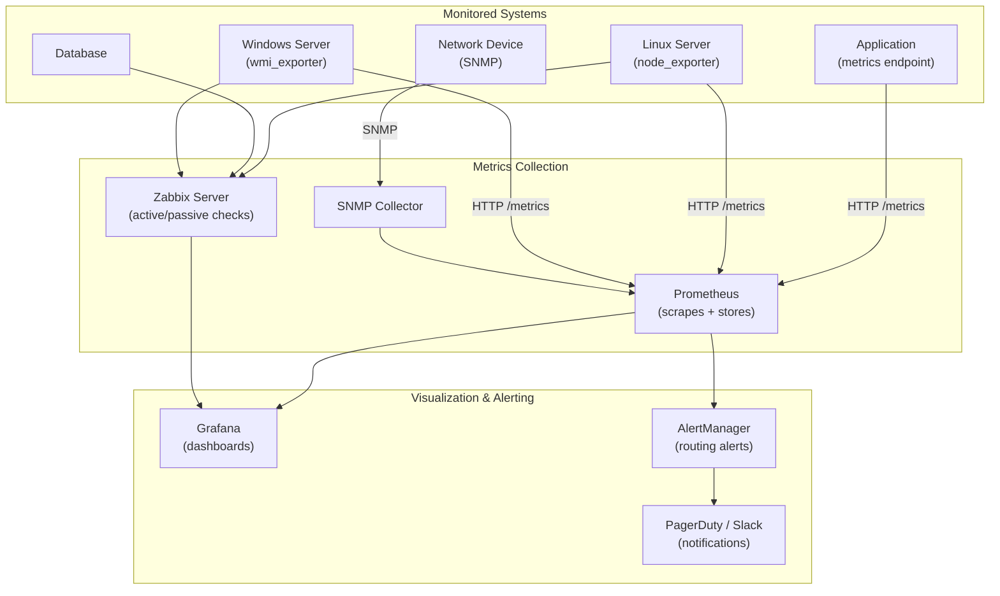

# 36 — SNMP & Network Monitoring (Prometheus, Grafana, Zabbix)

> **[← Index](00_INDEX.md)** | **Related: [Monitoring & Logging](13_Monitoring_Logging.md) · [Networking Fundamentals](07_Networking_Fundamentals.md) · [Docker & Containers](30_Docker_Containers.md) · [Bash Scripting](23_Bash_Scripting.md)**

---

## Monitoring Architecture Overview



---

## SNMP — Simple Network Management Protocol

SNMP is used to monitor and manage **network devices** (routers, switches, firewalls, printers, UPS).

- **Port:** UDP 161 (queries), UDP 162 (traps)
- **Versions:** v1 (legacy), v2c (common), v3 (secure — auth + encryption)

### SNMP Concepts

| Term | Meaning |
|------|---------|
| **OID** | Object Identifier — unique dot-notation ID for each metric (e.g., `1.3.6.1.2.1.1.1.0`) |
| **MIB** | Management Information Base — database of OIDs and their meaning |
| **Community String** | v1/v2c password (plain text, typically "public"/"private") |
| **GET** | Query a specific OID value |
| **WALK** | Query an entire OID subtree |
| **TRAP** | Unsolicited alert sent from device to manager |
| **Agent** | SNMP daemon running on the monitored device |
| **Manager** | System collecting/querying SNMP data |

### Common OIDs

```
System Info:
1.3.6.1.2.1.1.1.0    sysDescr        System description
1.3.6.1.2.1.1.3.0    sysUpTime       Uptime (in hundredths of seconds)
1.3.6.1.2.1.1.4.0    sysContact      Admin contact
1.3.6.1.2.1.1.5.0    sysName         Hostname
1.3.6.1.2.1.1.6.0    sysLocation     Physical location

Interfaces:
1.3.6.1.2.1.2.2.1.2  ifDescr         Interface name (eth0, Gi0/1)
1.3.6.1.2.1.2.2.1.5  ifSpeed         Interface speed (bps)
1.3.6.1.2.1.2.2.1.10 ifInOctets      Bytes received
1.3.6.1.2.1.2.2.1.16 ifOutOctets     Bytes sent
1.3.6.1.2.1.2.2.1.14 ifInErrors      Receive errors
1.3.6.1.2.1.2.2.1.20 ifOutErrors     Transmit errors

CPU / Memory (NET-SNMP):
1.3.6.1.4.1.2021.10.1.3.1  laLoad.1  1-min load average
1.3.6.1.4.1.2021.4.3.0     memTotalSwap
1.3.6.1.4.1.2021.4.4.0     memAvailSwap
1.3.6.1.4.1.2021.4.5.0     memTotalReal  Total RAM
1.3.6.1.4.1.2021.4.6.0     memAvailReal  Free RAM
```

### Installing SNMP Agent on Linux

```bash
# Install
sudo apt install snmpd snmp

# Configure: /etc/snmp/snmpd.conf
# SNMPv2c (simple, not secure — use only on trusted networks)
rocommunity  public  127.0.0.1             # Read-only, local only
rocommunity  public  192.168.1.0/24        # Read-only, local network
rwcommunity  private 127.0.0.1             # Read-write, local only

# Allow system info
syslocation  "Rack 3, DC1, Chennai"
syscontact   "Admin <admin@example.com>"

# Extend with disk/process monitoring
disk / 10%                                  # Alert if / < 10% free
proc nginx 1                                # Must have at least 1 nginx process

# SNMPv3 (secure — recommended for production)
# Create v3 user:
sudo systemctl stop snmpd
sudo net-snmp-create-v3-user -ro -A authpass -X encryptpass -a SHA -x AES snmpuser
sudo systemctl start snmpd

# Restart and enable
sudo systemctl restart snmpd
sudo systemctl enable snmpd
```

### SNMP Query Commands

```bash
# Basic queries
snmpget  -v2c -c public 192.168.1.1 1.3.6.1.2.1.1.1.0   # System description
snmpget  -v2c -c public 192.168.1.1 sysDescr.0           # By name
snmpwalk -v2c -c public 192.168.1.1 1.3.6.1.2.1.1        # Walk system OID tree
snmpwalk -v2c -c public 192.168.1.1 ifDescr               # All interface names

# SNMPv3 query
snmpget -v3 -l authPriv -u snmpuser -a SHA -A authpass -x AES -X encryptpass \
    192.168.1.1 sysUpTime.0

# Discover all OIDs on a device
snmpwalk -v2c -c public 192.168.1.1

# Get interface traffic counters
snmpget -v2c -c public switch.local \
    1.3.6.1.2.1.2.2.1.10.1 \   # ifInOctets for interface 1
    1.3.6.1.2.1.2.2.1.16.1      # ifOutOctets for interface 1

# Translate OID to human name
snmptranslate 1.3.6.1.2.1.1.1.0    # → .iso.org.dod.internet.mgmt.mib-2.system.sysDescr.0
snmptranslate -IR sysDescr          # → numeric OID
```

---

## Prometheus — Metrics Collection

Prometheus is a time-series database that **scrapes** metrics from HTTP endpoints.

### Installation

```bash
# Via Docker (recommended for quick start)
docker run -d \
    --name prometheus \
    -p 9090:9090 \
    -v /etc/prometheus:/etc/prometheus \
    -v prometheus_data:/prometheus \
    prom/prometheus

# Binary install
wget https://github.com/prometheus/prometheus/releases/download/v2.51.0/prometheus-2.51.0.linux-amd64.tar.gz
tar xzvf prometheus-*.tar.gz
sudo mv prometheus /usr/local/bin/
```

### `prometheus.yml` — Configuration

```yaml
# /etc/prometheus/prometheus.yml

global:
  scrape_interval:     15s          # How often to scrape
  evaluation_interval: 15s          # How often to evaluate rules
  scrape_timeout:      10s

# Alert rules files
rule_files:
  - "rules/*.yml"

# Alertmanager config
alerting:
  alertmanagers:
    - static_configs:
        - targets:
          - alertmanager:9093

# Scrape configs (what to monitor)
scrape_configs:

  # Prometheus itself
  - job_name: 'prometheus'
    static_configs:
      - targets: ['localhost:9090']

  # Linux servers via node_exporter
  - job_name: 'linux-servers'
    static_configs:
      - targets:
          - 'web1.example.com:9100'
          - 'web2.example.com:9100'
          - 'db1.example.com:9100'
    labels:
      env: production

  # Node exporter via file service discovery
  - job_name: 'node_exporter'
    file_sd_configs:
      - files:
          - '/etc/prometheus/targets/*.json'
        refresh_interval: 30s

  # Laravel/Node.js application metrics
  - job_name: 'myapp'
    metrics_path: /metrics
    static_configs:
      - targets: ['app1:8000', 'app2:8000']

  # MySQL exporter
  - job_name: 'mysql'
    static_configs:
      - targets: ['db1:9104']

  # Nginx exporter
  - job_name: 'nginx'
    static_configs:
      - targets: ['web1:9113', 'web2:9113']

  # SNMP exporter
  - job_name: 'snmp'
    static_configs:
      - targets: ['192.168.1.1']     # Network device IP
    metrics_path: /snmp
    params:
      module: [if_mib]
    relabel_configs:
      - source_labels: [__address__]
        target_label: __param_target
      - target_label: __address__
        replacement: snmp-exporter:9116
```

### Node Exporter (Linux Metrics)

```bash
# Install node_exporter on each Linux server
wget https://github.com/prometheus/node_exporter/releases/download/v1.7.0/node_exporter-1.7.0.linux-amd64.tar.gz
tar xzvf node_exporter-*.tar.gz
sudo mv node_exporter /usr/local/bin/

# Create systemd service
sudo tee /etc/systemd/system/node_exporter.service << 'EOF'
[Unit]
Description=Node Exporter
After=network.target

[Service]
User=node_exporter
ExecStart=/usr/local/bin/node_exporter \
    --collector.filesystem.mount-points-exclude="^/(sys|proc|dev|host|etc)($$|/)" \
    --collector.systemd \
    --collector.processes
Restart=on-failure

[Install]
WantedBy=multi-user.target
EOF

sudo useradd -M -s /sbin/nologin node_exporter
sudo systemctl daemon-reload
sudo systemctl enable --now node_exporter

# Test: should return metrics
curl http://localhost:9100/metrics | head -30
```

### PromQL — Query Language

```promql
# ── Basic Queries ─────────────────────────────────────
# CPU usage percentage
100 - (avg by(instance) (rate(node_cpu_seconds_total{mode="idle"}[5m])) * 100)

# Memory usage %
(1 - (node_memory_MemAvailable_bytes / node_memory_MemTotal_bytes)) * 100

# Disk usage %
(1 - (node_filesystem_avail_bytes{fstype!="tmpfs"} / node_filesystem_size_bytes{fstype!="tmpfs"})) * 100

# Network traffic (bytes/sec)
rate(node_network_receive_bytes_total{device="eth0"}[5m])
rate(node_network_transmit_bytes_total{device="eth0"}[5m])

# HTTP request rate (from app metrics)
rate(http_requests_total[5m])

# HTTP error rate
rate(http_requests_total{status=~"5.."}[5m]) / rate(http_requests_total[5m]) * 100

# 95th percentile response time
histogram_quantile(0.95, sum(rate(http_request_duration_seconds_bucket[5m])) by (le))

# Available disk space
node_filesystem_avail_bytes{mountpoint="/"} / 1024 / 1024 / 1024  # In GB

# ── Aggregation ───────────────────────────────────────
# Average CPU across all instances
avg(100 - (rate(node_cpu_seconds_total{mode="idle"}[5m]) * 100))

# Sum network traffic across all servers
sum(rate(node_network_receive_bytes_total[5m]))

# Max memory usage
max by(instance)(node_memory_MemTotal_bytes - node_memory_MemAvailable_bytes)

# ── Alerting Expressions ──────────────────────────────
# CPU > 80% for 5 minutes
100 - (avg by(instance)(rate(node_cpu_seconds_total{mode="idle"}[5m])) * 100) > 80

# Disk > 90% full
(1 - node_filesystem_avail_bytes / node_filesystem_size_bytes) * 100 > 90

# Service down (no data for 60s)
up{job="linux-servers"} == 0
```

### Alert Rules

```yaml
# /etc/prometheus/rules/alerts.yml
groups:
  - name: infrastructure
    rules:

      # Host down
      - alert: HostDown
        expr: up == 0
        for: 1m
        labels:
          severity: critical
        annotations:
          summary: "Host {{ $labels.instance }} is down"
          description: "{{ $labels.instance }} has been unreachable for more than 1 minute."

      # High CPU
      - alert: HighCPU
        expr: 100 - (avg by(instance)(rate(node_cpu_seconds_total{mode="idle"}[5m])) * 100) > 85
        for: 5m
        labels:
          severity: warning
        annotations:
          summary: "High CPU on {{ $labels.instance }}: {{ $value | printf \"%.1f\" }}%"

      # High Memory
      - alert: HighMemory
        expr: (1 - (node_memory_MemAvailable_bytes / node_memory_MemTotal_bytes)) * 100 > 90
        for: 5m
        labels:
          severity: warning
        annotations:
          summary: "High memory on {{ $labels.instance }}: {{ $value | printf \"%.1f\" }}%"

      # Disk almost full
      - alert: DiskAlmostFull
        expr: (1 - node_filesystem_avail_bytes{fstype!="tmpfs"} / node_filesystem_size_bytes{fstype!="tmpfs"}) * 100 > 85
        for: 10m
        labels:
          severity: warning
        annotations:
          summary: "Disk {{ $labels.mountpoint }} on {{ $labels.instance }} is {{ $value | printf \"%.1f\" }}% full"

      # High HTTP error rate
      - alert: HighErrorRate
        expr: rate(http_requests_total{status=~"5.."}[5m]) / rate(http_requests_total[5m]) * 100 > 5
        for: 5m
        labels:
          severity: critical
        annotations:
          summary: "High HTTP error rate: {{ $value | printf \"%.1f\" }}%"
```

---

## Grafana — Dashboards

```bash
# Install via Docker
docker run -d \
    --name grafana \
    -p 3000:3000 \
    -v grafana_data:/var/lib/grafana \
    -e GF_SECURITY_ADMIN_PASSWORD=admin \
    grafana/grafana

# Or apt
sudo apt install grafana
sudo systemctl enable --now grafana-server
# Access: http://localhost:3000 (admin/admin)
```

### Grafana as Code (dashboard provisioning)

```yaml
# /etc/grafana/provisioning/datasources/prometheus.yml
apiVersion: 1
datasources:
  - name: Prometheus
    type: prometheus
    url: http://prometheus:9090
    isDefault: true
    access: proxy
    jsonData:
      timeInterval: "15s"

# /etc/grafana/provisioning/dashboards/dashboards.yml
apiVersion: 1
providers:
  - name: 'default'
    folder: ''
    type: file
    options:
      path: /var/lib/grafana/dashboards
```

### Popular Grafana Dashboards (import by ID)

| Dashboard | ID | Monitors |
|-----------|-----|---------|
| Node Exporter Full | 1860 | Linux server metrics |
| MySQL Overview | 7362 | MySQL performance |
| Nginx | 9614 | Nginx traffic |
| Docker | 893 | Container stats |
| Kubernetes | 3119 | K8s cluster |
| HAProxy | 367 | HAProxy stats |

---

## Alertmanager — Alert Routing

```yaml
# /etc/alertmanager/alertmanager.yml
global:
  resolve_timeout: 5m
  slack_api_url: 'https://hooks.slack.com/services/xxx'

route:
  group_by: ['alertname', 'instance']
  group_wait: 30s
  group_interval: 5m
  repeat_interval: 12h
  receiver: 'default'

  routes:
    - match:
        severity: critical
      receiver: 'pagerduty'
    - match:
        severity: warning
      receiver: 'slack'

receivers:
  - name: 'default'
    slack_configs:
      - channel: '#alerts'
        text: "{{ range .Alerts }}{{ .Annotations.summary }}\n{{ end }}"

  - name: 'slack'
    slack_configs:
      - channel: '#monitoring'
        title: "{{ .GroupLabels.alertname }}"
        text: "{{ range .Alerts }}{{ .Annotations.description }}\n{{ end }}"
        send_resolved: true

  - name: 'pagerduty'
    pagerduty_configs:
      - service_key: 'YOUR_PAGERDUTY_KEY'

  - name: 'email'
    email_configs:
      - to: 'admin@example.com'
        from: 'alertmanager@example.com'
        smarthost: 'smtp.example.com:587'
        auth_username: 'alerts@example.com'
        auth_password: 'smtppassword'
```

---

## Zabbix — Enterprise Monitoring

Zabbix is an all-in-one monitoring solution with agents, SNMP support, and built-in alerting.

```bash
# Install Zabbix server (Ubuntu)
wget https://repo.zabbix.com/zabbix/6.4/ubuntu/pool/main/z/zabbix-release/zabbix-release_6.4-1+ubuntu22.04_all.deb
sudo dpkg -i zabbix-release_6.4-1+ubuntu22.04_all.deb
sudo apt update
sudo apt install zabbix-server-mysql zabbix-frontend-php zabbix-apache-conf zabbix-sql-scripts zabbix-agent

# Install Zabbix agent on monitored hosts
sudo apt install zabbix-agent

# /etc/zabbix/zabbix_agentd.conf
Server=10.0.0.5                    # Zabbix server IP (passive checks)
ServerActive=10.0.0.5              # Zabbix server IP (active checks)
Hostname=web1.example.com          # This host's name (must match in Zabbix UI)
LogFile=/var/log/zabbix/zabbix_agentd.log

# Start agent
sudo systemctl enable --now zabbix-agent
```

---

## Full Docker Compose Stack — Monitoring

```yaml
# docker-compose-monitoring.yml
version: '3.8'

volumes:
  prometheus_data:
  grafana_data:
  alertmanager_data:

networks:
  monitoring:
    driver: bridge

services:
  prometheus:
    image: prom/prometheus:v2.51.0
    container_name: prometheus
    restart: unless-stopped
    volumes:
      - ./prometheus:/etc/prometheus
      - prometheus_data:/prometheus
    command:
      - '--config.file=/etc/prometheus/prometheus.yml'
      - '--storage.tsdb.path=/prometheus'
      - '--storage.tsdb.retention.time=30d'
      - '--web.enable-lifecycle'
      - '--web.enable-admin-api'
    ports:
      - "9090:9090"
    networks:
      - monitoring

  alertmanager:
    image: prom/alertmanager:v0.27.0
    container_name: alertmanager
    restart: unless-stopped
    volumes:
      - ./alertmanager:/etc/alertmanager
      - alertmanager_data:/alertmanager
    ports:
      - "9093:9093"
    networks:
      - monitoring

  grafana:
    image: grafana/grafana:10.3.0
    container_name: grafana
    restart: unless-stopped
    environment:
      GF_SECURITY_ADMIN_USER: admin
      GF_SECURITY_ADMIN_PASSWORD: ${GRAFANA_PASSWORD}
      GF_USERS_ALLOW_SIGN_UP: false
    volumes:
      - grafana_data:/var/lib/grafana
      - ./grafana/provisioning:/etc/grafana/provisioning
    ports:
      - "3000:3000"
    networks:
      - monitoring
    depends_on:
      - prometheus

  node_exporter:
    image: prom/node-exporter:v1.7.0
    container_name: node_exporter
    restart: unless-stopped
    volumes:
      - /proc:/host/proc:ro
      - /sys:/host/sys:ro
      - /:/rootfs:ro
    command:
      - '--path.procfs=/host/proc'
      - '--path.rootfs=/rootfs'
      - '--path.sysfs=/host/sys'
    ports:
      - "9100:9100"
    networks:
      - monitoring

  cadvisor:
    image: gcr.io/cadvisor/cadvisor:latest
    container_name: cadvisor
    restart: unless-stopped
    privileged: true
    volumes:
      - /:/rootfs:ro
      - /var/run:/var/run:ro
      - /sys:/sys:ro
      - /var/lib/docker/:/var/lib/docker:ro
    ports:
      - "8080:8080"
    networks:
      - monitoring
```

---

## Related Topics

- [Monitoring & Logging ←](13_Monitoring_Logging.md) — Linux logs, Windows Event Viewer
- [Networking Fundamentals ←](07_Networking_Fundamentals.md) — SNMP port 161/162
- [Docker & Containers ←](30_Docker_Containers.md) — monitoring stack in Docker
- [Bash Scripting ←](23_Bash_Scripting.md) — custom monitoring scripts
- [Security Concepts ←](14_Security_Concepts.md) — SNMPv3 security

---

> [Index](00_INDEX.md)
