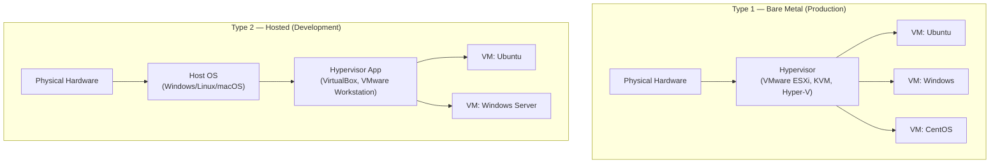

# 37 — Virtualization & Hypervisors (KVM, VMware, Hyper-V)

> **[← Index](00_INDEX.md)** | **Related: [OS Fundamentals](01_OS_Fundamentals.md) · [Cloud & Remote Access](17_Cloud_Remote_Access.md) · [Docker & Containers](30_Docker_Containers.md) · [Storage & RAID](35_Storage_RAID.md)**

---

## Virtualization Overview

**Virtualization** allows multiple operating systems to run simultaneously on one physical host by abstracting hardware resources.



| Type | Hypervisor | Host OS Needed | Performance | Use Case |
|------|-----------|----------------|-------------|---------|
| **Type 1** | VMware ESXi, KVM, Hyper-V, Xen | ❌ No | Excellent | Production servers |
| **Type 2** | VirtualBox, VMware Workstation, Parallels | ✅ Yes | Good | Dev/testing |

---

## KVM — Kernel-based Virtual Machine

KVM turns the Linux kernel itself into a Type-1 hypervisor. It is built into the Linux kernel and is free, open-source, and production-grade.

### Check CPU Virtualization Support

```bash
# Intel VT-x or AMD-V must be enabled
egrep -c '(vmx|svm)' /proc/cpuinfo    # > 0 = supported
lscpu | grep Virtualization            # VT-x or AMD-V
cat /proc/cpuinfo | grep -E 'vmx|svm' # Raw check

# Check KVM modules loaded
lsmod | grep kvm
# Expected: kvm_intel (or kvm_amd) + kvm
```

### Installation

```bash
# Ubuntu/Debian
sudo apt install -y \
    qemu-kvm \
    libvirt-daemon-system \
    libvirt-clients \
    bridge-utils \
    virtinst \
    virt-manager \
    ovmf               # UEFI firmware for VMs

sudo systemctl enable --now libvirtd
sudo usermod -aG libvirt,kvm $USER    # Add user to groups (re-login)

# Arch Linux
sudo pacman -S qemu-full libvirt virt-manager dnsmasq bridge-utils
sudo systemctl enable --now libvirtd

# Verify
virsh list --all
virt-host-validate    # Full validation
```

### Creating VMs — Command Line (`virt-install`)

```bash
# Create Ubuntu Server VM
virt-install \
  --name ubuntu-server-01 \
  --ram 2048 \
  --vcpus 2 \
  --disk path=/var/lib/libvirt/images/ubuntu-01.qcow2,size=20,format=qcow2 \
  --cdrom /tmp/ubuntu-22.04-live-server-amd64.iso \
  --os-variant ubuntu22.04 \
  --network bridge=virbr0 \
  --graphics vnc,listen=127.0.0.1 \
  --noautoconsole \
  --boot cdrom,hd

# Create Windows Server VM
virt-install \
  --name win-server-2022 \
  --ram 4096 \
  --vcpus 4 \
  --disk path=/var/lib/libvirt/images/win2022.qcow2,size=60,format=qcow2 \
  --cdrom /tmp/WinServer2022.iso \
  --os-variant win2k22 \
  --network bridge=virbr0 \
  --graphics spice \
  --boot cdrom,hd \
  --features kvm_hidden=on \
  --machine q35

# PXE boot VM (no ISO)
virt-install \
  --name pxe-client \
  --ram 2048 \
  --vcpus 2 \
  --disk path=/var/lib/libvirt/images/pxe-client.qcow2,size=20 \
  --network bridge=br0 \
  --os-variant generic \
  --boot network,hd \
  --pxe

# Clone existing VM
virt-clone \
  --original ubuntu-server-01 \
  --name ubuntu-server-02 \
  --file /var/lib/libvirt/images/ubuntu-02.qcow2
```

### Managing VMs — `virsh`

```bash
# ── List VMs ──────────────────────────────────────────
virsh list                          # Running VMs
virsh list --all                    # All VMs (running + stopped)
virsh list --inactive               # Only stopped

# ── Power control ─────────────────────────────────────
virsh start ubuntu-server-01        # Start VM
virsh shutdown ubuntu-server-01     # Graceful shutdown (ACPI)
virsh destroy ubuntu-server-01      # Force stop (like power off)
virsh reboot ubuntu-server-01       # Reboot
virsh suspend ubuntu-server-01      # Pause (freeze memory)
virsh resume ubuntu-server-01       # Resume paused VM
virsh reset ubuntu-server-01        # Hard reset

# ── Auto-start on host boot ───────────────────────────
virsh autostart ubuntu-server-01
virsh autostart --disable ubuntu-server-01

# ── VM info ───────────────────────────────────────────
virsh dominfo ubuntu-server-01      # VM details
virsh domstats ubuntu-server-01     # Resource usage
virsh vcpuinfo ubuntu-server-01     # vCPU info
virsh dommemstat ubuntu-server-01   # Memory stats
virsh domblkstat ubuntu-server-01   # Disk I/O stats
virsh domifstat ubuntu-server-01 vnet0  # Network stats

# ── Connect to console ────────────────────────────────
virsh console ubuntu-server-01      # Serial console
# Ctrl+] to exit

# ── Edit VM config ────────────────────────────────────
virsh edit ubuntu-server-01         # Opens XML in $EDITOR
virsh dumpxml ubuntu-server-01      # Print XML config
virsh dumpxml ubuntu-server-01 > vm-backup.xml  # Backup config

# ── Delete VM ─────────────────────────────────────────
virsh destroy ubuntu-server-01      # Stop first
virsh undefine ubuntu-server-01 --remove-all-storage  # Delete VM + disks
```

### Snapshots

```bash
# Create snapshot
virsh snapshot-create-as ubuntu-server-01 \
    --name "before-update-$(date +%Y%m%d)" \
    --description "Before kernel update" \
    --atomic

# List snapshots
virsh snapshot-list ubuntu-server-01
virsh snapshot-info ubuntu-server-01 --snapshotname "before-update-20240422"

# Revert to snapshot
virsh snapshot-revert ubuntu-server-01 --snapshotname "before-update-20240422"

# Delete snapshot
virsh snapshot-delete ubuntu-server-01 --snapshotname "before-update-20240422"

# External snapshot (disk-based — works while running)
virsh snapshot-create-as ubuntu-server-01 \
    --name "live-snap" \
    --disk-only \
    --atomic \
    --quiesce    # Freeze filesystem for consistency (needs qemu-guest-agent)
```

### Resource Management

```bash
# ── vCPU hot-plug ─────────────────────────────────────
virsh setvcpus ubuntu-server-01 4 --live     # Change vCPUs while running
virsh setvcpus ubuntu-server-01 4 --config   # Persist after reboot

# ── Memory hot-plug ───────────────────────────────────
virsh setmem ubuntu-server-01 4G --live
virsh setmem ubuntu-server-01 4G --config
virsh setmaxmem ubuntu-server-01 8G --config  # Set max memory

# ── Disk management ───────────────────────────────────
# Attach disk
virsh attach-disk ubuntu-server-01 \
    /var/lib/libvirt/images/extra.qcow2 \
    vdb \
    --subdriver qcow2 \
    --persistent

# Detach disk
virsh detach-disk ubuntu-server-01 vdb --persistent

# Resize disk image
virsh destroy ubuntu-server-01
qemu-img resize /var/lib/libvirt/images/ubuntu-01.qcow2 +20G
virsh start ubuntu-server-01
# Then resize partition inside VM with growpart/resize2fs

# ── Network ───────────────────────────────────────────
virsh attach-interface ubuntu-server-01 bridge br0 --persistent
virsh detach-interface ubuntu-server-01 bridge --mac 52:54:00:xx:xx:xx --persistent
```

### QEMU Disk Image Management

```bash
# Create disk image
qemu-img create -f qcow2 /var/lib/libvirt/images/new.qcow2 50G

# Image formats
# qcow2 = QEMU copy-on-write v2 (snapshots, compression, sparse)
# raw   = No overhead, best performance, no features
# vmdk  = VMware format
# vhd/vhdx = Hyper-V format

# Convert between formats
qemu-img convert -f vmdk -O qcow2 source.vmdk dest.qcow2
qemu-img convert -f qcow2 -O raw source.qcow2 dest.raw
qemu-img convert -p -f qcow2 -O vmdk source.qcow2 dest.vmdk  # Show progress

# Info about image
qemu-img info disk.qcow2

# Check and repair
qemu-img check disk.qcow2
qemu-img check -r all disk.qcow2  # Repair

# Compress qcow2 (make smaller for storage/transfer)
qemu-img convert -O qcow2 -c source.qcow2 compressed.qcow2

# Merge snapshots (flatten)
qemu-img convert -O qcow2 with-snapshots.qcow2 flat.qcow2
```

### Networking — Bridge vs NAT

```bash
# ── Default NAT network (virbr0) ─────────────────────
# VMs get 192.168.122.x, can reach internet via NAT
# Host can reach VMs but external hosts cannot
virsh net-list --all
virsh net-info default
virsh net-start default
virsh net-autostart default

# ── Bridge network (direct LAN access) ───────────────
# VMs get IP from your real DHCP, visible to LAN

# Create bridge (Ubuntu Netplan)
# /etc/netplan/01-bridge.yaml
cat > /etc/netplan/01-bridge.yaml << 'EOF'
network:
  version: 2
  renderer: networkd
  ethernets:
    enp3s0:
      dhcp4: false
  bridges:
    br0:
      interfaces: [enp3s0]
      dhcp4: true
      parameters:
        stp: false
        forward-delay: 0
EOF
sudo netplan apply

# Create libvirt bridge network
cat > bridge-network.xml << 'EOF'
<network>
  <name>bridge-net</name>
  <forward mode="bridge"/>
  <bridge name="br0"/>
</network>
EOF
virsh net-define bridge-network.xml
virsh net-start bridge-net
virsh net-autostart bridge-net
```

---

## VMware ESXi — Key Concepts

```
ESXi Architecture:
┌──────────────────────────────────────────────┐
│                 vSphere Client               │ ← Web UI / management
├──────────────────────────────────────────────┤
│                   vCenter                   │ ← Central management (optional)
├──────────────────────────────────────────────┤
│              VMware ESXi Host               │
│  ┌──────────┐ ┌──────────┐ ┌────────────┐  │
│  │   VM 1   │ │   VM 2   │ │    VM 3    │  │
│  └──────────┘ └──────────┘ └────────────┘  │
│           VMkernel (Type-1)                 │
├──────────────────────────────────────────────┤
│              Physical Hardware              │
└──────────────────────────────────────────────┘
```

### ESXi CLI (SSH or ESXi Shell)

```bash
# List VMs
esxcli vm process list
vim-cmd vmsvc/getallvms

# Power control
vim-cmd vmsvc/power.on   <vmid>
vim-cmd vmsvc/power.off  <vmid>
vim-cmd vmsvc/power.shutdown <vmid>
vim-cmd vmsvc/power.reboot   <vmid>

# Snapshot
vim-cmd vmsvc/snapshot.create <vmid> "snapshot-name" "description"
vim-cmd vmsvc/snapshot.get    <vmid>
vim-cmd vmsvc/snapshot.revert <vmid>
vim-cmd vmsvc/snapshot.removeall <vmid>

# Storage
esxcli storage filesystem list    # Datastores
esxcli storage vmfs extent list   # VMFS extents

# Network
esxcfg-vmknic -l                  # VMkernel NICs
esxcfg-vswitch -l                 # Virtual switches
```

---

## Hyper-V — Windows Hypervisor

```powershell
# Enable Hyper-V (Windows 10/11 Pro/Enterprise)
Enable-WindowsOptionalFeature -Online -FeatureName Microsoft-Hyper-V-All
# or
Install-WindowsFeature -Name Hyper-V -IncludeManagementTools  # Server

# ── VM Management ─────────────────────────────────────
New-VM -Name "Ubuntu-Server" -MemoryStartupBytes 2GB -Generation 2 `
       -NewVHDPath "C:\VMs\Ubuntu.vhdx" -NewVHDSizeBytes 50GB `
       -SwitchName "Default Switch"

Get-VM                                          # List VMs
Get-VM -Name "Ubuntu-Server" | Start-VM
Stop-VM -Name "Ubuntu-Server" -Force
Restart-VM -Name "Ubuntu-Server"
Remove-VM -Name "Ubuntu-Server" -Force

# ── Resources ─────────────────────────────────────────
Set-VM -Name "Ubuntu-Server" -ProcessorCount 4
Set-VMMemory -VMName "Ubuntu-Server" -StartupBytes 4GB
Set-VMMemory -VMName "Ubuntu-Server" -DynamicMemoryEnabled $true `
             -MinimumBytes 1GB -MaximumBytes 8GB

# ── Snapshots (Checkpoints) ───────────────────────────
Checkpoint-VM -Name "Ubuntu-Server" -SnapshotName "Before-Update"
Get-VMSnapshot -VMName "Ubuntu-Server"
Restore-VMSnapshot -VMName "Ubuntu-Server" -Name "Before-Update" -Confirm:$false
Remove-VMSnapshot -VMName "Ubuntu-Server" -Name "Before-Update"

# ── Networking ────────────────────────────────────────
New-VMSwitch -Name "Internal" -SwitchType Internal
New-VMSwitch -Name "External" -NetAdapterName "Ethernet" -SwitchType External
Add-VMNetworkAdapter -VMName "Ubuntu-Server" -SwitchName "External"

# ── Export / Import ───────────────────────────────────
Export-VM -Name "Ubuntu-Server" -Path "D:\VM-Exports\"
Import-VM -Path "D:\VM-Exports\Ubuntu-Server\Virtual Machines\*.vmcx"
```

---

## VirtualBox — Development Use

```bash
# Command-line management (VBoxManage)
VBoxManage list vms                   # List all VMs
VBoxManage list runningvms            # Running VMs

# Create VM
VBoxManage createvm --name "Ubuntu-Dev" --ostype Ubuntu_64 --register
VBoxManage modifyvm "Ubuntu-Dev" --memory 2048 --cpus 2 --nic1 nat
VBoxManage createhd --filename ~/VMs/Ubuntu-Dev.vdi --size 20480
VBoxManage storagectl "Ubuntu-Dev" --name "SATA" --add sata
VBoxManage storageattach "Ubuntu-Dev" --storagectl "SATA" --port 0 \
    --device 0 --type hdd --medium ~/VMs/Ubuntu-Dev.vdi

# Start / stop
VBoxManage startvm "Ubuntu-Dev" --type headless   # No GUI
VBoxManage startvm "Ubuntu-Dev" --type gui
VBoxManage controlvm "Ubuntu-Dev" poweroff
VBoxManage controlvm "Ubuntu-Dev" acpipowerbutton  # Graceful

# Snapshots
VBoxManage snapshot "Ubuntu-Dev" take "clean-install"
VBoxManage snapshot "Ubuntu-Dev" list
VBoxManage snapshot "Ubuntu-Dev" restore "clean-install"
VBoxManage snapshot "Ubuntu-Dev" delete "clean-install"

# Shared folders
VBoxManage sharedfolder add "Ubuntu-Dev" --name "projects" \
    --hostpath "$HOME/projects" --automount

# Headless + SSH workflow
VBoxManage startvm "Ubuntu-Dev" --type headless
ssh -p 2222 user@localhost    # With port forwarding set up
```

---

## VM Migration

```bash
# Cold migration (VM is off)
# Copy disk image + XML config to target host
virsh dumpxml ubuntu-server-01 > vm.xml
scp /var/lib/libvirt/images/ubuntu-01.qcow2 targethost:/var/lib/libvirt/images/
scp vm.xml targethost:/tmp/
ssh targethost "virsh define /tmp/vm.xml && virsh start ubuntu-server-01"

# Live migration (VM keeps running!)
# Requirements: shared storage (NFS/Ceph) or compatible storage
virsh migrate --live ubuntu-server-01 \
    qemu+ssh://targethost/system \
    --persistent \
    --undefinesource

# Check migration progress
virsh domjobinfo ubuntu-server-01
```

---

## Related Topics

- [OS Fundamentals ←](01_OS_Fundamentals.md) — kernel, process model
- [Storage & RAID ←](35_Storage_RAID.md) — VM disk storage
- [Cloud & Remote Access ←](17_Cloud_Remote_Access.md) — cloud VMs
- [Docker & Containers ←](30_Docker_Containers.md) — containers vs VMs
- [Networking Fundamentals ←](07_Networking_Fundamentals.md) — VM networking

---

> [Index](00_INDEX.md)
