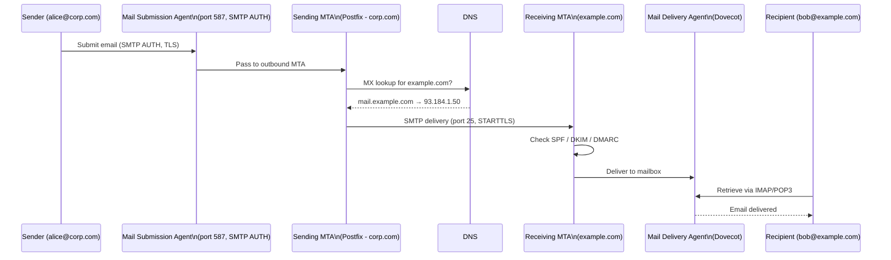
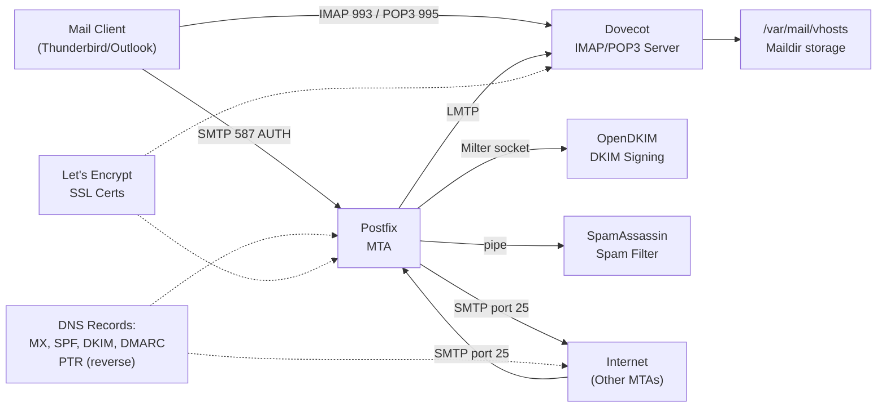

# 40 — Email & Mail Servers (Postfix, SMTP, IMAP, SPF/DKIM/DMARC)

> **[← Index](00_INDEX.md)** | **Related: [DNS Deep Dive](22_DNS_Deep_Dive.md) · [SSL/TLS Certificates](26_SSL_TLS_Certificates.md) · [Networking Fundamentals](07_Networking_Fundamentals.md) · [Security Concepts](14_Security_Concepts.md)**

---

## Email Flow — End to End



---

## Email Protocols Reference

| Protocol | Port | Use | Encryption |
|---------|------|-----|-----------|
| **SMTP** | 25 | Server-to-server delivery (MTA↔MTA) | STARTTLS |
| **SMTP Submission** | 587 | Client to server (MUA→MSA) | STARTTLS (required) |
| **SMTPS** | 465 | Client to server (legacy SSL) | TLS from start |
| **IMAP** | 143 | Client retrieves email (keeps on server) | STARTTLS |
| **IMAPS** | 993 | IMAP over SSL | TLS from start |
| **POP3** | 110 | Client downloads email (removes from server) | STARTTLS |
| **POP3S** | 995 | POP3 over SSL | TLS from start |

---

## Postfix — MTA Installation & Setup

### Install Postfix

```bash
# Ubuntu/Debian
sudo apt install postfix postfix-utils mailutils

# During install wizard:
# General type: Internet Site
# System mail name: mail.example.com

# Arch Linux
sudo pacman -S postfix
sudo newaliases    # Initialize alias database

# Check status
sudo systemctl status postfix
sudo postfix status
```

### Main Configuration Files

```
/etc/postfix/
├── main.cf          ← Primary configuration
├── master.cf        ← Service/daemon configuration
├── virtual         ← Virtual mailbox mappings
├── transport       ← Delivery routing rules
├── header_checks   ← Header manipulation rules
└── /etc/aliases    ← Local alias mappings
```

### `main.cf` — Core Configuration

```ini
# /etc/postfix/main.cf

# ── Identity ──────────────────────────────────────────
myhostname = mail.example.com
mydomain = example.com
myorigin = $mydomain

# ── Network ───────────────────────────────────────────
inet_interfaces = all
inet_protocols = all
mydestination = $myhostname, localhost.$mydomain, localhost, $mydomain

# Who can relay through this server (your networks)
mynetworks = 127.0.0.0/8, 10.0.0.0/8, 192.168.0.0/16

# ── TLS for receiving ─────────────────────────────────
smtpd_tls_cert_file = /etc/letsencrypt/live/mail.example.com/fullchain.pem
smtpd_tls_key_file  = /etc/letsencrypt/live/mail.example.com/privkey.pem
smtpd_tls_security_level = may          # Opportunistic TLS
smtpd_tls_protocols = !SSLv2, !SSLv3, !TLSv1, !TLSv1.1
smtpd_tls_mandatory_protocols = !SSLv2, !SSLv3, !TLSv1, !TLSv1.1
smtpd_tls_loglevel = 1

# ── TLS for sending ───────────────────────────────────
smtp_tls_security_level = may
smtp_tls_CAfile = /etc/ssl/certs/ca-certificates.crt
smtp_tls_loglevel = 1

# ── Anti-spam / restrictions ──────────────────────────
smtpd_helo_required = yes
smtpd_helo_restrictions =
    permit_mynetworks,
    reject_invalid_helo_hostname,
    reject_non_fqdn_helo_hostname

smtpd_sender_restrictions =
    permit_mynetworks,
    reject_non_fqdn_sender,
    reject_unknown_sender_domain

smtpd_recipient_restrictions =
    permit_mynetworks,
    permit_sasl_authenticated,
    reject_unauth_destination,
    reject_unknown_recipient_domain,
    reject_rbl_client zen.spamhaus.org,
    reject_rbl_client bl.spamcop.net

# ── SASL Authentication (for submission) ──────────────
smtpd_sasl_type = dovecot
smtpd_sasl_path = private/auth
smtpd_sasl_auth_enable = yes
smtpd_sasl_security_options = noanonymous
broken_sasl_auth_clients = yes

# ── Mailbox delivery ──────────────────────────────────
home_mailbox = Maildir/
mailbox_size_limit = 0
message_size_limit = 52428800    # 50MB max message size

# ── Virtual domains ───────────────────────────────────
virtual_mailbox_domains = example.com, corp.com
virtual_mailbox_base = /var/mail/vhosts
virtual_mailbox_maps = hash:/etc/postfix/virtual_mailboxes
virtual_minimum_uid = 100
virtual_uid_maps = static:5000
virtual_gid_maps = static:5000

# ── Queue tuning ──────────────────────────────────────
maximal_queue_lifetime = 5d
bounce_queue_lifetime = 1d
queue_run_delay = 300s
minimal_backoff_time = 300s
maximal_backoff_time = 4000s
```

### `master.cf` — Submission Port (587)

```ini
# /etc/postfix/master.cf
# Uncomment/add the submission service

submission inet n - y - - smtpd
  -o syslog_name=postfix/submission
  -o smtpd_tls_security_level=encrypt
  -o smtpd_sasl_auth_enable=yes
  -o smtpd_tls_auth_only=yes
  -o smtpd_client_restrictions=permit_sasl_authenticated,reject
  -o smtpd_sender_restrictions=reject_sender_login_mismatch
  -o smtpd_recipient_restrictions=permit_sasl_authenticated,reject_unauth_destination
  -o milter_macro_daemon_name=ORIGINATING

smtps inet n - y - - smtpd
  -o syslog_name=postfix/smtps
  -o smtpd_tls_wrappermode=yes
  -o smtpd_sasl_auth_enable=yes
  -o smtpd_client_restrictions=permit_sasl_authenticated,reject
```

### Managing Postfix

```bash
# Start / stop / reload
sudo systemctl start postfix
sudo systemctl reload postfix   # Reload config without stopping
sudo postfix reload             # Same

# Check config syntax
sudo postfix check
sudo postfix -n                 # Show non-default settings only

# Test sending
echo "Test body" | mail -s "Test Subject" user@example.com
sendmail -v user@example.com < test-email.txt

# Queue management
sudo postqueue -p               # View mail queue
sudo postqueue -f               # Flush queue (retry delivery)
sudo postsuper -d ALL           # Delete all queued mail ⚠️
sudo postsuper -d QUEUE_ID      # Delete specific message
sudo postcat -q QUEUE_ID        # View queued message content

# View logs
sudo tail -f /var/log/mail.log
sudo grep "status=bounced" /var/log/mail.log
sudo grep "status=deferred" /var/log/mail.log
sudo grep "status=sent" /var/log/mail.log

# Aliases
sudo nano /etc/aliases
# Format: alias: destination
# root: admin@example.com
# postmaster: admin@example.com
sudo newaliases                 # Rebuild alias database after edit
```

---

## Dovecot — IMAP/POP3 Server

```bash
# Install
sudo apt install dovecot-core dovecot-imapd dovecot-pop3d dovecot-lmtpd

# Main config files
/etc/dovecot/dovecot.conf
/etc/dovecot/conf.d/
├── 10-auth.conf        ← Authentication
├── 10-mail.conf        ← Mailbox location
├── 10-master.conf      ← Service sockets
├── 10-ssl.conf         ← TLS configuration
└── 15-mailboxes.conf   ← Special mailbox names
```

```ini
# /etc/dovecot/conf.d/10-mail.conf
mail_location = maildir:/var/mail/vhosts/%d/%n

# /etc/dovecot/conf.d/10-auth.conf
disable_plaintext_auth = yes
auth_mechanisms = plain login

passdb {
  driver = passwd-file
  args = scheme=SHA512-CRYPT /etc/dovecot/users
}
userdb {
  driver = static
  args = uid=vmail gid=vmail home=/var/mail/vhosts/%d/%n
}

# /etc/dovecot/conf.d/10-ssl.conf
ssl = required
ssl_cert = </etc/letsencrypt/live/mail.example.com/fullchain.pem
ssl_key  = </etc/letsencrypt/live/mail.example.com/privkey.pem
ssl_min_protocol = TLSv1.2
ssl_prefer_server_ciphers = yes
```

```bash
# Create virtual mail user
sudo groupadd -g 5000 vmail
sudo useradd -g vmail -u 5000 vmail -d /var/mail/vhosts -s /sbin/nologin

# Create user account (doveadm)
sudo doveadm pw -s SHA512-CRYPT -p "UserPassword123"
# Output: {SHA512-CRYPT}$6$...
echo "alice@example.com:{SHA512-CRYPT}$6$..." | sudo tee -a /etc/dovecot/users

# Create mailbox directories
sudo mkdir -p /var/mail/vhosts/example.com/alice
sudo chown -R vmail:vmail /var/mail/vhosts

# Test connection
sudo doveadm -v auth test alice@example.com "UserPassword123"
sudo doveadm user alice@example.com

# Test IMAP manually
openssl s_client -connect mail.example.com:993
# Then: a LOGIN alice@example.com password
# Then: a LIST "" "*"
```

---

## SPF, DKIM, DMARC — Full Setup

### SPF — Sender Policy Framework

```bash
# DNS TXT record (add in your DNS zone)
# example.com.  IN  TXT  "v=spf1 ... ~all"

# Build your SPF record:
# v=spf1                    → SPF version 1
# ip4:93.184.216.50          → Authorize specific IP
# ip4:10.0.0.0/24            → Authorize IP range
# include:sendgrid.net       → Trust SendGrid's SPF
# include:_spf.google.com    → Trust Google Workspace
# a                          → Authorize this domain's A record IP
# mx                         → Authorize this domain's MX record IPs
# ~all                       → SoftFail anything else (recommended to start)
# -all                       → HardFail anything else (strict)

# Example for self-hosted + Sendgrid:
"v=spf1 ip4:93.184.216.50 include:sendgrid.net ~all"

# Verify SPF record
dig TXT example.com | grep spf
nslookup -type=TXT example.com

# Test SPF evaluation
sudo apt install pyspf
python3 -c "import spf; print(spf.check2(i='93.184.216.50',s='alice@example.com',h='mail.example.com'))"
```

### DKIM — DomainKeys Identified Mail

```bash
# Install OpenDKIM
sudo apt install opendkim opendkim-tools

# /etc/opendkim.conf
Mode              sv          # Sign and verify
Domain            example.com
Selector          mail        # DNS selector name
KeyFile           /etc/opendkim/keys/example.com/mail.private
Socket            local:/run/opendkim/opendkim.sock
PidFile           /run/opendkim/opendkim.pid
UMask             002
UserID            opendkim
Canonicalization  relaxed/simple
SignatureAlgorithm rsa-sha256
OversignHeaders   From

# For multiple domains:
# KeyTable    /etc/opendkim/KeyTable
# SigningTable refile:/etc/opendkim/SigningTable

# Generate key pair
sudo mkdir -p /etc/opendkim/keys/example.com
cd /etc/opendkim/keys/example.com
sudo opendkim-genkey -s mail -d example.com --bits 2048
sudo chown opendkim:opendkim mail.private
sudo chmod 600 mail.private

# View the DNS TXT record to add
sudo cat /etc/opendkim/keys/example.com/mail.txt
# mail._domainkey  IN  TXT  ( "v=DKIM1; k=rsa; "
#   "p=MIGfMA0GCSqGSIb3DQEBA..." )

# Add to your DNS:
# mail._domainkey.example.com  IN  TXT  "v=DKIM1; k=rsa; p=MIGfMA0G..."

# Connect OpenDKIM to Postfix
# Add to /etc/postfix/main.cf:
sudo bash -c 'cat >> /etc/postfix/main.cf << EOF
milter_protocol = 2
milter_default_action = accept
smtpd_milters = local:/run/opendkim/opendkim.sock
non_smtpd_milters = local:/run/opendkim/opendkim.sock
EOF'

sudo systemctl enable --now opendkim
sudo systemctl reload postfix

# Verify DKIM record
dig TXT mail._domainkey.example.com

# Test DKIM signing
echo "Test" | mail -s "DKIM Test" test@gmail.com
# Check headers in received email for DKIM-Signature:
```

### DMARC — Domain-based Message Auth

```bash
# Add DNS TXT record:
# _dmarc.example.com  IN  TXT  "v=DMARC1; p=none; rua=mailto:dmarc@example.com"

# Build your DMARC record step by step:

# Step 1: Monitor only (p=none) — collect reports, don't reject
"v=DMARC1; p=none; rua=mailto:dmarc-reports@example.com; ruf=mailto:forensics@example.com"

# Step 2: After reviewing reports, move to quarantine
"v=DMARC1; p=quarantine; pct=10; rua=mailto:dmarc@example.com"
# pct=10 → apply to only 10% of failing mail initially

# Step 3: Full enforcement
"v=DMARC1; p=reject; pct=100; rua=mailto:dmarc@example.com; adkim=s; aspf=s"

# DMARC tag reference:
# v=DMARC1          → Version
# p=none/quarantine/reject → Policy for failures
# pct=100           → Apply to 100% of failing mail
# rua=mailto:...    → Aggregate reports (daily digest)
# ruf=mailto:...    → Forensic reports (per-failure)
# adkim=r/s         → DKIM alignment: relaxed or strict
# aspf=r/s          → SPF alignment: relaxed or strict
# sp=               → Subdomain policy
# ri=86400          → Report interval (seconds)

# Verify DMARC record
dig TXT _dmarc.example.com

# Parse DMARC reports (they come as XML in email attachments)
sudo apt install opendmarc
# Or use online tools: dmarcian.com, mxtoolbox.com
```

---

## Email Testing & Verification

```bash
# ── Test SMTP manually ────────────────────────────────
telnet mail.example.com 25
# or with TLS:
openssl s_client -starttls smtp -connect mail.example.com:587

# SMTP conversation:
# EHLO myhost.example.com
# AUTH LOGIN
# (base64 username)
# (base64 password)
# MAIL FROM:<alice@example.com>
# RCPT TO:<bob@gmail.com>
# DATA
# Subject: Test
#
# Test body
# .
# QUIT

# Encode credentials for AUTH LOGIN
echo -n "alice@example.com" | base64
echo -n "mypassword" | base64

# ── Test IMAP manually ────────────────────────────────
openssl s_client -connect mail.example.com:993
# After connection:
# A001 LOGIN alice@example.com password
# A002 LIST "" "*"
# A003 SELECT INBOX
# A004 FETCH 1 FULL
# A005 LOGOUT

# ── swaks — Swiss Army Knife for SMTP ────────────────
sudo apt install swaks

# Test basic delivery
swaks --to bob@example.com --from alice@corp.com --server mail.corp.com

# Test with AUTH
swaks --to bob@example.com \
      --from alice@corp.com \
      --server mail.corp.com:587 \
      --auth LOGIN \
      --auth-user alice@corp.com \
      --auth-password "mypassword" \
      --tls

# Test DKIM signing
swaks --to test@gmail.com \
      --from alice@example.com \
      --server localhost:25 \
      --data "Subject: DKIM Test\n\nTest body"

# ── MX lookup & reachability ─────────────────────────
dig MX example.com
nslookup -type=MX example.com

# Check if port 25 is open
nc -zv mail.example.com 25
telnet mail.example.com 25

# Full email deliverability check
# Use: https://mxtoolbox.com/SuperTool.aspx
# Use: https://mail-tester.com
# Use: https://dmarcian.com/dmarc-inspector/
```

---

## Email Header Analysis

```
Received: from mail.corp.com (mail.corp.com [93.184.216.50])
        by mail.example.com with ESMTPS id abc123
        (version=TLSv1.3 cipher=TLS_AES_256_GCM_SHA384)
        for <bob@example.com>; Mon, 22 Apr 2024 10:30:15 +0530
Authentication-Results: mail.example.com;
       dkim=pass header.i=@corp.com header.s=mail;    ← DKIM result
       spf=pass (corp.com: 93.184.216.50 is authorized);  ← SPF result
       dmarc=pass (policy=reject) header.from=corp.com;   ← DMARC result
DKIM-Signature: v=1; a=rsa-sha256; d=corp.com; s=mail;
        h=from:to:subject:date; bh=base64hash; b=signature...
Return-Path: <alice@corp.com>
From: Alice <alice@corp.com>
To: Bob <bob@example.com>
Subject: Hello
Date: Mon, 22 Apr 2024 10:30:00 +0530
Message-ID: <unique-id@mail.corp.com>
```

```bash
# Analyze headers in CLI
# Save email as .eml, then:
formail -x Received < email.eml          # Extract Received headers
cat email.eml | grep -E "^(Received|Authentication|DKIM|SPF|Return-Path):"

# Parse with Python
python3 << 'EOF'
import email
with open('email.eml') as f:
    msg = email.message_from_file(f)
for key in ['From','To','Subject','Date','Authentication-Results']:
    print(f"{key}: {msg.get(key, 'Not found')}")
EOF
```

---

## Anti-Spam with SpamAssassin

```bash
# Install
sudo apt install spamassassin spamc

# Enable
sudo systemctl enable --now spamassassin

# /etc/spamassassin/local.cf
required_score  5.0             # Score threshold for spam
rewrite_header  Subject [SPAM] # Add to subject if spam
report_safe     0               # Don't wrap spam as attachment
use_bayes       1               # Enable Bayesian filtering
bayes_auto_learn 1              # Auto-learn from scored mail

# Integrate with Postfix (pipe through spamassassin)
# /etc/postfix/master.cf:
smtp      inet  n  -  y  -  -  smtpd
  -o content_filter=spamassassin

spamassassin unix - n n - - pipe
  user=spamd argv=/usr/bin/spamc -f -e /usr/sbin/sendmail -oi -f ${sender} ${recipient}

# Test SpamAssassin
echo "Test message" | spamassassin -t
# Check score in output: X-Spam-Status: No, score=1.2

# Train Bayesian filter
sa-learn --spam /path/to/spam/folder/
sa-learn --ham  /path/to/ham/folder/
sa-learn --dump magic                    # View stats
```

---

## Complete Mail Server Stack Summary



---

## Troubleshooting Email Delivery

```bash
# ── Check why mail bounced ────────────────────────────
sudo grep "status=bounced" /var/log/mail.log | tail -20
sudo grep "status=deferred" /var/log/mail.log | tail -20

# Common bounce reasons:
# 550 5.1.1 = Recipient unknown
# 550 5.7.1 = Rejected by policy (SPF/DKIM/DMARC fail)
# 421 = Temporary failure (try again later)
# 535 = Authentication failed
# 554 = Transaction failed (RBL blacklist)

# ── Check if your IP is blacklisted ───────────────────
# Use: https://mxtoolbox.com/blacklists.aspx
dig 50.216.184.93.zen.spamhaus.org    # Reverse IP + .zen.spamhaus.org
dig 50.216.184.93.bl.spamcop.net

# ── Trace a specific message ──────────────────────────
sudo grep "unique-message-id" /var/log/mail.log

# ── Check reverse DNS (PTR) ───────────────────────────
# Critical: PTR record for your mail server IP must resolve back to hostname
dig -x 93.184.216.50          # Should return mail.example.com
# Set PTR record at your hosting provider / ISP

# ── Force queue retry ─────────────────────────────────
sudo postqueue -f

# ── Check open relay (security) ───────────────────────
# Your server should NOT relay for random senders
telnet mail.example.com 25
EHLO test
MAIL FROM:<fake@otherdomain.com>
RCPT TO:<victim@gmail.com>
# Should get: 554 Relay access denied
```

---

## Related Topics

- [DNS Deep Dive ←](22_DNS_Deep_Dive.md) — MX, SPF, DKIM, DMARC DNS records
- [SSL/TLS Certificates ←](26_SSL_TLS_Certificates.md) — TLS for SMTP/IMAP
- [Networking Fundamentals ←](07_Networking_Fundamentals.md) — SMTP ports
- [Security Concepts ←](14_Security_Concepts.md) — anti-spam, authentication
- [Linux Hardening ←](38_Linux_Hardening.md) — server security
- [Monitoring & Logging ←](13_Monitoring_Logging.md) — mail log analysis

---

> [Index](00_INDEX.md)
