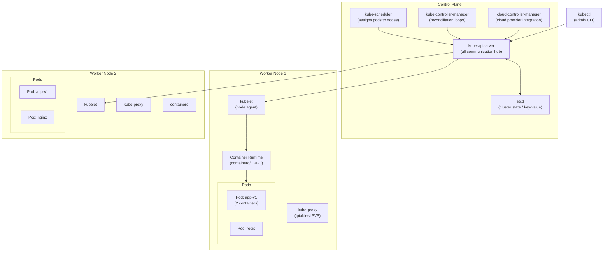

# 41 — Kubernetes Deep Dive

> **[← Index](00_INDEX.md)** | **Related: [Docker & Containers](30_Docker_Containers.md) · [CI/CD](27_CICD_Fundamentals.md) · [IaC](28_IaC_Terraform_Ansible.md) · [Networking Fundamentals](07_Networking_Fundamentals.md) · [Monitoring](42_Monitoring_Prometheus_Grafana.md)**

---

## Kubernetes Architecture — Deep View



---

## kubectl — Master Command Reference

### Cluster & Context

```bash
# Cluster info
kubectl cluster-info
kubectl get nodes
kubectl get nodes -o wide              # With IP, OS, kernel version
kubectl describe node worker-01        # Detailed node info
kubectl top nodes                      # CPU/memory usage (needs metrics-server)

# Context management (multiple clusters)
kubectl config get-contexts            # List all contexts
kubectl config current-context         # Current context
kubectl config use-context prod-cluster
kubectl config set-context --current --namespace=production   # Set default NS

# Shorthand aliases (add to ~/.bashrc)
alias k=kubectl
alias kgp='kubectl get pods'
alias kgs='kubectl get services'
alias kgd='kubectl get deployments'
complete -F __start_kubectl k          # Enable tab completion for alias
```

### Namespaces

```bash
# List namespaces
kubectl get namespaces
kubectl get ns

# Create namespace
kubectl create namespace production
kubectl create namespace staging

# Work in a namespace
kubectl get pods -n production
kubectl get all -n production
kubectl -n production get pods -o wide

# Apply resources to namespace
kubectl apply -f deployment.yaml -n production

# Delete namespace (deletes everything in it!)
kubectl delete namespace staging
```

### Pods

```bash
# Get pods
kubectl get pods
kubectl get pods -A                    # All namespaces
kubectl get pods -o wide               # With node, IP
kubectl get pods -l app=nginx          # Label selector
kubectl get pods -w                    # Watch (stream updates)
kubectl get pods --sort-by='.status.startTime'

# Describe pod (events, conditions, resource requests)
kubectl describe pod my-pod-abc123

# Pod logs
kubectl logs my-pod                    # stdout
kubectl logs my-pod -c sidecar         # Specific container
kubectl logs my-pod --previous         # Previous (crashed) container
kubectl logs -f my-pod                 # Follow
kubectl logs my-pod --tail=100
kubectl logs -l app=nginx --all-containers  # All pods with label

# Execute commands
kubectl exec -it my-pod -- bash
kubectl exec -it my-pod -c app -- sh
kubectl exec my-pod -- cat /etc/nginx/nginx.conf
kubectl exec my-pod -- env            # List environment variables

# Copy files
kubectl cp my-pod:/var/log/app.log ./app.log
kubectl cp ./config.yaml my-pod:/app/config.yaml

# Port forward (local access to pod/service)
kubectl port-forward pod/my-pod 8080:80
kubectl port-forward svc/my-service 8080:80
kubectl port-forward deployment/my-app 8080:3000

# Delete pod (deployment will recreate it)
kubectl delete pod my-pod
kubectl delete pod my-pod --grace-period=0 --force   # Immediate
```

---

## Core Kubernetes Objects

### Deployment

```yaml
# deployment.yaml
apiVersion: apps/v1
kind: Deployment
metadata:
  name: myapp
  namespace: production
  labels:
    app: myapp
    version: "1.0"
spec:
  replicas: 3
  revisionHistoryLimit: 5          # Keep 5 old ReplicaSets for rollback
  selector:
    matchLabels:
      app: myapp

  strategy:
    type: RollingUpdate
    rollingUpdate:
      maxUnavailable: 1            # Max pods down during update
      maxSurge: 1                  # Max extra pods during update

  template:
    metadata:
      labels:
        app: myapp
        version: "1.0"
      annotations:
        prometheus.io/scrape: "true"
        prometheus.io/port: "9090"
    spec:
      serviceAccountName: myapp-sa

      # Security context for pod
      securityContext:
        runAsNonRoot: true
        runAsUser: 1000
        fsGroup: 2000

      # Topology spread (spread across zones)
      topologySpreadConstraints:
        - maxSkew: 1
          topologyKey: topology.kubernetes.io/zone
          whenUnsatisfiable: DoNotSchedule
          labelSelector:
            matchLabels:
              app: myapp

      containers:
        - name: app
          image: myapp:1.0
          imagePullPolicy: Always

          ports:
            - name: http
              containerPort: 3000
            - name: metrics
              containerPort: 9090

          # Environment variables
          env:
            - name: NODE_ENV
              value: "production"
            - name: PORT
              value: "3000"
            - name: DB_HOST
              valueFrom:
                configMapKeyRef:
                  name: myapp-config
                  key: db_host
            - name: DB_PASSWORD
              valueFrom:
                secretKeyRef:
                  name: myapp-secrets
                  key: db_password

          # Mount volumes
          volumeMounts:
            - name: config
              mountPath: /app/config
              readOnly: true
            - name: data
              mountPath: /app/data

          # Resource management
          resources:
            requests:
              cpu: "100m"           # 0.1 vCPU
              memory: "128Mi"
            limits:
              cpu: "500m"           # 0.5 vCPU
              memory: "512Mi"

          # Health checks
          livenessProbe:
            httpGet:
              path: /health/live
              port: 3000
            initialDelaySeconds: 30
            periodSeconds: 10
            failureThreshold: 3

          readinessProbe:
            httpGet:
              path: /health/ready
              port: 3000
            initialDelaySeconds: 5
            periodSeconds: 5
            successThreshold: 1

          startupProbe:
            httpGet:
              path: /health/live
              port: 3000
            failureThreshold: 30    # Allow 30 * 10s = 5min to start
            periodSeconds: 10

          # Security context for container
          securityContext:
            allowPrivilegeEscalation: false
            readOnlyRootFilesystem: true
            capabilities:
              drop: ["ALL"]

      volumes:
        - name: config
          configMap:
            name: myapp-config
        - name: data
          persistentVolumeClaim:
            claimName: myapp-data

      # Image pull secret (private registry)
      imagePullSecrets:
        - name: registry-secret

      # Node affinity (prefer nodes with SSD)
      affinity:
        nodeAffinity:
          preferredDuringSchedulingIgnoredDuringExecution:
            - weight: 1
              preference:
                matchExpressions:
                  - key: disktype
                    operator: In
                    values: ["ssd"]
        # Anti-affinity: don't put 2 pods on same node
        podAntiAffinity:
          requiredDuringSchedulingIgnoredDuringExecution:
            - labelSelector:
                matchLabels:
                  app: myapp
              topologyKey: kubernetes.io/hostname
```

### Service

```yaml
# service.yaml
apiVersion: v1
kind: Service
metadata:
  name: myapp-service
  namespace: production
spec:
  # Service types:
  # ClusterIP     = internal only (default)
  # NodePort      = expose on each node's IP:port
  # LoadBalancer  = cloud load balancer (AWS/GCP/Azure)
  # ExternalName  = DNS alias to external service
  type: ClusterIP
  selector:
    app: myapp          # Routes to pods with this label
  ports:
    - name: http
      port: 80          # Service port
      targetPort: 3000  # Pod port
      protocol: TCP
    - name: metrics
      port: 9090
      targetPort: 9090

---
# LoadBalancer service (cloud)
apiVersion: v1
kind: Service
metadata:
  name: myapp-lb
  annotations:
    service.beta.kubernetes.io/aws-load-balancer-type: "nlb"
spec:
  type: LoadBalancer
  selector:
    app: myapp
  ports:
    - port: 80
      targetPort: 3000
```

### Ingress

```yaml
# ingress.yaml
apiVersion: networking.k8s.io/v1
kind: Ingress
metadata:
  name: myapp-ingress
  namespace: production
  annotations:
    kubernetes.io/ingress.class: nginx
    cert-manager.io/cluster-issuer: letsencrypt-prod
    nginx.ingress.kubernetes.io/ssl-redirect: "true"
    nginx.ingress.kubernetes.io/proxy-body-size: "50m"
    nginx.ingress.kubernetes.io/rate-limit: "100"
spec:
  tls:
    - hosts:
        - app.example.com
        - api.example.com
      secretName: example-tls

  rules:
    - host: app.example.com
      http:
        paths:
          - path: /
            pathType: Prefix
            backend:
              service:
                name: myapp-service
                port:
                  number: 80

    - host: api.example.com
      http:
        paths:
          - path: /v1
            pathType: Prefix
            backend:
              service:
                name: api-service
                port:
                  number: 80
```

### ConfigMap & Secret

```yaml
# configmap.yaml
apiVersion: v1
kind: ConfigMap
metadata:
  name: myapp-config
  namespace: production
data:
  db_host: "mysql.production.svc.cluster.local"
  db_port: "3306"
  log_level: "info"
  config.yaml: |
    server:
      port: 3000
      timeout: 30s
    database:
      host: mysql
      name: myapp

---
# secret.yaml
apiVersion: v1
kind: Secret
metadata:
  name: myapp-secrets
  namespace: production
type: Opaque
data:
  # Values must be base64 encoded
  db_password: c2VjcmV0cGFzcw==    # echo -n "secretpass" | base64
  api_key: bXlhcGlrZXkxMjM=
stringData:                         # Auto-encoded (plaintext here)
  jwt_secret: "my-super-secret-jwt-key"
```

```bash
# Create secrets from command line (preferred — no plaintext in files)
kubectl create secret generic myapp-secrets \
    --from-literal=db_password="secretpass" \
    --from-literal=api_key="myapikey123" \
    -n production

# Create from file
kubectl create secret generic tls-secret \
    --from-file=tls.crt=./cert.pem \
    --from-file=tls.key=./key.pem

# TLS secret
kubectl create secret tls myapp-tls \
    --cert=./cert.pem \
    --key=./key.pem

# Create secret from env file
kubectl create secret generic myapp-env \
    --from-env-file=.env

# View secret (decoded)
kubectl get secret myapp-secrets -o jsonpath='{.data.db_password}' | base64 -d
```

### Persistent Volumes

```yaml
# pvc.yaml — request storage
apiVersion: v1
kind: PersistentVolumeClaim
metadata:
  name: myapp-data
  namespace: production
spec:
  accessModes:
    - ReadWriteOnce          # RWO = one node, RWX = many nodes
  storageClassName: fast-ssd  # Storage class (cloud-specific)
  resources:
    requests:
      storage: 10Gi

---
# StorageClass (cloud provisioner)
apiVersion: storage.k8s.io/v1
kind: StorageClass
metadata:
  name: fast-ssd
provisioner: kubernetes.io/aws-ebs
parameters:
  type: gp3
  iops: "3000"
  throughput: "125"
  encrypted: "true"
reclaimPolicy: Retain         # Retain or Delete
allowVolumeExpansion: true
```

---

## Deployments — Rollouts & Rollbacks

```bash
# Deploy new version
kubectl set image deployment/myapp app=myapp:2.0 -n production

# Watch rollout progress
kubectl rollout status deployment/myapp -n production
kubectl rollout history deployment/myapp -n production

# Rollback
kubectl rollout undo deployment/myapp -n production
kubectl rollout undo deployment/myapp --to-revision=2 -n production

# Pause/resume rollout
kubectl rollout pause deployment/myapp
# Make multiple changes...
kubectl rollout resume deployment/myapp

# Scale
kubectl scale deployment myapp --replicas=5 -n production

# Autoscale (HPA)
kubectl autoscale deployment myapp --min=2 --max=10 --cpu-percent=70
kubectl get hpa -n production
```

### HorizontalPodAutoscaler (HPA)

```yaml
apiVersion: autoscaling/v2
kind: HorizontalPodAutoscaler
metadata:
  name: myapp-hpa
  namespace: production
spec:
  scaleTargetRef:
    apiVersion: apps/v1
    kind: Deployment
    name: myapp
  minReplicas: 2
  maxReplicas: 20
  metrics:
    - type: Resource
      resource:
        name: cpu
        target:
          type: Utilization
          averageUtilization: 70
    - type: Resource
      resource:
        name: memory
        target:
          type: AverageValue
          averageValue: 400Mi
```

---

## RBAC — Role-Based Access Control

```yaml
# ServiceAccount
apiVersion: v1
kind: ServiceAccount
metadata:
  name: myapp-sa
  namespace: production

---
# Role (namespace-scoped)
apiVersion: rbac.authorization.k8s.io/v1
kind: Role
metadata:
  name: myapp-role
  namespace: production
rules:
  - apiGroups: [""]
    resources: ["pods", "services", "configmaps"]
    verbs: ["get", "list", "watch"]
  - apiGroups: ["apps"]
    resources: ["deployments"]
    verbs: ["get", "list", "watch", "update", "patch"]

---
# RoleBinding
apiVersion: rbac.authorization.k8s.io/v1
kind: RoleBinding
metadata:
  name: myapp-rolebinding
  namespace: production
subjects:
  - kind: ServiceAccount
    name: myapp-sa
    namespace: production
  - kind: User
    name: alice@corp.com
    apiGroup: rbac.authorization.k8s.io
roleRef:
  kind: Role
  name: myapp-role
  apiGroup: rbac.authorization.k8s.io

---
# ClusterRole + ClusterRoleBinding (cluster-wide)
apiVersion: rbac.authorization.k8s.io/v1
kind: ClusterRole
metadata:
  name: node-reader
rules:
  - apiGroups: [""]
    resources: ["nodes"]
    verbs: ["get", "list", "watch"]
```

---

## Kubernetes Networking

```bash
# DNS in cluster
# Service: my-service.my-namespace.svc.cluster.local
# Pod:     pod-ip.my-namespace.pod.cluster.local

# Test DNS from inside a pod
kubectl run -it --rm debug --image=busybox -- nslookup kubernetes.default
kubectl run -it --rm debug --image=busybox -- nslookup myapp-service.production.svc.cluster.local

# Network policies (firewall rules between pods)
```

```yaml
# networkpolicy.yaml — default deny + allow selectively
apiVersion: networking.k8s.io/v1
kind: NetworkPolicy
metadata:
  name: default-deny-ingress
  namespace: production
spec:
  podSelector: {}         # Apply to ALL pods in namespace
  policyTypes:
    - Ingress

---
# Allow ingress from specific pod
apiVersion: networking.k8s.io/v1
kind: NetworkPolicy
metadata:
  name: allow-frontend-to-backend
  namespace: production
spec:
  podSelector:
    matchLabels:
      app: backend
  policyTypes:
    - Ingress
  ingress:
    - from:
        - podSelector:
            matchLabels:
              app: frontend
      ports:
        - protocol: TCP
          port: 3000
```

---

## Jobs & CronJobs

```yaml
# job.yaml — run once to completion
apiVersion: batch/v1
kind: Job
metadata:
  name: db-migration
  namespace: production
spec:
  completions: 1
  parallelism: 1
  backoffLimit: 3          # Retry 3 times on failure
  ttlSecondsAfterFinished: 3600  # Delete job 1h after completion
  template:
    spec:
      restartPolicy: OnFailure
      containers:
        - name: migration
          image: myapp:1.0
          command: ["php", "artisan", "migrate", "--force"]
          env:
            - name: DB_PASSWORD
              valueFrom:
                secretKeyRef:
                  name: myapp-secrets
                  key: db_password

---
# cronjob.yaml
apiVersion: batch/v1
kind: CronJob
metadata:
  name: daily-report
  namespace: production
spec:
  schedule: "0 2 * * *"     # 2 AM daily
  concurrencyPolicy: Forbid  # Don't run if previous still running
  successfulJobsHistoryLimit: 3
  failedJobsHistoryLimit: 1
  jobTemplate:
    spec:
      template:
        spec:
          restartPolicy: OnFailure
          containers:
            - name: report
              image: myapp:1.0
              command: ["node", "scripts/daily-report.js"]
```

---

## Troubleshooting Kubernetes

```bash
# ── Pod not starting ──────────────────────────────────
kubectl describe pod <pod-name> -n production
# Look at: Events section at bottom
# Common: ImagePullBackOff, CrashLoopBackOff, Pending

# ImagePullBackOff = can't pull image
kubectl describe pod ... | grep -A5 "Events"
# Check: image name, tag, registry credentials

# CrashLoopBackOff = pod starts but crashes repeatedly
kubectl logs <pod-name> --previous    # Logs from crashed container

# Pending = can't schedule
kubectl describe pod ... | grep -A10 "Events"
# Common: Insufficient CPU/memory, no nodes match affinity

# ── OOMKilled = out of memory ─────────────────────────
kubectl describe pod ... | grep OOMKilled
# Fix: increase memory limits in deployment

# ── Debug with ephemeral container (K8s 1.23+) ────────
kubectl debug -it <pod-name> --image=busybox --target=app

# ── Check events ──────────────────────────────────────
kubectl get events -n production --sort-by='.lastTimestamp'
kubectl get events -n production --field-selector type=Warning

# ── Node issues ───────────────────────────────────────
kubectl describe node worker-01
kubectl get node worker-01 -o yaml | grep -A10 conditions

# Drain node for maintenance
kubectl cordon worker-01               # Stop new pods
kubectl drain worker-01 --ignore-daemonsets --delete-emptydir-data
# Do maintenance...
kubectl uncordon worker-01             # Re-enable

# ── Check resource usage ──────────────────────────────
kubectl top pods -n production
kubectl top pods -n production --sort-by=memory
kubectl top nodes

# ── Service not reachable ─────────────────────────────
# Check service endpoints (should list pod IPs)
kubectl get endpoints myapp-service -n production
# If empty: selector in service doesn't match pod labels
kubectl get pods --show-labels -n production
```

---

## Helm — Kubernetes Package Manager

```bash
# Install Helm
curl https://raw.githubusercontent.com/helm/helm/main/scripts/get-helm-3 | bash

# Add chart repositories
helm repo add stable https://charts.helm.sh/stable
helm repo add bitnami https://charts.bitnami.com/bitnami
helm repo add ingress-nginx https://kubernetes.github.io/ingress-nginx
helm repo update

# Search charts
helm search repo nginx
helm search hub postgresql

# Install chart
helm install my-nginx ingress-nginx/ingress-nginx -n ingress --create-namespace
helm install my-postgres bitnami/postgresql -n production \
    --set auth.postgresPassword=secret \
    --set primary.persistence.size=20Gi

# Install with values file
helm install my-app ./mychart -f values-production.yaml -n production

# Upgrade
helm upgrade my-app ./mychart -f values-production.yaml -n production
helm upgrade --install my-app ./mychart    # Install if not exists

# List releases
helm list -A                          # All namespaces
helm list -n production

# Rollback
helm history my-app -n production
helm rollback my-app 2 -n production

# Uninstall
helm uninstall my-app -n production

# Create your own chart
helm create mychart
# Structure:
# mychart/
#   Chart.yaml         ← Chart metadata
#   values.yaml        ← Default values
#   templates/         ← Kubernetes manifests with Go templating
#     deployment.yaml
#     service.yaml
#     ingress.yaml
#     _helpers.tpl     ← Template helpers
```

---

## Related Topics

- [Docker & Containers ←](30_Docker_Containers.md) — container basics
- [CI/CD ←](27_CICD_Fundamentals.md) — deploying to K8s
- [IaC ←](28_IaC_Terraform_Ansible.md) — provisioning K8s clusters
- [Monitoring →](42_Monitoring_Prometheus_Grafana.md) — K8s observability
- [Networking Fundamentals ←](07_Networking_Fundamentals.md) — service networking
- [SSL/TLS ←](26_SSL_TLS_Certificates.md) — cert-manager in K8s

---

> [Index](00_INDEX.md)
