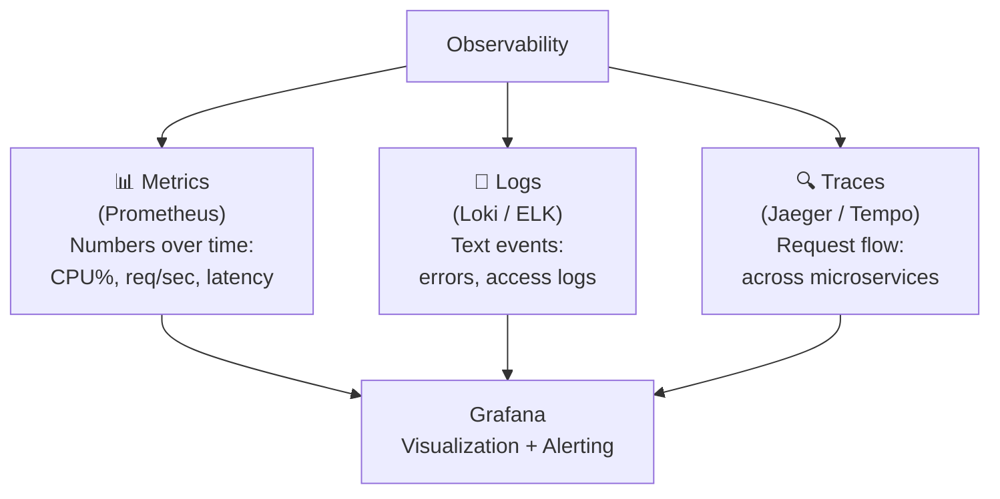
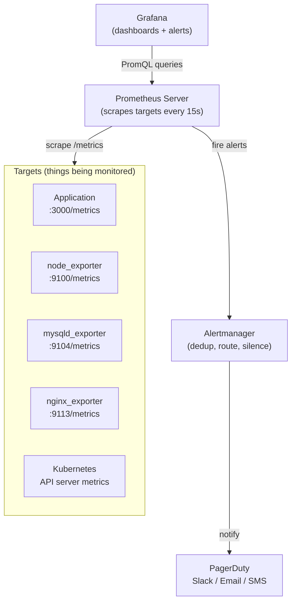

# 42 — Monitoring with Prometheus & Grafana

> **[← Index](00_INDEX.md)** | **Related: [Monitoring & Logging](13_Monitoring_Logging.md) · [Docker & Containers](30_Docker_Containers.md) · [Kubernetes Deep Dive](41_Kubernetes_Deep_Dive.md) · [Bash Scripting](23_Bash_Scripting.md) · [SNMP & Network Monitoring](36_SNMP_Network_Monitoring.md)**

---

## Observability — The Three Pillars



---

## Prometheus Architecture



---

## Installing Prometheus

### Docker Compose Stack (Full Observability)

```yaml
# docker-compose.yml — Full monitoring stack
version: '3.8'

volumes:
  prometheus_data:
  grafana_data:
  alertmanager_data:

networks:
  monitoring:
    driver: bridge

services:

  # ── Prometheus ────────────────────────────────────────
  prometheus:
    image: prom/prometheus:v2.51.0
    container_name: prometheus
    restart: unless-stopped
    command:
      - '--config.file=/etc/prometheus/prometheus.yml'
      - '--storage.tsdb.path=/prometheus'
      - '--storage.tsdb.retention.time=30d'   # Keep 30 days of data
      - '--web.console.libraries=/etc/prometheus/console_libraries'
      - '--web.console.templates=/etc/prometheus/consoles'
      - '--web.enable-lifecycle'               # Allow config reload via API
      - '--web.enable-admin-api'
    volumes:
      - ./prometheus/prometheus.yml:/etc/prometheus/prometheus.yml:ro
      - ./prometheus/rules/:/etc/prometheus/rules/:ro
      - prometheus_data:/prometheus
    ports:
      - "9090:9090"
    networks:
      - monitoring

  # ── Alertmanager ──────────────────────────────────────
  alertmanager:
    image: prom/alertmanager:v0.27.0
    container_name: alertmanager
    restart: unless-stopped
    command:
      - '--config.file=/etc/alertmanager/config.yml'
      - '--storage.path=/alertmanager'
    volumes:
      - ./alertmanager/config.yml:/etc/alertmanager/config.yml:ro
      - alertmanager_data:/alertmanager
    ports:
      - "9093:9093"
    networks:
      - monitoring

  # ── Grafana ───────────────────────────────────────────
  grafana:
    image: grafana/grafana:10.4.0
    container_name: grafana
    restart: unless-stopped
    environment:
      GF_SECURITY_ADMIN_USER: admin
      GF_SECURITY_ADMIN_PASSWORD: ${GRAFANA_PASSWORD:-admin}
      GF_USERS_ALLOW_SIGN_UP: "false"
      GF_SERVER_ROOT_URL: "https://grafana.example.com"
      GF_SMTP_ENABLED: "true"
      GF_SMTP_HOST: "mail.example.com:587"
      GF_SMTP_USER: "grafana@example.com"
      GF_SMTP_PASSWORD: "${SMTP_PASSWORD}"
      GF_SMTP_FROM_ADDRESS: "grafana@example.com"
    volumes:
      - grafana_data:/var/lib/grafana
      - ./grafana/provisioning/:/etc/grafana/provisioning/:ro
      - ./grafana/dashboards/:/var/lib/grafana/dashboards/:ro
    ports:
      - "3000:3000"
    networks:
      - monitoring
    depends_on:
      - prometheus

  # ── Node Exporter (host metrics) ──────────────────────
  node_exporter:
    image: prom/node-exporter:v1.7.0
    container_name: node_exporter
    restart: unless-stopped
    command:
      - '--path.rootfs=/host'
      - '--collector.filesystem.mount-points-exclude=^/(sys|proc|dev|host|etc)($$|/)'
    network_mode: host
    pid: host
    volumes:
      - '/:/host:ro,rslave'

  # ── cAdvisor (Docker container metrics) ───────────────
  cadvisor:
    image: gcr.io/cadvisor/cadvisor:v0.49.1
    container_name: cadvisor
    restart: unless-stopped
    privileged: true
    volumes:
      - /:/rootfs:ro
      - /var/run:/var/run:ro
      - /sys:/sys:ro
      - /var/lib/docker/:/var/lib/docker:ro
    ports:
      - "8080:8080"
    networks:
      - monitoring

  # ── Loki (log aggregation) ────────────────────────────
  loki:
    image: grafana/loki:2.9.0
    container_name: loki
    restart: unless-stopped
    command: -config.file=/etc/loki/local-config.yaml
    ports:
      - "3100:3100"
    networks:
      - monitoring

  # ── Promtail (log shipper → Loki) ─────────────────────
  promtail:
    image: grafana/promtail:2.9.0
    container_name: promtail
    restart: unless-stopped
    command: -config.file=/etc/promtail/config.yml
    volumes:
      - /var/log:/var/log:ro
      - /var/lib/docker/containers:/var/lib/docker/containers:ro
      - ./promtail/config.yml:/etc/promtail/config.yml:ro
    networks:
      - monitoring
```

---

## Prometheus Configuration

```yaml
# prometheus/prometheus.yml

global:
  scrape_interval: 15s          # Scrape every 15 seconds
  evaluation_interval: 15s      # Evaluate rules every 15 seconds
  scrape_timeout: 10s

  # Labels added to all metrics from this Prometheus
  external_labels:
    datacenter: 'dc1'
    environment: 'production'

# Alertmanager configuration
alerting:
  alertmanagers:
    - static_configs:
        - targets: ['alertmanager:9093']

# Load alerting rules
rule_files:
  - "/etc/prometheus/rules/*.yml"

# Scrape configs
scrape_configs:

  # Prometheus self-monitoring
  - job_name: 'prometheus'
    static_configs:
      - targets: ['localhost:9090']

  # Node Exporter (host metrics)
  - job_name: 'node-exporter'
    static_configs:
      - targets:
          - 'node_exporter:9100'
          - '10.0.0.10:9100'
          - '10.0.0.11:9100'
    relabel_configs:
      - source_labels: [__address__]
        target_label: instance

  # cAdvisor (Docker container metrics)
  - job_name: 'cadvisor'
    static_configs:
      - targets: ['cadvisor:8080']

  # MySQL Exporter
  - job_name: 'mysql'
    static_configs:
      - targets: ['mysqld_exporter:9104']
    relabel_configs:
      - source_labels: [__address__]
        target_label: instance
        replacement: 'production-mysql'

  # Nginx Exporter
  - job_name: 'nginx'
    static_configs:
      - targets: ['nginx_exporter:9113']

  # Application scrape (app exposes /metrics)
  - job_name: 'myapp'
    metrics_path: '/metrics'
    static_configs:
      - targets: ['app:3000']
        labels:
          service: 'myapp'
          team: 'backend'

  # Kubernetes (dynamic service discovery)
  - job_name: 'kubernetes-pods'
    kubernetes_sd_configs:
      - role: pod
    relabel_configs:
      # Only scrape pods with annotation
      - source_labels: [__meta_kubernetes_pod_annotation_prometheus_io_scrape]
        action: keep
        regex: "true"
      - source_labels: [__meta_kubernetes_pod_annotation_prometheus_io_path]
        action: replace
        target_label: __metrics_path__
        regex: (.+)
      - source_labels: [__address__, __meta_kubernetes_pod_annotation_prometheus_io_port]
        action: replace
        regex: ([^:]+)(?::\d+)?;(\d+)
        replacement: $1:$2
        target_label: __address__
      - source_labels: [__meta_kubernetes_namespace]
        target_label: kubernetes_namespace
      - source_labels: [__meta_kubernetes_pod_name]
        target_label: kubernetes_pod_name
```

---

## PromQL — Prometheus Query Language

### Basic Query Types

```promql
# ── Instant vector (current value) ─────────────────────────
# Get metric
up
# All metrics from job
{job="myapp"}
# With label filter
http_requests_total{method="GET", status="200"}
# Regex filter
http_requests_total{path=~"/api/.*"}
# Negative filter
http_requests_total{status!="200"}

# ── Range vector (values over time window) ─────────────────
# Last 5 minutes of data
http_requests_total[5m]
node_cpu_seconds_total[1h]

# ── Functions ──────────────────────────────────────────────
# Rate: per-second increase rate over 5 min window
rate(http_requests_total[5m])

# irate: instantaneous rate (last 2 data points)
irate(http_requests_total[5m])

# increase: total increase over time window
increase(http_requests_total[1h])

# Sum across all labels
sum(rate(http_requests_total[5m]))

# Sum grouped by label
sum by (method) (rate(http_requests_total[5m]))

# Average
avg(rate(http_requests_total[5m]))

# Max / Min
max(node_memory_MemFree_bytes)
min(node_disk_free_bytes)

# Percentiles (histogram)
histogram_quantile(0.95, rate(http_request_duration_seconds_bucket[5m]))
histogram_quantile(0.99, sum by (le) (rate(http_request_duration_seconds_bucket[5m])))
```

### Real-World PromQL Examples

```promql
# ── CPU ────────────────────────────────────────────────────
# CPU usage percentage per instance
100 - (avg by (instance) (rate(node_cpu_seconds_total{mode="idle"}[5m])) * 100)

# CPU usage over 80% (for alerting)
100 - (avg by (instance) (rate(node_cpu_seconds_total{mode="idle"}[5m])) * 100) > 80

# ── Memory ─────────────────────────────────────────────────
# Memory usage percentage
100 * (1 - node_memory_MemAvailable_bytes / node_memory_MemTotal_bytes)

# Memory available in GB
node_memory_MemAvailable_bytes / 1024^3

# ── Disk ───────────────────────────────────────────────────
# Disk usage percentage
100 - (node_filesystem_avail_bytes{fstype!="tmpfs"} / node_filesystem_size_bytes{fstype!="tmpfs"} * 100)

# Disk free in GB
node_filesystem_avail_bytes{mountpoint="/"} / 1024^3

# ── HTTP / Application ─────────────────────────────────────
# Request rate (req/sec)
sum(rate(http_requests_total[5m]))

# Error rate percentage
sum(rate(http_requests_total{status=~"5.."}[5m])) /
sum(rate(http_requests_total[5m])) * 100

# 95th percentile latency
histogram_quantile(0.95, sum by (le) (rate(http_request_duration_seconds_bucket[5m])))

# Apdex score (% of requests under threshold)
(
  sum(rate(http_request_duration_seconds_bucket{le="0.5"}[5m])) +
  sum(rate(http_request_duration_seconds_bucket{le="2.0"}[5m]))
) / 2 / sum(rate(http_request_duration_seconds_count[5m]))

# ── Network ────────────────────────────────────────────────
# Network receive MB/s
rate(node_network_receive_bytes_total{device!="lo"}[5m]) / 1024^2

# Network transmit MB/s
rate(node_network_transmit_bytes_total{device!="lo"}[5m]) / 1024^2

# ── Kubernetes ─────────────────────────────────────────────
# Pod restart count in last hour
increase(kube_pod_container_status_restarts_total[1h]) > 0

# Pods not running
kube_pod_status_phase{phase!="Running"} == 1

# Node memory pressure
kube_node_status_condition{condition="MemoryPressure",status="true"} == 1
```

---

## Alerting Rules

```yaml
# prometheus/rules/host-alerts.yml
groups:
  - name: host-alerts
    rules:

      # ── CPU ────────────────────────────────────────────
      - alert: HighCPUUsage
        expr: |
          100 - (avg by (instance) (
            rate(node_cpu_seconds_total{mode="idle"}[5m])
          ) * 100) > 85
        for: 5m                   # Must be true for 5 min before firing
        labels:
          severity: warning
          team: ops
        annotations:
          summary: "High CPU on {{ $labels.instance }}"
          description: "CPU is {{ $value | humanize }}% on {{ $labels.instance }} for 5+ minutes."
          runbook: "https://wiki.example.com/runbooks/high-cpu"

      - alert: CriticalCPUUsage
        expr: |
          100 - (avg by (instance) (
            rate(node_cpu_seconds_total{mode="idle"}[5m])
          ) * 100) > 95
        for: 2m
        labels:
          severity: critical
          team: ops
        annotations:
          summary: "CRITICAL CPU on {{ $labels.instance }}"
          description: "CPU is {{ $value | humanize }}% — immediate action required."

      # ── Memory ─────────────────────────────────────────
      - alert: HighMemoryUsage
        expr: |
          100 * (1 - node_memory_MemAvailable_bytes / node_memory_MemTotal_bytes) > 90
        for: 5m
        labels:
          severity: warning
        annotations:
          summary: "High memory on {{ $labels.instance }}"
          description: "Memory usage is {{ $value | humanize }}%"

      # ── Disk ───────────────────────────────────────────
      - alert: DiskSpaceLow
        expr: |
          100 - (node_filesystem_avail_bytes{fstype!="tmpfs"} /
          node_filesystem_size_bytes{fstype!="tmpfs"} * 100) > 85
        for: 1m
        labels:
          severity: warning
        annotations:
          summary: "Disk space low on {{ $labels.instance }}:{{ $labels.mountpoint }}"
          description: "Disk is {{ $value | humanize }}% full."

      - alert: DiskSpaceCritical
        expr: |
          100 - (node_filesystem_avail_bytes{fstype!="tmpfs"} /
          node_filesystem_size_bytes{fstype!="tmpfs"} * 100) > 95
        for: 1m
        labels:
          severity: critical
        annotations:
          summary: "CRITICAL: Disk almost full on {{ $labels.instance }}"

      # ── Service down ───────────────────────────────────
      - alert: ServiceDown
        expr: up == 0
        for: 1m
        labels:
          severity: critical
        annotations:
          summary: "Service {{ $labels.job }} is DOWN"
          description: "Target {{ $labels.instance }} has been unreachable for 1+ minute."

      # ── HTTP errors ────────────────────────────────────
      - alert: HighErrorRate
        expr: |
          sum(rate(http_requests_total{status=~"5.."}[5m])) by (service) /
          sum(rate(http_requests_total[5m])) by (service) * 100 > 5
        for: 2m
        labels:
          severity: warning
        annotations:
          summary: "High error rate for {{ $labels.service }}"
          description: "Error rate is {{ $value | humanize }}% (threshold: 5%)"
```

---

## Alertmanager Configuration

```yaml
# alertmanager/config.yml
global:
  resolve_timeout: 5m
  smtp_smarthost: 'mail.example.com:587'
  smtp_from: 'alertmanager@example.com'
  smtp_auth_username: 'alertmanager@example.com'
  smtp_auth_password: 'smtp_password'

# Notification templates
templates:
  - '/etc/alertmanager/templates/*.tmpl'

# Routing tree
route:
  receiver: 'default'
  group_by: ['alertname', 'cluster', 'service']
  group_wait: 30s          # Wait to group alerts
  group_interval: 5m       # Wait before re-sending grouped alerts
  repeat_interval: 12h     # Re-notify if still firing after 12h

  routes:
    # Critical alerts → PagerDuty + Slack
    - matchers:
        - severity = critical
      receiver: pagerduty-critical
      repeat_interval: 1h

    # Warning alerts → Slack only
    - matchers:
        - severity = warning
      receiver: slack-warnings
      repeat_interval: 4h

    # Ops team alerts
    - matchers:
        - team = ops
      receiver: ops-slack

# Inhibition rules (suppress lower severity if higher is firing)
inhibit_rules:
  - source_matchers:
      - severity = critical
    target_matchers:
      - severity = warning
    equal: ['alertname', 'instance']

receivers:
  - name: 'default'
    email_configs:
      - to: 'ops-team@example.com'
        require_tls: true

  - name: 'pagerduty-critical'
    pagerduty_configs:
      - routing_key: '${PAGERDUTY_KEY}'
        severity: '{{ if eq .Status "firing" }}critical{{ else }}resolved{{ end }}'
        description: '{{ range .Alerts }}{{ .Annotations.summary }}{{ end }}'
    slack_configs:
      - api_url: '${SLACK_WEBHOOK_URL}'
        channel: '#alerts-critical'
        color: '{{ if eq .Status "firing" }}danger{{ else }}good{{ end }}'
        title: '{{ .Status | toUpper }}: {{ .CommonAnnotations.summary }}'
        text: '{{ range .Alerts }}{{ .Annotations.description }}{{ end }}'

  - name: 'slack-warnings'
    slack_configs:
      - api_url: '${SLACK_WEBHOOK_URL}'
        channel: '#alerts-warnings'
        color: 'warning'
        title: '⚠️ {{ .CommonAnnotations.summary }}'
        text: '{{ range .Alerts }}{{ .Annotations.description }}{{ end }}'
```

---

## Grafana — Dashboards & Data Sources

### Provisioning Data Sources (as code)

```yaml
# grafana/provisioning/datasources/prometheus.yml
apiVersion: 1
datasources:
  - name: Prometheus
    type: prometheus
    access: proxy
    url: http://prometheus:9090
    isDefault: true
    jsonData:
      timeInterval: "15s"
      queryTimeout: "60s"

  - name: Loki
    type: loki
    access: proxy
    url: http://loki:3100

  - name: Alertmanager
    type: alertmanager
    access: proxy
    url: http://alertmanager:9093
    jsonData:
      implementation: prometheus
```

### Grafana HTTP API (automation)

```bash
GRAFANA_URL="http://localhost:3000"
GRAFANA_TOKEN="glsa_xxxx"    # Service account token

# Get all dashboards
curl -H "Authorization: Bearer $GRAFANA_TOKEN" \
    "$GRAFANA_URL/api/search?type=dash-db"

# Import dashboard (JSON)
curl -X POST \
    -H "Authorization: Bearer $GRAFANA_TOKEN" \
    -H "Content-Type: application/json" \
    -d @dashboard.json \
    "$GRAFANA_URL/api/dashboards/import"

# Create folder
curl -X POST \
    -H "Authorization: Bearer $GRAFANA_TOKEN" \
    -H "Content-Type: application/json" \
    -d '{"title":"Production"}' \
    "$GRAFANA_URL/api/folders"

# Create alert notification channel
curl -X POST \
    -H "Authorization: Bearer $GRAFANA_TOKEN" \
    -H "Content-Type: application/json" \
    -d '{"name":"Slack Ops","type":"slack","settings":{"url":"https://hooks.slack.com/..."}}' \
    "$GRAFANA_URL/api/alert-notifications"
```

---

## Exporters Reference

| Exporter | Port | What it monitors |
|---------|------|-----------------|
| **node_exporter** | 9100 | Linux host: CPU, memory, disk, network, filesystem |
| **windows_exporter** | 9182 | Windows host metrics |
| **mysqld_exporter** | 9104 | MySQL/MariaDB |
| **postgres_exporter** | 9187 | PostgreSQL |
| **redis_exporter** | 9121 | Redis |
| **nginx-prometheus-exporter** | 9113 | Nginx stub_status |
| **apache_exporter** | 9117 | Apache mod_status |
| **blackbox_exporter** | 9115 | HTTP/TCP/DNS/ICMP probing |
| **process_exporter** | 9256 | Named processes |
| **cadvisor** | 8080 | Docker container metrics |
| **kube-state-metrics** | 8080 | Kubernetes object state |

### Blackbox Exporter (probe external endpoints)

```yaml
# prometheus.yml — probe config
scrape_configs:
  - job_name: 'blackbox-http'
    metrics_path: /probe
    params:
      module: [http_2xx]
    static_configs:
      - targets:
          - https://example.com
          - https://api.example.com/health
    relabel_configs:
      - source_labels: [__address__]
        target_label: __param_target
      - source_labels: [__param_target]
        target_label: instance
      - target_label: __address__
        replacement: blackbox_exporter:9115

# Alert on website down
- alert: WebsiteDown
  expr: probe_success{job="blackbox-http"} == 0
  for: 1m
  labels:
    severity: critical
  annotations:
    summary: "Website down: {{ $labels.instance }}"
```

---

## Application Instrumentation

```javascript
// Node.js — expose /metrics with prom-client
const client = require('prom-client');
const express = require('express');

// Collect default metrics (CPU, memory, GC, etc.)
client.collectDefaultMetrics({ prefix: 'myapp_' });

// Custom metrics
const httpRequestsTotal = new client.Counter({
  name: 'http_requests_total',
  help: 'Total HTTP requests',
  labelNames: ['method', 'path', 'status'],
});

const httpRequestDuration = new client.Histogram({
  name: 'http_request_duration_seconds',
  help: 'HTTP request duration in seconds',
  labelNames: ['method', 'path'],
  buckets: [0.005, 0.01, 0.025, 0.05, 0.1, 0.25, 0.5, 1, 2.5, 5],
});

// Middleware to record metrics
app.use((req, res, next) => {
  const end = httpRequestDuration.startTimer();
  res.on('finish', () => {
    httpRequestsTotal.inc({ method: req.method, path: req.route?.path || req.path, status: res.statusCode });
    end({ method: req.method, path: req.route?.path || req.path });
  });
  next();
});

// Expose metrics endpoint
app.get('/metrics', async (req, res) => {
  res.set('Content-Type', client.register.contentType);
  res.end(await client.register.metrics());
});
```

```python
# Python — Flask with prometheus_client
from prometheus_client import Counter, Histogram, generate_latest, CONTENT_TYPE_LATEST
from flask import Flask, Response
import time

app = Flask(__name__)

REQUEST_COUNT = Counter('http_requests_total', 'Total requests', ['method', 'endpoint', 'status'])
REQUEST_LATENCY = Histogram('http_request_duration_seconds', 'Request latency', ['endpoint'])

@app.before_request
def start_timer():
    from flask import g
    g.start = time.time()

@app.after_request
def record_metrics(response):
    from flask import g, request
    elapsed = time.time() - g.start
    REQUEST_COUNT.labels(request.method, request.path, response.status_code).inc()
    REQUEST_LATENCY.labels(request.path).observe(elapsed)
    return response

@app.route('/metrics')
def metrics():
    return Response(generate_latest(), mimetype=CONTENT_TYPE_LATEST)
```

---

## Related Topics

- [Monitoring & Logging ←](13_Monitoring_Logging.md) — system logs, journalctl
- [SNMP & Network Monitoring ←](36_SNMP_Network_Monitoring.md) — Nagios, Zabbix
- [Docker & Containers ←](30_Docker_Containers.md) — containerized monitoring
- [Kubernetes Deep Dive ←](41_Kubernetes_Deep_Dive.md) — K8s metrics
- [Bash Scripting ←](23_Bash_Scripting.md) — health check scripts
- [Nginx & Apache ←](25_Nginx_Apache.md) — nginx stub_status

---

> [Index](00_INDEX.md)
