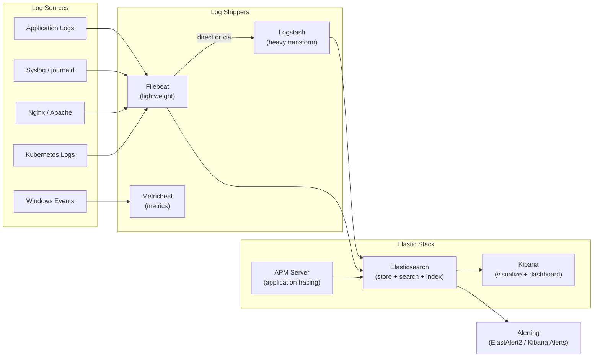

# 43 — ELK Stack (Elasticsearch, Logstash, Kibana)

> **[← Index](00_INDEX.md)** | **Related: [Monitoring & Logging](13_Monitoring_Logging.md) · [Monitoring Prometheus Grafana](42_Monitoring_Prometheus_Grafana.md) · [Nginx & Apache](25_Nginx_Apache.md) · [Docker & Containers](30_Docker_Containers.md) · [Bash Scripting](23_Bash_Scripting.md)**

---

## ELK Stack Overview

The **ELK Stack** (now called **Elastic Stack**) is the most widely used log management and analytics platform.



### When to Use What

| Tool | Role | Use When |
|------|------|---------|
| **Filebeat** | Lightweight log shipper | Shipping log files to ES/Logstash |
| **Metricbeat** | Metrics collector | System/service metrics |
| **Logstash** | ETL pipeline | Complex parsing/transformation |
| **Elasticsearch** | Storage & search | Storing, indexing, querying logs |
| **Kibana** | Visualization | Dashboards, search, alerting |
| **APM** | Application tracing | Distributed tracing |

---

## Docker Compose — Full ELK Stack

```yaml
# docker-compose.yml
version: '3.8'

volumes:
  elasticsearch_data:
  kibana_data:
  logstash_data:

networks:
  elastic:
    driver: bridge

services:

  # ── Elasticsearch ─────────────────────────────────────
  elasticsearch:
    image: docker.elastic.co/elasticsearch/elasticsearch:8.13.0
    container_name: elasticsearch
    restart: unless-stopped
    environment:
      - node.name=elasticsearch
      - cluster.name=elk-cluster
      - discovery.type=single-node           # Single node (dev/small prod)
      - ELASTIC_PASSWORD=${ELASTIC_PASSWORD:-changeme}
      - xpack.security.enabled=true
      - xpack.security.http.ssl.enabled=false  # Disable for internal
      - xpack.license.self_generated.type=basic
      - bootstrap.memory_lock=true
      - "ES_JAVA_OPTS=-Xms1g -Xmx1g"         # Heap: half of available RAM
    ulimits:
      memlock:
        soft: -1
        hard: -1
    volumes:
      - elasticsearch_data:/usr/share/elasticsearch/data
    ports:
      - "9200:9200"
      - "9300:9300"
    networks:
      - elastic
    healthcheck:
      test: ["CMD-SHELL", "curl -s -u elastic:${ELASTIC_PASSWORD:-changeme} http://localhost:9200/_cluster/health | grep -q '\"status\":\"green\\|yellow\"'"]
      interval: 30s
      timeout: 10s
      retries: 5

  # ── Kibana ────────────────────────────────────────────
  kibana:
    image: docker.elastic.co/kibana/kibana:8.13.0
    container_name: kibana
    restart: unless-stopped
    environment:
      - SERVERNAME=kibana
      - ELASTICSEARCH_HOSTS=http://elasticsearch:9200
      - ELASTICSEARCH_USERNAME=kibana_system
      - ELASTICSEARCH_PASSWORD=${KIBANA_PASSWORD:-changeme}
      - XPACK_SECURITY_ENCRYPTIONKEY=${KIBANA_ENCRYPTION_KEY:-changeme32charlongkey}
      - XPACK_ENCRYPTEDSAVEDOBJECTS_ENCRYPTIONKEY=${KIBANA_ENCRYPTION_KEY:-changeme32charlongkey}
    volumes:
      - kibana_data:/usr/share/kibana/data
    ports:
      - "5601:5601"
    networks:
      - elastic
    depends_on:
      elasticsearch:
        condition: service_healthy

  # ── Logstash ──────────────────────────────────────────
  logstash:
    image: docker.elastic.co/logstash/logstash:8.13.0
    container_name: logstash
    restart: unless-stopped
    environment:
      - ELASTIC_PASSWORD=${ELASTIC_PASSWORD:-changeme}
      - "LS_JAVA_OPTS=-Xms512m -Xmx512m"
    volumes:
      - ./logstash/pipeline/:/usr/share/logstash/pipeline/:ro
      - ./logstash/config/logstash.yml:/usr/share/logstash/config/logstash.yml:ro
      - logstash_data:/usr/share/logstash/data
    ports:
      - "5044:5044"   # Beats input
      - "5000:5000"   # TCP/UDP syslog input
      - "9600:9600"   # Logstash API
    networks:
      - elastic
    depends_on:
      elasticsearch:
        condition: service_healthy

  # ── Filebeat ──────────────────────────────────────────
  filebeat:
    image: docker.elastic.co/beats/filebeat:8.13.0
    container_name: filebeat
    restart: unless-stopped
    user: root
    environment:
      - ELASTIC_PASSWORD=${ELASTIC_PASSWORD:-changeme}
    volumes:
      - ./filebeat/filebeat.yml:/usr/share/filebeat/filebeat.yml:ro
      - /var/log:/var/log:ro
      - /var/lib/docker/containers:/var/lib/docker/containers:ro
      - /var/run/docker.sock:/var/run/docker.sock:ro
    command: filebeat -e -strict.perms=false
    networks:
      - elastic
    depends_on:
      - elasticsearch
      - logstash
```

---

## Elasticsearch — Core Concepts

### Index, Document, Shard

```
Elasticsearch Concepts vs SQL:
──────────────────────────────────────
Index         ≈  Database / Table
Document      ≈  Row
Field         ≈  Column
Mapping       ≈  Schema
Query DSL     ≈  SQL
Shard         ≈  Partition (for scaling)
Replica       ≈  Backup shard (for HA)
```

### REST API — Essential Operations

```bash
BASE="http://localhost:9200"
AUTH="-u elastic:changeme"

# ── Cluster health ────────────────────────────────────
curl $AUTH "$BASE/_cluster/health?pretty"
curl $AUTH "$BASE/_cluster/stats?pretty"
curl $AUTH "$BASE/_cat/nodes?v"
curl $AUTH "$BASE/_cat/indices?v&s=index"      # List all indices
curl $AUTH "$BASE/_cat/shards?v"
curl $AUTH "$BASE/_cat/health?v"

# ── Index management ──────────────────────────────────
# Create index with settings
curl $AUTH -X PUT "$BASE/myapp-logs" -H 'Content-Type: application/json' -d '{
  "settings": {
    "number_of_shards": 1,
    "number_of_replicas": 1,
    "index.lifecycle.name": "logs-policy",
    "index.lifecycle.rollover_alias": "myapp-logs"
  },
  "mappings": {
    "properties": {
      "@timestamp":   { "type": "date" },
      "level":        { "type": "keyword" },
      "service":      { "type": "keyword" },
      "message":      { "type": "text", "analyzer": "standard" },
      "response_time":{ "type": "float" },
      "status_code":  { "type": "integer" },
      "client_ip":    { "type": "ip" },
      "url":          { "type": "keyword" }
    }
  }
}'

# Delete index
curl $AUTH -X DELETE "$BASE/myapp-logs"

# Index stats
curl $AUTH "$BASE/myapp-logs/_stats?pretty"

# ── Documents (CRUD) ──────────────────────────────────
# Index a document
curl $AUTH -X POST "$BASE/myapp-logs/_doc" -H 'Content-Type: application/json' -d '{
  "@timestamp": "2024-04-22T10:30:00Z",
  "level": "ERROR",
  "service": "auth",
  "message": "Failed login attempt",
  "client_ip": "192.168.1.100",
  "status_code": 401
}'

# Get document by ID
curl $AUTH "$BASE/myapp-logs/_doc/abc123?pretty"

# Update document
curl $AUTH -X POST "$BASE/myapp-logs/_update/abc123" -H 'Content-Type: application/json' -d '{
  "doc": { "level": "WARN" }
}'

# Delete document
curl $AUTH -X DELETE "$BASE/myapp-logs/_doc/abc123"
```

### Elasticsearch Query DSL

```bash
# ── Basic search ──────────────────────────────────────
# Match all
curl $AUTH -X GET "$BASE/myapp-logs/_search?pretty" -H 'Content-Type: application/json' -d '{
  "query": { "match_all": {} },
  "size": 10,
  "sort": [{ "@timestamp": "desc" }]
}'

# ── Full-text search ──────────────────────────────────
curl $AUTH -X GET "$BASE/myapp-logs/_search?pretty" -H 'Content-Type: application/json' -d '{
  "query": {
    "match": {
      "message": "login failed"
    }
  }
}'

# Match phrase (exact order)
curl $AUTH -X GET "$BASE/myapp-logs/_search" -H 'Content-Type: application/json' -d '{
  "query": {
    "match_phrase": { "message": "connection refused" }
  }
}'

# ── Filtered search (bool query) ──────────────────────
curl $AUTH -X GET "$BASE/myapp-logs/_search?pretty" -H 'Content-Type: application/json' -d '{
  "query": {
    "bool": {
      "must": [
        { "match": { "service": "auth" } }
      ],
      "filter": [
        { "term": { "level": "ERROR" } },
        {
          "range": {
            "@timestamp": {
              "gte": "now-1h",
              "lte": "now"
            }
          }
        }
      ],
      "must_not": [
        { "term": { "client_ip": "10.0.0.1" } }
      ]
    }
  },
  "size": 50,
  "sort": [{ "@timestamp": { "order": "desc" } }]
}'

# ── Aggregations ──────────────────────────────────────
curl $AUTH -X GET "$BASE/myapp-logs/_search?pretty" -H 'Content-Type: application/json' -d '{
  "size": 0,
  "aggs": {
    "errors_by_service": {
      "terms": { "field": "service", "size": 10 }
    },
    "errors_over_time": {
      "date_histogram": {
        "field": "@timestamp",
        "calendar_interval": "1h"
      }
    },
    "avg_response_time": {
      "avg": { "field": "response_time" }
    },
    "response_time_percentiles": {
      "percentiles": {
        "field": "response_time",
        "percents": [50, 90, 95, 99]
      }
    }
  }
}'
```

### Index Lifecycle Management (ILM)

```bash
# Create ILM policy — hot → warm → cold → delete
curl $AUTH -X PUT "$BASE/_ilm/policy/logs-policy" -H 'Content-Type: application/json' -d '{
  "policy": {
    "phases": {
      "hot": {
        "min_age": "0ms",
        "actions": {
          "rollover": {
            "max_age": "7d",        # Roll over after 7 days
            "max_size": "50gb"      # Or 50GB
          },
          "set_priority": { "priority": 100 }
        }
      },
      "warm": {
        "min_age": "7d",
        "actions": {
          "shrink": { "number_of_shards": 1 },
          "forcemerge": { "max_num_segments": 1 },
          "set_priority": { "priority": 50 }
        }
      },
      "cold": {
        "min_age": "30d",
        "actions": {
          "freeze": {},
          "set_priority": { "priority": 0 }
        }
      },
      "delete": {
        "min_age": "90d",
        "actions": { "delete": {} }
      }
    }
  }
}'
```

---

## Logstash Pipeline

```ruby
# logstash/pipeline/main.conf

# ── INPUT ─────────────────────────────────────────────
input {
  # From Filebeat
  beats {
    port => 5044
  }

  # Syslog UDP
  udp {
    port => 5000
    codec => "plain"
    type => "syslog"
  }

  # TCP JSON
  tcp {
    port => 5001
    codec => json_lines
  }

  # Redis queue
  redis {
    host => "redis"
    port => 6379
    key  => "logstash"
    data_type => "list"
  }
}

# ── FILTER ────────────────────────────────────────────
filter {

  # Parse Nginx access logs
  if [type] == "nginx-access" {
    grok {
      match => {
        "message" => '%{IPORHOST:client_ip} - %{DATA:user} \[%{HTTPDATE:timestamp}\] "%{WORD:method} %{URIPATHPARAM:url} HTTP/%{NUMBER:http_version}" %{NUMBER:status_code:int} %{NUMBER:bytes:int} "%{DATA:referrer}" "%{DATA:user_agent}"'
      }
      remove_field => ["message"]
    }

    date {
      match => ["timestamp", "dd/MMM/yyyy:HH:mm:ss Z"]
      target => "@timestamp"
      remove_field => ["timestamp"]
    }

    geoip {
      source => "client_ip"
      target => "geoip"
    }

    useragent {
      source => "user_agent"
      target => "ua"
    }

    mutate {
      convert => { "status_code" => "integer" }
      add_field => {
        "is_error" => "%{status_code}"
      }
    }

    if [status_code] >= 500 {
      mutate { add_tag => ["server_error"] }
    } else if [status_code] >= 400 {
      mutate { add_tag => ["client_error"] }
    }
  }

  # Parse application JSON logs
  if [type] == "app-log" {
    json {
      source => "message"
      target => "parsed"
    }

    mutate {
      rename => {
        "[parsed][level]"   => "level"
        "[parsed][service]" => "service"
        "[parsed][msg]"     => "message"
        "[parsed][ts]"      => "app_timestamp"
        "[parsed][err]"     => "error_message"
      }
      remove_field => ["parsed"]
      uppercase => ["level"]
    }
  }

  # Parse syslog
  if [type] == "syslog" {
    grok {
      match => {
        "message" => "%{SYSLOGTIMESTAMP:syslog_timestamp} %{SYSLOGHOST:syslog_host} %{DATA:syslog_program}(?:\[%{POSINT:syslog_pid}\])?: %{GREEDYDATA:syslog_message}"
      }
    }
    date {
      match => ["syslog_timestamp", "MMM  d HH:mm:ss", "MMM dd HH:mm:ss"]
    }
  }

  # Add common fields
  mutate {
    add_field => {
      "environment" => "${ENVIRONMENT:production}"
      "datacenter"  => "${DC:dc1}"
    }
    remove_field => ["host", "agent", "ecs"]
  }

  # Drop health check logs (reduce noise)
  if [url] == "/health" or [url] == "/ping" {
    drop {}
  }
}

# ── OUTPUT ────────────────────────────────────────────
output {
  # Main Elasticsearch output
  elasticsearch {
    hosts    => ["http://elasticsearch:9200"]
    user     => "elastic"
    password => "${ELASTIC_PASSWORD}"
    index    => "logs-%{[service]:unknown}-%{+YYYY.MM.dd}"
    # ILM managed index
    ilm_enabled          => true
    ilm_rollover_alias   => "logs"
    ilm_policy           => "logs-policy"
    ilm_pattern          => "000001"
  }

  # Debug output (disable in production)
  # stdout { codec => rubydebug }

  # Dead letter queue for failed events
  if "_grokparsefailure" in [tags] {
    file {
      path => "/var/log/logstash/parse-failures-%{+YYYY-MM-dd}.log"
    }
  }
}
```

---

## Filebeat Configuration

```yaml
# filebeat/filebeat.yml
filebeat.inputs:

  # ── Application logs ──────────────────────────────────
  - type: log
    id: app-logs
    enabled: true
    paths:
      - /var/log/myapp/*.log
      - /var/log/myapp/**/*.log
    fields:
      type: app-log
      service: myapp
      environment: production
    fields_under_root: true
    multiline:
      type: pattern
      pattern: '^\d{4}-\d{2}-\d{2}'   # Line starts with date = new log entry
      negate: true
      match: after

  # ── Nginx access logs ──────────────────────────────────
  - type: log
    id: nginx-access
    enabled: true
    paths:
      - /var/log/nginx/access.log
      - /var/log/nginx/*-access.log
    fields:
      type: nginx-access
      service: nginx
    fields_under_root: true

  # ── Nginx error logs ───────────────────────────────────
  - type: log
    id: nginx-error
    enabled: true
    paths:
      - /var/log/nginx/error.log
    fields:
      type: nginx-error
      service: nginx
      level: ERROR
    fields_under_root: true

  # ── Docker container logs ──────────────────────────────
  - type: container
    id: docker-logs
    paths:
      - /var/lib/docker/containers/*/*.log
    processors:
      - add_docker_metadata:
          host: "unix:///var/run/docker.sock"

  # ── System logs ───────────────────────────────────────
  - type: log
    id: syslog
    paths:
      - /var/log/syslog
      - /var/log/auth.log
    fields:
      type: syslog
    fields_under_root: true

# ── Output: send to Logstash ──────────────────────────
output.logstash:
  hosts: ["logstash:5044"]
  loadbalance: true
  bulk_max_size: 2048

# Alternative: send directly to Elasticsearch
# output.elasticsearch:
#   hosts: ["elasticsearch:9200"]
#   username: "elastic"
#   password: "${ELASTIC_PASSWORD}"
#   index: "filebeat-%{[agent.version]}-%{+yyyy.MM.dd}"

# ── Processors (apply to all events) ──────────────────
processors:
  - add_host_metadata:
      when.not.contains.tags: forwarded
  - add_cloud_metadata: ~
  - drop_fields:
      fields: ["agent.ephemeral_id", "ecs.version"]
      ignore_missing: true

# ── Logging ───────────────────────────────────────────
logging.level: warning
logging.to_files: true
logging.files:
  path: /var/log/filebeat
  name: filebeat
  keepfiles: 7
  permissions: 0640
```

---

## Kibana — Key Features

### Index Patterns & Discover

```
1. Stack Management → Index Patterns → Create index pattern
   Pattern: logs-* or filebeat-*
   Time field: @timestamp

2. Discover tab:
   - KQL (Kibana Query Language) for filtering
   - Add columns from fields list
   - Save searches for reuse

KQL examples:
  level: ERROR                           # Exact match
  level: ERROR and service: auth         # AND
  status_code >= 400                     # Numeric range
  message: "connection refused"          # Phrase
  not url: "/health"                     # Negate
  client_ip: 192.168.1.*                # Wildcard
  @timestamp >= "2024-04-22T10:00"      # Time filter
```

### Kibana Alerts (Watcher / Rules)

```json
// Create alert via API
POST kbn:/api/alerting/rule
{
  "name": "High Error Rate",
  "rule_type_id": ".es-query",
  "schedule": { "interval": "5m" },
  "params": {
    "index": ["logs-*"],
    "timeField": "@timestamp",
    "esQuery": "{\"query\":{\"bool\":{\"filter\":[{\"term\":{\"level\":\"ERROR\"}}]}}}",
    "timeWindowSize": 5,
    "timeWindowUnit": "m",
    "threshold": [100],
    "thresholdComparator": ">"
  },
  "actions": [{
    "id": "slack-connector-id",
    "group": "threshold met",
    "params": {
      "message": "Error count exceeded 100 in last 5 minutes: {{context.value}}"
    }
  }]
}
```

---

## ElastAlert2 — Advanced Alerting

```bash
# Install
pip install elastalert2

# config.yml
es_host: elasticsearch
es_port: 9200
es_username: elastic
es_password: changeme
rules_folder: /opt/elastalert/rules
run_every:
  minutes: 1
buffer_time:
  minutes: 15
```

```yaml
# rules/high-error-rate.yml
name: High Error Rate Alert
type: frequency
index: logs-*
num_events: 50           # 50 or more events
timeframe:
  minutes: 5

filter:
  - term:
      level: ERROR

alert:
  - slack

slack_webhook_url: "https://hooks.slack.com/services/xxx"
slack_channel_override: "#alerts"
slack_msg_color: danger
alert_subject: "High error rate: {num_hits} errors in 5 min"
alert_text: |
  {num_hits} ERROR events in the last 5 minutes.
  Service: {service}
  Top errors:
  {top_events_field: message}
```

---

## Useful Elasticsearch Admin Commands

```bash
AUTH="-u elastic:changeme"
BASE="http://localhost:9200"

# ── Cluster maintenance ───────────────────────────────
# Check unassigned shards
curl $AUTH "$BASE/_cat/shards?v&h=index,shard,prirep,state,unassigned.reason" | grep UNASSIGNED

# Re-route an unassigned shard
curl $AUTH -X POST "$BASE/_cluster/reroute" -H 'Content-Type: application/json' -d '{
  "commands": [{"allocate_empty_primary": {
    "index": "logs-2024.04.22", "shard": 0,
    "node": "elasticsearch", "accept_data_loss": true
  }}]
}'

# Force merge (reduce segments, reclaim disk)
curl $AUTH -X POST "$BASE/logs-*/_forcemerge?max_num_segments=1"

# Flush (write memory buffers to disk)
curl $AUTH -X POST "$BASE/_flush"

# Clear cache
curl $AUTH -X POST "$BASE/_cache/clear"

# ── Index operations ──────────────────────────────────
# Reindex
curl $AUTH -X POST "$BASE/_reindex" -H 'Content-Type: application/json' -d '{
  "source": { "index": "logs-old" },
  "dest":   { "index": "logs-new" }
}'

# Clone index
curl $AUTH -X POST "$BASE/source-index/_clone/dest-index"

# Freeze (reduce memory footprint for cold data)
curl $AUTH -X POST "$BASE/logs-2024.01.*/_freeze"
curl $AUTH -X POST "$BASE/logs-2024.01.*/_unfreeze"

# ── Disk allocation ───────────────────────────────────
# Check disk usage
curl $AUTH "$BASE/_cat/allocation?v"

# ── Index templates ───────────────────────────────────
# Create index template (auto-applied to matching indices)
curl $AUTH -X PUT "$BASE/_index_template/logs-template" -H 'Content-Type: application/json' -d '{
  "index_patterns": ["logs-*"],
  "template": {
    "settings": {
      "number_of_shards": 1,
      "number_of_replicas": 1,
      "index.lifecycle.name": "logs-policy"
    },
    "mappings": {
      "properties": {
        "@timestamp": { "type": "date" },
        "level":      { "type": "keyword" },
        "service":    { "type": "keyword" },
        "message":    { "type": "text" }
      }
    }
  },
  "priority": 100
}'
```

---

## Performance Tuning

```yaml
# elasticsearch.yml key settings
cluster.name: elk-cluster
node.name: node-1

# Memory
bootstrap.memory_lock: true        # Lock JVM heap in RAM
# Set heap = 50% of RAM, max 31GB
# export ES_JAVA_OPTS="-Xms8g -Xmx8g"

# Storage
path.data: /var/lib/elasticsearch
path.logs: /var/log/elasticsearch

# Thread pools
thread_pool.write.queue_size: 1000
thread_pool.search.queue_size: 1000

# Circuit breakers
indices.breaker.total.limit: 95%
indices.breaker.fielddata.limit: 40%
```

```bash
# OS-level tuning for Elasticsearch
# /etc/sysctl.d/99-elasticsearch.conf
vm.max_map_count = 262144      # Required by ES
vm.swappiness = 1              # Minimize swap usage
net.core.somaxconn = 65535

sudo sysctl --system

# /etc/security/limits.conf
elasticsearch soft nofile 65536
elasticsearch hard nofile 65536
elasticsearch soft memlock unlimited
elasticsearch hard memlock unlimited
```

---

## ELK vs Alternatives

| Stack | Strengths | Weaknesses |
|-------|-----------|-----------|
| **ELK/Elastic** | Feature-rich, mature, great UI | Resource-heavy, complex |
| **Loki + Grafana** | Lightweight, cheap, label-based | Less powerful search |
| **Graylog** | Easy setup, GELF protocol | Less ecosystem |
| **Splunk** | Enterprise features, best search | Very expensive |
| **ClickHouse** | Extremely fast analytics | Complex to operate |

---

## Related Topics

- [Monitoring & Logging ←](13_Monitoring_Logging.md) — system logs, journalctl
- [Monitoring Prometheus Grafana ←](42_Monitoring_Prometheus_Grafana.md) — metrics stack
- [Nginx & Apache ←](25_Nginx_Apache.md) — access/error log sources
- [Docker & Containers ←](30_Docker_Containers.md) — containerized ELK
- [Bash Scripting ←](23_Bash_Scripting.md) — log parsing scripts
- [Linux Hardening ←](38_Linux_Hardening.md) — audit log shipping

---

> [Index](00_INDEX.md)
