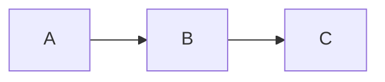

# 🤝 Contributing to SysAdmin & DevOps Study Notes

Thank you for considering a contribution! This guide explains how to add new files, improve existing ones, and maintain the cross-linked structure of the repository.

---

## 📋 What Can You Contribute?

| Type | Examples |
|------|---------|
| **New topic file** | A missing technology (Azure, GCP, Kafka, etc.) |
| **Expand existing file** | Add more commands, diagrams, or real-world examples |
| **Fix errors** | Incorrect commands, broken links, typos |
| **Add diagrams** | Mermaid flowcharts, architecture diagrams |
| **New learning path** | A curated sequence for a specific role |
| **Translations** | Non-English versions of files |

---

## 🚀 Getting Started

### 1. Fork and Clone

```bash
# Fork via GitHub UI, then:
git clone https://github.com/YOUR_USERNAME/sysadmin-notes.git
cd sysadmin-notes

# Create a feature branch
git switch -c add/46-git-advanced
# or
git switch -c fix/nginx-ssl-config
```

### 2. Make Your Changes

Follow the standards below, then:

```bash
git add .
git commit -m "feat: add 46_Git_Advanced.md — hooks, submodules, reflog"
git push origin add/46-git-advanced
```

### 3. Open a Pull Request

- Use a descriptive title: `feat: Add 46_Git_Advanced.md`
- Describe what you added/changed and why
- Reference any related issues

---

## 📝 File Format Standards

### Naming Convention
```
NN_Topic_Name.md

Examples:
  46_Git_Advanced.md
  47_Cloud_Azure.md
  48_Security_Incident_Response.md
```

### File Template

Every new file must follow this structure:

```markdown
# NN — Full Topic Name

> **[← Index](00_INDEX.md)** | **Related: [Related Topic A](XX_File.md) · [Related Topic B](XX_File.md)**

---

## What is X?

Brief introduction paragraph explaining the topic and why it matters.

---

## Core Concepts

### Concept 1

Explanation with diagram where appropriate.



### Concept 2

...

---

## Installation / Setup

```bash
# Commands with comments
sudo apt install tool
```

---

## Configuration

```ini
# Config file example
setting = value
```

---

## Common Commands

```bash
# Grouped, commented commands
tool command --flag argument    # What it does
```

---

## Practical Examples

Real-world scenarios with full working examples.

---

## Troubleshooting

Common issues and how to resolve them.

---

## Related Topics

- [Related Topic A ←](XX_File_A.md) — brief reason why it's related
- [Related Topic B →](XX_File_B.md) — brief reason why it's related

---

> [Index](00_INDEX.md)
```

---

## ✅ Quality Checklist

Before submitting, verify your file:

- [ ] Follows the naming convention (`NN_Topic_Name.md`)
- [ ] Has the header with index link and related topics
- [ ] Has the footer with index link
- [ ] Contains at least **one Mermaid diagram** (for architecture/workflow topics)
- [ ] All code blocks have a **language tag** (` ```bash `, ` ```yaml `, ` ```python `)
- [ ] Commands are **copy-paste ready** (no placeholder variables without explanation)
- [ ] Cross-links to at least **2 related existing files**
- [ ] Added to `00_INDEX.md` in the correct section with line count
- [ ] No broken relative links (test with a Markdown viewer)
- [ ] Covers both **Linux and Windows** where applicable

---

## 🎨 Diagram Standards

Use **Mermaid** for all diagrams. Supported types:

```markdown
# Architecture / Flow
```mermaid
graph LR / graph TD
```

# Sequence (request/response flows)
```mermaid
sequenceDiagram
```

# State machine
```mermaid
stateDiagram-v2
```

# Git branches


# Timeline / Gantt
```mermaid
gantt
```
```

**Diagram tips:**
- Use `graph LR` (left-right) for architecture diagrams
- Use `graph TD` (top-down) for hierarchies
- Use `sequenceDiagram` for protocol flows (TCP handshake, OAuth, etc.)
- Keep diagrams **simple** — one concept per diagram
- Always add a text explanation below the diagram

---

## 📏 Writing Style Guide

### Do ✅
- Write in **present tense**: "The kernel manages memory" not "The kernel managed memory"
- Use **active voice**: "Run the command" not "The command should be run"
- Add **inline comments** to all code: `nginx -t  # Test config syntax`
- Use **tables** for comparisons: feature vs feature, tool vs tool
- Add **warning callouts** for destructive commands: `> ⚠️ **WARNING:** rm -rf is irreversible`
- Use **tip callouts** for important notes: `> 💡 Always run nginx -t before reload`
- Include **real file paths**: `/etc/nginx/nginx.conf` not just `nginx.conf`

### Don't ❌
- Don't use placeholders like `<your-server-ip>` — use realistic examples like `192.168.1.100` or `10.0.0.10`
- Don't add theory without practical commands
- Don't add commands without explaining what they do
- Don't create files over 1,000 lines without splitting into sub-topics
- Don't use first person ("I recommend...") — write objectively

---

## 🔗 Cross-Linking Standards

### In the header (top of file)
```markdown
> **[← Index](00_INDEX.md)** | **Related: [Topic A](XX_A.md) · [Topic B](XX_B.md) · [Topic C](XX_C.md)**
```

### In the Related Topics section (bottom of file)
```markdown
## Related Topics
- [Topic A ←](XX_A.md) — brief reason (e.g., "DNS records required for email")
- [Topic B →](XX_B.md) — brief reason (e.g., "next step after this topic")
```

### In-line cross references
```markdown
> See [SSL/TLS Certificates →](26_SSL_TLS_Certificates.md) for HTTPS setup
> See [Networking Fundamentals ←](07_Networking_Fundamentals.md) — port 25, 587, 993
```

---

## 🏷️ Commit Message Convention

Follow **Conventional Commits**:

```
feat: add 46_Git_Advanced.md — hooks, submodules, worktrees
fix: correct nginx SSL config in 25_Nginx_Apache.md
docs: expand NTP stratum section in 11_NTP.md
chore: update 00_INDEX.md with new file 46
refactor: reorganize 30_Docker_Containers.md sections
```

---

## ❓ Questions?

Open a GitHub **Discussion** or **Issue** if you:
- Want to propose a new topic before writing it
- Are unsure where a topic fits in the index
- Found an error but aren't sure of the correct fix
- Want to suggest a new learning path

---

Thank you for helping make this resource better for everyone! 🙌
